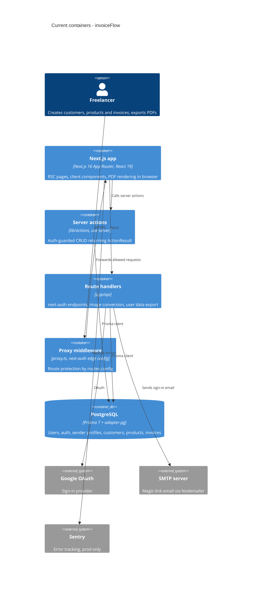

# Architecture map — invoiceFlow (Invoice Forge)

> The **current** architecture (what exists today), produced by `survey` and read by
> specify / design / data-model / implement. Refresh with `survey` when the repo drifts past
> `reflects_commit`. This is generated; a hand-maintained `docs/architecture.md`, if present, is
> authoritative and reconciled below — not replaced.

## Stack

- Language / runtime: TypeScript 5 (strict) on Node, pnpm 10 (`package.json`, `tsconfig.json`)
- Frameworks: Next.js 16.1.1 App Router, React 19.2.3, Prisma 7.2 with `@prisma/adapter-pg` (PostgreSQL), next-auth 5.0.0-beta.30, zod 3, react-hook-form 7, zustand 5, @tanstack/react-table 8, @react-pdf/renderer 4, Sentry 10 (`package.json:15-60`)
- Build / test / lint: `pnpm build` (= `prisma generate && next build`), `pnpm lint` (eslint 9, `eslint.config.mjs`), `pnpm format:check` (prettier + tailwind plugin). **No test script and no test files exist** — `test_cmd` is intentionally `""`.
- Hosting: Vercel (`vercel.json`, `@vercel/analytics` + `@vercel/speed-insights` in `app/layout.tsx:123-124`).

## C4 — system as it is

## Module inventory

| Module | Path | Layers | Wired at | Responsibility |
|---|---|---|---|---|
| Routes (public) | `app/(public)/` | ui (RSC) | `app/(public)/page.tsx` | Landing, privacy, terms |
| Routes (auth) | `app/(auth)/` | ui | `app/(auth)/layout.tsx` | Login, verify-request, auth error |
| Routes (protected) | `app/(protected)/` | ui (RSC pages + loading) | `app/(protected)/layout.tsx` | Dashboard, invoices list, customers, products, sender-profiles, settings |
| Routes (invoice editor) | `app/(invoice-editor)/` | ui | `app/(invoice-editor)/layout.tsx` | Full-screen editor: `invoices/new`, `invoices/[id]/edit` |
| API route handlers | `app/api/` | http | `app/api/auth/[...nextauth]/route.ts` | next-auth handlers, `convert-image`, `user/export` |
| Server actions | `lib/actions/` | app/service + data access | `lib/actions/customer-actions.ts:1` (`'use server'`) | Per-domain CRUD (customer, product, custom-price, sender-profile, bank-account, invoice, dashboard, account, profile, login) |
| Validation | `lib/validations/` | domain (schemas) | `lib/validations/invoice.ts` | Zod schemas per entity, shared by forms and actions |
| Helpers | `lib/helpers/` | domain/util | `lib/helpers/index.ts` | Auth guard, invoice calculations, PDF building, formatting |
| Auth | `auth.ts`, `auth.config.ts`, `proxy.ts` | infra | `auth.ts:44`, `auth.config.ts:6`, `proxy.ts:69` | next-auth (Google + Nodemailer), edge-safe config, route guard |
| Persistence | `prisma.ts`, `prisma/schema/`, `prisma/migrations/` | infra | `prisma.ts:13` | Prisma client singleton, split schema, migrations |
| Components | `components/` | ui | `components/ui/` | shadcn primitives + feature folders (invoices, customers, products, invoice-editor, modals, layout, …) |
| Client state | `store/` | ui state | `store/use-modal-store.ts:18` | Zustand: modal registry, invoice-editor store |
| Hooks | `hooks/` | ui | `hooks/use-invoice-pdf.tsx` | Editor handlers, invoice filters, PDF, mobile detection |
| Config / constants / types | `config/`, `constants/`, `types/` | shared | `config/routes.config.ts` | Routes, site, nav, PDF, JWT config; currency options; shared TS types |

## Conventions (cited — the rules a new feature must match)

- **Module wiring / registration:** data access lives in `'use server'` files under `lib/actions/<domain>-actions.ts` (larger domains get a folder: `lib/actions/invoice-actions/{invoice-actions,helpers,select-queries}.ts`); RSC pages call them directly — `lib/actions/customer-actions.ts:14`.
- **Auth guard in actions:** every action starts with `getAuthenticatedUser()` and scopes queries by `userId` — `lib/helpers/auth-helpers.ts:10`, used at `lib/actions/customer-actions.ts:18`.
- **Error handling:** actions never throw to the client; they return `ActionResult<T> = { success, data?, error? }` — `types/actions.ts:5`; errors are `console.error`-logged inside `try/catch` (`lib/helpers/auth-helpers.ts:24-26`).
- **Cache invalidation:** mutations call `revalidatePath(protectedRoutes.<x>)` — `lib/actions/customer-actions.ts:109`.
- **IDs:** `String @id @default(cuid())` on every model — `prisma/schema/invoice.prisma:21`.
- **Persistence / DB access:** single `prisma` singleton over `PrismaPg` adapter, `DATABASE_URL` required at import — `prisma.ts:6-13`. Invoices snapshot sender/customer/bank data (denormalized) — `prisma/schema/invoice.prisma:142`.
- **Migrations:** `prisma migrate`, schema split in `prisma/schema/{base,auth,invoice}.prisma`, folders `YYYYMMDDhhmmss_snake_case` — `prisma/migrations/20251231005646_add_invoice_system/`, config `prisma.config.ts`.
- **Validation:** one zod schema file per entity in `lib/validations/`, reused by react-hook-form via `zodResolver` — `lib/validations/invoice.ts`, `components/customers/customer-form.tsx:51`.
- **Tests:** **none** — no harness, no test files. Any feature adding tests must also introduce the harness (flag as a design decision).
- **Inter-module communication:** direct function calls (RSC/client → server action); `fetch` only to `app/api/*` route handlers (e.g. `app/api/user/export/route.ts`). No events/queues.
- **Env config:** `.env` per `env.example`; no runtime env schema.
- **UI / styling:** shadcn/ui (base-vega, neutral) + Tailwind 4 CSS variables + `cn()` — `components.json`, `lib/utils.ts` (detail in §Frontend below).

## Datastores

| Store | Engine | Accessed via | Notes |
|---|---|---|---|
| Main DB | PostgreSQL | Prisma 7 client (`prisma.ts`) | Models: User, Account, Session, VerificationToken, EmailHistory (`prisma/schema/auth.prisma`); SenderProfile, BankAccount, Customer, Product, CustomPrice, Invoice, InvoiceItem + enums Currency (UAH/USD/EUR/GBP/PLN), InvoiceStatus (DRAFT/PENDING/PAID/OVERDUE/CANCELLED) (`prisma/schema/invoice.prisma:3-222`) |

## Frontend / UI foundation

- **Component library / design system:** shadcn/ui 3.6, style `base-vega`, base color `neutral`, RSC on, over `@base-ui/react` — `components.json`; 54 primitives in `components/ui/`.
- **Design tokens:** OKLch CSS variables in `:root` (`app/globals.css:51`) and `.dark` (`app/globals.css:86`), mapped into Tailwind via `@theme inline` (`app/globals.css:7`); radius, sidebar and chart tokens included.
- **Styling approach:** Tailwind CSS 4 + `tw-animate-css`, class merging via `cn()` (clsx + tailwind-merge) — `lib/utils.ts`; prettier-plugin-tailwindcss sorts classes.
- **Theming:** `next-themes` via `components/theme-provider.tsx`, mounted at `app/layout.tsx:109`.
- **Shared primitives:** Button, Card, Input, Field, InputGroup, Select, Combobox, Command, Dialog, AlertDialog, Drawer, Sheet, Popover, Tabs, Table, Pagination, Calendar, Chart, Sidebar, Skeleton, Empty, Spinner, Sonner (toasts), … — `components/ui/`.
- **State / data-fetching:** server data via RSC + server actions (no client cache lib); client state in zustand — `store/use-modal-store.ts:18` (typed modal registry), `store/invoice-editor-store/use-invoice-editor-store.ts`.
- **Forms / tables / PDF:** react-hook-form + zod (`components/customers/customer-form.tsx:51`); TanStack Table (`components/invoices/invoices-data-table.tsx:190`); PDF built client-side with `pdf(doc).toBlob()` (`lib/helpers/invoice-pdf-helpers.tsx:133`).
- **Closest UI precedent:** a list screen looks like the invoices list — `app/(protected)/invoices/page.tsx` → `components/invoices/invoices-list-container.tsx` → `components/invoices/invoices-data-table.tsx`; a CRUD form looks like `components/customers/customer-form.tsx`.

## Where things live / closest precedents

- A new CRUD entity → Prisma model in `prisma/schema/invoice.prisma` + migration, zod schema in `lib/validations/<entity>.ts`, actions in `lib/actions/<entity>-actions.ts`, page in `app/(protected)/<entity>/page.tsx`, components in `components/<entity>/`, types in `types/<entity>/` — modelled on customers (`lib/actions/customer-actions.ts`, `app/(protected)/customers/page.tsx`).
- A complex, multi-query domain → action folder like `lib/actions/invoice-actions/` (`invoice-actions.ts:167` `createInvoice`, `select-queries.ts`).
- A full-screen editor flow → `app/(invoice-editor)/` route group + a zustand store in `store/` — modelled on `app/(invoice-editor)/invoices/new/page.tsx` and `store/invoice-editor-store/`.
- An HTTP endpoint (file/binary responses, non-action callers) → `app/api/<name>/route.ts`, modelled on `app/api/user/export/route.ts`.
- A new screen / UI component → composed from `components/ui/` primitives and tokens in `app/globals.css`, modelled on `components/invoices/invoices-list-container.tsx`; modals go through `store/use-modal-store.ts`.
- A new route → register it in `config/routes.config.ts` so `proxy.ts` protects it.

## Constraints & known tech-debt

- **No automated tests** — TDD-driven `implement` will need a test harness introduced first (unit runner choice is an open decision).
- **next-auth 5.0.0-beta.30** — beta API; `auth.config.ts` must stay edge-safe (no Prisma/Nodemailer imports, `auth.config.ts:4`).
- **No runtime env validation** — missing vars fail late (only `DATABASE_URL` is checked, `prisma.ts:7`).
- **`@prisma/extension-accelerate` installed but unused** — no import anywhere in app code.
- **Prisma 7 split schema** — schema is a folder (`prisma.config.ts`), not a single `schema.prisma`; tooling must point at `prisma/schema`.
- **Sentry** is production-only with a `/monitoring` tunnel (`next.config.ts`); most actions log via `console.error` rather than Sentry.

## Reconciliation with the authored architecture doc

No authored architecture doc (no `docs/architecture.md`, `ARCHITECTURE.md`, `CLAUDE.md` or ADRs); `README.md` only describes the product. This map is the current reference.
