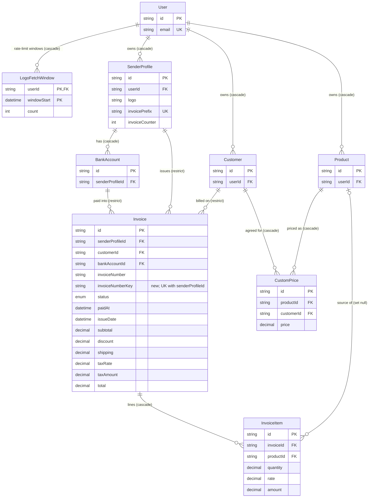

# Data model — architecture-hardening

> **Mode:** brownfield delta. This feature adds one table (`LogoFetchWindow`, wave 1) and one column with its unique index (`Invoice.invoiceNumberKey`, wave 2, made `NOT NULL` in wave 4). Every other entity it touches is unchanged, and they are documented below only as far as this feature reads or writes them.
> **Conventions followed (derived, not imposed):** `prisma migrate` with the split schema `prisma/schema/{base,auth,invoice}.prisma` (architecture-map §Migrations). Quoted PascalCase table names and camelCase columns. `TEXT` ids from `cuid()`. `TIMESTAMP(3)` for timestamps. Prisma's index names (`<Model>_<cols>_idx` / `_key` / `_pkey` / `_fkey`). FKs are `ON UPDATE CASCADE`. No `CHECK` constraints or triggers, and money is `DECIMAL(10,2)`.
> **Staged migrations:** `docs/features/architecture-hardening/migrations/01…06`. They are **not** in the live `prisma/migrations/` tree yet. `implement` promotes each one when its wave is built (see the audit report).

## ER diagram

Only the entities this feature changes or relies on are shown. `Account`, `Session`, `VerificationToken` and `EmailHistory` are unchanged and reached only through `User`'s cascades (ADR-0007).



## Entities

Aggregate roots, inferred from the ACs and CONTEXT: **User** (the Freelancer) is the root of the account. Its account-owned aggregates are **SenderProfile** (owns `BankAccount` and the invoice sequence), **Customer** (owns `CustomPrice` on the customer side), **Product**, and **Invoice** (owns `InvoiceItem`). An Invoice references SenderProfile, Customer and BankAccount with `Restrict`, which is the AC-22 invariant. `LogoFetchWindow` is infrastructure owned by User.

### `LogoFetchWindow` ★ new (wave 1, ADR-0008)

| Column | Type | Constraints | Notes |
|---|---|---|---|
| `userId` | TEXT | NOT NULL, PK (1/2), FK → `User(id)` ON DELETE CASCADE | the Freelancer whose real fetches are counted |
| `windowStart` | TIMESTAMP(3) | NOT NULL, PK (2/2) | UTC start of the one-minute window (`date_trunc('minute', now())`, or the app-computed equivalent) |
| `count` | INTEGER | NOT NULL DEFAULT 0 | real outbound fetches in this window |

**Aggregate root:** `User`. Account deletion cascades the rows (ADR-0007: no `Restrict` reference, so it doesn't need to join the delete transaction).
**Access patterns:**
- Increment: `INSERT … VALUES ($userId, $window, 1) ON CONFLICT ("userId","windowStart") DO UPDATE SET "count" = "LogoFetchWindow"."count" + 1 RETURNING "count"` → served by the PK.
- Read the previous window for the sliding estimate: `WHERE "userId" = $1 AND "windowStart" = $prev` → PK.
- Opportunistic cleanup, **scoped to the caller**: `DELETE WHERE "userId" = $1 AND "windowStart" < $prev` → PK prefix. A global sweep is deliberately not used, because it would need an index on `windowStart` alone.

**Constraints:** composite PK (`userId`, `windowStart`) is the upsert's conflict target. FK → `User(id)`, and the PK's leading column covers the FK index.
**Convention deviations (deliberate, flagged in the audit):** no `id`/cuid and no `createdAt`/`updatedAt`. The repo's precedent is the auth tables, which use composite `@@id` (`Account`, `VerificationToken`), and `VerificationToken` has no audit columns either. The row *is* a timestamped counter, and it lives about two minutes.

**Prisma schema (`prisma/schema/auth.prisma`, next to `User`):**

```prisma
model LogoFetchWindow {
    userId      String
    windowStart DateTime
    count       Int      @default(0)

    user User @relation(fields: [userId], references: [id], onDelete: Cascade)

    @@id([userId, windowStart])
}
// and on User:  logoFetchWindows LogoFetchWindow[]
```

### `Invoice` ✎ changed (wave 2 expand, wave 4 contract; ADR-0004, ADR-0005)

Only the columns this feature adds or whose rules change are listed. All other columns are unchanged.

| Column | Type | Constraints | Notes |
|---|---|---|---|
| `invoiceNumberKey` | TEXT | ★ NULL in wave 2 → NOT NULL in wave 4 (only if no NULL rows remain); UNIQUE with `senderProfileId` | `normalizeInvoiceNumber(invoiceNumber)` = trimmed + lower-cased. Written by **every** invoice write path (create, update, move, duplicate). NULL only for legacy rows whose number is shared (ADR-0004 fallback) or rows written by the previous build during a rollback window |
| `invoiceNumber` | TEXT | NOT NULL; exact-match unique with `senderProfileId` **kept through wave 2, dropped in wave 4** | as typed or as allocated; the displayed value |
| `status` | `InvoiceStatus` enum | NOT NULL DEFAULT `DRAFT` (unchanged) | the enum already rejects unknown values at the DB. AC-19's plain-language refusal comes from the zod enum in `lib/validations/invoice.ts` |
| `paidAt` | TIMESTAMP(3) | NULL (unchanged) | rule moves to `applyStatusChange()`: set on entering `PAID`, kept on re-save, cleared on leaving (AC-18, AC-19). No DB rule, per the repo's no-CHECK convention |
| `subtotal`, `taxAmount`, `total`, `discount`, `shipping`, `taxRate` | DECIMAL(10,2) / DECIMAL(5,2) | unchanged | now always recomputed server-side by the shared exact-decimal module (ADR-0006). Non-negativity and `discount ≤ subtotal + shipping` are enforced in the zod schema, not with `CHECK` (the repo uses none) |

**Aggregate root:** `Invoice` (owns `InvoiceItem`). It belongs to one `SenderProfile`, reached for ownership via `senderProfile.userId`.
**Access patterns:**
- AC-08 / AC-09 "is this key taken in this profile": `WHERE "senderProfileId" = $1 AND "invoiceNumberKey" = $2` → `Invoice_senderProfileId_invoiceNumberKey_key`.
- AC-07 concurrency backstop: a unique violation on the same index (P2002) if the allocator is ever wrong.
- AC-17 shared-number flag on a legacy row (key NULL): `WHERE "senderProfileId" = $1 AND id <> $2` with the number normalized in app → `Invoice_senderProfileId_idx` (existing; a profile holds tens to hundreds of invoices).

**Prisma schema (`prisma/schema/invoice.prisma`):**

```prisma
// wave 2
invoiceNumberKey String?
@@unique([senderProfileId, invoiceNumber])      // kept until wave 4
@@unique([senderProfileId, invoiceNumberKey])   // new

// wave 4 (only if the pre-flight finds 0 NULL keys)
invoiceNumberKey String
// @@unique([senderProfileId, invoiceNumber])   // removed
@@unique([senderProfileId, invoiceNumberKey])
```

### `SenderProfile` (unchanged schema; new write rule)

| Column | Type | Constraints | Notes |
|---|---|---|---|
| `invoiceCounter` | INTEGER | NOT NULL DEFAULT 0 | **the invoice sequence**. Advanced **only** by system-assigned numbers via `UPDATE … SET "invoiceCounter" = "invoiceCounter" + 1 WHERE id = $1 RETURNING`, which also takes the row lock ADR-0005 relies on. Manual numbers never touch it (AC-10) |
| `logo` | TEXT | NULL | now validated as an `https:` URL on save (AC-04). Fetched only through the safe fetcher (ADR-0003) |
| `invoicePrefix` | TEXT | UNIQUE (global) | unchanged. Account-scoped uniqueness is accepted debt (SAD §11, spec §8 Q2) |

**Access patterns:** allocation locks the row by PK. AC-22's "N invoices depend on it" count is `Invoice WHERE "senderProfileId" = $1`, served by `Invoice_senderProfileId_idx`.

### `Customer`, `BankAccount`, `Product`, `InvoiceItem` (unchanged)

- **Customer.** AC-22 count: `Invoice WHERE "customerId" = $1` → `Invoice_customerId_idx` (existing). The `Restrict` FK stays as the backstop, and flow 10's race maps its violation to `CONFLICT`.
- **InvoiceItem.** `amount` is now always `round_half_up(quantity × rate, 2)` from the shared module (AC-13). Items are replaced inside the save transaction, as today.
- **Account deletion (AC-20, ADR-0007).** In one transaction: `DELETE FROM "Invoice" WHERE "senderProfileId" IN (the Freelancer's profiles)` (served by `SenderProfile_userId_idx` + `Invoice_senderProfileId_idx`; items cascade), then `DELETE FROM "User"`. That cascades `Account`, `Session`, `EmailHistory`, `SenderProfile` → `BankAccount`, `Customer` → `CustomPrice`, `Product`, and ★ `LogoFetchWindow`. `VerificationToken` has no FK to User; it is keyed by email identifier and expires on its own. <!-- TBD: confirm with design whether AC-20's "sign-in links" means VerificationToken rows for the account's email must be deleted explicitly in the transaction (`DELETE FROM "VerificationToken" WHERE identifier = $email`). -->

### `CustomPrice` (unchanged)

| Column | Type | Constraints | Notes |
|---|---|---|---|
| `customerId` | TEXT | NOT NULL, FK → `Customer(id)` CASCADE | AC-31: set explicitly from the chosen Customer, ownership checked in the action |
| `productId` | TEXT | NOT NULL, FK → `Product(id)` CASCADE | same |
| `price` | DECIMAL(10,2) | NOT NULL | AC-16: non-negative, enforced by the shared zod schema on create **and** update |

**No unique (`customerId`, `productId`).** SAD §6 flow 9 hints at "the pair uniqueness index", but the repo deliberately **dropped** that unique in `20260105020000_allow_multiple_custom_prices`. Several named price tiers per pair are allowed, and AC-31 requires only that each price links exactly one owned Customer and one owned product. Re-adding the unique would break existing data and behaviour, so it is **not** added. This is flagged back to the SAD in the audit.

## Indexes

New and changed only. Every other query in the §6 flows is served by an existing index, as listed below the table.

| Index | Columns | Query it serves |
|---|---|---|
| `LogoFetchWindow_pkey` ★ | (`userId`, `windowStart`) | flow 1: the atomic per-window upsert, the previous-window read, and the caller-scoped cleanup. Also covers the FK to `User` |
| `Invoice_senderProfileId_invoiceNumberKey_key` ★ UNIQUE | (`senderProfileId`, `invoiceNumberKey`) | flows 2, 6, 7: the AC-08 "already used" check, the AC-09 skip loop, and the database backstop for AC-07 concurrent allocation |
| `Invoice_senderProfileId_invoiceNumber_key` ✗ dropped in wave 4 | (`senderProfileId`, `invoiceNumber`) | superseded by the key unique once the key is `NOT NULL` (equal numbers always have equal keys) |

**Existing indexes this feature relies on (no change):**
- `Invoice_senderProfileId_idx`, `Invoice_customerId_idx`: flow 10 dependent-invoice counts (AC-22), and flow 3 account-deletion count and delete.
- `SenderProfile_userId_idx`: ownership joins in every scoped invoice query, and the account-deletion invoice set.
- `Invoice_status_idx`, `Invoice_issueDate_idx`: flow 11 list filters and flow 8 dashboard payment queries. At current scale (27 invoices on the configured DB) a composite such as (`senderProfileId`, `issueDate`) has no measured need, so none is added. Revisit if list p95 regresses.

## Pre-flight queries (read-only, run before promoting)

```sql
-- Before 02–04 (wave 2): normalized duplicate groups. 0 → every row gets a key. >0 → those rows stay NULL (ADR-0004 fallback, AC-17).
SELECT "senderProfileId", lower(regexp_replace("invoiceNumber", '^\s+|\s+$', '', 'g')) AS key, count(*)
FROM "Invoice" GROUP BY 1, 2 HAVING count(*) > 1;

-- Before 05–06 (wave 4): must return 0, otherwise do not promote 05/06 (the column stays nullable, SAD §11 accepted debt).
SELECT count(*) FROM "Invoice" WHERE "invoiceNumberKey" IS NULL;
```

**Normalization parity.** The backfill (03) trims leading and trailing whitespace with the POSIX `\s` class (space, tab, CR, LF, VT, FF) and applies `lower()`. `normalizeInvoiceNumber()` must produce the same key for every stored number. JS `String.prototype.trim()` also strips Unicode spaces such as NBSP, and `toLowerCase()` differs from Postgres `lower()` outside ASCII. `implement` must either make the function match (e.g. `s.replace(/^[ \t\n\r\v\f]+|[ \t\n\r\v\f]+$/g, '').toLowerCase()`) or re-run a verification after deploy. A mismatch on a legacy row would only matter for non-ASCII or Unicode-whitespace numbers, and there are 0 such rows on the configured DB.

## Test fixtures

Amended 2026-09-27: automated tests are now in scope (F7 reversed). The factories and their seed/cleanup rules are specified in `test-plan.md` §Test data and built in task T00 — none are generated here. The SQL itself was exercised on an in-memory Postgres (PGlite): the 9 repo migrations, then 01–06 applied twice, the downs applied twice in reverse order, and the schema confirmed back to its original state. The fixtures used only `user-1@example.test` and `Test User`.
