# Software Architecture Document — architecture-hardening

## 1. Introduction and goals

**Intent.** Invoice Forge is in production, and a review on 2026-09-26 found 27 open problems. This feature fixes them in the existing app. It closes the authorization boundary so a Visitor can reach only deliberately public endpoints, and makes the logo fetch for PDFs unable to reach internal or private network addresses. The server enforces every invoice rule itself, so each saved invoice has a number unique within its sender profile and totals that equal what the Freelancer saw and are never negative. List and dashboard pages survive malformed links and report load failures honestly, and account deletion always succeeds and removes all of the Freelancer's data. Nothing new is built for the Freelancer beyond warnings, confirmations and error states. The work hardens what exists, shipped in four risk-ordered waves (spec §1).

**Top-3 quality goals (1-liners; full scenarios in §10):**

1. **Security of the boundary.** Deny by default for every non-public endpoint, and a logo fetch that never reaches private, loopback or link-local addresses and stays within ≤ 512 KB, ≤ 5 s and ≤ 30 fetches per minute per Freelancer.
2. **Integrity of stored invoice data.** Invoice numbers are unique within a sender profile, 0 "number already used" failures on system-proposed numbers, totals are recomputed on the server and never negative, and account deletion is all-or-nothing.
3. **Honest, crash-free reads.** 0 unhandled page errors from malformed links; a load failure is shown as an error with retry, never as an empty state or "not found".

**Stakeholders.**

| Role | Interest | Sign-off owner? |
|---|---|---|
| Freelancer | Trusts every stored number and total; can export and delete the account; sees honest errors | No |
| Visitor | Adversary and crawler. Must reach only public pages, sign-in and the crawling rules | No |
| Customer | Data subject. Their details copied onto invoices must actually be removed when the Freelancer deletes the account | No |
| Dmytro Hopko (owner) | Ships the four waves; owns the §11 open questions | Yes |
| Tech Lead | SAD approval | Yes |
| Security Lead | Security review required by spec §6.1 (the authorization boundary of every endpoint changes) | Yes |

**Decision overrides:**
- Decision override: spec §8 Q1 (one-time clean-up) is closed without a bulk fix — rationale: the configured database has 0 duplicate numbers and 0 negative totals (measured 2026-09-26), and the ADR-0004 fallback keeps wave 2 unblocked whatever the production duplicate count turns out to be. Any production duplicates follow AC-17 (see §11).
- Decision override: spec §8 Q3 (p95 targets for save and export) is re-dated from "before `sdd:design`" to "before the wave-2 release (save) / wave-4 release (export)" — rationale: both targets are defined relative to a baseline that can only be measured from production traces, and no design decision depends on the number (see §11).

## 2. Constraints

**Technical.**
- TypeScript 5 (strict) on Node, pnpm 10 (`package.json`, `tsconfig.json`).
- Next.js 16.1.1 App Router + React 19.2.3. RSC pages call `'use server'` actions directly, and route handlers live under `app/api/`.
- PostgreSQL on Neon (reached through its connection pooler) via Prisma 7.2 + `@prisma/adapter-pg`. The schema is split in `prisma/schema/{base,auth,invoice}.prisma`, and money columns are `Decimal(10,2)` (`prisma/schema/invoice.prisma:187-193`).
- next-auth 5.0.0-beta.30 with the **JWT session strategy**, 30-day lifetime (`auth.ts`, `config/jwt.config.ts`). There is no server-side session row to revoke. `auth.config.ts` must stay edge-safe (no Prisma or Nodemailer imports), because `proxy.ts` runs on it.
- `proxy.ts` guards page routes only; its matcher excludes `api` (`proxy.ts:70`).
- Hosting on Vercel serverless functions. There is no shared in-process memory between invocations, so any counter that must hold across requests has to live in a shared store.
- PDFs are rendered in the browser with `@react-pdf/renderer` 4 (`lib/helpers/invoice-pdf-helpers.tsx:133`). The server only supplies the logo as a data URL.
- Sentry 10, production only, with a `/monitoring` tunnel (`next.config.ts`).
- zod 3 + react-hook-form 7 for validation; schemas are shared by forms and actions.

**Organisational.**
- Size M (1–2 sprints), one developer, the owner (Dmytro Hopko).
- Delivery in four risk-ordered waves (spec §1): (1) the image-conversion security fix as its own release; (2) invoice data integrity; (3) input and link validation; (4) the rest.
- Automated tests are in scope (amended 2026-09-27; spec §3 F7 non-goal reversed). TDD is on; the harness is task T00 and the AC → test map is `test-plan.md`. Integration tests run against a throwaway database, never the configured one.
- Target: 0 open High/Medium findings within 30 days of the first wave's release (spec §7). There is no other hard deadline.

**Conventions.** (source: `docs/architecture-map.md` §Conventions)
- Data access lives in `lib/actions/<domain>-actions.ts`. `getAuthenticatedUser()` runs first, then queries are scoped by `userId` (`lib/helpers/auth-helpers.ts:10`). Actions return `ActionResult<T>` (`types/actions.ts:5`) and never throw to the client.
- One zod schema file per entity in `lib/validations/`, reused by forms via `zodResolver`.
- Mutations call `revalidatePath(protectedRoutes.<x>)`. IDs are `cuid()`. Migrations use `prisma migrate` with `YYYYMMDDhhmmss_snake_case` folders.
- UI is built from shadcn/ui (base-vega) primitives in `components/ui/` and modals go through `store/use-modal-store.ts`.
- The canonical action to copy is `lib/actions/customer-actions.ts`. Account and profile actions are the known deviation (F3) this feature removes.

**Regulatory / external.**
- Data classification: confidential. Invoices hold names, addresses, tax ids and bank details (spec §6.1).
- Account deletion is immediate and total, with no soft delete and no grace period (spec §3). Export beforehand is the only safety net.
- Records in error monitoring and logs are not purged on deletion; they expire under normal retention (spec §3).
- A security review is required before release (spec §6.1). No formal compliance regime (e.g. SOC 2, PCI) applies; N/A.

## 3. Context and scope

Invoice Forge lets Freelancers keep sender profiles, Customers and products, create invoices, export them as PDFs and send them to their Customers. This feature changes no business capability. It moves the trust boundary: the server stops trusting the browser form, the Origin header and any URL a caller supplies, and treats every request without a live account as a Visitor. The one outbound call that reaches arbitrary internet hosts, the logo fetch, is fenced off from private networks.

<!-- brownfield: architecture-map.md reflects ded1be7; HEAD 1c90e41 differs only in docs, so the map is current. Next.js 16 App Router monolith on Vercel, Prisma 7 on Neon Postgres, next-auth JWT sessions, proxy excludes /api, no tests. -->

**External systems (in / out):**

| Actor or system | Type | Interaction |
|---|---|---|
| Freelancer | Person | Signs in; manages sender profiles, Customers, products and invoices; exports PDFs and their data; deletes their account |
| Visitor | Person (external, untrusted) | Anyone without a signed-in session, including scripts, bots and search crawlers. May reach only the public set (AC-05) |
| Customer | Person (non-interacting) | Never signs in and receives PDFs outside the system. Their details live only as copies on invoices, which account deletion removes (AC-20). Not drawn in the C4 Context because there is no interaction |
| Google OAuth | System (external) | Identity provider for sign-in |
| SMTP server | System (external) | Delivers magic-link sign-in email (Nodemailer) |
| Sentry | System (external) | Receives errors and load failures (production only) |
| Logo image hosts | System (external, untrusted) | Any public HTTPS host a Freelancer links a sender-profile logo to. Fetched server-side, capped by size, time and rate |
| Private and internal networks | System (external, forbidden) | Cloud metadata service, loopback, private and link-local ranges. The logo fetch must refuse them at every hop |

**C4 Context (L1):**

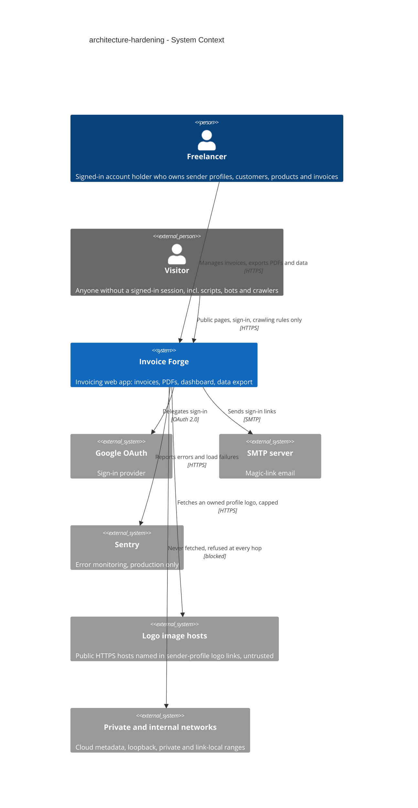

## 4. Solution strategy

**Target surfaces: `backend-service` + `web-frontend`.** The feature introduces no new container. It hardens the two halves of the existing Next.js monolith: the server side (RSC pages, server actions, route handlers, proxy) and the browser side (client components, the invoice editor, PDF rendering). ux-flows lists 19 affected screens (SCR-01…SCR-19) and one new stop, the legacy-totals confirmation (SCR-15). Scored 1 of 3 on the blast-radius gate (multi-module only; nothing new is introduced and there is no real alternative), so this is recorded inline, not as an ADR.

**UI architecture (web-frontend): unchanged.** Server-rendered React Server Components with client islands, as today. New UI (error-with-retry, confirmations, field messages, the logo warning) is composed from the existing shadcn/ui primitives (`Empty`, `AlertDialog`, `Field`, `Sonner`) and modals go through `store/use-modal-store.ts` (architecture-map §Frontend). No new state or routing library.

**Top strategic choices (the seeds for ADRs):**

1. **Deny by default at the boundary** (ADR-0001, ADR-0002). One allowlist in `config/routes.config.ts` defines the public set, and the proxy now covers `/api` too. Everything else requires a session: page requests go to sign-in, and data requests and actions are refused. A token whose account no longer exists counts as a Visitor. The edge proxy checks the signature, and the Node layer (layouts, `getAuthenticatedUser()`, `requireSession()`) checks that the account is live. This serves quality goal 1 and closes F1, F2 and AC-21 without changing the session model. F3, the account and profile actions that skip the guard-first convention, is closed by moving those actions onto that convention (§8), in wave 4.
2. **Outbound fetches are fenced, not trusted** (ADR-0003). The logo endpoint takes an owned sender-profile id, never a URL. A dedicated fetcher pins each connection to an address it has validated as public, re-checks every redirect hop, and enforces the ≤ 512 KB / ≤ 5 s caps. Refusals come from a closed, generic code set. This serves quality goal 1. Together with the ADR-0001 allowlist (which structurally closes the same hole and F2) and the ADR-0008 rate limit, it is wave 1, the image-conversion security release.
3. **The server is the single source of truth for invoice data** (ADR-0004, ADR-0005, ADR-0006). Numbers are allocated server-side inside the save transaction under a sender-profile row lock. Uniqueness is enforced by the database on a normalized key. Amounts are recomputed by one exact-decimal module that the editor also runs, so the saved total equals the displayed one. Every action re-validates its input with the shared zod schema (fixing L8's bypass). This serves quality goal 2 (waves 2–3).
4. **Destructive operations are explicit and atomic** (ADR-0007). Account deletion is one transaction that deletes invoices before the user, and the `Restrict` foreign keys that protect AC-22 stay in place. The paid date follows the status through one transition function (`applyStatusChange`: set on entering Paid, clear on leaving, reject unknown statuses) used by both the list and the editor. This serves quality goal 2.
5. **Reads fail honestly** (crosscutting mechanics in §8). Link parameters are parsed with fallback-to-default schemas, never cast. Load failures, "not found" and "not signed in" are distinct outcomes, each with its own destination: the error boundary with retry (SCR-17), not-found (SCR-16) or sign-in (SCR-01). This serves quality goal 3 (waves 3–4).

Delivery follows the spec's risk order, and every schema change is expand-only within its wave (§7). A tactical decision in later sections that contradicts one of these choices is a red flag for §11.

## 5. Building block view

The app keeps its existing style: a layered-by-convention Next.js monolith. Route groups render pages (ui), `'use server'` actions hold the use cases and data access, and Prisma talks to Postgres. `lib/helpers` and `lib/validations` hold shared rules. There are no hexagonal ports, and this feature doesn't introduce them. Every change extends an existing module or adds a small shared module next to its peers, so the closest precedents in `docs/architecture-map.md` still apply (copy `lib/actions/customer-actions.ts` for any action). Two surfaces map onto two containers: the **Server app** (`backend-service`) and the **Browser UI** (`web-frontend`). The proxy and the safe fetcher are drawn separately because they are the two trust checkpoints.

**Internal decomposition** (★ new, ✎ changed, ✗ removed):

```
proxy.ts                                   ✎ matcher covers /api; allowlist from routes.config (ADR-0001)
config/routes.config.ts                    ✎ single publicRoutes allowlist (AC-05)
app/
├── (protected)/layout.tsx                 ✎ requireLiveUser() (ADR-0002); tz-cookie client island (ADR-0010)
├── (protected)/error.tsx                  ★ load-error boundary: retry; Sentry for client-originated errors only (ADR-0009, SCR-17)
├── (invoice-editor)/layout.tsx            ✎ requireLiveUser()
├── (invoice-editor)/error.tsx             ★ load-error boundary for the editor
├── (protected)/dashboard/page.tsx         ✎ params via schema (A3); Suspense keyed on currency (A9)
├── (protected)/invoices/page.tsx          ✎ params via schema (A4, A5)
├── (protected)/{customers,products,sender-profiles}/…  ✎ typed failure → error boundary, not 404/empty (A6, A7)
├── api/convert-image/route.ts             ✎ requireSession + { senderProfileId } + safe fetch + rate limit (ADR-0003, ADR-0008)
├── api/user/export/route.ts               ✎ requireSession; parallel reads; filename from siteConfig (A10, AC-24)
├── api/auth/log-logout/                   ✗ empty leftover folder (F6)
└── robots.ts                              ✎ prefix disallow rules for section roots (A8, AC-30)
lib/
├── security/safe-fetch.ts                 ★ IP classification, pinned undici agent, per-hop checks, 512 KB / 5 s caps
├── security/logo-rate-limit.ts            ★ Postgres sliding-window counter (ADR-0008)
├── helpers/route-auth.ts                  ★ requireSession(), requireLiveUser()
├── helpers/invoice-calculations.ts        ✎ pure exact-decimal module shared by editor and server (ADR-0006)
├── helpers/invoice-status.ts              ★ applyStatusChange(): paid date set/clear, status enum (AC-18, AC-19)
├── helpers/time-zone.ts                   ★ validated tz cookie, day bounds, current month (ADR-0010)
├── validations/search-params.ts           ★ invoice-list and dashboard param schemas with fallback defaults
├── validations/invoice.ts                 ✎ ranges, discount cap, status enum (AC-14, AC-15, AC-19)
├── actions/invoice-actions/numbering.ts   ★ normalizeInvoiceNumber(), allocateInvoiceNumber() (ADR-0004, ADR-0005)
├── actions/invoice-actions/*.ts           ✎ recompute amounts, one allocator for create/move/duplicate, validated paging (L6)
├── actions/account-actions.ts             ✎ guard first + ActionResult (F3); invoice count; delete transaction (ADR-0007)
├── actions/profile-actions.ts             ✎ session check before parsing input (F3, AC-23)
├── actions/custom-price-actions.ts        ✎ validate on update, explicit customerId (L8, L10, AC-16, AC-31)
└── actions/{customer,sender-profile}-actions.ts  ✎ "N invoices depend on it" refusal (AC-22)
types/actions.ts                           ✎ ActionResult gains a typed error code (ADR-0009)
prisma/schema/                             ✎ Invoice.invoiceNumberKey + unique (ADR-0004); LogoFetchWindow model (ADR-0008)
components/                                ✎ editor number hint + field errors + legacy-totals dialog (SCR-15), delete dialogs with counts (SCR-08, SCR-14), logo warning (SCR-04)
.claude/settings.json, .gitignore          ✎ marketplace declared (F4); settings.local.json ignored (F5)
```

**C4 Container (L2):**

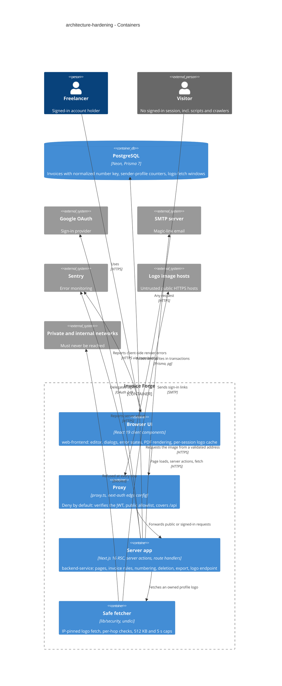

## 6. Runtime view

These flows seed the runtime view with the three highest-risk paths, one per strategic choice that changes runtime behaviour. The `sequences` stage adds a flow or branch for every remaining §5 acceptance criterion. Participants are the §5 containers; messages are semantic, not endpoints.

**Critical flow 1: logo fetch for a PDF (wave 1; AC-01, AC-02, AC-02b, AC-03, AC-21)**

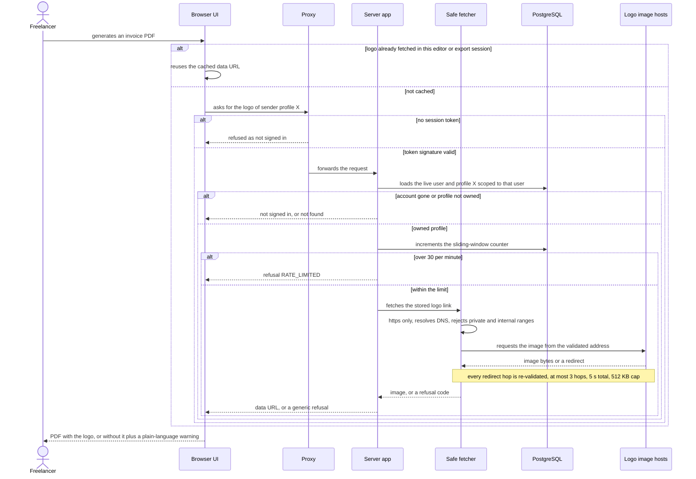

**Critical flow 2: saving an invoice, system-assigned vs manual number (wave 2; AC-06, AC-07, AC-08, AC-09, AC-10, AC-13, AC-14, AC-15)**

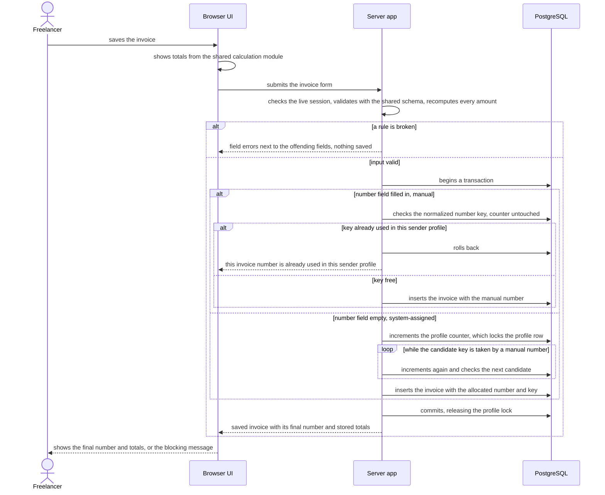

**Critical flow 3: account deletion (wave 2; AC-20, AC-21, AC-24)**

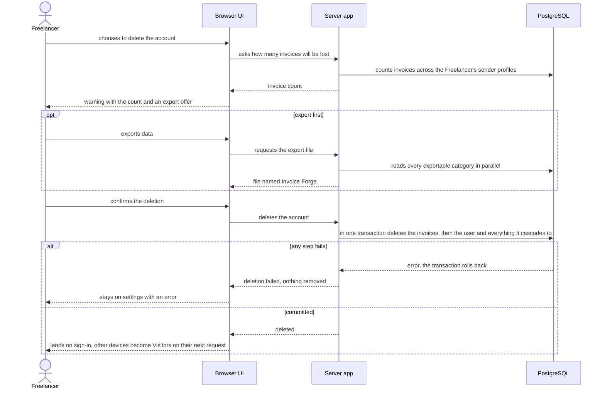

### Flow 4: request boundary, deny by default (wave 1; AC-05, AC-21, AC-23, AC-30)

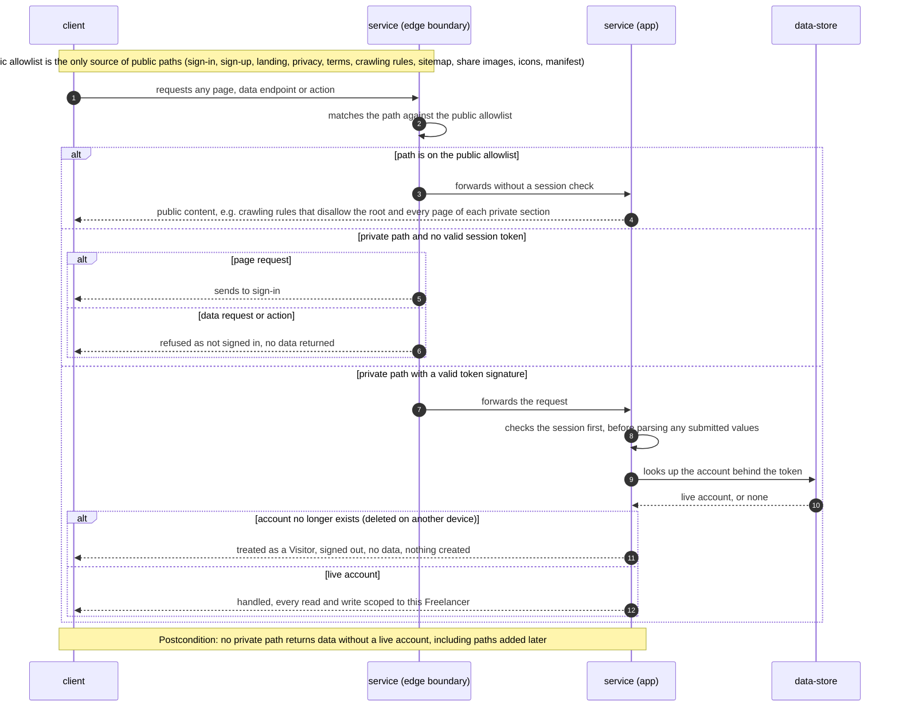

### Flow 5: saving a sender profile's logo link (wave 3; AC-04)

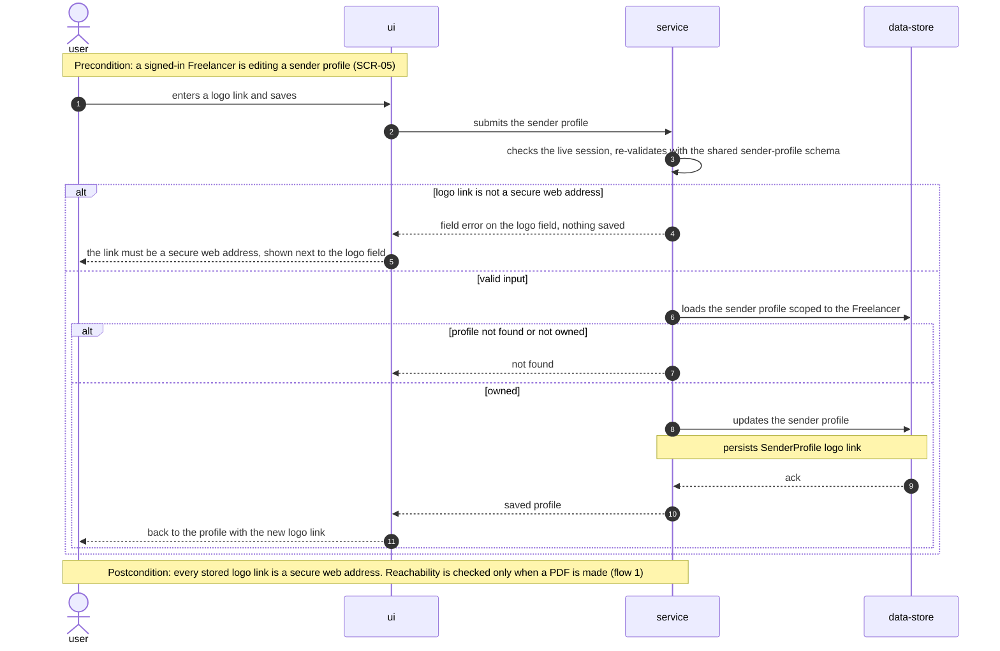

### Flow 6: moving an invoice to another sender profile, and duplicating one (wave 2; AC-11, AC-12)

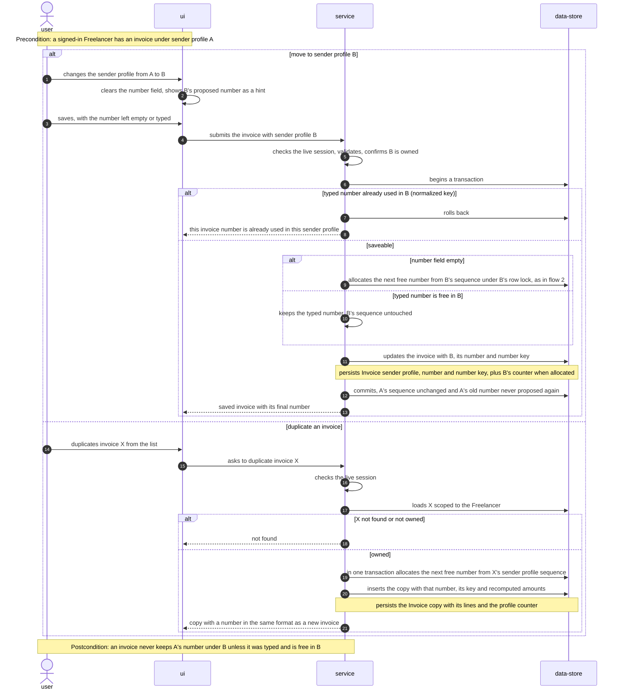

### Flow 7: editing a legacy invoice (wave 2; AC-17)

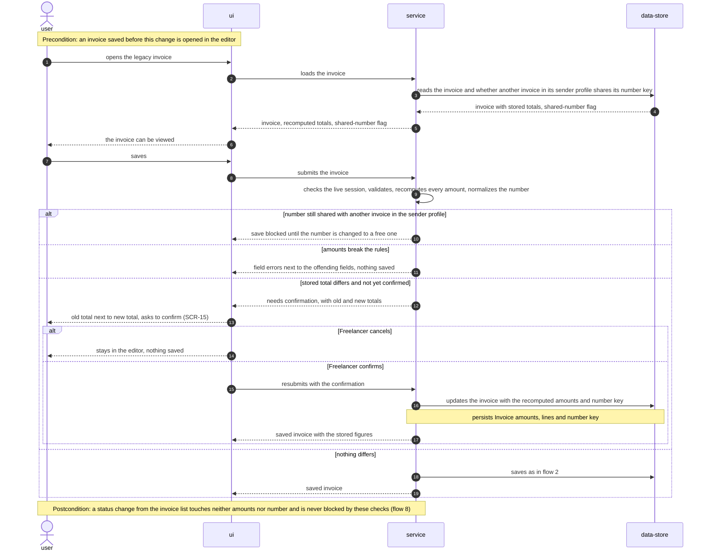

### Flow 8: status change and paid date (wave 2; AC-18, AC-19)

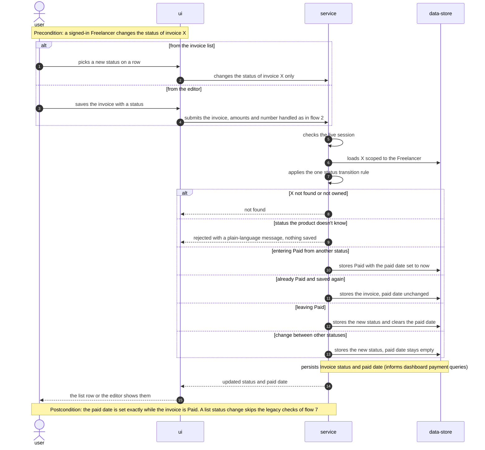

### Flow 9: creating or updating a custom price (wave 3; AC-16, AC-31)

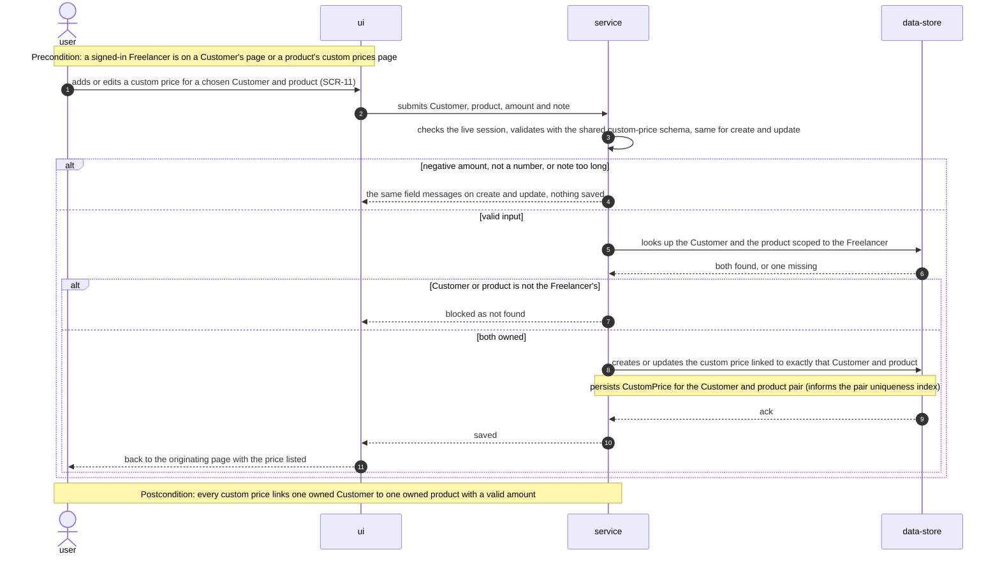

### Flow 10: deleting a Customer or sender profile (wave 2; AC-22)

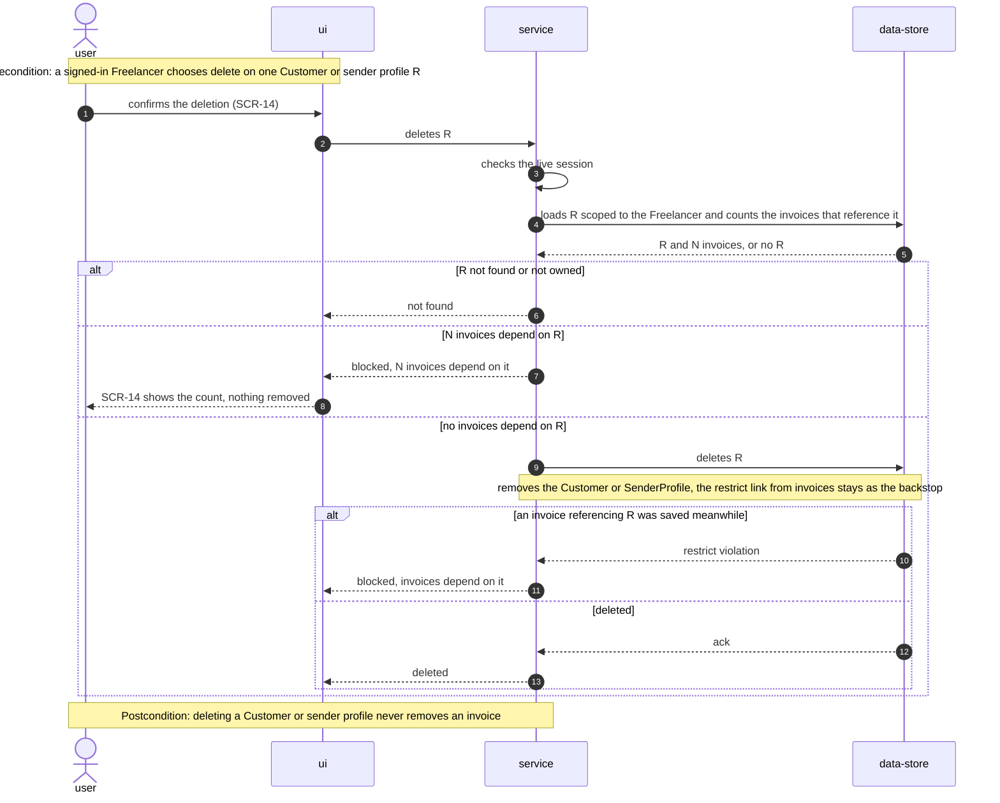

### Flow 11: opening the invoice list or dashboard from a link (wave 3; AC-25, AC-26, AC-27)

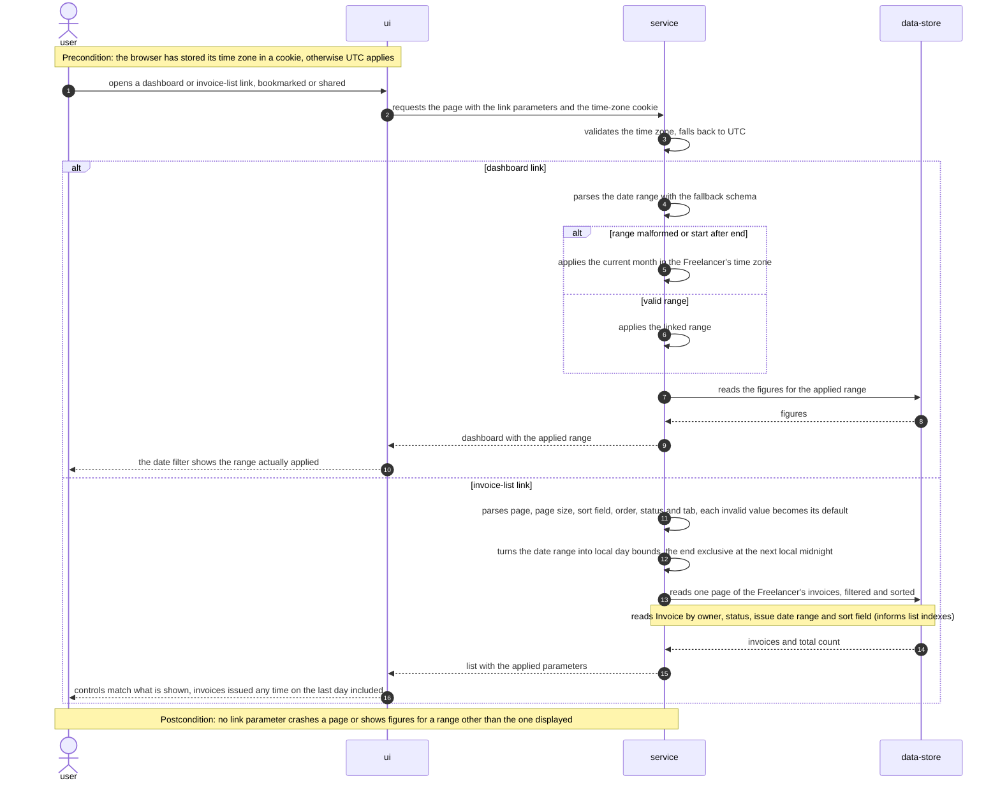

### Flow 12: loading a data page, load failure vs not found (wave 3; AC-28, AC-29)

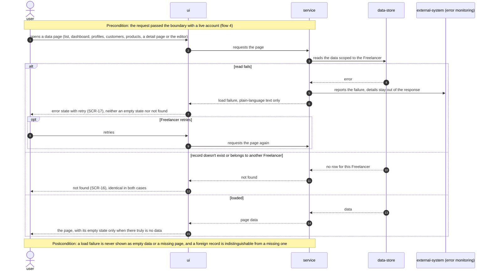

### Coverage: user stories and acceptance criteria → flows

| US | Flows |
|---|---|
| US-01 Include my logo safely in PDFs | 1, 4, 5 |
| US-02 Get a unique invoice number | 2, 6 |
| US-03 Trust invoice amounts | 2, 7, 9 |
| US-04 Track when an invoice was paid | 8 |
| US-05 Manage and delete my account safely | 3, 4, 10 |
| US-06 Use any link to my lists and dashboard | 11 |
| US-07 See an honest error when data fails to load | 12 |
| US-08 Keep my private pages out of search engines | 4 (public-path branch) |

| AC | Shown in | AC | Shown in |
|---|---|---|---|
| AC-01 | flow 1, happy path | AC-17 | flow 7 |
| AC-02 | flow 1 "no session token", flow 4 | AC-18 | flow 8 "entering Paid", "already Paid" |
| AC-02b | flow 1 "profile not owned" | AC-19 | flow 8 "leaving Paid", "unknown status" |
| AC-03 | flow 1 refusal branches | AC-20 | flow 3 |
| AC-04 | flow 5 | AC-21 | flow 3 postcondition, flow 4 "account no longer exists" |
| AC-05 | flow 4 | AC-22 | flow 10 |
| AC-06 | flow 2 "system-assigned" | AC-23 | flow 4 (session checked before input), plus the no-token branch |
| AC-07 | flow 2 profile row lock | AC-24 | flow 3 "export first" |
| AC-08 | flow 2 "key already used" | AC-25 | flow 11 dashboard branch |
| AC-09 | flow 2 skip loop | AC-26 | flow 11 invoice-list branch |
| AC-10 | flow 2 "key free" | AC-27 | flow 11 local day bounds |
| AC-11 | flow 6 move branch | AC-28 | flow 12 "read fails" |
| AC-12 | flow 6 duplicate branch | AC-29 | flow 12 "doesn't exist or belongs to another Freelancer" |
| AC-13 | flow 2 recompute | AC-30 | flow 4 public-path branch |
| AC-14 | flow 2 "a rule is broken" | AC-31 | flow 9 ownership branch |
| AC-15 | flow 2 "a rule is broken" | | |
| AC-16 | flow 9 validation branch | | |

Every §4 user story maps to at least one flow, and every §5 AC maps to a flow or branch. None is non-runtime.

### Flags from the sequences pass

- **Flag for design:** flow 7's "needs confirmation, with old and new totals" outcome is not one of the ADR-0009 typed codes (`UNAUTHORIZED`, `NOT_FOUND`, `VALIDATION`, `CONFLICT`, `FAILED`). Decide whether it is a new code or a detail on an existing one. Also decide how the resubmit proves the Freelancer confirmed these exact totals, for example by echoing the confirmed old total.
- **Flag for design:** flow 10's race branch (an invoice saved between the count and the delete) must map the database restrict violation to the same "N invoices depend on it" refusal (`CONFLICT`), not to `FAILED`.
- **Participants:** flows 4–12 use the generic vocabulary. In flow 4, "service (edge boundary)" is the §5 Proxy container and "service (app)" is the Server app. In flow 12, "external-system (error monitoring)" is Sentry. No participant is new to §5. Flows 1–3 predate this pass and keep their concrete names.
- **Hints for data-model, from the persist and read notes:** unique (sender profile, normalized number key) (flows 2, 6, 7); invoice counts by Customer and by sender profile (flow 10, AC-22 warnings); the invoice-list read by owner, status, issue-date range and sort field (flow 11); invoice status and paid date for dashboard payment queries (flow 8); unique (Customer, product) on custom prices (flow 9); the logo-fetch window counter (flow 1, ADR-0008).

## 7. Deployment view

There is no infrastructure change. The app stays one Vercel project (`vercel.json`, functions in region `iad1`, the proxy on the edge) over the existing Neon Postgres reached through its pooler (`eu-central-1`). No new service, queue or store is added: the logo-fetch counter is a table in the same database (ADR-0008). The feature ships as **four production releases**, one per wave (spec §1). Every schema change is expand-only inside its wave, so the previous build can be redeployed without a database rollback (§6 NFR: 0 minutes of planned downtime).

| Wave | Ships | Schema change | Rollback-safe because |
|---|---|---|---|
| 1 | ADR-0001, ADR-0003, ADR-0008; A1, A2, F1, F2 | new `LogoFetchWindow` table | old code ignores the table |
| 2 | ADR-0002, ADR-0004, ADR-0005, ADR-0006, ADR-0007; L1–L5, L7, L10 | `Invoice.invoiceNumberKey` nullable + backfill + unique index | old code doesn't write the key, so its rows stay `NULL`, which the unique index tolerates |
| 3 | ADR-0009, ADR-0010; A3–A7, L6, L8, L9 | none | code only |
| 4 | A8–A10, F3–F6 | contract step: `invoiceNumberKey` `NOT NULL`, only if no row has a `NULL` key (the ADR-0004 fallback was not taken) | applied only after wave 2 has run in production without a rollback; if the fallback was taken, the column stays nullable |

Migrations are applied with `prisma migrate deploy` before the release that needs them. The wave-2 migration counts normalized duplicate numbers first and takes the ADR-0004 fallback if the count is above 0. Releases go out at low-traffic hours (spec §8, stale editor tabs).

**Monitoring:**
- Metrics, as structured log lines: `logo_fetch outcome=<ok|NOT_HTTPS|NOT_IMAGE|TOO_LARGE|RATE_LIMITED|UNAVAILABLE> reason=<size|timeout|blocked_ip|…>`, which gives the size-cap, time-cap and refusal counts spec §6 measures "in logs". The upstream host and IP go to the log only, never to the response.
- Alerts (Sentry): any "number already used" on a system-assigned number (target 0 per month; it indicates an allocator bug); any unhandled error on the list or dashboard pages (target 0 per month); a spike in `UNAVAILABLE reason=blocked_ip` (a likely SSRF probe).
- Load failures (AC-28): reported **once**, by the loader's `failed()` (which captures the cause) — `instrumentation.ts` `onRequestError` skips the resulting `load_failed` error, and the `error.tsx` boundaries capture only errors with no `digest` (raised in the browser, which nothing else reports).
- Tracing: the existing Sentry performance traces (10% sample in production, `sentry.server.config.ts:18`) give invoice-save and data-export p95 over a 7-day window. Their targets are open (§11).

**Scaling thresholds** (design estimates, current scale is 3 accounts and 27 invoices on the configured database):
- Number allocation serializes saves within one sender profile only. Each save holds the profile lock for its transaction's round-trips (see the region note in §11), which is comfortable up to roughly 1 save per second per sender profile. Above that, move the allocation into a single SQL statement.
- `LogoFetchWindow` holds about 2 rows per actively fetching Freelancer after opportunistic cleanup. It stays tiny until thousands of concurrent Freelancers.
- Account deletion runs in one transaction. It is comfortable up to about 10,000 invoices per Freelancer; above that, delete invoices in batches inside the transaction or move deletion to a background job.

## 8. Crosscutting concepts

Default is the repo's convention set (`docs/architecture-map.md` §Conventions). The rows below state each convention this feature relies on, and **bold** marks where it adds or overrides one.

| Concept | Convention | Where defined |
|---|---|---|
| Authentication | next-auth JWT sessions. **Deny by default**: the proxy covers `/api`, and one `publicRoutes` allowlist is the only way to make a path public. **A token without a live account is a Visitor** everywhere in the Node layer | ADR-0001, ADR-0002; `config/routes.config.ts` |
| Authorization | `getAuthenticatedUser()` (actions) or `requireSession()` (route handlers) runs **first, before any input is parsed**. Every query is scoped by `userId`. A record that isn't the caller's returns `NOT_FOUND`, identical to a missing one | architecture-map §Conventions; ADR-0009; AC-23, AC-29 |
| Input validation | Every action re-runs the entity's zod schema, **with no `as` casts that bypass it** (L8). **Link parameters are parsed with fallback-to-default schemas**: page ≥ 1, page size ∈ {10, 20, 30, 50, 100} (the sizes the list offers, `components/invoices/invoices-table-footer.tsx:29`), sort field, order, status and tab from enums; anything invalid becomes its default, and the controls show what was applied | `lib/validations/`, `lib/validations/search-params.ts` |
| Error handling | Actions return `ActionResult<T>` and never throw to the client. **Typed `code`** (`UNAUTHORIZED`, `NOT_FOUND`, `VALIDATION`, `CONFLICT`, `FAILED`) plus a plain-language `error` and optional `fieldErrors`. Pages map `FAILED` to the segment `error.tsx` (retry); the cause is reported once by `failed()`, and the boundary reports only client-originated errors. Raw database or upstream text is logged, never returned | ADR-0009; `types/actions.ts` |
| Money | `Decimal(10,2)` at rest. All amounts are computed by **one pure exact-decimal module** shared by editor and server, rounding half-up. The server ignores client-sent totals | ADR-0006 |
| Invoice numbering | The number is unique within a sender profile on a **normalized key** (lower-case, trimmed). An empty field means system-assigned and is allocated under a profile row lock; a filled field is manual and never moves the sequence | ADR-0004, ADR-0005 |
| Status and paid date | **One transition function**, `applyStatusChange()`: entering Paid sets `paidAt` to now; saving an already-Paid invoice keeps it; leaving Paid clears it; an unknown status is rejected | `lib/helpers/invoice-status.ts`; AC-18, AC-19 |
| Destructive operations | Deleting a Customer or sender profile counts its invoices and refuses with the count (the `Restrict` FKs stay as the database backstop). **Account deletion is one explicit transaction**; any new entity that references Freelancer-owned data with `Restrict` must join that transaction | ADR-0007; AC-20, AC-22 |
| Outbound HTTP | The server fetches a user-influenced URL **only through the safe fetcher** (https, validated and pinned address per hop, 5 s, 512 KB, `image/*`). No other code path fetches user-supplied URLs | ADR-0003 |
| Rate limiting | Real logo fetches are limited per Freelancer by a Postgres sliding-window counter; browser-side reuse never reaches the server | ADR-0008 |
| Time and time zones | Stored as UTC. Day boundaries and "current month" use the validated browser time zone from the `tz` cookie, falling back to UTC. Range ends are exclusive at the next local midnight | ADR-0010; `lib/helpers/time-zone.ts` |
| Logging and observability | Existing `console.error` inside `try/catch`, plus Sentry (production). **Load failures and allocator conflicts go to Sentry**; logo-fetch outcomes are structured log lines (§7). No request body or bank detail is logged: Prisma call arguments are cut from Sentry events and from server log lines | §7; `sentry.*.config.ts`; `lib/helpers/prisma-error-scrub.ts` |
| Cache invalidation | Mutations call `revalidatePath(protectedRoutes.<x>)`. **Dashboard Suspense boundaries for debtors, expected payments and recent invoices are keyed on currency only** (A9) | architecture-map §Conventions |
| ID strategy | `cuid()` on domain models; unchanged | `prisma/schema/invoice.prisma:21` |
| Internationalisation | N/A: English only | — |
| Events | N/A: no events or queues; all calls are direct function calls | — |
| Repository configuration | **The `sdd` marketplace is declared in `.claude/settings.json` `extraKnownMarketplaces`** (F4). **`.claude/settings.local.json` is git-ignored** (F5). There are no empty route folders (F6) | spec §6 repository-hygiene rows |

## 9. Architecture decisions

| # | Title | Status | Section |
|---|---|---|---|
| 0001 | Deny unauthenticated requests in the proxy by default, with an explicit public allowlist | Accepted | §4 |
| 0002 | Treat sessions without a live account as Visitors, keeping JWT sessions | Accepted | §4 |
| 0003 | Fetch logos only by owned sender-profile id, through an IP-pinning fetcher that checks every hop | Accepted | §4 |
| 0004 | Enforce invoice-number uniqueness on a normalized key column | Accepted | §4 |
| 0005 | Allocate invoice numbers under a sender-profile row lock inside the save transaction | Accepted | §4 |
| 0006 | Compute invoice amounts in one shared exact-decimal module used by both editor and server | Accepted | §4 |
| 0007 | Delete an account in one explicit transaction, keeping Restrict foreign keys on invoices | Accepted | §4 |
| 0008 | Rate-limit logo fetches with a Postgres sliding-window counter | Accepted | §5 |
| 0009 | Classify action failures with typed error codes and route load failures to segment error boundaries | Accepted | §8 |
| 0010 | Carry the browser time zone to the server in a cookie | Accepted | §8 |

ADR files live under `docs/features/architecture-hardening/adr/NNNN-<title>.md`.

## 10. Quality requirements

Every scenario is covered by automated tests mapped in `test-plan.md` (amended 2026-09-27; F7 reversed). The "How verify" lines below are the additional manual probes on the preview deployment before each wave ships, and the production metrics. The numbers are quoted verbatim from spec §6 and §7.

**QG-1. Security of the boundary**
- **When:** a Visitor (no cookie, or the token of a deleted account) requests any page, `/api/*` route or server action outside the public allowlist, including a route added after this feature.
- **Then:** a page request is sent to sign-in; a data request or action is refused as "not signed in" with no data (AC-05, AC-21, AC-23).
- **How verify:** before each wave, a scripted request sweep without cookies over every route in the `next build` route manifest, where only allowlisted paths may return content; the same sweep with a deleted account's token; Security Lead review of the matcher and allowlist.

- **When:** a signed-in Freelancer's logo link is not https, is not an image, is large, is slow, or leads (directly, via a redirect, or via a DNS answer that changes between lookup and connect) to a private, loopback, link-local or metadata address, or the Freelancer keeps regenerating PDFs.
- **Then:** the PDF is produced without the logo, with the AC-03 warning. Size cap: ≤ 512 KB per image; larger is refused. Time cap: ≤ 5 s per fetch, then aborted. Rate limit: ≤ 30 fetches per minute per Freelancer; only real fetches from the external address count, and reusing a logo already fetched within the same editor or export session does not. No private address is ever connected to.
- **How verify:** a probe set on a preview deployment covering `169.254.169.254`, `127.0.0.1`, `[::1]`, an IPv4-mapped IPv6 address, a redirect to `10.0.0.1`, a DNS-rebinding test host, a 5 MB image, a slow-drip server, and 31 fetches in a minute; then the counts of `logo_fetch outcome=` log lines (size-cap warnings, aborts, refusals), as spec §6 measures them.

**QG-2. Integrity of stored invoice data**
- **When:** two editor tabs save new invoices under one sender profile at the same time with the number field empty, or a system-proposed number is already taken by a manual one.
- **Then:** both saves succeed with different numbers. Duplicate-number save failures on untouched numbers: 0 per month.
- **How verify:** a script that fires two parallel saves 20 times on a preview deployment (all must succeed with distinct numbers); in production, the error-monitoring count of "number already used" where the number was system-proposed (Sentry alert, §7).

- **When:** a Freelancer saves an invoice with any line items, discount, shipping and tax, or edits a legacy invoice, or deletes an account that has invoices.
- **Then:** newly saved invoices with a negative total or a line total ≠ quantity × price: 0 new ones in the 30 days after the integrity wave ships. Account deletions that fail: 0 failed deletions within 14 days of release. Invoice save latency p95 (incl. number assignment): TBD — baseline + 20% (see §8).
- **How verify:** a SQL count on release day and at day 30 (`total < 0`, or any item whose stored total ≠ round-half-up(quantity × price)); the Sentry/log count of failed `deleteUserAccount` calls over 14 days; production performance traces over a 7-day window for save p95, once the baseline is set (§11 open question).

**QG-3. Honest, crash-free reads**
- **When:** a Freelancer opens an invoice-list or dashboard link with malformed, out-of-range or tampered parameters (A3–A5 examples: `?from=abc&to=xyz`, `?page=-1`, `?pageSize=2.5`, `?sortBy=items`, `?status=FOO`).
- **Then:** the page opens with the default for each bad value and the controls show what was applied. Unhandled page errors from malformed links: 0 per month.
- **How verify:** a malformed-link checklist opened on a preview deployment before wave 3; in production, the error-monitoring count on the list and dashboard pages.

- **When:** any data page (invoice list, dashboard, sender profiles, customers, products, invoice/customer/sender-profile detail, invoice editor) can't load its data, or the record doesn't exist or belongs to someone else.
- **Then:** a load failure shows the error state with retry (SCR-17) and is reported to Sentry; a missing or foreign record shows the same "not found" (SCR-16).
- **How verify:** on a preview deployment with the database made unreachable, open each listed page and confirm SCR-17 and a Sentry event; open another account's record ids and confirm SCR-16.

- **When:** the Freelancer changes the dashboard date range.
- **Then:** only the date-dependent sections reload (3 fewer data loads per change).
- **How verify:** the request count per change in a production trace.

**Supporting NFRs (outside the top 3, still verified):**
- Availability during rollout: 0 minutes of planned downtime, and the schema change is backward-compatible within a wave. Verified by the deploy log and the §7 rollback-safety table.
- Data export latency p95: TBD — ≤ baseline − 30% (see §8). Verified by production performance traces.
- Repository hygiene, plugin setup: 0 missing-plugin failures on a fresh clone; the plugin installs from shared repo config alone (F4). Verified by a fresh-clone check on a second machine.
- Repository hygiene, personal settings: 0 personal settings files tracked in the repo; 0 empty route folders (F5, F6). Verified by an ignore-rule check and a folder scan in review.

## 11. Risks and technical debt

| Risk / debt | Severity | Mitigation | Owner |
|---|---|---|---|
| A regression in security-critical code (the proxy matcher and allowlist, IP classification in the safe fetcher, the number allocator, the deletion transaction) slips past the tests. Amended 2026-09-27: F7 reversed, these paths now carry unit + integration tests (`test-plan.md`) | Medium | The `test-plan.md` rows for AC-03, AC-05, AC-07, AC-20 run on every PR; Security Lead review of the ADR-0001 and ADR-0003 code paths; the §10 manual probe sets run before each wave; the §7 Sentry alerts | Dmytro Hopko |
| Region mismatch: functions run in Vercel `iad1`, the database in Neon `eu-central-1` (brownfield: `vercel.json`, `.env`). Every round-trip inside the save transaction crosses the Atlantic, which inflates save latency and how long the sender-profile lock is held (ADR-0005) | Medium | Keep allocation to the fewest round-trips (one `UPDATE … RETURNING`, the key check, the insert); measure the save baseline before wave 2; moving the function region next to the database is a separate decision | Dmytro Hopko |
| The proxy matcher regex and allowlist become security-critical (ADR-0001). A wrong exclusion silently makes a path public | Medium | Every exclusion commented with its reason; the §10 QG-1 route sweep before every release that touches `proxy.ts` or `routes.config.ts` | Dmytro Hopko |
| Gaps in private-address classification: IPv6 forms, IPv4-mapped IPv6, NAT64, decimal or octal IPv4 literals in hostnames | Medium | Normalize addresses with Node's `net` parsing before range checks; connect only to the checked address (ADR-0003); include these forms in the §10 probe set | Dmytro Hopko |
| The production duplicate-number count may differ from the count on the database configured in `.env` (0 groups, 27 invoices, measured 2026-09-26) | Low | The wave-2 migration counts first and takes the ADR-0004 fallback (nullable key, AC-17 path) if the count is above 0 | Dmytro Hopko |
| PDFs of older invoices show the sender profile's current logo, not the logo URL snapshotted on the invoice (ADR-0003) | Low | Accepted; mention it in the release note; revisit with logo uploads (spec §3 non-goal) | Dmytro Hopko |
| next-auth 5.0.0-beta.30: the live-account rule relies on the session callback's database lookup (ADR-0002) | Low | Pin the version; `requireLiveUser()` checks for a missing `user.id` explicitly, so a callback change fails closed | Dmytro Hopko |
| Open architectural decision: p95 latency targets for invoice save (incl. number assignment) and data export | Open question | Resolve before the wave-2 release for save, and before the wave-4 release for export; default is baseline + 20% (save) and baseline − 30% (export) measured from Sentry traces (spec §8) | Dmytro Hopko |
| Open architectural decision: editor tabs opened before a deploy send data in the old shape after a wave ships | Open question | Resolve before `sdd:tasks`; default is to accept the risk and ship waves at low-traffic hours (spec §8) | Dmytro Hopko |

**Accepted debt (acceptable in v1, plan to fix later):**
- **No one-time clean-up of already-corrupted data** (spec §8 Q1, closed here). On the configured database there are 0 duplicate numbers and 0 negative totals. Sequences behind their highest number are handled by the allocator's skip loop (AC-09). Stale paid dates and wrong line totals are corrected on the next status change or edit (AC-17, AC-18, AC-19).
- **Invoice prefixes stay unique across all Freelancers** (`invoicePrefix @unique`, spec §8 Q2, closed here as a follow-up). One Freelancer can learn that another already uses a prefix. Planned as a separate feature that scopes uniqueness to one account.
- The logo rate limit is a sliding-window estimate, not an exact 60-second log (ADR-0008).
- The first-ever server render uses UTC until the `tz` cookie exists (ADR-0010).
- `invoiceNumberKey` stays nullable between waves 2 and 4 (§7) for rollback safety, and stays nullable for good if the ADR-0004 fallback was taken (legacy duplicate rows keep a `NULL` key until renumbered).

## 12. Glossary

| Term | Meaning |
|---|---|
| Freelancer | A signed-in account holder who owns sender profiles, Customers, products and invoices and sees only their own data (CONTEXT) |
| Visitor | Anyone reaching the app without a signed-in session, including scripts and bots; here also any device whose token belongs to a deleted account (CONTEXT, ADR-0002) |
| Customer | A party a Freelancer bills. Invoices keep a copy of the Customer's details, and account deletion removes those copies (CONTEXT) |
| Sender profile | A business identity a Freelancer issues invoices under, with its own logo, bank accounts, invoice prefix and invoice sequence (CONTEXT) |
| Invoice number | The identifier printed on an invoice, unique within its sender profile; system-assigned from the sequence or typed manually (CONTEXT) |
| Invoice sequence | The per-sender-profile running count that proposes the next number; only system-assigned numbers advance it (CONTEXT) |
| Custom price | A price agreed with one Customer for one product, pre-filled into that Customer's invoice lines (CONTEXT) |
| Normalized number key | The invoice number lower-cased and trimmed; two numbers are "the same" when their keys match. Uniqueness is enforced on it (ADR-0004) |
| System-assigned vs manual number | An empty number field on save means system-assigned (allocated from the sequence); any filled-in number is manual, even if it equals the hint (AC-06) |
| Legacy invoice | An invoice saved before this feature whose stored total differs from the recomputed one, whose amounts break the new rules, or whose number is shared; it is corrected on its next edit (AC-17). *Not yet in CONTEXT, flagged for `/sdd:glossary`* |
| Live account | A session whose `User` row still exists. Without one, the session is treated as a Visitor (ADR-0002) |
| Public allowlist | The exact set of paths reachable without a session (AC-05); everything else is denied by default (ADR-0001) |
| Safe fetcher | The only server-side path that fetches a user-influenced URL: https, pinned validated address per hop, 5 s, 512 KB, images only (ADR-0003) |
| Load failure vs not found | A load failure is an error with retry (SCR-17); "not found" is a missing or foreign record (SCR-16). They are never shown as each other (ADR-0009) |
| Wave | One of the four risk-ordered production releases: security, integrity, validation, the rest (spec §1, §7) |
