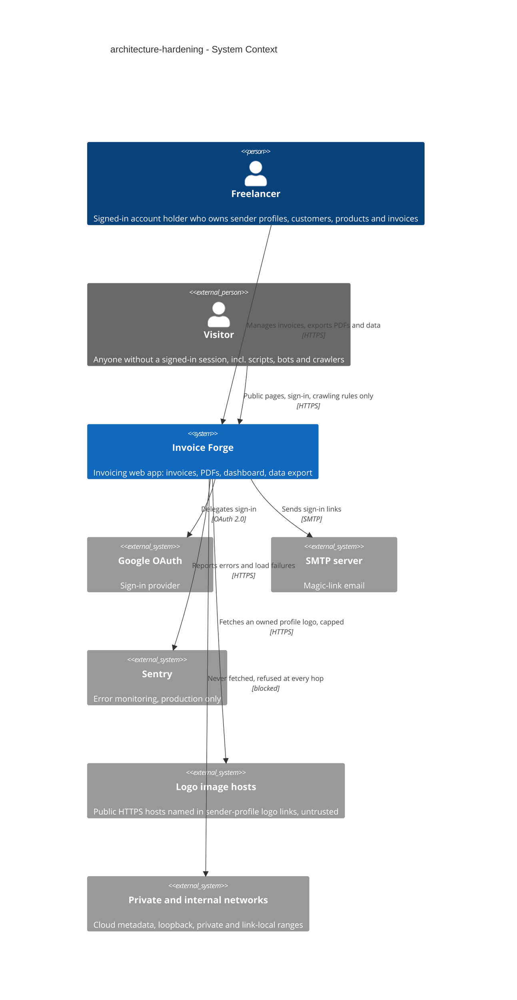
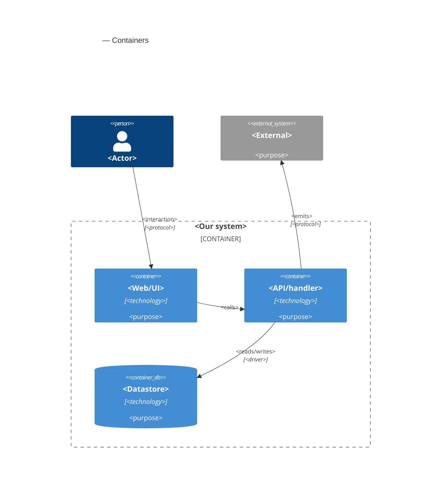

# Software Architecture Document — architecture-hardening

<!-- 12 Arc42 sections. Empty section → <!-- N/A: <one-line reason> -->. -->
<!-- C4 Context (L1) lives inline in §3. C4 Container (L2) lives inline in §5. -->
<!-- Numbers in §10 come VERBATIM from spec.md §6 NFR — no inventing, no rounding. -->

## 1. Introduction and goals

**Intent.** Invoice Forge is in production, and a review on 2026-09-26 found 27 open problems. This feature fixes them in the existing app. It closes the authorization boundary so a Visitor can reach only deliberately public endpoints, and makes the logo fetch for PDFs unable to reach internal or private network addresses. The server enforces every invoice rule itself, so each saved invoice has a number unique within its sender profile and totals that equal what the Freelancer saw and are never negative. List and dashboard pages survive malformed links and report load failures honestly, and account deletion always succeeds and removes all of the Freelancer's data. Nothing new is built for the Freelancer beyond warnings, confirmations and error states. The work hardens what exists, shipped in four risk-ordered waves (spec §1).

**Top-3 quality goals (1-liners; full scenarios in §10):**

1. **Security of the boundary.** Deny by default for every non-public endpoint, and a logo fetch that never reaches private, loopback or link-local addresses and stays within ≤ 512 KB, ≤ 5 s and ≤ 30 fetches per minute per Freelancer.
2. **Integrity of stored invoice data.** Invoice numbers are unique within a sender profile, 0 "number already used" failures on system-proposed numbers, totals are recomputed on the server and never negative, and account deletion is all-or-nothing.
3. **Honest, crash-free reads.** 0 unhandled page errors from malformed links; a load failure is shown as an error with retry, never as an empty state or "not found".

**Stakeholders.**

| Role | Interest | Sign-off owner? |
|---|---|---|
| Freelancer | Trusts every stored number and total; can export and delete the account; sees honest errors | No |
| Visitor | Adversary and crawler. Must reach only public pages, sign-in and the crawling rules | No |
| Customer | Data subject. Their details copied onto invoices must actually be removed when the Freelancer deletes the account | No |
| Dmytro Hopko (owner) | Ships the four waves; owns the §11 open questions | Yes |
| Tech Lead | SAD approval | Yes |
| Security Lead | Security review required by spec §6.1 (the authorization boundary of every endpoint changes) | Yes |

<!-- Decision overrides (¶4) — populated by the critic resolution loop, empty otherwise. -->

## 2. Constraints

**Technical.**
- TypeScript 5 (strict) on Node, pnpm 10 (`package.json`, `tsconfig.json`).
- Next.js 16.1.1 App Router + React 19.2.3. RSC pages call `'use server'` actions directly, and route handlers live under `app/api/`.
- PostgreSQL on Neon (reached through its connection pooler) via Prisma 7.2 + `@prisma/adapter-pg`. The schema is split in `prisma/schema/{base,auth,invoice}.prisma`, and money columns are `Decimal(10,2)` (`prisma/schema/invoice.prisma:187-193`).
- next-auth 5.0.0-beta.30 with the **JWT session strategy**, 30-day lifetime (`auth.ts`, `config/jwt.config.ts`). There is no server-side session row to revoke. `auth.config.ts` must stay edge-safe (no Prisma or Nodemailer imports), because `proxy.ts` runs on it.
- `proxy.ts` guards page routes only; its matcher excludes `api` (`proxy.ts:70`).
- Hosting on Vercel serverless functions. There is no shared in-process memory between invocations, so any counter that must hold across requests has to live in a shared store.
- PDFs are rendered in the browser with `@react-pdf/renderer` 4 (`lib/helpers/invoice-pdf-helpers.tsx:133`). The server only supplies the logo as a data URL.
- Sentry 10, production only, with a `/monitoring` tunnel (`next.config.ts`).
- zod 3 + react-hook-form 7 for validation; schemas are shared by forms and actions.

**Organisational.**
- Size M (1–2 sprints), one developer, the owner (Dmytro Hopko).
- Delivery in four risk-ordered waves (spec §1): (1) the image-conversion security fix as its own release; (2) invoice data integrity; (3) input and link validation; (4) the rest.
- No automated tests and no test harness (spec §3, F7). TDD is off, and regressions are caught by review and production monitoring.
- Target: 0 open High/Medium findings within 30 days of the first wave's release (spec §7). There is no other hard deadline.

**Conventions.** (source: `docs/architecture-map.md` §Conventions)
- Data access lives in `lib/actions/<domain>-actions.ts`. `getAuthenticatedUser()` runs first, then queries are scoped by `userId` (`lib/helpers/auth-helpers.ts:10`). Actions return `ActionResult<T>` (`types/actions.ts:5`) and never throw to the client.
- One zod schema file per entity in `lib/validations/`, reused by forms via `zodResolver`.
- Mutations call `revalidatePath(protectedRoutes.<x>)`. IDs are `cuid()`. Migrations use `prisma migrate` with `YYYYMMDDhhmmss_snake_case` folders.
- UI is built from shadcn/ui (base-vega) primitives in `components/ui/` and modals go through `store/use-modal-store.ts`.
- The canonical action to copy is `lib/actions/customer-actions.ts`. Account and profile actions are the known deviation (F3) this feature removes.

**Regulatory / external.**
- Data classification: confidential. Invoices hold names, addresses, tax ids and bank details (spec §6.1).
- Account deletion is immediate and total, with no soft delete and no grace period (spec §3). Export beforehand is the only safety net.
- Records in error monitoring and logs are not purged on deletion; they expire under normal retention (spec §3).
- A security review is required before release (spec §6.1). No formal compliance regime (e.g. SOC 2, PCI) applies; N/A.

## 3. Context and scope

Invoice Forge lets Freelancers keep sender profiles, Customers and products, create invoices, export them as PDFs and send them to their Customers. This feature changes no business capability. It moves the trust boundary: the server stops trusting the browser form, the Origin header and any URL a caller supplies, and treats every request without a live account as a Visitor. The one outbound call that reaches arbitrary internet hosts, the logo fetch, is fenced off from private networks.

<!-- brownfield: architecture-map.md reflects ded1be7; HEAD 1c90e41 differs only in docs, so the map is current. Next.js 16 App Router monolith on Vercel, Prisma 7 on Neon Postgres, next-auth JWT sessions, proxy excludes /api, no tests. -->

**External systems (in / out):**

| Actor or system | Type | Interaction |
|---|---|---|
| Freelancer | Person | Signs in; manages sender profiles, Customers, products and invoices; exports PDFs and their data; deletes their account |
| Visitor | Person (external, untrusted) | Anyone without a signed-in session, including scripts, bots and search crawlers. May reach only the public set (AC-05) |
| Google OAuth | System (external) | Identity provider for sign-in |
| SMTP server | System (external) | Delivers magic-link sign-in email (Nodemailer) |
| Sentry | System (external) | Receives errors and load failures (production only) |
| Logo image hosts | System (external, untrusted) | Any public HTTPS host a Freelancer links a sender-profile logo to. Fetched server-side, capped by size, time and rate |
| Private and internal networks | System (external, forbidden) | Cloud metadata service, loopback, private and link-local ranges. The logo fetch must refuse them at every hop |

**C4 Context (L1):**



## 4. Solution strategy

<!-- 🎯 Why: the 3–4 STRATEGIC PILLARS every ADR grows from. Without §4 each ADR looks random —
     there's no umbrella. ⭐ The densest section — the blast-radius gate fires almost always here
     (decisions are irreversible + multi-module).
     📋 Write: 3–4 choices; each a heading + 2–3 sentences of rationale.
     📌 «Store content as a table of typed blocks» is a pillar — ADR-0001 grows from it. -->

**Top strategic choices (the seeds for ADRs):**

1. **<e.g. Module isolation through events>** — <2–3 sentences citing quality goals + constraints>.
2. **<e.g. Single-store persistence>** — <2–3 sentences>.
3. **<e.g. Server-rendered read side>** — <2–3 sentences>.

Each tactical decision in later sections should trace to one of these seeds. Tactical decisions that *contradict* a strategic choice are red flags — surface them in §11.

## 5. Building block view

<!-- 🎯 Why: INTERNAL DECOMPOSITION — modules, containers, datastores. The static topology: who
     may talk to whom. Without §5, §6 (the flows) has no vocabulary of participants.
     📋 Write: 1 ¶ on the style (layered / hexagonal / clean / event-driven) + a folder tree + a
     C4Container block.
     📌 Draw ONE Container per declared `target_surface` (frontmatter): a fullstack
     [backend-service, web-frontend] = a backend-API container + a web/SPA container; a
     [backend-service, mobile-app] = the API + the mobile app. The Container(web, …) line below is
     just one surface's container — swap/add per what was declared in §4. → _shared/surfaces.md
     📌 e.g. «web app, content API, media worker, datastore, object store, CDN». -->

<One paragraph: layered / hexagonal / clean / event-driven, and why.>

**Internal decomposition:**

```
<e.g. modules/<feature>/>
├── domain/       <entities + sentinel errors>
├── app/          <use cases / services>
├── infra/        <repository + integration impl>
├── ports/        <handlers, DTOs, error mapping>
└── wiring        <self-wiring entry point>
```

**C4 Container (L2):** <!-- syntax → references/c4-mermaid-syntax.md. Real names, no <placeholder> stubs. ONE Container per declared target_surface (frontmatter); the web container below is one example surface. -->



## 6. Runtime view

<!-- 🎯 Why: the RUNTIME FLOW of 1–2 critical scenarios — who talks to whom, when, in what order.
     Without §6, §5 is just boxes with no life.
     📋 Write: a Mermaid sequenceDiagram. Participants are names from §5 (don't invent new ones).
     Messages are semantic («saves a draft»), NO HTTP verbs / paths / status codes — endpoint-level
     sequences arrive at the `api` stage.
     📌 e.g. «author → web: composes draft → web → content API: save». Seed the primary flow(s) here;
     the `sequences` stage then covers every §5 AC (no cap). Never N/A for M+; XS/S keeps ≥1 happy-path flow. -->

**Critical flow 1: <flow name>**

```mermaid
sequenceDiagram
    actor Actor
    participant Web
    participant Service
    participant Store
    Actor->>Web: <action>
    Web->>Service: <call>
    Service->>Store: <write>
    Store-->>Service: ok
    Service-->>Web: result
    Web-->>Actor: confirmation
```

**Critical flow 2: <e.g. async event propagation>** — <if applicable, otherwise N/A>.

## 7. Deployment view

<!-- 🎯 Why: the TOPOLOGY DevOps must know without reading the deploy charts — how many replicas,
     where the background worker lives, AT WHAT NUMBERS we scale.
     📋 Write: 2–3 sentences on topology + monitoring + concrete threshold numbers.
     📌 e.g. «500 authors → partition by quarter» (not «we'll think about scale later»).
     🎯 N/A allowed for XS/S that reuses an existing deployment unit with no change.
     Deployment-diagram scaffold → templates/deployment.md. -->

<Topology in 2–3 sentences. Where it runs, replicas, scaling thresholds.>

**Monitoring:**
- <Metrics — e.g. `<metric_name>`>
- <Alerts — e.g. «worker lag > 10 min → page on-call»>
- <Tracing — e.g. spans on the request boundary>

**Scaling thresholds:**
- <e.g. comfortable in one table up to N rows/year>
- <e.g. partition by quarter above N rows/year>

<!-- For XS/S with no deployment change: <!-- N/A: reuses existing deployment unit, no infra change --> -->

## 8. Crosscutting concepts

<!-- 🎯 Why: CROSS-CUTTING PATTERNS spanning several modules: logging, errors, authorization, ID
     strategy, events, caching. ⭐ The second-densest section. A pattern inside one module is NOT
     here; a project-wide convention belongs in the convention file.
     📋 Write: a table — concept / convention / where defined. One row per concept.
     📌 e.g. «sortable time-based IDs generated in the app layer» as a default from the convention file. -->

| Concept | Convention | Where defined |
|---|---|---|
| Logging | <e.g. structured, fields `module=<name>`> | <convention file §X or here> |
| Authentication | <e.g. token-based via middleware> | <convention file §X> |
| Error handling | <e.g. domain sentinel → ports error mapping → JSON> | <convention file §X> |
| ID strategy | <e.g. sortable time-based ID in the app layer> | <convention file §X> |
| Internationalisation | <e.g. N/A, single language> | — |
| Observability | <e.g. tracing on the request boundary> | — |
| Events | <module-specific patterns, if any> | <here> |

## 9. Architecture decisions

<!-- 🎯 Why: the REVERSE INDEX onto the adr/ folder. `ls adr/` gives the files; §9 gives the
     semantics — why they exist, which SAD section they attach to, what status.
     📋 Write: a 4-column table, one row per ADR. Mixed status is fine.
     📌 e.g. «0001 | Store content as a table of typed blocks | Accepted | §4». -->

| # | Title | Status | Section |
|---|---|---|---|
| <NNNN> | <imperative — e.g. "Use a sliding-window counter for rate limiting"> | Accepted | §<N> |
| <NNNN> | <imperative — e.g. "Co-locate the worker in the API process"> | Accepted | §<N> |

ADR files live under `docs/features/<slug>/adr/NNNN-<title>.md`.

## 10. Quality requirements

<!-- 🎯 Why: the QUALITY TREE — take a goal from §1 and break it into concrete leaves: tests,
     metrics, configs, drills. ⭐ Without §10, §1 is a manifesto. With §10 each declaration maps
     to something PROVABLE.
     📋 Write: per §1 goal — When / Then / How-verify. Numbers from spec §6 NFR VERBATIM (don't
     round ≤250ms to ≤300ms — that's a critic F6 hit).
     📌 e.g. «p95 ≤ 500 ms on a block update, verified by a 100 req/s load test». -->

Each top-3 goal from §1 expanded into a full scenario:

**QG-1. <quality attribute>**
- **When:** <trigger condition>
- **Then:** <expected behaviour with numbers from spec §6 NFR>
- **How verify:** <test / chaos drill / load test / metric>

**QG-2. <quality attribute>**
- **When:** <trigger>
- **Then:** <expected>
- **How verify:** <how>

**QG-3. <quality attribute>**
- **When:** <trigger>
- **Then:** <expected>
- **How verify:** <how>

## 11. Risks and technical debt

<!-- 🎯 Why: ⭐ collects EVERYTHING that can break — not only the technical. Without §11 risks get
     discussed at standups and lost; debt lives only in the head of whoever accepted it.
     📋 Write: a risk/debt table — severity — mitigation — owner. Accepted debt in its own block.
     📌 The first risk is often a product risk, not a technical one. That's normal. -->

<!-- Severity literals: Low / Medium / High for regular risks; "Open question" for rows created by
     a Save-as-OQ resolution during the Socratic walk (see references/socratic.md). -->

| Risk / debt | Severity | Mitigation | Owner |
|---|---|---|---|
| <e.g. Worker lag may reach hours during a downstream outage> | Medium | <alert >10 min, on-call playbook, retry backoff> | <DevOps> |
| <e.g. No event-schema versioning in v1> | Medium | <ADR-NNNN planned for v2, tolerate unknown fields> | <Backend> |
| Open architectural decision: <decision-headline> | Open question | Resolve before <stage trigger or YYYY-MM-DD>; <inline rationale from the Save-as-OQ> | <owner> |

**Accepted debt (acceptable in v1, plan to fix later):**
- <e.g. the entity is immutable / unversioned — OK for v1, may need audit versioning in v2>

## 12. Glossary

<!-- 🎯 Why: ⭐ the DOMAIN GLOSSARY that ends arguments a year later («checkpoint — weekly or
     biweekly? quarter — calendar or fiscal?»).
     📋 Write: a term / meaning table. Business + technical terms mixed.
     📌 e.g. «Lesson | a unit inside a course made of blocks (text, video)». -->

| Term | Meaning |
|---|---|
| <e.g. domain object A> | <its meaning in this domain> |
| <e.g. domain object B> | <its meaning> |
| <e.g. domain invariant name> | <the rule, in plain language> |
