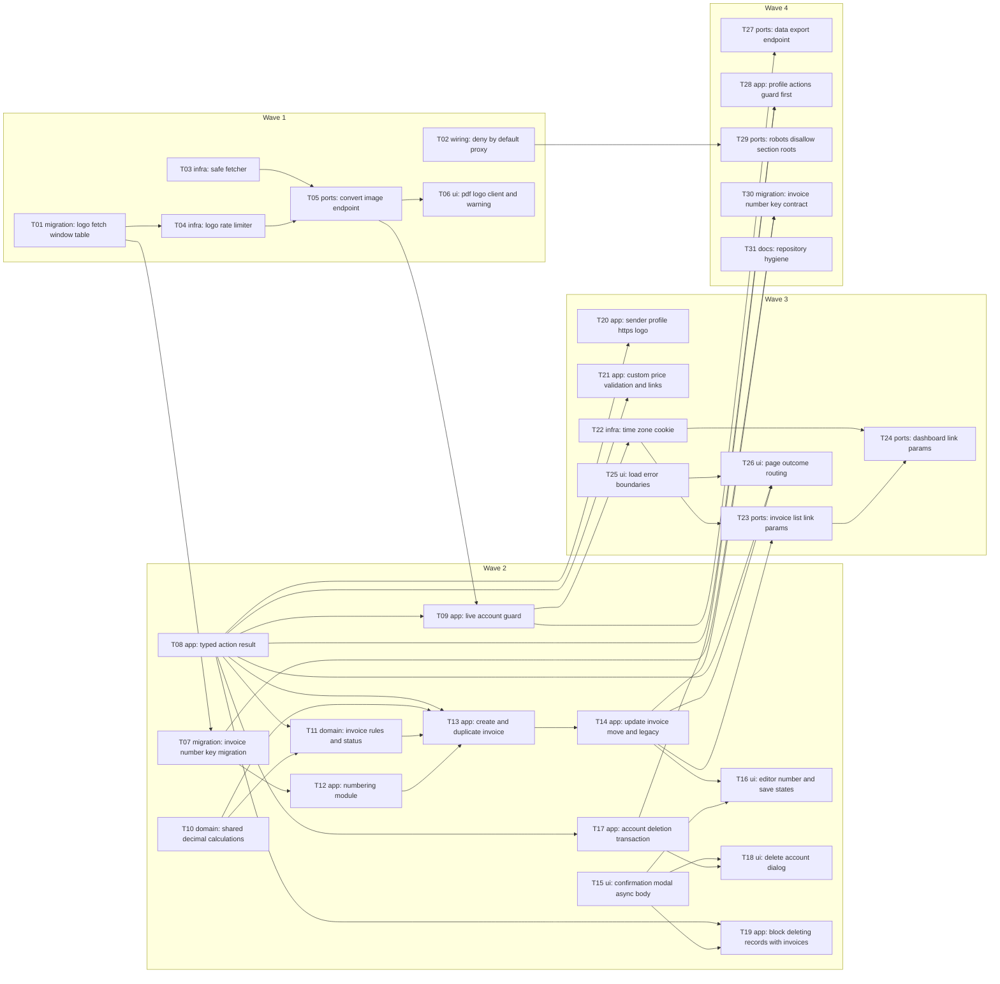

# Epic — architecture-hardening

> **Spec:** [spec.md](../spec.md) · **Design:** [sad.md](../sad.md) · **Data model:** [data-model.md](../data-model.md) · **API:** [openapi.yaml](../contracts/openapi.yaml) + [server-actions.md](../contracts/server-actions.md) · **Screens:** [screens.md](../screens.md) · **ADRs:** [adr/](../adr/)

## Goal

Close the 20 open High/Medium review findings (spec §7) in the production app, in four risk-ordered releases: the image-conversion security fix first, then invoice data integrity, then input and link validation, then the rest. When the epic ships, a Visitor can reach only the public allowlist, every saved invoice has a unique number and server-computed non-negative totals, malformed links and load failures never crash a page or masquerade as empty data, and account deletion always succeeds and removes everything (spec §2).

## Scope

- **In:** proxy + public allowlist, route handlers (`/api/convert-image`, `/api/user/export`), the safe fetcher and logo rate limiter, invoice / account / profile / customer / sender-profile / custom-price actions, shared validation and calculation modules, two staged schema changes (`LogoFetchWindow`, `Invoice.invoiceNumberKey`), the editor, delete dialogs, PDF logo warning, error boundaries, `robots.txt`, repository config, and the automated test harness + tests (T00, `test-plan.md`; F7 reversed 2026-09-27). Surfaces: `backend-service`, `web-frontend` (sad.md frontmatter).
- **Out:** logo file upload; bulk repair of already-corrupted data; soft delete or a grace period; purging monitoring/log records; a manually entered payment date (spec §3). Account-scoped invoice prefixes (accepted debt, sad §11).

## Task map

Same DAG as [tasks.json](../tasks.json). Waves are release boundaries: a wave's tasks ship together, and a later wave starts after the earlier one is released (dependency edges across waves are the code-level ones).

Parallel branches at the start: T01 (migration) · T02 (proxy) · T03 (safe fetcher) run together in wave 1; T08 (typed results) · T10 (decimal module) · T15 (modal) start wave 2 in parallel with T07; T25 (error boundaries) has no deps in wave 3; T31 is independent.

## Tasks

See [tracker.md](./tracker.md) for status. Machine contract: [tasks.json](../tasks.json).

| # | Task | Layer | Wave | Blocked by | DoD (short) |
|---|---|---|---|---|---|
| T00 | [Set up the test harness, throwaway database and factories](./t00-test-harness.md) | infra | 1 | — | Unit, component, integration (throwaway Postgres + staged migrations), contract and e2e suites each run one smoke test green, locally and in CI. |
| T01 | [Add the LogoFetchWindow table and Prisma model](./t01-logo-fetch-window-table.md) | migration | 1 | — | The LogoFetchWindow migration applies and reverts cleanly on the dev DB and prisma migrate diff reports no drift. |
| T02 | [Deny unauthenticated requests by default in the proxy, with one public allowlist](./t02-deny-by-default-proxy.md) | wiring | 1 | — | A cookie-less request sweep returns content only for allowlisted paths, redirects private pages to sign-in and answers /api/* and server-action POSTs with 401 NotSignedIn. |
| T03 | [Build the IP-pinning safe fetcher with per-hop checks and size/time caps](./t03-safe-fetcher.md) | infra | 1 | — | A scratch probe run shows the safe fetcher refuses every private/loopback/link-local/metadata/rebinding/redirect/oversize/slow case and returns bytes for a public https image. |
| T04 | [Implement the per-Freelancer sliding-window logo rate limiter](./t04-logo-rate-limiter.md) | infra | 1 | T01 | A scratch run against the dev DB allows 30 fetches and refuses the 31st within a minute with a Retry-After between 1 and 60 seconds. |
| T05 | [Rewrite /api/convert-image to fetch only an owned sender profile's logo](./t05-convert-image-endpoint.md) | ports | 1 | T03, T04 | Manual probes show 401 without a session, 404 for a foreign or logo-less profile, 200 with a data URL for an owned https image, and generic 422/429/502 refusals that never echo the address. |
| T06 | [Request logos by sender-profile id with a per-session cache and show the PDF logo warning](./t06-pdf-logo-client-and-warning.md) | ui | 1 | T05 | In the running app the PDF shows an owned https logo, reuses it without a second request, and for a refused logo still renders the PDF with the verbatim AC-03 warning. |
| T07 | [Add, backfill and uniquely index Invoice.invoiceNumberKey (expand step)](./t07-invoice-number-key-migration.md) | migration | 2 | T01 | Migrations 02-04 apply and revert cleanly, every non-duplicate invoice has a key, and the unique (senderProfileId, invoiceNumberKey) index is valid. |
| T08 | [Introduce typed ActionResult error codes and move every action onto them](./t08-typed-action-result.md) | app | 2 | — | The discriminated ActionResult compiles across the repo, every failure return carries a typed code, and a foreign id yields the same NOT_FOUND as a missing one. |
| T09 | [Treat sessions without a live account as Visitors in layouts and guards](./t09-live-account-guard.md) | app | 2 | T05, T08 | With the User row deleted, the other device is redirected to sign-in, its actions return UNAUTHORIZED and create nothing, and its /api calls get 401. |
| T10 | [Make invoice-calculations a pure exact-decimal module shared by editor and server](./t10-shared-decimal-calculations.md) | domain | 2 | — | A scratch run over the half-up rounding cases matches hand-computed values and the editor displays totals from the shared module. |
| T11 | [Tighten the invoice schema and add applyStatusChange for the paid date](./t11-invoice-rules-and-status.md) | domain | 2 | T08, T10 | Scratch runs show applyStatusChange sets, keeps, clears and rejects as specified, the schema rejects every AC-14/15 case with the contract messages, and the list status change updates the paid date. |
| T12 | [Add normalizeInvoiceNumber and the row-locked allocateInvoiceNumber](./t12-numbering-module.md) | app | 2 | T07 | A scratch run of parallel allocations yields only distinct numbers, skips a manually taken candidate, and normalization treats " INV-001 " and "inv-001" as equal. |
| T13 | [Rewrite createInvoice and duplicateInvoice on the allocator and recomputed amounts](./t13-create-and-duplicate-invoice.md) | app | 2 | T08, T10, T11, T12 | Manual and scripted probes show allocated, kept and blocked numbers as specified, concurrent saves all succeed with distinct numbers, stored amounts equal the shared-module figures, and duplicates get a sequence number. |
| T14 | [Rewrite updateInvoice for profile moves, legacy invoices and confirmed totals](./t14-update-invoice-move-and-legacy.md) | app | 2 | T13 | Manual checks show a move allocates from the target profile only, legacy invoices are blocked or confirmed exactly per AC-17, and re-saving a Paid invoice keeps its paid date. |
| T15 | [Extend ConfirmationModal with a body slot, async confirm and a hideable confirm button](./t15-confirmation-modal-async-body.md) | ui | 2 | — | Existing confirmations behave unchanged and an async confirm keeps the dialog open with a spinner until it settles. |
| T16 | [Build the editor number hint, field errors, saved state, legacy alert and SCR-15 dialog](./t16-editor-number-and-save-states.md) | ui | 2 | T14, T15 | A manual walk of every changed SCR-03 state and every SCR-15 state in the running app matches screens.md, and the displayed total equals the stored total after save. |
| T17 | [Add the deletion summary and delete the account in one explicit transaction](./t17-account-deletion-transaction.md) | app | 2 | T08 | Deleting a throwaway account with invoices removes every AC-20 category and a forced failure mid-transaction removes nothing. |
| T18 | [Show the invoice count and export offer in the delete-account dialog](./t18-delete-account-dialog.md) | ui | 2 | T15, T17 | A manual walk of every SCR-08 state and the changed SCR-07 states matches screens.md and a successful deletion lands on sign-in. |
| T19 | [Refuse deleting a Customer or sender profile that has invoices, with the count](./t19-block-deleting-records-with-invoices.md) | app | 2 | T08, T15 | Deleting a Customer or sender profile with invoices is blocked with the count and removes no invoice, while one without invoices is deleted. |
| T20 | [Require an https logo link when saving a sender profile](./t20-sender-profile-https-logo.md) | app | 3 | T08 | Saving a sender profile with a non-https logo link is blocked with the field message and an https link saves. |
| T21 | [Validate custom prices on create and update and link them to an explicit owned Customer](./t21-custom-price-validation-and-links.md) | app | 3 | T08 | Updating a custom price shows the same validation messages as creating one, and a created price links exactly the chosen owned Customer and product or is refused as not found. |
| T22 | [Carry the browser time zone in a validated tz cookie with day-bound helpers](./t22-time-zone-cookie.md) | infra | 3 | T09 | A scratch run shows local day ranges end exclusively at the next local midnight including DST edges, the tz cookie is set on first load, and an invalid cookie falls back to UTC. |
| T23 | [Parse invoice-list link parameters with fallback defaults and inclusive local date ranges](./t23-invoice-list-link-params.md) | ports | 3 | T14, T22 | Every malformed invoice-list link opens with defaults and matching controls, and invoices issued late on the last local day of a range are included. |
| T24 | [Parse dashboard date ranges with a current-month fallback and key Suspense on currency](./t24-dashboard-link-params.md) | ports | 3 | T22, T23 | Malformed and inverted dashboard links show the current local month with the filter displaying it, and a date change no longer reloads the three currency-keyed sections. |
| T25 | [Add the segment load-error boundaries with retry and Sentry reporting](./t25-load-error-boundaries.md) | ui | 3 | — | A forced page-load throw renders the SCR-17 boundary inside the app shell with a working retry and reports the error. |
| T26 | [Route page load outcomes: FAILED to the error boundary, NOT_FOUND to not-found](./t26-page-outcome-routing.md) | ui | 3 | T08, T25, T14 | With the database unreachable every AC-28 page shows the retry error state and reports it, and foreign record ids show the same not-found page as random ids. |
| T27 | [Harden the data export: session first, parallel reads, Invoice Forge file name](./t27-data-export-endpoint.md) | ports | 4 | T09 | The export downloads a file named "Invoice Forge export YYYY-MM-DD.json" holding every deletion category except sessions and no OAuth tokens. |
| T28 | [Check the session before parsing input in profile and account settings actions](./t28-profile-actions-guard-first.md) | app | 4 | T08, T17 | Signed out, profile and account actions return UNAUTHORIZED before looking at any submitted values, and signed in the profile update still works. |
| T29 | [Disallow the root and every page of each private section in robots.txt](./t29-robots-disallow-section-roots.md) | ports | 4 | T02 | robots.txt served without a session matches the contract example, disallowing every private section root and page. |
| T30 | [Make invoiceNumberKey NOT NULL and drop the exact-match unique (contract step)](./t30-invoice-number-key-contract.md) | migration | 4 | T07, T14 | With a zero pre-flight count, migrations 05-06 apply and revert cleanly with no schema drift; otherwise the task is closed as not applicable with the count recorded. |
| T31 | [Declare the sdd marketplace, ignore local settings and remove the empty route folder](./t31-repository-hygiene.md) | docs | 4 | — | No personal settings file is tracked, no empty route folder remains, and a fresh clone installs the sdd plugin from repo config alone. |

**Count note:** 31 tasks is above the 8–20 guideline for size M. The spec traces 27 findings across two surfaces (`backend-service` + `web-frontend`), and each task stays ≤ 1 day and one reviewable PR.

## Risks / Hard rules

- **Tests first** (amended 2026-09-27; F7 reversed). T00 builds the harness and blocks every task. Each task's tests are the `test-plan.md` rows for its ACs, written red before the code. The sad §10 probe sets still run on the preview deployment before each wave ships. Integration tests never touch the `.env` database.
- **Deny by default is security-critical** (ADR-0001; sad §11 Medium): every matcher exclusion is commented; run the QG-1 sweep on every release that touches `proxy.ts` or `routes.config.ts`.
- **Expand-only schema per wave** (sad §7): T01 and T07 are expand steps; T30 (contract step) runs only after wave 2 has run in production without a rollback **and** the pre-flight finds 0 NULL keys.
- **AC-22 invariant**: no task may add cascades from Customer/SenderProfile to Invoice; `Restrict` FKs stay (ADR-0007).
- **Contract strings are verbatim**: UI shows `error` / `fieldErrors` from results as-is, never raw DB or upstream text (spec §6.1).
- **Wave ordering deviation:** ADR-0009's typed `ActionResult` (T08) lands in wave 2, not wave 3 as sad §7 lists, because wave-2 actions need `CONFLICT` + `details`. The page-side routing (T25, T26) stays in wave 3.
- **Open questions carried:** spec §8 Q4 (stale editor tabs after a deploy) was due before `tasks` and is taken at its default: accept the risk and ship waves at low-traffic hours. Data-model OQ-2 (AC-20 "sign-in links" vs `VerificationToken`) is taken as "delete the tokens in the transaction" in T17; revert that step if the owner rules otherwise. Spec §8 Q3 (p95 targets) stays open until before the wave-2 and wave-4 releases (sad §1 override).
