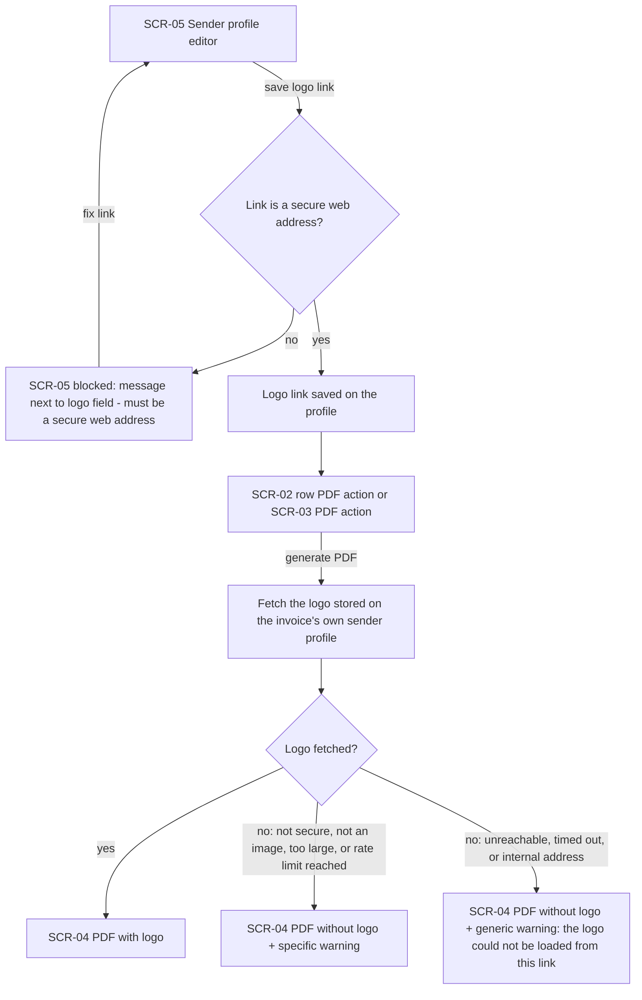
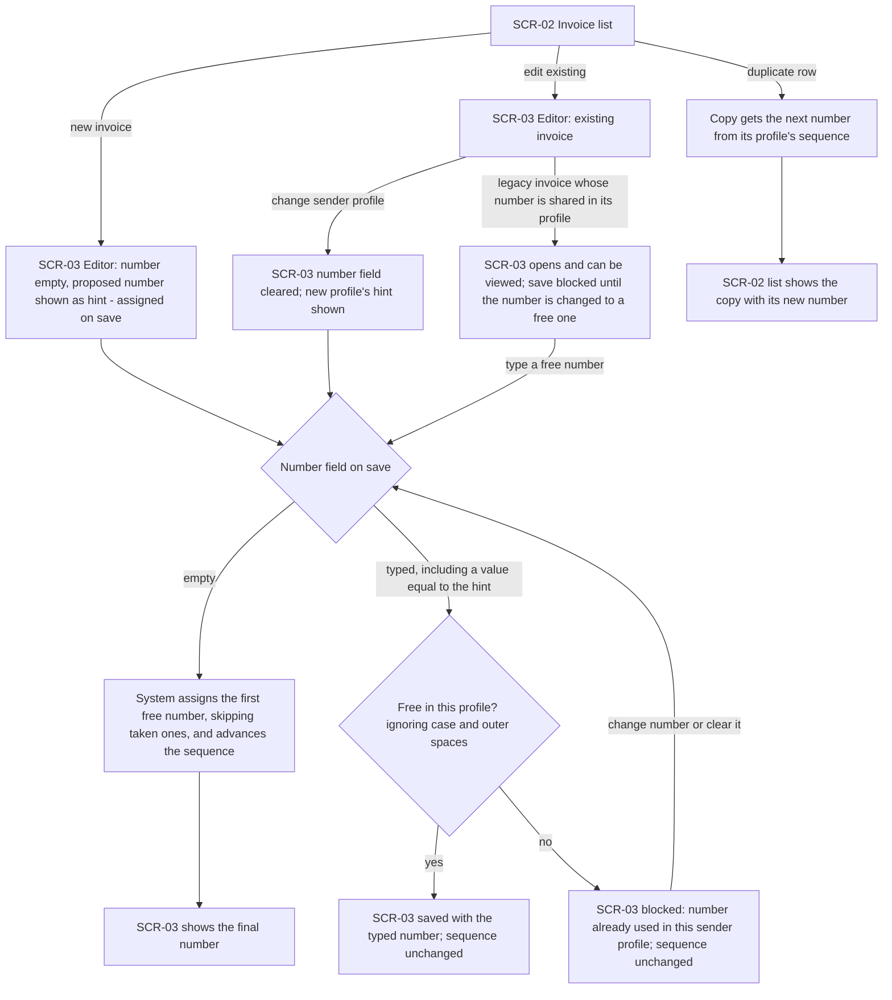
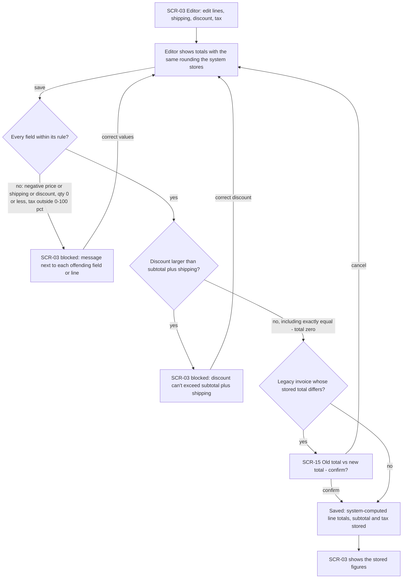
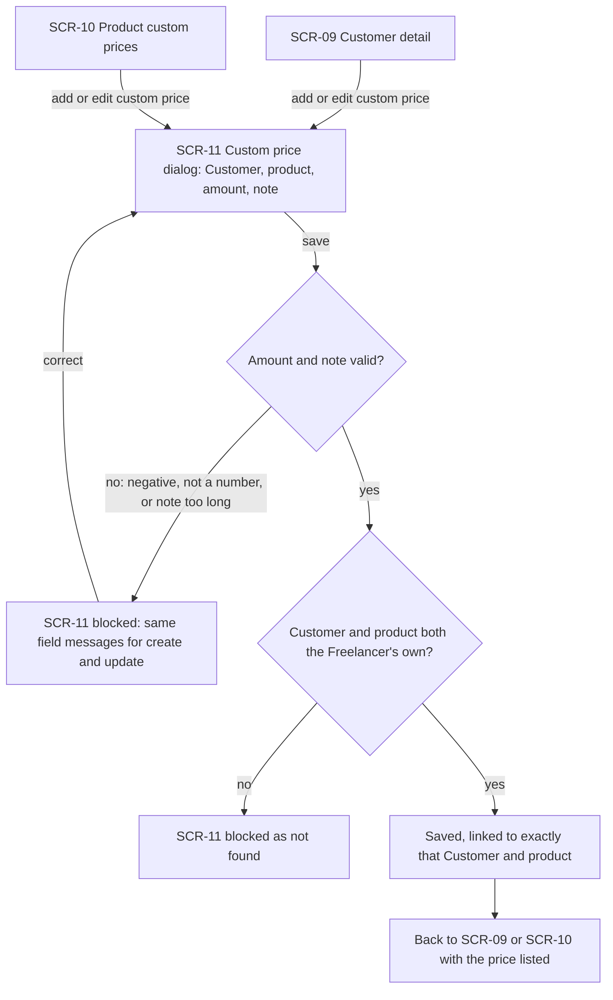
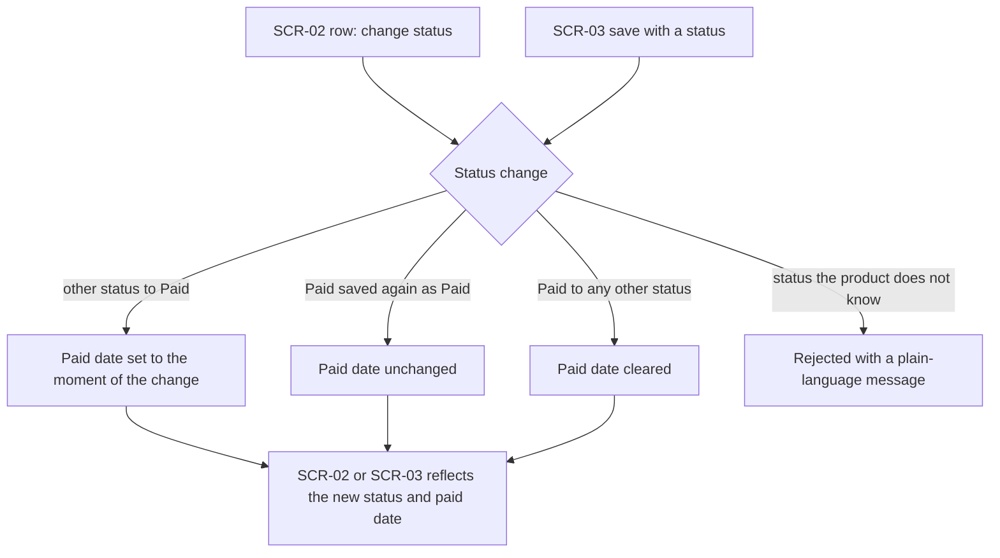
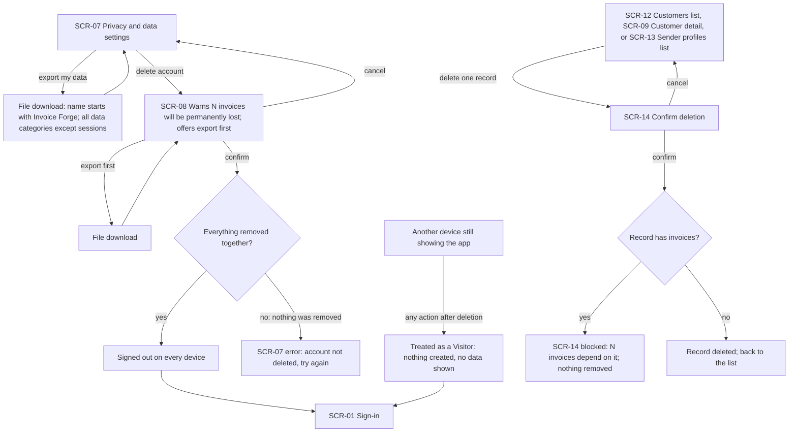
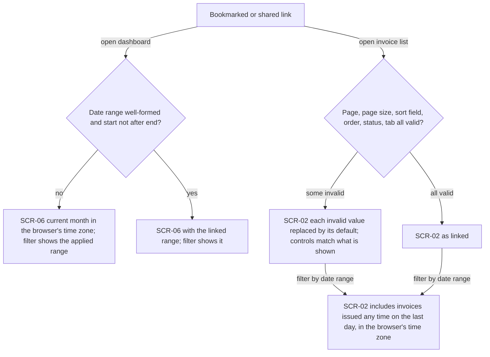
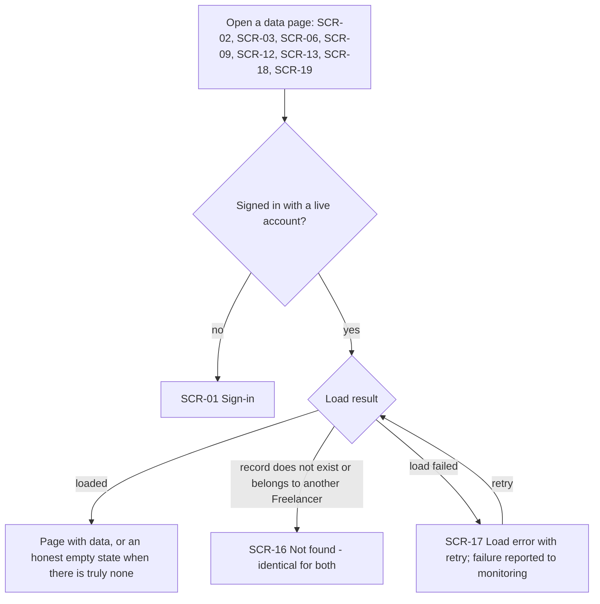

# UX flows — architecture-hardening

> User flows for every UI-touching §4 user story, produced by `ux-flows` (after `clarify`, before
> `design`) and read by `design` (evidence for the target-surface + UI-architecture decisions),
> `sequences` (UI-driven flows align on SCR ids), `screens` (details every inventory row) and
> `plan-tests` (the e2e-through-UI paths). **Always markdown + mermaid `flowchart`**, whatever the
> design tool — this artifact is flow-altitude, not visual design.

## Platform decisions

- **Posture:** responsive-both. This keeps the app's current behaviour: the same screens serve desktop and mobile. `docs/design-system.md` doesn't exist yet, so this comes from the existing app, not from a canon.
- **No new pages.** This feature adds only new branches, states and confirmation steps to screens that already exist. The one new stop is the legacy-invoice confirmation (SCR-15).
- **Modality.** Confirmations that interrupt an action are dialogs over the screen that started them: delete account (SCR-08), delete customer or sender profile (SCR-14), legacy totals (SCR-15), custom price (SCR-11). Everything else stays a page.
- **Blocked saves keep the Freelancer where they are.** A save that breaks a rule (numbering, amounts, logo link, custom price) returns to the same screen with the entered values intact and a message next to the offending field. It never navigates away, and it never silently corrects the value.
- **Load failure vs. not found are two different destinations.** Every data page can end in either the load-error stop (SCR-17, with retry) or the not-found stop (SCR-16). Whether SCR-17 replaces the page or sits inside it is left to `screens`/`design`.
- **Private pages start from sign-in.** A Visitor, or a device whose account was deleted, that opens any private page lands on sign-in (SCR-01).

## Screen inventory

| ID | Screen | Purpose | Entry | Exit |
|---|---|---|---|---|
| SCR-01 | Sign-in | Where Visitors and stale sessions are sent; entry to the private app | Any private page without a valid session; after account deletion | Dashboard or the page they came from (after sign-in) |
| SCR-02 | Invoice list | Browse, filter, sort and paginate invoices; row actions: view/download/print PDF, edit, duplicate, change status | App navigation, bookmarked or shared link, leaving the editor | SCR-03, SCR-04, SCR-16, SCR-17 |
| SCR-03 | Invoice editor | Create or edit an invoice: sender profile, number, lines, amounts, status | "New invoice" or "Edit" from SCR-02, direct link | SCR-02 (exit), SCR-04 (PDF), SCR-15 (legacy confirm), SCR-16, SCR-17 |
| SCR-04 | PDF output | Invoice PDF as a preview, download or print, plus the logo warning when the logo was left out | PDF actions on SCR-02 rows or in SCR-03 | Back to the originating screen |
| SCR-05 | Sender profile editor | Edit a sender profile's details, including its logo link | Sender profile detail (SCR-19) or list (SCR-13) | SCR-19 / SCR-13 after save |
| SCR-06 | Dashboard | Figures for a date range | App navigation, bookmarked or shared link, after sign-in | Other app pages; SCR-17 |
| SCR-07 | Privacy & data settings | Export my data; delete my account | Settings navigation | SCR-08; file download |
| SCR-08 | Delete-account confirmation | States how many invoices will be lost, offers an export first, asks for the final confirmation | "Delete account" on SCR-07 | SCR-01 (deleted), SCR-07 (cancel or failure) |
| SCR-09 | Customer detail | One Customer's details, custom prices and related invoices; delete action | SCR-12, direct link | SCR-11, SCR-14, SCR-16, SCR-17 |
| SCR-10 | Product custom prices | Custom prices agreed for one product across Customers | Products list (SCR-18) | SCR-11, SCR-16, SCR-17 |
| SCR-11 | Custom price dialog | Create or update one custom price for a chosen Customer and product | "Add" / "Edit" on SCR-09 or SCR-10 | Back to SCR-09 / SCR-10 |
| SCR-12 | Customers list | Browse Customers; delete action per Customer | App navigation | SCR-09, SCR-14, SCR-17 |
| SCR-13 | Sender profiles list | Browse sender profiles; delete action per profile | App navigation | SCR-19, SCR-05, SCR-14, SCR-17 |
| SCR-14 | Delete-record confirmation | Confirms deleting one Customer or sender profile, and shows the "N invoices depend on it" block when invoices exist | Delete action on SCR-09, SCR-12 or SCR-13 | Back to the originating screen |
| SCR-15 | Legacy-invoice confirmation | Shows a pre-change invoice's old total next to the recomputed total and asks to confirm before saving | Saving a legacy invoice in SCR-03 whose stored total differs | SCR-03 (saved or cancelled) |
| SCR-16 | Not found | Shown for a record that doesn't exist or isn't the Freelancer's (identical for both) | Any detail page or the editor with an unknown or foreign id | App navigation |
| SCR-17 | Load error with retry | Honest "couldn't load your data" with a retry; the failure is reported to error monitoring | Any data page whose load fails | Retry (the same page again) or app navigation |
| SCR-18 | Products list | Browse products | App navigation | SCR-10, SCR-17 |
| SCR-19 | Sender profile detail | One sender profile's details and related invoices | SCR-13, direct link | SCR-05, SCR-14, SCR-16, SCR-17 |

## Flows

### Flow: US-01 — Include my logo safely in PDFs

The Freelancer sets the logo link in the sender profile editor. A link that isn't a secure web address is refused on save, with a message next to the logo field, and the Freelancer corrects it there. Later, when they generate a PDF from an invoice row or from the editor, the system fetches only the logo saved on that invoice's own sender profile; the Freelancer never supplies an address. If the fetch works, the PDF includes the logo. If it fails, the PDF is still produced without the logo, and a warning explains why. Four reasons get their own wording: not a secure link, not an image, too large, and too many requests in a minute. Unreachable, timed-out and internal or private addresses all share one generic message, so the warning never reveals which addresses exist.

### Flow: US-02 — Get a unique invoice number

A new invoice opens in the editor with an empty number field and the proposed number shown only as a hint ("assigned on save"). On save, an empty field means the system assigns a number. It takes the first free one, skipping any that were typed manually, and advances the sequence, so two tabs saving at once each get a different number and neither fails. The editor then shows the final number. A typed number is manual, even if it equals the hint. If it's free in the profile (ignoring case and outer spaces), it's kept and the sequence doesn't move. If it's taken, the save is blocked with "already used in this sender profile" and the Freelancer changes or clears it. Moving an existing invoice to another sender profile clears the number field, and the same rules then apply in the new profile. Duplicating a row from the list gives the copy a fresh number from its profile's sequence. A legacy invoice whose number is shared can still be opened and viewed, but it can't be saved until its number is changed to a free one.

### Flow: US-03 — Trust invoice amounts (A: invoice editor)

While editing, the editor shows the totals using the same rounding the system stores. On save, the system checks each field. A negative price, shipping or discount, a quantity of zero or less, or a tax rate outside 0–100 % blocks the save, with a message next to that field or line. A discount larger than subtotal plus shipping is also blocked, with an explanation. A discount exactly equal to it is allowed and gives a zero total. If the invoice predates this change and its stored total differs from the recomputed one, a confirmation shows the old and new totals first. Cancelling returns to the editor, and confirming saves. A legacy invoice whose amounts break the rules can't reach this confirmation until its amounts are fixed. Otherwise the save succeeds, the system stores its own line totals, subtotal and tax whatever the browser sent, and the editor shows the stored figures. The save is never blocked just because the browser's figures differed.

### Flow: US-03 — Trust invoice amounts (B: custom prices)

A custom price is created or edited in the same dialog, from either the customer's page or the product's custom-prices page. On save, a negative amount, a non-number, or a note that's too long is blocked, with the same field messages whether the price is being created or updated. If the chosen Customer or product isn't the Freelancer's own, the save is blocked as "not found". Otherwise the price is saved for exactly that Customer and product, and the Freelancer returns to the page they started from, where the price is listed.

### Flow: US-04 — Track when an invoice was paid

The Freelancer changes an invoice's status from a list row or by saving it in the editor. Moving to Paid from any other status records that moment as the paid date. Saving an invoice that's already Paid leaves the date untouched. Moving from Paid to anything else clears the date. A status the product doesn't recognise (only reachable through a tampered request) is rejected with a plain message. A status change from the list doesn't touch amounts or the number, so the legacy checks from US-02 and US-03 never block it.

### Flow: US-05 — Manage and delete my account safely

From privacy settings, the Freelancer can export their data. They get one file whose name starts with "Invoice Forge" and which holds every data category except sessions. Choosing to delete the account opens a confirmation that states how many invoices will be permanently lost and offers the export right there. Exporting from the confirmation downloads the file and returns to it. Cancelling goes back to settings. Confirming removes everything together. On success, every device is signed out and the Freelancer lands on sign-in. If anything fails, nothing is removed and settings shows that the account wasn't deleted. A second device that is still open is treated as a Visitor on its next action: nothing is created, no data is shown, and it goes to sign-in. Separately, deleting a single Customer or sender profile asks for confirmation. If the record has invoices, the deletion is blocked with "N invoices depend on it" and nothing is removed. If it has none, the record is deleted.

### Flow: US-06 — Use any link to my lists and dashboard

Opening a dashboard link with a malformed range, or one whose start is after its end, shows the current month in the Freelancer's browser time zone, and the date filter shows the range that was actually applied. A valid range opens as linked. Opening an invoice-list link replaces each bad value individually with its default: out-of-range or malformed page, a page size not offered, or an unknown sort field, order, status or tab. The on-screen controls always match what's shown. A date-range filter on the list includes invoices issued at any time on the last day, counted in the browser's time zone. Neither page ever crashes on a bad link.

### Flow: US-07 — See an honest error when data fails to load

Opening any page that shows the Freelancer's data first checks the session. A Visitor, or a device whose account was deleted, goes to sign-in. Otherwise the page loads. If it loads, the Freelancer sees the data, or a real empty state when there genuinely is none. If the requested record doesn't exist, or belongs to another Freelancer, the page shows the same "not found", so it never reveals that the record exists. If loading fails, the Freelancer sees an error with a retry instead of an empty list or "not found", and the failure is reported to error monitoring. Retrying tries the load again.

### Out of scope

- **US-08 — Keep my private pages out of search engines.** This affects only crawlers (Visitors) reading the crawling rules. No human sees a screen, so there is no flow.

## AC coverage

| AC | Shown by | Notes |
|---|---|---|
| AC-01 | Flow US-01 → G2 yes → G3 | |
| AC-02 | N/A: endpoint-level | A Visitor calling the image endpoint directly has no screen. The only UI-visible part (private page → sign-in) is AC-05 |
| AC-02b | Flow US-01 → G1 | The UI only ever fetches the invoice's own profile logo; the "foreign profile → not found" path has no UI entry and is endpoint-level |
| AC-03 | Flow US-01 → G4 (specific reasons), G5 (generic) | |
| AC-04 | Flow US-01 → P2 no → P3 | |
| AC-05 | Flow US-07 → V1 no → V2 | Page requests only. Refusing data requests and actions is endpoint-level |
| AC-06 | Flow US-02 → N2 empty → N3 → N4 | |
| AC-07 | Flow US-02 → N3 | Concurrency is invisible in the UI. Each tab independently takes N3 and gets a distinct number |
| AC-08 | Flow US-02 → N5 no → N7 | |
| AC-09 | Flow US-02 → N3 (skips taken numbers) | |
| AC-10 | Flow US-02 → N5 yes → N6 | |
| AC-11 | Flow US-02 → N1b → N1c → N2 | |
| AC-12 | Flow US-02 → D1 → D2 | |
| AC-13 | Flow US-03 A → A2, A9, A10 | |
| AC-14 | Flow US-03 A → A3 no → A4 | |
| AC-15 | Flow US-03 A → A5 yes → A6; equal → A7 | |
| AC-16 | Flow US-03 B → C3 no → C4 | |
| AC-17 | Flow US-03 A → A7 yes → SCR-15 (totals); Flow US-02 → L1 (shared number); Flow US-04 prose (list status change never blocked) | "Rules broken → can't save" is A3/A5 applied to legacy invoices |
| AC-18 | Flow US-04 → S3, S4 | |
| AC-19 | Flow US-04 → S5, S6 | |
| AC-20 | Flow US-05 → E2 → E4 → E5/E7 | |
| AC-21 | Flow US-05 → X0 → X1 → SCR-01; Flow US-07 → V1 no | |
| AC-22 | Flow US-05 → R1 → R2 yes → R3 | |
| AC-23 | N/A: endpoint-level | A Visitor has no settings screen (it's sent to SCR-01 by AC-05). The check-session-before-input ordering is invisible in the UI |
| AC-24 | Flow US-05 → E1 (and E3 from the confirmation) | |
| AC-25 | Flow US-06 → K1 no → K2 | |
| AC-26 | Flow US-06 → K4 some invalid → K5 | |
| AC-27 | Flow US-06 → K7 | |
| AC-28 | Flow US-07 → V3 load failed → V6 | Covers every page AC-28 lists: SCR-02, 03, 06, 09, 12, 13, 18, 19 |
| AC-29 | Flow US-07 → V3 → V5 | |
| AC-30 | N/A: crawler only | No human-facing UI (US-08 is out of scope above) |
| AC-31 | Flow US-03 B → C5 no → C6; yes → C7 | |

## Assumptions (easy depth — veto any line)

- Assumed: US-03 is drawn as two diagrams (editor amounts, custom prices), because one diagram with two unrelated entry points reads worse.
- Assumed: the logo warning (AC-03) appears alongside the PDF output (SCR-04), whether that's the preview, a download or a print. Its exact placement is left to `screens`.
- Assumed: AC-17's "old vs new totals" confirmation is a dialog over the editor (SCR-15), not a separate page.
- Assumed: the delete-account confirmation (SCR-08) hosts the "export first" action, and after exporting the Freelancer returns to the confirmation, not to settings.
- Assumed: a failed account deletion returns to settings (SCR-07) with an error, and nothing is removed.
- Assumed: a successful account deletion lands on sign-in (SCR-01). This keeps the app's current behaviour.
- Assumed: after a duplicate, the Freelancer stays on the invoice list and sees the copy with its new number. The app doesn't open the copy in the editor, which also keeps current behaviour.
- Assumed: deleting a Customer or sender profile is blocked after the Freelancer confirms (SCR-14 shows the count), as AC-22 words it, not pre-emptively before the dialog.
- Assumed: SCR-17 (load error) and SCR-16 (not found) are shared destinations for every data page. Whether SCR-17 replaces the page or sits inside it is left to `screens`/`design`.
