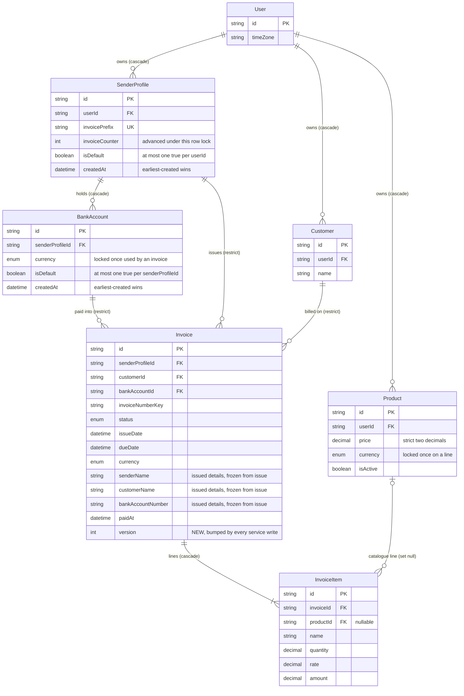

# Data model — invoice-integrity

> **Mode:** brownfield delta. This feature adds **no table**. It adds one column (`Invoice.version`), one index on an existing FK (`Invoice_bankAccountId_idx`) and two partial unique indexes that keep at most one default (`SenderProfile`, `BankAccount`). Before creating them, it runs a one-time repair of duplicate and missing defaults (AC-18). Most of the feature changes how existing columns are written and read, not their shape. The issued details are the existing snapshot columns, and they are frozen from issue (ADR-0001). The lifecycle (ADR-0002), the locked-field check (ADR-0003), and the currency, amount and date rules all live in `lib/services`. None of them has a database form.
>
> **Conventions followed (derived, not imposed):**
> - `prisma migrate` with the split schema `prisma/schema/{base,auth,invoice}.prisma` (architecture-map §Migrations). Every touched model is in `invoice.prisma`.
> - Table names are quoted PascalCase and columns are camelCase. Ids are `TEXT` from `cuid()` (SAD §8). Prisma's default index names (`_idx`, `_key`) are used where they are unambiguous. The partial indexes get an explicit `map:` name because Prisma's default (`SenderProfile_userId_key`) would read as "one profile per user".
> - No `CHECK` constraints or triggers. The repo uses none, and the lifecycle and currency rules stay in the service (SAD §11 accepted debt).
> - **Deliberate convention change (ADR-0005, owner decision 2026-10-07):** the repo had no partial indexes, because Prisma could not represent them and they would have shown up as drift (mcp-server data-model). Prisma 7.10 has the `partialIndexes` preview feature. It is enabled in the `generator` block, and the two indexes are declared in the schema with `where: { isDefault: true }`. So `migrate diff` stays empty, and a later `migrate dev` will not generate a `DROP INDEX`. This is verified (see the audit).
> - An index on an existing table is built `CONCURRENTLY` in a file of its own, as in `20260927100200_create_invoice_number_key_unique`.
> - DDL is idempotent (`IF NOT EXISTS` / `IF EXISTS`), and the repair `UPDATE`s match no row on a second run.
>
> **Staged migrations:** `docs/features/invoice-integrity/migrations/0{1..4}_*.{up,down}.sql`. `implement` promotes them into `prisma/migrations/`.

## ER diagram

Only the entities this feature changes or relies on are shown. ★ marks new columns. The two partial unique indexes are noted on `isDefault`.



## Entities

**Aggregate roots, from the ACs and ADRs.**
- **`User` (the Freelancer)** owns `SenderProfile`, `Customer` and `Product`. Its row is the lock that serializes default changes among its sender profiles (ADR-0005).
- **`SenderProfile`** is a child of `User`. It is also the parent of `BankAccount`, and its row is the lock for default changes among its bank accounts (ADR-0005) and for invoice numbering (architecture-hardening ADR-0005).
- **`Invoice`** is the aggregate root of the invoice document. `InvoiceItem` belongs to it, is deleted with it, and is written only through it. The `Invoice` row lock (`FOR UPDATE OF i`, scoped by the owner through `SenderProfile.userId`) guards every invoice write: the version check, the lifecycle and the locked-field comparison (ADR-0002, 0003, 0004). `Invoice` refers to `SenderProfile`, `Customer` and `BankAccount` with `RESTRICT`, and keeps a copy of their printed data. It does not depend on their current values.
- **`Customer`** and **`Product`** are separate roots under `User`. The invoice paths only read them: they are copied into a draft's issued details or a line, and counted for the currency lock (AC-13b). A `Product` row is locked, though: an invoice save reads its line products `FOR SHARE`, and `updateProduct` locks the product `FOR UPDATE` before counting its usage, so the two serialize on the currency (AC-12, AC-13b).

### `Invoice` (one new column; new write semantics for existing columns)

| Column | Type | Constraints | Notes |
|---|---|---|---|
| `version` ★ | INTEGER | NOT NULL DEFAULT 0 | ADR-0004. Every service write to the invoice sets `"version" = "version" + 1`: create (starts at 0), `updateInvoice`, `updateInvoiceStatus`, and any later invoice write. The one exception is the lazy calendar-day normalisation (mcp-server ADR-0009), which does not change the day the Freelancer sees. Existing rows start at 0. Not indexed: it is only compared on the row already locked by id |
| `bankAccountId` | TEXT | NOT NULL, FK → `BankAccount(id)` ON DELETE RESTRICT | unchanged, **newly indexed** (`Invoice_bankAccountId_idx`) for the AC-13 count. It was the only `Invoice` FK without an index |

**Existing columns whose meaning this feature fixes (no DDL):**

| Columns | Rule | Source |
|---|---|---|
| Issued details: `senderName`, `senderLegalName`, `senderTaxId`, `senderAddress`, `senderCity`, `senderCountry`, `senderPostalCode`, `senderPhone`, `senderEmail`, `senderWebsite`; `customerName`, `customerCompanyName`, `customerTaxId`, `customerEmail`, `customerPhone`, `customerAddress`, `customerCity`, `customerCountry`, `customerPostalCode`; `bankName`, `bankAccountNumber`, `bankIban`, `bankSwift`, `accountName` | Written from the current records by create, duplicate, and `updateInvoice` while the row is `DRAFT` at the start of the save (issuing from the editor refreshes them, then freezes them). **Never written again once the status is not `DRAFT`.** `updateInvoiceStatus` never touches them. The PDF, the editor and the Assistant read only these columns (AC-01 to AC-03, AC-26) | ADR-0001 |
| `senderLogo` | Still written for drafts as today, but **not printed**. The PDF takes the logo from the current `SenderProfile.logo` (spec §3) | ADR-0001, SAD §11 debt |
| Editable on an issued invoice: `dueDate`, `notes`, `paymentTerms`, `poNumber` | The only columns `updateInvoice` may change when the status is `PENDING`, `OVERDUE` or `PAID` | ADR-0003, AC-07, AC-08 |
| Locked on an issued invoice: every other business column (the issued details, `invoiceNumber`/`invoiceNumberKey`, `senderProfileId`, `customerId`, `bankAccountId`, `issueDate`, `currency`, `subtotal`, `taxRate`, `taxAmount`, `discount`, `shipping`, `total`, `terms`, the `InvoiceItem` rows) | Compared with the submitted values using the write normalizers. Any difference → `VALIDATION`. A `CANCELLED` row refuses every edit | ADR-0003, AC-06, AC-08 |
| `status` | Changed only through `decideStatusChange` (the transition table), under the row lock. Create accepts only `DRAFT` (AC-04b). Delete accepts only `DRAFT` | ADR-0002 |
| `paidAt` | Set to the moment of entering `PAID`. Cleared on `PAID → PENDING`. Untouched by a same-status request (AC-04) | ADR-0002 |
| `invoiceNumber` / `invoiceNumberKey` | Assigned on first save. The year comes from the UTC year of `issueDate` (a calendar day stored at `T00:00:00Z`), not the server clock. The number is kept when the issue date moves later (AC-21, AC-21b, AC-22) | SAD §4 tactical |
| `amountPaid` | Untouched by this feature (no partial payments, spec §3) | — |

**Access patterns (SAD §6).**
- **Lock for write (flows 1, 2, 4, 5, 6):** `SELECT … FROM "Invoice" i JOIN "SenderProfile" sp ON sp."id" = i."senderProfileId" WHERE i."id" = $id AND sp."userId" = $owner FOR UPDATE OF i` → `Invoice_pkey`, then `SenderProfile_pkey`. This already exists at `lib/services/invoices/invoices.ts:597` for `updateInvoice`. `updateInvoiceStatus` and `deleteInvoice` take the same lock. No rows → `NOT_FOUND` (AC-23).
- **Locks behind the currency checks (flows 3, 4, 5, 9; AC-11, AC-12, AC-13, AC-13b):** always taken in this order, so no two paths wait on each other in a cycle:
  1. the `Invoice` row, as above (update, status change);
  2. the `SenderProfile` row, `FOR UPDATE` by id and owner → `SenderProfile_pkey`. It is taken before the draft rules on create, duplicate and every draft update. It guards the bank account's currency, because `updateBankAccount` counts invoices under the same lock;
  3. the line products, `SELECT … FROM "Product" WHERE "id" IN (…) AND "userId" = $owner ORDER BY "id" FOR SHARE` → `Product_pkey`, inside the save transaction.

  Issuing from the list (`updateInvoiceStatus`, draft → pending) takes 1 and 3 only. The draft already references its bank account, so `updateBankAccount`'s count under the profile lock refuses that account's currency change.

  `updateProduct` locks its own row `FOR UPDATE` (owner in the `WHERE`), then counts usage and writes in the same transaction. The default switch takes `User` → `SenderProfile` (ADR-0005); no invoice transaction takes the `User` lock.
- **Version check (flows 1, 2, 4):** compare `$loadedVersion` with the locked row's `version` in the service, before any other rule. On success, the `UPDATE … SET "version" = "version" + 1 WHERE "id" = $id` runs in the same transaction. It is safe without a `WHERE "version" = $loaded` guard because the row is locked.
- **Same-status request (flow 5):** no write and no version bump.
- **AC-13 currency lock (flow 9):** `SELECT count(*) FROM "Invoice" WHERE "bankAccountId" = $id` (any status) → `Invoice_bankAccountId_idx` ★. It runs only when the submitted currency differs from the stored one.
- **AC-13b currency lock (flow 9):** `SELECT count(DISTINCT "invoiceId") FROM "InvoiceItem" WHERE "productId" = $id` → `InvoiceItem_productId_idx` (existing). The rule exists today. Its message now names the count.
- **Draft rules on create, save and issue (flows 3, 4, 5):** the bank account and the lines' catalogue products are read by id, **inactive products included** → `BankAccount_pkey`, `Product_pkey`. Bounded by the line count.
- **Read and print (flows 7, 8):** by `Invoice_pkey` with the lines (`InvoiceItem_invoiceId_idx`), every product the lines reference (by id, active or not), and the current `SenderProfile.logo`.

### `InvoiceItem` (no change)

Lines are copies (`name`, `description`, `unit`, `quantity`, `rate`, `amount`). They are written as sent on a draft save and never touched on an issued invoice. Deleting a product sets `productId` to NULL (`ON DELETE SET NULL`), and the line remains free text (AC-16). Deactivating a product does not touch lines (AC-15). The nullable `currency` column stays unused by these rules. The line-currency check (AC-12) compares the **catalogue product's** currency with the invoice's, because a free-text line has no currency of its own.

### `SenderProfile` (one partial unique index; repair at release)

| Column | Type | Constraints | Notes |
|---|---|---|---|
| `isDefault` | BOOLEAN | NOT NULL DEFAULT false; **partial UNIQUE (`userId`) WHERE `isDefault` = true** ★ (`SenderProfile_userId_isDefault_key`) | ADR-0005. The database guarantees **at most one** default per Freelancer. **At least one while any exist** is a service rule under the `User` row lock |
| `invoiceCounter` | INTEGER | NOT NULL DEFAULT 0 | unchanged. Advanced under the `SenderProfile` row lock (`numbering.ts:71`). Never reset per year (spec §3) |

**Access patterns (flow 10).** Every default-changing write is one transaction:
1. `SELECT 1 FROM "User" WHERE "id" = $owner FOR UPDATE` → `User_pkey`. Parallel requests for this Freelancer wait here.
2. Then one of:
   - **Make B the default:** `UPDATE … SET "isDefault" = false WHERE "userId" = $owner AND "isDefault" AND "id" <> $b`, then `UPDATE … SET "isDefault" = true WHERE "id" = $b AND "userId" = $owner`. Clear first, set second, so the partial index never sees two `true` rows. Repeating the request finds B already the default.
   - **Create:** `isDefault = NOT EXISTS (SELECT 1 FROM "SenderProfile" WHERE "userId" = $owner)` → `SenderProfile_userId_idx`.
   - **Delete the default:** delete it, then promote `SELECT "id" … WHERE "userId" = $owner ORDER BY "createdAt", "id" LIMIT 1` → `SenderProfile_userId_idx` (a Freelancer's profiles are few, so the sort is trivial).
   - **Unset without a replacement:** refused before any write.

A unique violation on `SenderProfile_userId_isDefault_key` (P2002) means a write path skipped the lock. It maps to a retryable `CONFLICT` and raises the SAD §7 alert.

### `BankAccount` (one partial unique index; repair at release; currency lock)

| Column | Type | Constraints | Notes |
|---|---|---|---|
| `isDefault` | BOOLEAN | NOT NULL DEFAULT false; **partial UNIQUE (`senderProfileId`) WHERE `isDefault` = true** ★ (`BankAccount_senderProfileId_isDefault_key`) | ADR-0005. Same rule as for sender profiles, per sender profile |
| `currency` | `Currency` | NOT NULL | unchanged type. It can no longer change once any invoice, in any status, uses the account (AC-13; count above) |

**Access patterns (flow 10).** The same four operations as `SenderProfile`, under `SELECT 1 FROM "SenderProfile" WHERE "id" = $sp AND "userId" = $owner FOR UPDATE`. The earliest-created remaining account → `BankAccount_senderProfileId_idx`.

### `Product` (no DDL)

`price` stays `DECIMAL(10,2)`. The new strict two-decimal format (AC-20) is a zod rule in `lib/validations/product.ts`, the same one custom prices use. `currency` is locked once the product appears on any invoice line (the existing rule, counted by `InvoiceItem_productId_idx`). Inactive products stay readable by id for existing lines (AC-15).

### Release repair of defaults (AC-18)

This runs once, inside migrations 03 and 04. In each, the repair and the index creation share one transaction behind a table lock:

| Situation before release | After |
|---|---|
| Several defaults under one parent | Only the earliest-created of them stays the default (`ORDER BY "createdAt", "id"`) |
| Records but no default under one parent | The earliest-created record becomes the default |
| Exactly one default (even if it is not the earliest) | Unchanged |

Only `isDefault` changes. `updatedAt` keeps its value, because raw SQL does not fire Prisma's `@updatedAt`. No invoice is touched. Sender profiles are repaired first (03), then bank accounts (04). The two are independent: a bank account's default is per sender profile, whatever that profile's own default flag says. The downs drop only the indexes. The repair is not reverted (SAD §7).

### Pre-release count-only report (spec §8, SAD §7; `scripts/invoice-integrity-report.ts`)

These are read-only queries. The script runs them before the production deploy, and their counts become the baseline of the §7 "new rule violations" KPI. They are listed here so the script and the KPI re-run use the same definitions:

| Category | Query (counts only) |
|---|---|
| Freelancers with more than one default sender profile | `SELECT count(*) FROM (SELECT "userId" FROM "SenderProfile" WHERE "isDefault" GROUP BY 1 HAVING count(*) > 1) t` |
| Freelancers with sender profiles but no default | `SELECT count(DISTINCT "userId") FROM "SenderProfile" s WHERE NOT EXISTS (SELECT 1 FROM "SenderProfile" d WHERE d."userId" = s."userId" AND d."isDefault")` |
| Sender profiles with more than one default account / with accounts but no default | the same two queries on `"BankAccount"` grouped by `"senderProfileId"` |
| Invoices whose currency differs from their bank account's, split by draft or issued | `SELECT i."status" = 'DRAFT' AS draft, count(*) FROM "Invoice" i JOIN "BankAccount" b ON b."id" = i."bankAccountId" WHERE b."currency" <> i."currency" GROUP BY 1` |
| Invoices with a catalogue line in another currency, split by draft or issued | `SELECT i."status" = 'DRAFT', count(DISTINCT i."id") FROM "Invoice" i JOIN "InvoiceItem" it ON it."invoiceId" = i."id" JOIN "Product" p ON p."id" = it."productId" WHERE p."currency" <> i."currency" GROUP BY 1` |
| Invoices with the due date before the issue date | `SELECT count(*) FROM "Invoice" WHERE "dueDate"::date < "issueDate"::date` |
| Impossible status history | `SELECT count(*) FROM "Invoice" WHERE ("status" = 'PAID') <> ("paidAt" IS NOT NULL)` |
| Invoices with an amount above 99,999,999.99 | not reachable: `DECIMAL(10,2)` caps every amount column at 99,999,999.99. Report 0 without a query |
| Issued invoices saved after a related record changed (SAD §11, "where it can be inferred") | `SELECT count(*) FROM "Invoice" i JOIN "SenderProfile" sp ON sp."id" = i."senderProfileId" JOIN "Customer" c ON c."id" = i."customerId" JOIN "BankAccount" b ON b."id" = i."bankAccountId" WHERE i."status" <> 'DRAFT' AND (sp."updatedAt" > i."createdAt" OR c."updatedAt" > i."createdAt" OR b."updatedAt" > i."createdAt")`. This is an upper bound, because `updatedAt` also moves on edits that do not touch printed fields |

### Prisma schema edits (land with the promotions)

```prisma
// prisma/schema/base.prisma — with promotion 03 (the first partial index)
generator client {
    provider        = "prisma-client-js"
    previewFeatures = ["partialIndexes"]
}

// prisma/schema/invoice.prisma
model SenderProfile {
    // … unchanged fields …
    @@unique([userId], map: "SenderProfile_userId_isDefault_key", where: { isDefault: true }) // 03, ADR-0005
    @@index([userId])
    @@index([invoicePrefix])
}

model BankAccount {
    // … unchanged fields …
    @@unique([senderProfileId], map: "BankAccount_senderProfileId_isDefault_key", where: { isDefault: true }) // 04, ADR-0005
    @@index([senderProfileId])
    @@index([currency])
}

model Invoice {
    // … unchanged fields …
    paidAt DateTime?

    version Int @default(0) // 01, ADR-0004: bumped by every service write

    // … relations …
    @@unique([senderProfileId, invoiceNumberKey])
    @@index([senderProfileId])
    @@index([customerId])
    @@index([bankAccountId]) // 02, AC-13 currency-lock count
    @@index([status])
    @@index([issueDate])
    @@index([dueDate])
}
```

`prisma migrate diff --from-schema prisma/schema --to-schema <schema with these edits>` produces exactly the DDL of the four staged files. The staged files add idempotency guards, `CONCURRENTLY` on 02, and the repair and table lock on 03 and 04. After the four files are applied, `migrate diff` from the migrations and from the database to the edited schema are both empty (verified, see the audit). `@@unique(..., where:)` generates a Prisma Client type, but the service should keep using `id` as its `where` key. The partial unique is a backstop, not a lookup.

## Indexes

New only. Every other query in the §6 flows is served by an existing index (see the access patterns above).

| Index | Columns | Query it serves |
|---|---|---|
| `Invoice_bankAccountId_idx` ★ | (`bankAccountId`) | flow 9 / AC-13: count the invoices (any status) that use a bank account before its currency may change. It also serves the `RESTRICT` check on a bank-account delete, and closes the only `Invoice` FK without an index |
| `SenderProfile_userId_isDefault_key` ★ (unique, partial `WHERE "isDefault" = true`) | (`userId`) | flow 10, flow 11 / AC-17, AC-18: the database backstop for "at most one default sender profile per Freelancer" (ADR-0005). It is not a lookup index: reads use `SenderProfile_userId_idx` |
| `BankAccount_senderProfileId_isDefault_key` ★ (unique, partial `WHERE "isDefault" = true`) | (`senderProfileId`) | flow 10, flow 11 / AC-17, AC-18: "at most one default bank account per sender profile" (ADR-0005) |

**Not added:**
- **An index on `Invoice.version`.** It is compared only on the row locked by primary key.
- **`InvoiceItem(productId)`.** It already exists (`InvoiceItem_productId_idx`) and serves the AC-13b count.
- **A composite `Invoice(bankAccountId, status)`.** AC-13 counts every status, so `status` would never be in the predicate.
- **A currency-carrying composite FK** (invoice ↔ bank account ↔ product). It was rejected in SAD §4: the currency rule is a service rule.

## Test fixtures

Not generated here. `version` and the partial unique types do not exist in the Prisma client until `implement` promotes 01 to 04 (the precedent of mcp-server and architecture-hardening). The `tasks` stage should put these into the DoD of the `layer: migration` tasks:

- **`createSenderProfile`** (`tests/support/factories/sender-profile.ts:20`) and **`createBankAccount`** (`tests/support/factories/bank-account.ts:21`) default `isDefault` to `true`. Once 03 and 04 land, a second profile or account under the same parent violates the partial index. Change the default to "true only if it is the first under its parent" (mirroring the service's create rule), and keep the `isDefault` override. Every existing test that creates two siblings without an explicit `isDefault` changes behaviour, and the NFR "Changed test expectations" asks to list it in the PR.
- **`createInvoice`** (`tests/support/factories/invoice.ts`) accepts a `version` override (default: the database default 0) and a `status` override, so the status matrix (QG-2a) can seed every status directly. A factory may write a non-draft status directly: fixtures bypass the service by design.
- **Default-repair fixture** (integration test for 03 and 04): users and profiles with two defaults, none, and one non-earliest default, plus accounts in the same three shapes. Assert the table in "Release repair of defaults" and that `updatedAt` did not change. Use `user-<n>@example.test` and `Test Sender Profile` names.
- **Index backstop test** (SAD §11): a direct `prisma.senderProfile.update({ isDefault: true })` on a second profile fails with P2002 on `SenderProfile_userId_isDefault_key`. The same for bank accounts.
- No change to `APP_TABLES` in `tests/support/db/truncate.ts`: the feature adds no table.
- PII guard: no real names, emails or IBANs. Use `example.test` emails and placeholder account numbers (`0000000000`, as the bank-account factory does).

No seeds: the feature adds no bootstrap or lookup data.
