# Software Architecture Document — invoice-integrity

<!-- 12 Arc42 sections. Empty section → <!-- N/A: <one-line reason> -->. -->
<!-- C4 Context (L1) lives inline in §3. C4 Container (L2) lives inline in §5. -->
<!-- Numbers in §10 come VERBATIM from spec.md §6 NFR — no inventing, no rounding. -->

## 1. Introduction and goals

**Intent.** Make every invoice rule hold in the one shared business layer (`lib/services`), so the editor, any other web path, a stale tab, a script with the Freelancer's session and the coming Assistant write tools all get the same answer (spec §1, §2). Concretely: an issued invoice keeps its issued details, lines, amounts, issue date, currency and number, and its PDF prints those issued details, the bank account number included; statuses follow one lifecycle with no way back to draft and a final cancelled state; a save made from an outdated view is refused; currency, amount and date rules return field errors instead of generic failures; each Freelancer has exactly one default sender profile and each sender profile exactly one default bank account; and the year in a system-assigned invoice number comes from the issue date. The feature is the prerequisite for letting an Assistant create and edit drafts, which stays out of scope (spec §3). The people served are every Freelancer with issued invoices and the Customers who receive and pay them.

**Top-3 quality goals (1-liners; full scenarios in §10):**

1. **Document fidelity** — an issued invoice and its PDF keep saying what the Customer received, whatever later happens to the sender profile, Customer or bank account.
2. **Integrity on every write path** — no caller can move a status outside the lifecycle, edit an issued invoice beyond its four editable fields, store mismatched currencies, leave more or fewer than one default, or overwrite a newer change from an outdated view.
3. **Explainable refusals at no noticeable cost** — every rejected amount, date, price, discount or currency comes back as a field error, and saves and status changes stay within 10 % of their pre-release latency.

**Stakeholders.**

| Role | Interest | Sign-off owner? |
|---|---|---|
| Freelancer | Issues, corrects, cancels and duplicates invoices; manages sender profiles, bank accounts and products under the new rules | No |
| Customer | Receives and pays the PDF; needs it to match what was issued, account number included | No |
| Assistant | Reads an invoice's issued details today; inherits every rule when write tools arrive in the next feature | No |
| Visitor | Refused as today; gains no read or write path | No |
| Security Lead | Confirms every invoice write path goes through the new rules (spec §6.1 "Security review: Required") | Yes |
| Tech Lead | SAD approval | Yes |

<!-- Decision overrides (¶4) — populated by the critic resolution loop, empty otherwise. -->

## 2. Constraints

**Technical.**
- TypeScript 5 (strict) on Node.js, pnpm.
- Next.js 16.3 App Router (React Server Components, server actions, route handlers on the Node.js runtime), React 19.2, next-auth 5 beta (JWT sessions), zod 3.25.
- PostgreSQL via Prisma 7.10 + `@prisma/adapter-pg`; split schema in `prisma/schema/`; migrations by `prisma migrate`, applied as an explicit release step (`prisma migrate deploy` against dev, then production) — `pnpm build` runs only the settings check, `prisma generate` and `next build`.
- Hosted on Vercel, single region `fra1` (`vercel.json`); one daily cron (`/api/cron/purge-limits`).
- Business logic only in `lib/services/*`, every function taking a branded `ActingFreelancer { userId, timeZone }` first (service-layer ADR-0001), isolated behind `server-only` + lint rules (service-layer ADR-0006), returning `ActionResult<T>` (service-layer ADR-0002), every write scoped by owner in its own `WHERE` (service-layer ADR-0003).
- Invoice numbers allocated under a `SenderProfile` row lock (architecture-hardening ADR-0005) and unique on the normalized key `(senderProfileId, invoiceNumberKey)` (architecture-hardening ADR-0004); amounts computed by the one shared decimal module (architecture-hardening ADR-0006); issue and due dates are calendar days stored at `T00:00:00Z` (mcp-server ADR-0009); overdue is derived at read time by one rule module (mcp-server ADR-0005).
- The issued details already exist as flat snapshot columns on `Invoice` (`sender*`, `customer*`, `bank*`, `accountName`); lines are copies in `InvoiceItem` with a nullable `productId` (`SetNull` on product delete); `Invoice.paidAt`, `Invoice.updatedAt` exist; `SenderProfile.isDefault` and `BankAccount.isDefault` are plain booleans with no constraint.
- Tests: vitest (unit, component) + an integration config on throwaway PostgreSQL containers (testcontainers, `fileParallelism: false`).

**Organisational.**
- No external deadline; the trigger is sequencing — this feature must ship before Assistant write tools (spec §1).
- Size M (`docs/features/invoice-integrity/.size`), route `standard`.
- Team: one developer (Dmytro Hopko) working with AI agents through the SDD pipeline.

**Conventions.**
- `docs/architecture-map.md` §Conventions — stale (reflects `ded1be7`, before `service-layer`, `security-patch`, `architecture-hardening` and `mcp-server`); the ADRs cited above are authoritative where they differ.
- Results: `ActionResult<T>` with typed codes `UNAUTHORIZED | NOT_FOUND | VALIDATION | CONFLICT | FAILED | RATE_LIMITED` and `fieldErrors` next to the offending field (`types/result.ts`; architecture-hardening ADR-0009).
- Shared zod schemas in `lib/validations/` (server schema plus a client-only variant for the editor).
- IDs: `cuid()` strings on every domain model.
- Another Freelancer's record is answered exactly like a missing one (`NOT_FOUND`).

**Regulatory / external.**
- Data classification Confidential; issued invoices have legal weight (spec §6.1).
- No new personal data; issued details are kept unchanged rather than refreshed (spec §6.1).
- `/security-review` is mandatory before ship (spec §6.1, size M).
- No automatic rewrite of issued invoices at release; only duplicate or missing defaults are repaired (spec §3, AC-18).

## 3. Context and scope

Invoice Forge is the invoicing web app a Freelancer uses to bill Customers. This feature changes no boundary: the Freelancer still works in the browser, the Customer still only receives the PDF the Freelancer sends, and an Assistant still reaches the read-only MCP endpoint with a Personal key. What changes is inside: every rule about issued invoices, statuses, currencies, amounts, defaults and numbering moves behind the business layer that all three paths share, and the PDF and the Assistant read the invoice's issued details instead of the current records.

<!-- brownfield: Next.js 16 monolith on Vercel fra1; lib/services business layer with ActingFreelancer and ActionResult; flat snapshot columns already on Invoice but re-copied on every save and ignored by the PDF (reads live relations); applyStatusChange accepts any transition; updateInvoice already locks the row FOR UPDATE; isDefault switch is two queries without a constraint; formatInvoiceNumber uses the server clock year; product currency lock exists, bank-account currency lock does not; no Sentry spans on invoice saves yet (explorer scan at f8bfaf4; architecture-map.md reflects ded1be7 and is stale) -->

**External systems (in / out):**

| Actor or system | Type | Interaction |
|---|---|---|
| Freelancer | Person | Edits drafts, issues, corrects, cancels and duplicates invoices; manages sender profiles, bank accounts and products; downloads PDFs |
| Customer | Person (external) | Receives the PDF from the Freelancer outside Invoice Forge and pays it; never signs in |
| Assistant (the Freelancer's MCP client) | System (external) | Reads invoices over the read-only MCP endpoint with a Personal key; now sees the issued details; still has no write tool (AC-24, AC-26) |
| Visitor | Person (external) | Any caller without a session or key, a script with no session included; refused as today |
| Sentry | System (external) | Error tracking and the new save and status-change spans — the measurement source for the latency and generic-failure NFRs |

External: no new third-party system — deliberate; the feature only tightens rules inside the existing app.

**C4 Context (L1):**

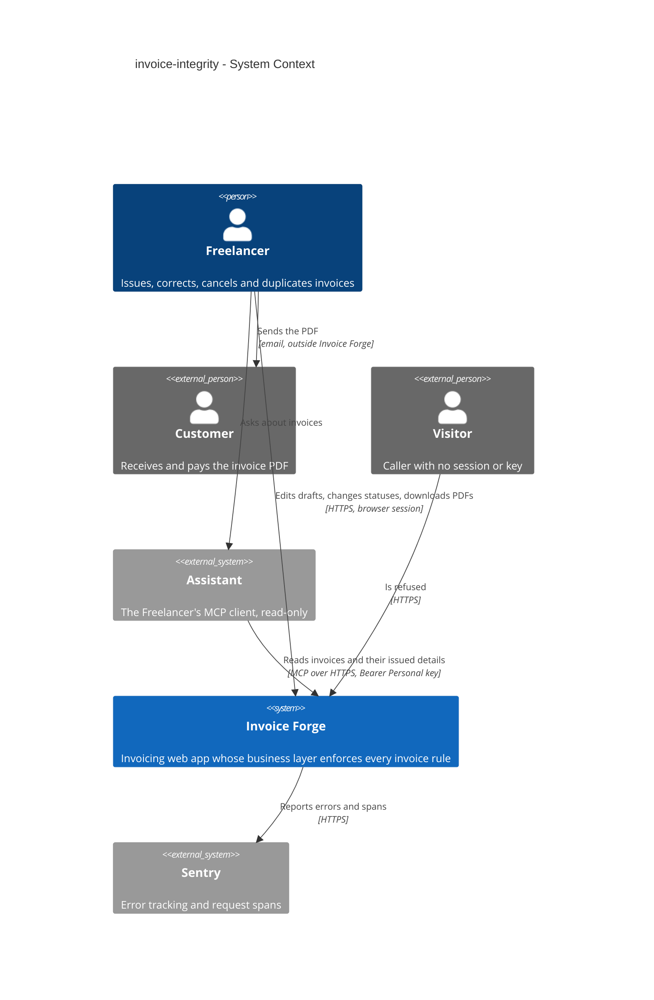

## 4. Solution strategy

**Target surfaces:** `backend-service` (the business layer and the server actions that call it) + `web-frontend` (the invoice list, the editor's three modes, the PDF, the sender-profile, bank-account and product forms, the cancel and "changed elsewhere" dialogs). Both containers already exist in the one Next.js deployable; the feature adds none. Inline, not an ADR: the gate scores 1 of 3 (multi-module only — nothing is irreversible and there is no real alternative, since AC-08 and AC-10 require editor states).

**Top strategic choices (the seeds for ADRs):**

1. **Issued details belong to the invoice** — the existing flat snapshot columns on `Invoice` (`sender*`, `customer*`, `bank*`, `accountName`) are refreshed from the current records only while the invoice is a draft and are never written again from the moment it leaves draft. The PDF, the editor and the Assistant read those columns; only the logo comes from the current sender profile (spec §3). Serves quality goal 1 (ADR-0001).
2. **One rule set, evaluated inside the write transaction against the locked row** — a pure lifecycle module (the allowed-transition table as data, plus "new invoices start as drafts" and "only drafts are deleted") is called by every write path after the invoice row is locked `FOR UPDATE`, and the editor and list import the same table to offer only allowed actions (ADR-0002). For an issued invoice, `updateInvoice` compares every locked field with what is stored and refuses any difference, then checks only the rules of the fields that changed (ADR-0003). Currency, amount and date rules run in the same transaction and return `VALIDATION` with `fieldErrors`. Serves quality goals 2 and 3.
3. **Optimistic concurrency with an explicit version** — `Invoice.version` is incremented by every service write; an editor save carries the version it loaded and is refused with `CONFLICT` when the locked row has moved on; a status change from the list is not version-checked but is judged by the lifecycle against the locked current status (ADR-0004). Issuing from the list (draft → pending through `updateInvoiceStatus`) runs every draft rule — currency, amount bounds, due date not before the issue date — over the stored draft under the same row lock, with the same explanations, so a draft cannot be issued from any path while it breaks a rule (AC-14, AC-25); the issued details frozen are those of the draft's last save (AC-02). Serves quality goal 2 (spec AC-10).
4. **Back an invariant with the database where it is cheap** — "at most one default" becomes two partial unique indexes, while "at least one" (first-created default, promote-on-delete, no unset) stays a service rule under a lock on the parent row; the release migration repairs existing duplicates and gaps before creating the indexes (ADR-0005). Invoice-number uniqueness already has its database backstop (architecture-hardening ADR-0004).

**UI architecture (web-frontend):** unchanged — Next.js App Router with React Server Components and server actions, composed from the existing shadcn/ui primitives and tokens (`docs/design-system.md`). No ADR: the only alternative (a client-side SPA) contradicts the repo's established stack. The editor chooses one of three modes from the invoice's status (draft fully editable; issued with only due date, notes, payment terms and PO number editable; cancelled read-only). Issuing from the editor is a draft save with status `PENDING` through the same `updateInvoice` call, so every draft rule and the lifecycle run in one transaction; whether the editor shows a dedicated issue button is decided at `screens`.

**Tactical choices recorded inline (gate below 2 of 3):**

- **Numbering year.** `formatInvoiceNumber` takes the year from the invoice's issue date — the calendar day stored at `T00:00:00Z` (mcp-server ADR-0009), read by its UTC year — instead of the server clock. The number is still assigned on first save, the counter is not reset per year, and a later issue-date change keeps the number (AC-21, AC-21b, AC-22).
- **Currency invariant.** Enforced in the business layer: `verifyInvoiceRelations` requires the bank account's currency to equal the invoice's and loads every catalogue product on the lines by id, inactive ones included, to compare currencies (AC-11, AC-12). A bank account's currency change is refused with a count of the invoices that use it, mirroring the existing product rule (AC-13, AC-13b). No database constraint: a composite key including currency would ripple through three tables for a rule the single write path already guarantees.
- **Amount and date bounds.** One shared zod module checks every amount from `computeInvoiceAmounts` (line amount, shipping, subtotal, tax amount, total, each on its own) against 99,999,999.99, caps the discount at lines plus shipping, and requires the due date not to be before the issue date. The editor runs the same module; the product price uses the strict two-decimal format custom prices already use (AC-09, AC-19, AC-20, AC-20b).
- **Retired products.** The editor loads every product referenced by the invoice's lines, active or not; lines are never removed automatically; inactive products are not offered for new lines (AC-15, AC-16).
- **Duplicate reference (spec §8 open question, due before design).** Closed with the spec's default: a duplicate carries no reference to the invoice it replaces; no schema change.

Each tactical decision in later sections should trace to one of these seeds. Tactical decisions that *contradict* a strategic choice are red flags — surface them in §11.

## 5. Building block view

The feature follows the repo's layered convention and adds no module: thin entry points (RSC pages, server actions, the read-only MCP route) over one business layer (`lib/services`, `server-only`, every function taking an `ActingFreelancer` first — service-layer ADR-0001, ADR-0006) over Prisma/PostgreSQL. Every new rule lands in the existing `invoices`, `bank-accounts`, `sender-profiles` and `products` services or in pure shared modules under `lib/helpers` and `lib/validations` that the editor also imports, so the browser shows the same rule the server enforces (the pattern of architecture-hardening ADR-0006). No rule lives in a server action, a component or the MCP adapter.

**Internal decomposition:**

```
lib/
├── helpers/
│   ├── invoice-status.ts            CHANGED  transition table as data + decideStatusChange (lifecycle, paidAt, create-as-draft, delete-only-drafts) — ADR-0002
│   ├── invoice-locked-fields.ts     NEW      pure comparison of an issued invoice's locked fields, using the write normalizers — ADR-0003
│   └── invoice-pdf-helpers.tsx      CHANGED  builds sender/Customer/bank blocks from the snapshot columns; logo from the current profile — ADR-0001
├── validations/
│   ├── invoice.ts                   CHANGED  per-amount 99,999,999.99 bounds over computeInvoiceAmounts, discount cap, dueDate >= issueDate, loadedVersion
│   └── product.ts                   CHANGED  strict two-decimal price
└── services/
    ├── invoices/
    │   ├── invoices.ts              CHANGED  create/update/status/delete/duplicate: lock row, version check, lifecycle, locked-field check, draft rules on draft → pending from any path, snapshot only for drafts, version bump
    │   ├── helpers.ts               CHANGED  verifyInvoiceRelations: bank and catalogue-product currency (inactive products included)
    │   ├── numbering.ts             CHANGED  year from the issue date's calendar day
    │   └── editor-data.ts           CHANGED  loads every product referenced by the invoice's lines
    ├── bank-accounts/bank-accounts.ts      CHANGED  currency lock by invoice count; default switch/create/delete under SenderProfile row lock — ADR-0005
    ├── sender-profiles/sender-profiles.ts  CHANGED  default switch/create/delete under User row lock — ADR-0005
    └── products/products.ts                CHANGED  strict price (currency lock already present)
components/
├── invoice-editor/                  CHANGED  three modes by status; SCR-05 "changed elsewhere" dialog on CONFLICT; no auto-removal of lines; PDF document prints account number
└── invoices/invoice-row-actions.tsx CHANGED  offers only lifecycle-allowed moves; SCR-04 cancel confirmation; Duplicate for every status; Delete only for drafts
prisma/
├── schema/invoice.prisma            CHANGED  Invoice.version — ADR-0004
└── migrations/<ts>_invoice_integrity/       version column; default repair + partial unique indexes (raw SQL) — ADR-0005
scripts/
└── invoice-integrity-report.ts      NEW      pre-release count-only report of records breaking the new invariants (spec §1, §8)
```

**C4 Container (L2):**

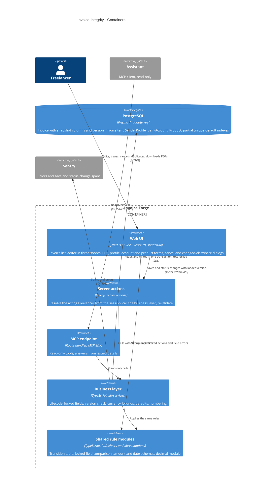

## 6. Runtime view

Two seed flows for the riskiest paths; `sequences` completes the flows for every §5 acceptance criterion. Participants are the §5 containers.

**Critical flow 1: saving an issued invoice from the editor (AC-07, AC-08, AC-09, AC-10, AC-14)**

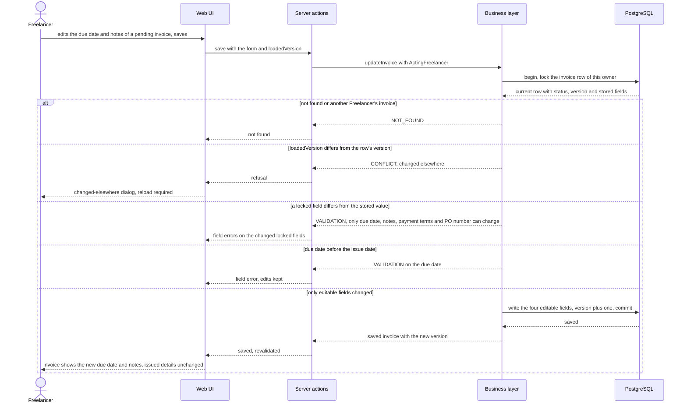

Issuing a draft from the list follows the same lock-then-decide shape as flow 2: after the lifecycle allows draft → pending, the business layer re-checks the stored draft's currency, amount and date rules and refuses with the editor's explanation if any fails (AC-14); `sequences` draws it as its own flow.

**Critical flow 2: a status change from the list racing an outdated editor save (AC-04, AC-10, NFR "Concurrent saves")**

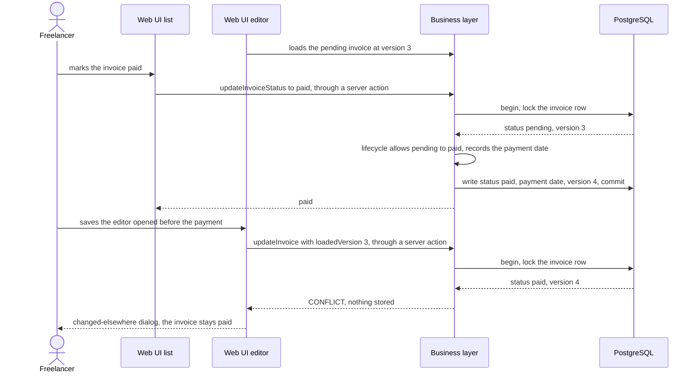

The flows below complete the runtime view for every §4 user story and §5 acceptance criterion. Participants are generic: `user` is the Freelancer, `ui` the web pages and dialogs, `service` the business layer behind the server actions or the MCP endpoint, `data-store` the database, `client` a non-browser caller. Every write carries a persist note for `data-model`.

### Flow 3: Creating a new invoice or a duplicate (AC-04b, AC-21, AC-22)

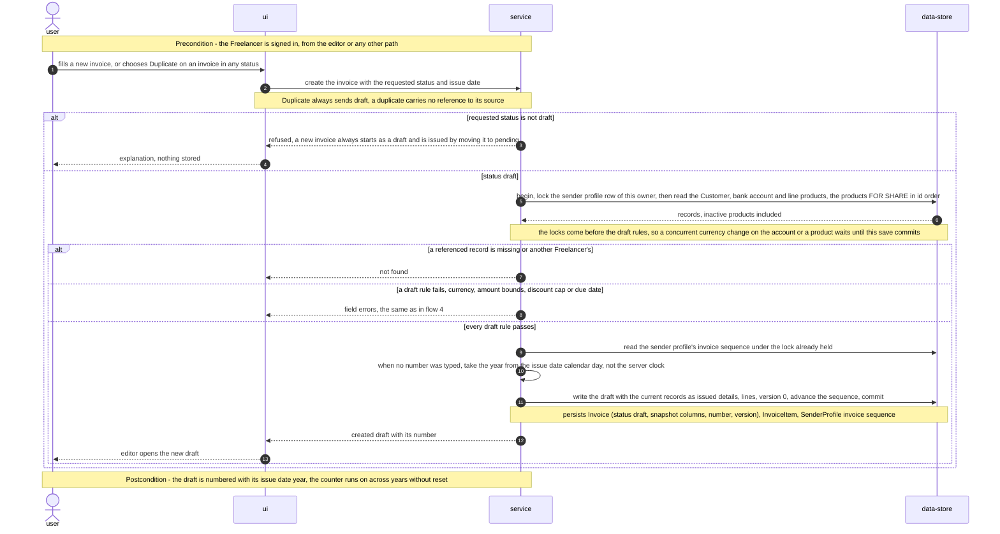

### Flow 4: Saving a draft from the editor, issuing from the editor, editing a cancelled invoice (AC-02, AC-06, AC-10, AC-11, AC-12, AC-14, AC-15, AC-19, AC-20b, AC-21b, AC-23, AC-25)

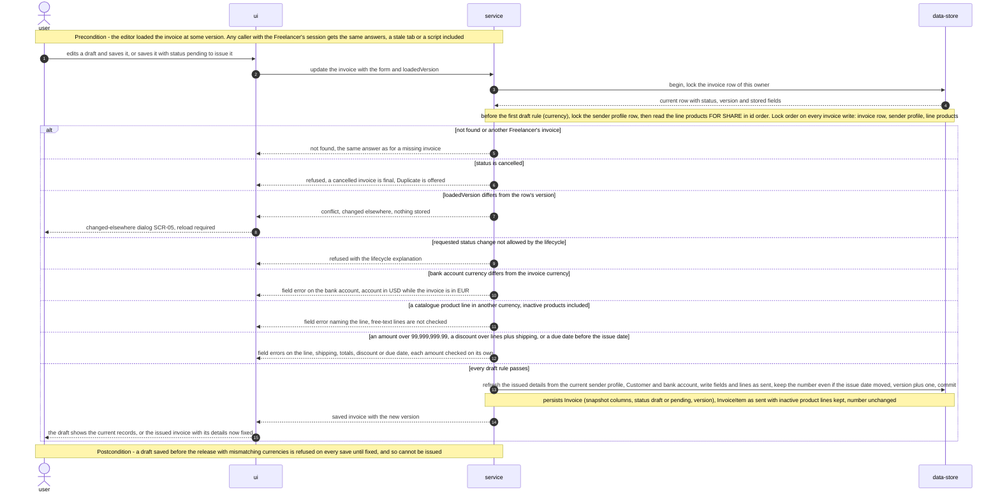

### Flow 5: Changing a status from the invoice list, issuing and cancelling included (AC-02, AC-04, AC-05, AC-06, AC-14, AC-23, AC-25)

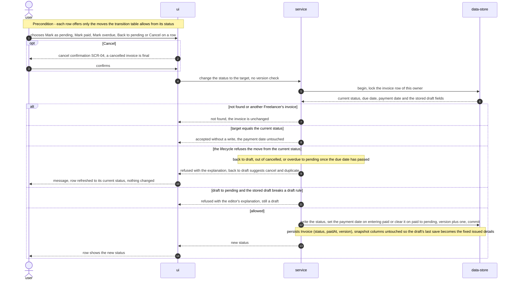

### Flow 6: Deleting an invoice (AC-06, AC-23)

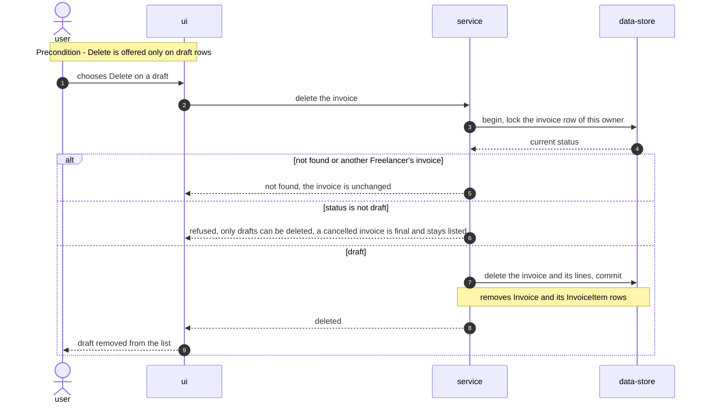

### Flow 7: Opening an invoice and printing its PDF (AC-01, AC-03, AC-15, AC-16)

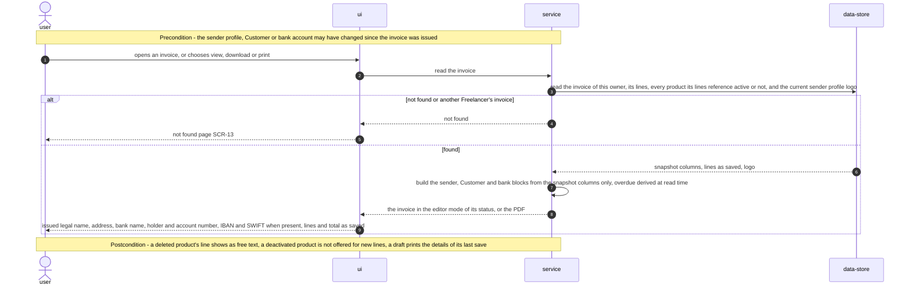

### Flow 8: An Assistant reads an invoice (AC-24, AC-26)

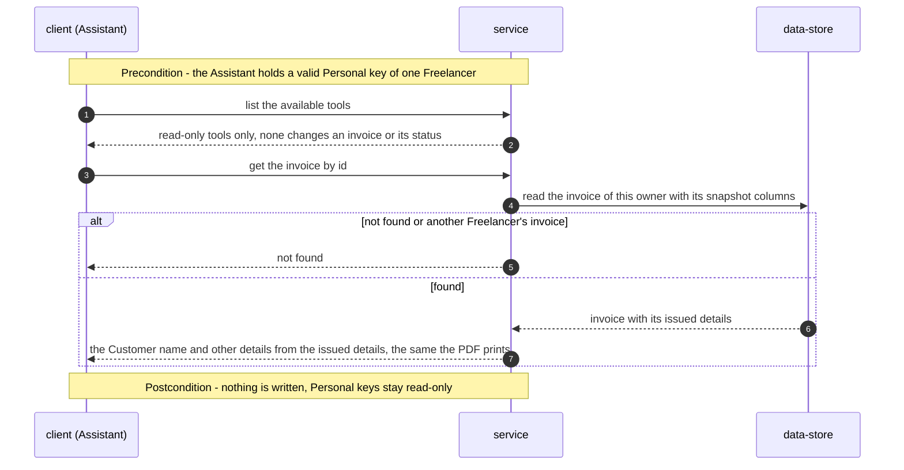

### Flow 9: Changing a bank account or a product (AC-13, AC-13b, AC-20)

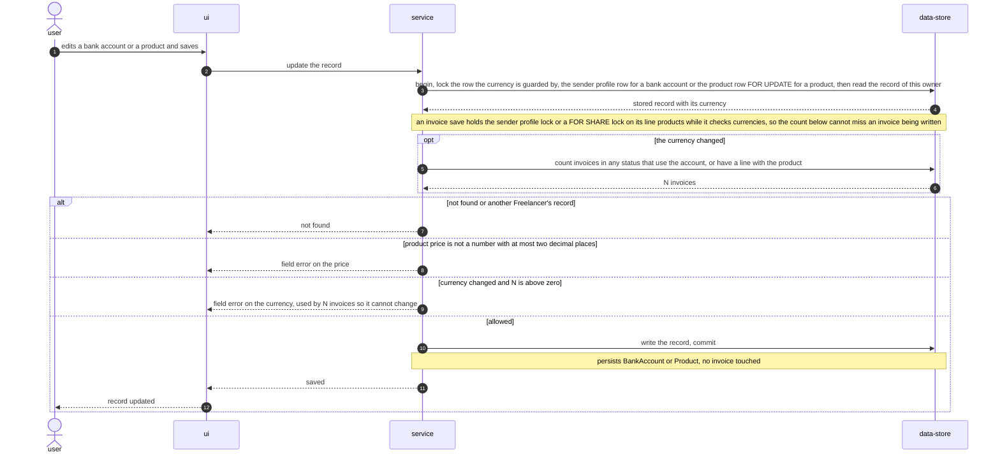

### Flow 10: Keeping exactly one default sender profile and bank account (AC-17, AC-17b)

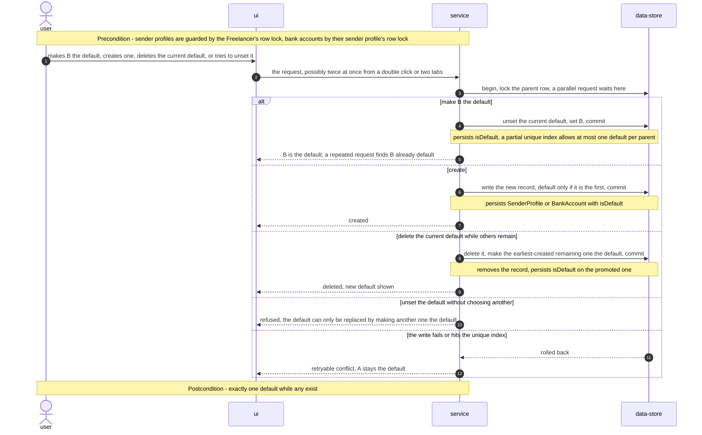

### Flow 11: Release, the pre-release report and the default repair (AC-18)

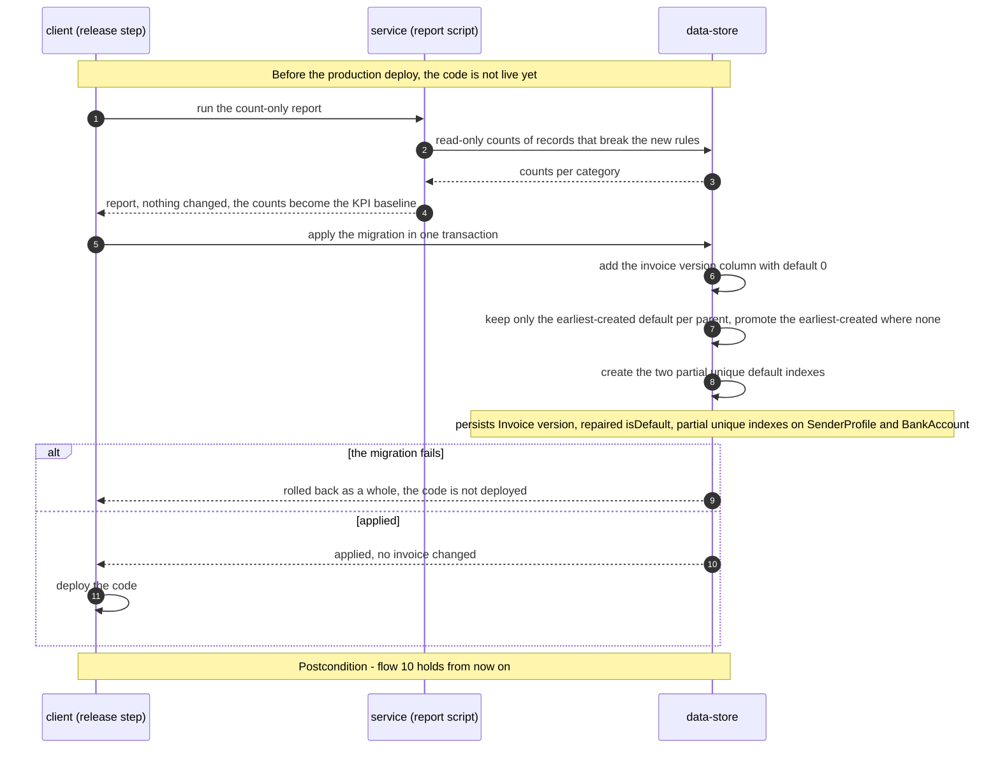

### Coverage: user stories and acceptance criteria to flows

| User story | Flows |
|---|---|
| US-01 Issued invoice keeps its details | 1, 4, 5, 7 |
| US-02 Customer can pay from the PDF | 7 |
| US-03 Statuses follow one lifecycle | 2, 3, 5, 6 |
| US-04 Correct an issued invoice safely | 1 |
| US-05 An old view never overwrites a newer change | 1, 2, 4 |
| US-06 One currency per invoice | 1, 4, 5, 9 |
| US-07 Retired products do not break old invoices | 4, 7 |
| US-08 Exactly one default profile and account | 10, 11 |
| US-09 Plain errors for out-of-range values | 1, 4, 9 |
| US-10 Invoice number year matches the invoice | 3, 4 |
| US-11 The same rules for every caller | 4, 5, 6, 8 |

| AC | Where it is shown |
|---|---|
| AC-01 | Flow 7 (PDF and editor from the snapshot), flow 1 (notes-only save keeps every other field) |
| AC-02 | Flow 4 (draft save refreshes the issued details), flow 5 (issuing from the list freezes the last save), flow 7 (draft PDF prints its last save) |
| AC-03 | Flow 7 (bank name, holder, account number, IBAN and SWIFT when present) |
| AC-04 | Flow 5 (lifecycle, payment date set and cleared, same-status branch), flow 2 |
| AC-04b | Flow 3 (non-draft status on create refused, duplicate always draft) |
| AC-05 | Flow 5 (back to draft refused, cancel and duplicate suggested) |
| AC-06 | Flow 4 (edit refused), flow 5 (status change out of cancelled refused), flow 6 (delete refused) |
| AC-07 | Flow 1 (only editable fields changed), overdue derived at read time in flow 7 |
| AC-08 | Flow 1 (locked-field branch). The read-only editor fields are a UI state, drawn at `screens` |
| AC-09 | Flow 1 (due date before the issue date) |
| AC-10 | Flow 2 (list race), flow 1 and flow 4 (version branch), flow 5 (list change not version-checked) |
| AC-11 | Flow 4 (bank account currency branch) |
| AC-12 | Flow 4 (catalogue line currency branch, inactive products included, free text unchecked) |
| AC-13 | Flow 9 (bank account currency with invoice count) |
| AC-13b | Flow 9 (product currency with invoice count) |
| AC-14 | Flow 1 (issued, only changed fields checked), flow 4 postcondition (old draft blocked), flow 5 (issue from the list re-checks draft rules) |
| AC-15 | Flow 4 (inactive product lines kept on save), flow 7 (opened unchanged, not offered for new lines) |
| AC-16 | Flow 7 postcondition (deleted product line as free text) |
| AC-17 | Flow 10 (make default, parallel requests, failure keeps A) |
| AC-17b | Flow 10 (first created, promote on delete, unset refused) |
| AC-18 | Flow 11 (default repair before the indexes) |
| AC-19 | Flow 4 (amount bounds branch, each amount on its own) |
| AC-20 | Flow 9 (strict price) |
| AC-20b | Flow 4 (discount cap in the bounds branch) |
| AC-21 | Flow 3 (year from the issue date, counter runs on) |
| AC-21b | Flow 4 (number kept when the issue date moves) |
| AC-22 | Flow 3 (issue date calendar day, not the server clock) |
| AC-23 | Not-found branch in flows 1, 4, 5, 6, 7, 8, 9 |
| AC-24 | Flow 8 (tool list offers read-only tools only) |
| AC-25 | Flow 4 precondition and flow 5, the same service answers for any caller with the Freelancer's session |
| AC-26 | Flow 8 (Customer name from the issued details) |

### Notes from sequences (flags, not decisions)

- **Pre-existing flows 1 and 2** name concrete containers (Web UI, PostgreSQL). They were left untouched; flows 3 to 11 use the generic vocabulary.
- **New participant:** flow 11 has a `client (release step)`, the human-run `prisma migrate deploy` and report run from §7. It is not a §5 container; reconcile in `design` only if wanted.
- **Hints for `data-model`:** the currency-lock counts in flow 9 read invoices by bank account and lines by product, so `Invoice.bankAccountId` and `InvoiceItem.productId` need indexes (check whether they exist). Flow 10 and flow 11 need the two partial unique default indexes, created after the repair. Every invoice write bumps `Invoice.version`.
- **For `implement`:** the order of the `alt` branches in flow 4 is the order checks run. Whether currency and bounds errors come back together in one `fieldErrors` set is an implementation choice the diagram leaves open. No new ADR is needed.

## 7. Deployment view

The feature runs inside the existing Vercel project in region `fra1` as part of the same Next.js deployable; no new function, cron job, environment setting or third-party service. One Prisma migration ships with the release and is applied as an explicit release step, `prisma migrate deploy` against dev and then production, **before** the code is deployed, because the new code reads `Invoice.version` (`pnpm build` does not migrate). The old code keeps working on the new schema: `version` has a default, and the default indexes only turn a double-click race into an error instead of a second default. Rollback: the down migration drops the two indexes and the column; the default repair is not reverted (it only removed duplicates and filled gaps, AC-18). The migration adds `Invoice.version` (`INT NOT NULL DEFAULT 0`, a metadata-only change), repairs duplicate and missing defaults by keeping or promoting the earliest-created record (AC-18), and creates the two partial unique indexes in the same migration transaction (ADR-0005). Before the production deploy, the count-only report (`scripts/invoice-integrity-report.ts`) runs read-only against production and its counts become the baseline of the "new rule violations" KPI (spec §7, §8); it changes nothing.

**Monitoring:**
- Sentry spans `invoices.save` (create and update) and `invoices.status-change` — the source for the spec §6 latency target (p95 no more than 10 % slower than the 7 days before release). The spans do not exist yet, so they ship first, as a behaviour-free change released at least 7 days before this feature, to give the pre-release baseline the spec measures against (§11).
- Counted refusal outcomes per write path: lifecycle refusal, locked-field refusal, `CONFLICT` (changed elsewhere), currency refusal, bounds refusal — the friction signal next to the §7 cancel-and-duplicate KPI. The `outcome` attribute (`ok`, `failed` or `refused:<kind>`) is recorded on the invoice write paths only:
  - create, update and duplicate (`invoices.save`);
  - status change (`invoices.status-change`);
  - delete (`invoices.delete`).

  The currency-lock refusals on a bank-account or product save (AC-13, AC-13b) are not part of this signal: they measure friction on those records, not on invoices.
- Generic save failures (`FAILED`) on invoices and products — already sent to Sentry by `failed()` (`captureException`), so the spec §7 baseline over the 14 days before release exists today; a path tag is added in the same early release as the spans. Source for the §7 "generic save failures" KPI and the §6 "0 generic failures from user input" target.
- Alert: any unique-constraint violation on the default indexes in production (a write path skipped the parent lock) → notify the owner.
- Alert: generic invoice or product save failures above the pre-release weekly baseline in a rolling day → notify the owner.

**Scaling thresholds:**
- No new hot path: the version check and the lifecycle decision run on the row the save already locks; the extra reads are the bank account and the line products by id, bounded by the line count.
- The currency-lock count on a bank-account or product edit scans invoices by an indexed foreign key; comfortable while a Freelancer has under the 5,000 invoices `mcp-server` budgets for — above that, revisit at `data-model` (design estimate, not a spec NFR).

## 8. Crosscutting concepts

| Concept | Convention | Where defined |
|---|---|---|
| Logging | Repo default — `console.error` inside `try/catch`, errors to Sentry in production; refusals are expected outcomes and are counted, not logged as errors. Never log form bodies, issued details or bank data; context is ids only. | `docs/architecture-map.md` §Conventions; here |
| Authentication | Unchanged — browser session resolved to an `ActingFreelancer` by the trusted factory; Personal keys remain read-only and gain no write tool (AC-24). | service-layer ADR-0001; mcp-server ADR-0003 |
| Authorization | Every read and write scoped by owner in its own `WHERE`, the row lock included; another Freelancer's invoice is answered exactly like a missing one (AC-23). | service-layer ADR-0003 |
| Error handling | `ActionResult` with typed codes. Lifecycle, locked-field, currency, bounds and date refusals → `VALIDATION` with `fieldErrors` next to the field and the spec's explanation; outdated view → `CONFLICT` (the editor opens SCR-05); unique-constraint hit on a default index → retryable `CONFLICT`. Never a generic `FAILED` for user input. | `types/result.ts`; architecture-hardening ADR-0009 |
| Status lifecycle | One transition table and `decideStatusChange`, called by every write path under the row lock; the UI imports the same table. | ADR-0002 |
| Issued details | Written from the current records only while the invoice is a draft; read by the PDF, the editor and the Assistant; logo always current. | ADR-0001 |
| Concurrency | Row lock `FOR UPDATE` on the invoice in every write transaction; `Invoice.version` bumped by every service write and checked on editor saves; parent-row lock for default changes; numbering keeps its sender-profile row lock. Currency checks run under locks taken in one order: invoice row, then sender profile, then line products `FOR SHARE` in id order; `updateBankAccount` counts under the sender-profile lock and `updateProduct` under its own row's `FOR UPDATE`. | ADR-0004, ADR-0005; architecture-hardening ADR-0005 |
| Validation | Shared zod schemas in `lib/validations` run in the editor and in the service; amounts come from the shared decimal module and are bounded each on its own at 99,999,999.99. | architecture-hardening ADR-0006; here |
| Money and currency | One currency per invoice, its bank account and its catalogue products; amounts never converted; free-text lines unchecked. | §4; here |
| Dates and time zone | Issue and due dates are calendar days; the number's year is the issue date's year; "today" for the overdue rule comes from the Freelancer time zone. | mcp-server ADR-0005, ADR-0006, ADR-0009 |
| ID strategy | `cuid()` unchanged; no new model. | repo default |
| Observability | Sentry spans `invoices.save` and `invoices.status-change`; refusal outcomes counted per path. | §7 |
| Caching | None added; pages revalidate after each successful write as today. | repo default |
| Internationalisation | Messages in English, the app's single UI language. | — |

## 9. Architecture decisions

| # | Title | Status | Section |
|---|---|---|---|
| 0001 | Freeze the existing snapshot columns at issue and print from them | Accepted | §4 |
| 0002 | Decide every status change in one pure lifecycle module | Accepted | §4 |
| 0003 | Compare locked fields in one update path and refuse any difference | Accepted | §4 |
| 0004 | Detect outdated views with an invoice version counter | Accepted | §4 |
| 0005 | Guard single defaults with partial unique indexes and a parent-row lock | Accepted | §4 |

ADR files live under `docs/features/invoice-integrity/adr/NNNN-<title>.md`. Inherited decisions this feature builds on (not repeated here): service-layer ADR-0001, ADR-0002, ADR-0003, ADR-0006; architecture-hardening ADR-0004, ADR-0005, ADR-0006, ADR-0009; mcp-server ADR-0005, ADR-0009.

## 10. Quality requirements

Each top-3 goal from §1 expanded into scenarios; every number is quoted from spec §6.

**QG-1. Document fidelity**
- **When:** the sender profile, Customer and bank account of a fixture of issued invoices are changed after issue (AC-01, AC-03).
- **Then:** 100 % of fixture issued invoices produce identical PDF text before and after their sender profile, Customer and bank account are changed; the account number is printed, IBAN and SWIFT when present.
- **How verify:** automated test over a seeded fixture, run in CI — extract the PDF text before and after the changes and compare; the logo is excluded because it stays current (ADR-0001).

**QG-2a. Integrity — status lifecycle on every write path**
- **When:** each of the 25 from–to status pairs is requested through create, update, status change, delete and duplicate.
- **Then:** 100 % of the 25 from–to status pairs tested on every write path: of the 20 pairs between different statuses, each outside AC-04 refused; the 5 same-status pairs accepted with status and payment date unchanged; creation in each non-draft status refused (AC-04b).
- **How verify:** automated test matrix, run in CI — a unit matrix over `decideStatusChange` plus one integration test per write path proving it calls the module under the row lock (ADR-0002).

**QG-2b. Integrity — concurrent saves**
- **When:** an outdated editor save races a status change from the list (§6 flow 2).
- **Then:** 0 lost status or payment-date changes across 50 runs of an outdated editor save racing a status change.
- **How verify:** integration test on the throwaway PostgreSQL container, 50 runs with both writes released together, asserting the final status, payment date and the `CONFLICT` refusal (ADR-0004).

**QG-2c. Integrity — default uniqueness**
- **When:** many "set as default" requests arrive at once for one Freelancer's sender profiles, or one profile's bank accounts.
- **Then:** exactly 1 default after 10 parallel "set as default" requests, for sender profiles and for bank accounts.
- **How verify:** integration test firing 10 parallel requests per entity type and counting defaults; a second test proves the partial unique index refuses a direct second default (ADR-0005).

**QG-3a. Explainable refusals**
- **When:** a Freelancer or any other caller submits an out-of-range amount, a due date before the issue date, a malformed price, an excessive discount or a mismatching currency.
- **Then:** 0 generic failures for amount, date, price, discount or currency input; each comes back as a field error.
- **How verify:** automated tests per AC-09, AC-11, AC-12, AC-19, AC-20, AC-20b + error tracking, 30 days after release (the `FAILED` count per path from §7).

**QG-3b. No noticeable cost**
- **When:** invoices are saved and statuses changed in production after the release.
- **Then:** latency p95, invoice save and status change: no more than 10 % slower than the 7 days before release.
- **How verify:** save and status-change spans in error tracking, 7-day window after release, compared with the 7 days before release measured by the same `invoices.save` and `invoices.status-change` spans shipped ahead (§7).

**QG-3c. No silent regressions**
- **When:** the feature's pull request runs the existing suite.
- **Then:** 100 % of existing automated tests pass, except those that encode now-forbidden behaviour; each such change is listed in the pull request.
- **How verify:** CI run + pull request review.

## 11. Risks and technical debt

| Risk / debt | Severity | Mitigation | Owner |
|---|---|---|---|
| The latency baseline does not exist: no Sentry spans wrap invoice saves or status changes today, so "7 days before release" cannot be measured if the spans ship with the feature | High | Ship `invoices.save` and `invoices.status-change` spans first as a behaviour-free change, released at least 7 days before this feature; resolve before `implement` (it is the first task) | Dmytro Hopko |
| Invoices issued before the release carry the snapshot from their last save, which may already differ from what the Customer received (brief D2) | Medium | Accepted: no automatic repair (spec §3); from the release on the copy is frozen; the count-only report states how many issued invoices were saved after a related record changed, where that can be inferred | Dmytro Hopko |
| Drafts saved before the release with mismatching currencies are blocked on their next save, even a notes-only one (AC-14) | Medium | Intended by the spec; the field error names the bank account or line to fix; the report counts such drafts before release | Dmytro Hopko |
| The locked-field comparison drifts from the write normalizers and refuses a legitimate notes-only save (ADR-0003) | Medium | One comparison module built on the same decimal and calendar-day helpers as the write; unit tests per locked field, including legacy instants and decimal scale | Dmytro Hopko |
| A future invoice write outside `lib/services` (a script or raw SQL) bypasses the lifecycle, the locked fields and the version bump (ADR-0002, ADR-0004) | Medium | Lint rules of service-layer ADR-0006; a test asserting every invoice service write path bumps `version` (all except the lazy calendar-day normalisation, ADR-0004); the security review confirms every write path (spec §6.1) | Security Lead |
| The partial unique default indexes live outside `schema.prisma`, so a later generated migration could drop them (ADR-0005) | Low | Record them in `data-model.md`; an integration test asserts the index refuses a second default | Dmytro Hopko |
| Issued-invoice lock adds friction: corrections need Cancel then Duplicate | Medium | Track the spec §7 cancel-and-duplicate KPI (no more than 5 % of issued invoices per month within 60 days); above that, revisit which fields stay editable | Dmytro Hopko |
| The release migration is applied by hand; deploying the code before it runs breaks every invoice save (the code reads `Invoice.version`) | Medium | Release checklist: `prisma migrate deploy` on dev, then production, before the deploy; the down migration is staged with it | Dmytro Hopko |
| `docs/architecture-map.md` is stale (reflects `ded1be7`) | Low | The design relied on a fresh scan at `f8bfaf4`; refresh with `survey` before the next feature | Dmytro Hopko |
| Open question (spec §8): what the pre-release report finds, and whether any category besides duplicate defaults needs a one-time repair | Open question | Resolve before the production deploy of `invoice-integrity`; default now: report counts only and repair nothing else | Dmytro Hopko |
| Open question (spec §8): how existing Freelancers learn that issued invoices are locked except for the due date, notes, payment terms and PO number | Open question | Resolve before `sdd:tasks`; default now: a short note in the editor the first time they open an issued invoice after release | Dmytro Hopko |

**Accepted debt (acceptable in v1, plan to fix later):**
- Issued details stay as flat columns; adding a printed field means adding a column (ADR-0001).
- "At least one default" is a service rule, not a database constraint (ADR-0005).
- No database backstop for the status lifecycle; it relies on every write going through `lib/services` (ADR-0002).
- `Invoice.senderLogo` stays stored but unused for printing; the PDF shows the current logo (spec §3).

## 12. Glossary

Canonical definitions live in [`CONTEXT.md`](../../../CONTEXT.md); this table lists the terms this SAD relies on, plus the design terms it introduces.

| Term | Meaning |
|---|---|
| Freelancer | A signed-in account holder who owns sender profiles, customers, products and invoices and sees only their own data. |
| Customer | A party a Freelancer bills; each invoice keeps a copy of the customer's details as they were when it was issued. |
| Assistant | A program that reads (and later changes) data on behalf of exactly one Freelancer, without a browser session; read-only in this feature. |
| Visitor | Anyone reaching the app without a signed-in session or a valid key. |
| Draft invoice | An invoice still being prepared; fully editable or deletable; its issued details follow the current records on every save. |
| Issued invoice | An invoice that has left draft and was not cancelled: pending, overdue or paid. |
| Cancelled invoice | An invoice withdrawn after issuing; keeps its number, stays listed and printable, never changes again. |
| Overdue invoice | An issued, unpaid invoice marked overdue by hand or whose due date is before today in the Freelancer time zone. |
| Issued details | The copy of the sender profile's, Customer's and bank account's details an invoice keeps and prints; refreshed while a draft, fixed from issue. Stored as the flat snapshot columns on `Invoice` (ADR-0001). |
| Default sender profile / Default bank account | The one profile a Freelancer's new invoices start from / the one account of a sender profile a new invoice starts from; exactly one while any exist. |
| Invoice number / Invoice sequence | The printed identifier, unique within a sender profile / the per-profile running count that proposes the next system-assigned number. |
| Freelancer time zone | The account's saved time zone that decides "today" for every surface; UTC until saved. |
| Personal key | A revocable secret a Freelancer gives an Assistant to read their data; never grants writes. |
| Locked fields | Every field of an issued invoice except its due date, notes, payment terms and PO number (design term; ADR-0003). |
| Invoice version | A counter on `Invoice` bumped by every service write except the lazy calendar-day normalisation, used to refuse saves from an outdated view (design term; ADR-0004). |
| Outdated view | An editor loaded before the invoice changed in any way; its save is refused with "changed elsewhere" (spec AC-10). |
| Transition table | The data form of the status lifecycle shared by the business layer and the UI (design term; ADR-0002). |

