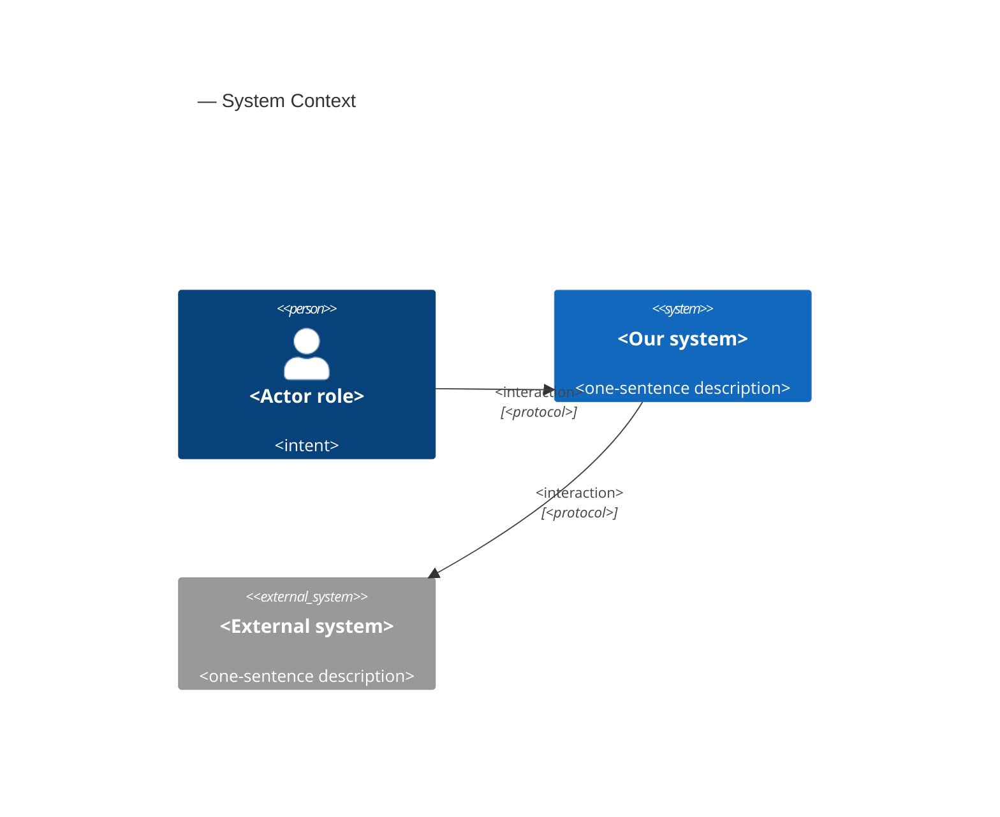
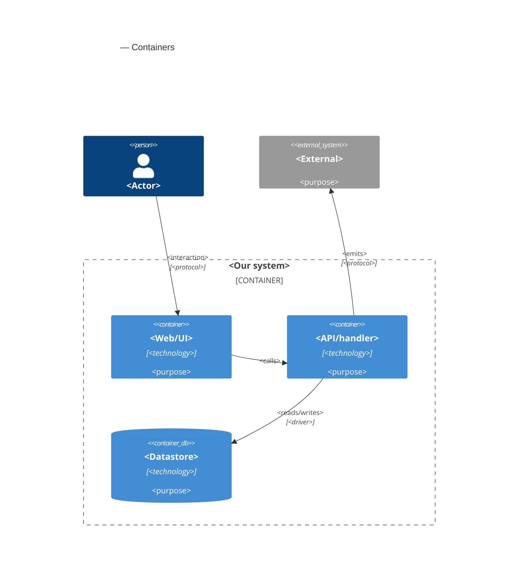

# Software Architecture Document — invoice-integrity

<!-- 12 Arc42 sections. Empty section → <!-- N/A: <one-line reason> -->. -->
<!-- C4 Context (L1) lives inline in §3. C4 Container (L2) lives inline in §5. -->
<!-- Numbers in §10 come VERBATIM from spec.md §6 NFR — no inventing, no rounding. -->

## 1. Introduction and goals

**Intent.** Make every invoice rule hold in the one shared business layer (`lib/services`), so the editor, any other web path, a stale tab, a script with the Freelancer's session and the coming Assistant write tools all get the same answer (spec §1, §2). Concretely: an issued invoice keeps its issued details, lines, amounts, issue date, currency and number, and its PDF prints those issued details, the bank account number included; statuses follow one lifecycle with no way back to draft and a final cancelled state; a save made from an outdated view is refused; currency, amount and date rules return field errors instead of generic failures; each Freelancer has exactly one default sender profile and each sender profile exactly one default bank account; and the year in a system-assigned invoice number comes from the issue date. The feature is the prerequisite for letting an Assistant create and edit drafts, which stays out of scope (spec §3). The people served are every Freelancer with issued invoices and the Customers who receive and pay them.

**Top-3 quality goals (1-liners; full scenarios in §10):**

1. **Document fidelity** — an issued invoice and its PDF keep saying what the Customer received, whatever later happens to the sender profile, Customer or bank account.
2. **Integrity on every write path** — no caller can move a status outside the lifecycle, edit an issued invoice beyond its four editable fields, store mismatched currencies, leave more or fewer than one default, or overwrite a newer change from an outdated view.
3. **Explainable refusals at no noticeable cost** — every rejected amount, date, price, discount or currency comes back as a field error, and saves and status changes stay within 10 % of their pre-release latency.

**Stakeholders.**

| Role | Interest | Sign-off owner? |
|---|---|---|
| Freelancer | Issues, corrects, cancels and duplicates invoices; manages sender profiles, bank accounts and products under the new rules | No |
| Customer | Receives and pays the PDF; needs it to match what was issued, account number included | No |
| Assistant | Reads an invoice's issued details today; inherits every rule when write tools arrive in the next feature | No |
| Security Lead | Confirms every invoice write path goes through the new rules (spec §6.1 "Security review: Required") | Yes |
| Tech Lead | SAD approval | Yes |

<!-- Decision overrides (¶4) — populated by the critic resolution loop, empty otherwise. -->

## 2. Constraints

**Technical.**
- TypeScript 5 (strict) on Node.js, pnpm.
- Next.js 16.3 App Router (React Server Components, server actions, route handlers on the Node.js runtime), React 19.2, next-auth 5 beta (JWT sessions), zod 3.25.
- PostgreSQL via Prisma 7.10 + `@prisma/adapter-pg`; split schema in `prisma/schema/`; migrations by `prisma migrate`, applied by `prisma migrate deploy` during `pnpm build`.
- Hosted on Vercel, single region `fra1` (`vercel.json`); one daily cron (`/api/cron/purge-limits`).
- Business logic only in `lib/services/*`, every function taking a branded `ActingFreelancer { userId, timeZone }` first (service-layer ADR-0001), isolated behind `server-only` + lint rules (service-layer ADR-0006), returning `ActionResult<T>` (service-layer ADR-0002), every write scoped by owner in its own `WHERE` (service-layer ADR-0003).
- Invoice numbers allocated under a `SenderProfile` row lock (architecture-hardening ADR-0005) and unique on the normalized key `(senderProfileId, invoiceNumberKey)` (architecture-hardening ADR-0004); amounts computed by the one shared decimal module (architecture-hardening ADR-0006); issue and due dates are calendar days stored at `T00:00:00Z` (mcp-server ADR-0009); overdue is derived at read time by one rule module (mcp-server ADR-0005).
- The issued details already exist as flat snapshot columns on `Invoice` (`sender*`, `customer*`, `bank*`, `accountName`); lines are copies in `InvoiceItem` with a nullable `productId` (`SetNull` on product delete); `Invoice.paidAt`, `Invoice.updatedAt` exist; `SenderProfile.isDefault` and `BankAccount.isDefault` are plain booleans with no constraint.
- Tests: vitest (unit, component) + an integration config on throwaway PostgreSQL containers (testcontainers, `fileParallelism: false`).

**Organisational.**
- No external deadline; the trigger is sequencing — this feature must ship before Assistant write tools (spec §1).
- Size M (`docs/features/invoice-integrity/.size`), route `standard`.
- Team: one developer (Dmytro Hopko) working with AI agents through the SDD pipeline.

**Conventions.**
- `docs/architecture-map.md` §Conventions — stale (reflects `ded1be7`, before `service-layer`, `security-patch`, `architecture-hardening` and `mcp-server`); the ADRs cited above are authoritative where they differ.
- Results: `ActionResult<T>` with typed codes `UNAUTHORIZED | NOT_FOUND | VALIDATION | CONFLICT | FAILED | RATE_LIMITED` and `fieldErrors` next to the offending field (`types/result.ts`; architecture-hardening ADR-0009).
- Shared zod schemas in `lib/validations/` (server schema plus a client-only variant for the editor).
- IDs: `cuid()` strings on every domain model.
- Another Freelancer's record is answered exactly like a missing one (`NOT_FOUND`).

**Regulatory / external.**
- Data classification Confidential; issued invoices have legal weight (spec §6.1).
- No new personal data; issued details are kept unchanged rather than refreshed (spec §6.1).
- `/security-review` is mandatory before ship (spec §6.1, size M).
- No automatic rewrite of issued invoices at release; only duplicate or missing defaults are repaired (spec §3, AC-18).

## 3. Context and scope

<!-- 🎯 Why: draws the SYSTEM BOUNDARY — who talks to it from outside, where the trust zone ends.
     Without §3, §5 and §8 (authorization) blur — unclear what's «inside» vs «outside».
     📋 Write: 2–3 sentences of business context + an external-systems table + a C4Context block.
     📌 «External: none (deliberate, no third-party in v1)» is itself a decision worth stating.
     Trust boundary — the line past which you don't trust data without checking it.
     Never N/A — greenfield still draws the planned actors + external systems. -->

<Business context in 2–3 sentences. What the system does for whom.>

<!-- brownfield: <one-line scan summary> (or «N/A — greenfield repo» if no source existed) -->

**External systems (in / out):**

| Actor or system | Type | Interaction |
|---|---|---|
| <author role> | Person | <what they do> |
| <external service> | System (internal/external) | <interaction> |
| <identity provider> | System (external) | <provides auth tokens> |

**C4 Context (L1):** <!-- syntax → references/c4-mermaid-syntax.md. Real names, no <placeholder> stubs. -->



## 4. Solution strategy

<!-- 🎯 Why: the 3–4 STRATEGIC PILLARS every ADR grows from. Without §4 each ADR looks random —
     there's no umbrella. ⭐ The densest section — the blast-radius gate fires almost always here
     (decisions are irreversible + multi-module).
     📋 Write: 3–4 choices; each a heading + 2–3 sentences of rationale.
     📌 «Store content as a table of typed blocks» is a pillar — ADR-0001 grows from it. -->

**Top strategic choices (the seeds for ADRs):**

1. **<e.g. Module isolation through events>** — <2–3 sentences citing quality goals + constraints>.
2. **<e.g. Single-store persistence>** — <2–3 sentences>.
3. **<e.g. Server-rendered read side>** — <2–3 sentences>.

Each tactical decision in later sections should trace to one of these seeds. Tactical decisions that *contradict* a strategic choice are red flags — surface them in §11.

## 5. Building block view

<!-- 🎯 Why: INTERNAL DECOMPOSITION — modules, containers, datastores. The static topology: who
     may talk to whom. Without §5, §6 (the flows) has no vocabulary of participants.
     📋 Write: 1 ¶ on the style (layered / hexagonal / clean / event-driven) + a folder tree + a
     C4Container block.
     📌 Draw ONE Container per declared `target_surface` (frontmatter): a fullstack
     [backend-service, web-frontend] = a backend-API container + a web/SPA container; a
     [backend-service, mobile-app] = the API + the mobile app. The Container(web, …) line below is
     just one surface's container — swap/add per what was declared in §4. → _shared/surfaces.md
     📌 e.g. «web app, content API, media worker, datastore, object store, CDN». -->

<One paragraph: layered / hexagonal / clean / event-driven, and why.>

**Internal decomposition:**

```
<e.g. modules/<feature>/>
├── domain/       <entities + sentinel errors>
├── app/          <use cases / services>
├── infra/        <repository + integration impl>
├── ports/        <handlers, DTOs, error mapping>
└── wiring        <self-wiring entry point>
```

**C4 Container (L2):** <!-- syntax → references/c4-mermaid-syntax.md. Real names, no <placeholder> stubs. ONE Container per declared target_surface (frontmatter); the web container below is one example surface. -->



## 6. Runtime view

<!-- 🎯 Why: the RUNTIME FLOW of 1–2 critical scenarios — who talks to whom, when, in what order.
     Without §6, §5 is just boxes with no life.
     📋 Write: a Mermaid sequenceDiagram. Participants are names from §5 (don't invent new ones).
     Messages are semantic («saves a draft»), NO HTTP verbs / paths / status codes — endpoint-level
     sequences arrive at the `api` stage.
     📌 e.g. «author → web: composes draft → web → content API: save». Seed the primary flow(s) here;
     the `sequences` stage then covers every §5 AC (no cap). Never N/A for M+; XS/S keeps ≥1 happy-path flow. -->

**Critical flow 1: <flow name>**

```mermaid
sequenceDiagram
    actor Actor
    participant Web
    participant Service
    participant Store
    Actor->>Web: <action>
    Web->>Service: <call>
    Service->>Store: <write>
    Store-->>Service: ok
    Service-->>Web: result
    Web-->>Actor: confirmation
```

**Critical flow 2: <e.g. async event propagation>** — <if applicable, otherwise N/A>.

## 7. Deployment view

<!-- 🎯 Why: the TOPOLOGY DevOps must know without reading the deploy charts — how many replicas,
     where the background worker lives, AT WHAT NUMBERS we scale.
     📋 Write: 2–3 sentences on topology + monitoring + concrete threshold numbers.
     📌 e.g. «500 authors → partition by quarter» (not «we'll think about scale later»).
     🎯 N/A allowed for XS/S that reuses an existing deployment unit with no change.
     Deployment-diagram scaffold → templates/deployment.md. -->

<Topology in 2–3 sentences. Where it runs, replicas, scaling thresholds.>

**Monitoring:**
- <Metrics — e.g. `<metric_name>`>
- <Alerts — e.g. «worker lag > 10 min → page on-call»>
- <Tracing — e.g. spans on the request boundary>

**Scaling thresholds:**
- <e.g. comfortable in one table up to N rows/year>
- <e.g. partition by quarter above N rows/year>

<!-- For XS/S with no deployment change: <!-- N/A: reuses existing deployment unit, no infra change --> -->

## 8. Crosscutting concepts

<!-- 🎯 Why: CROSS-CUTTING PATTERNS spanning several modules: logging, errors, authorization, ID
     strategy, events, caching. ⭐ The second-densest section. A pattern inside one module is NOT
     here; a project-wide convention belongs in the convention file.
     📋 Write: a table — concept / convention / where defined. One row per concept.
     📌 e.g. «sortable time-based IDs generated in the app layer» as a default from the convention file. -->

| Concept | Convention | Where defined |
|---|---|---|
| Logging | <e.g. structured, fields `module=<name>`> | <convention file §X or here> |
| Authentication | <e.g. token-based via middleware> | <convention file §X> |
| Error handling | <e.g. domain sentinel → ports error mapping → JSON> | <convention file §X> |
| ID strategy | <e.g. sortable time-based ID in the app layer> | <convention file §X> |
| Internationalisation | <e.g. N/A, single language> | — |
| Observability | <e.g. tracing on the request boundary> | — |
| Events | <module-specific patterns, if any> | <here> |

## 9. Architecture decisions

<!-- 🎯 Why: the REVERSE INDEX onto the adr/ folder. `ls adr/` gives the files; §9 gives the
     semantics — why they exist, which SAD section they attach to, what status.
     📋 Write: a 4-column table, one row per ADR. Mixed status is fine.
     📌 e.g. «0001 | Store content as a table of typed blocks | Accepted | §4». -->

| # | Title | Status | Section |
|---|---|---|---|
| <NNNN> | <imperative — e.g. "Use a sliding-window counter for rate limiting"> | Accepted | §<N> |
| <NNNN> | <imperative — e.g. "Co-locate the worker in the API process"> | Accepted | §<N> |

ADR files live under `docs/features/<slug>/adr/NNNN-<title>.md`.

## 10. Quality requirements

<!-- 🎯 Why: the QUALITY TREE — take a goal from §1 and break it into concrete leaves: tests,
     metrics, configs, drills. ⭐ Without §10, §1 is a manifesto. With §10 each declaration maps
     to something PROVABLE.
     📋 Write: per §1 goal — When / Then / How-verify. Numbers from spec §6 NFR VERBATIM (don't
     round ≤250ms to ≤300ms — that's a critic F6 hit).
     📌 e.g. «p95 ≤ 500 ms on a block update, verified by a 100 req/s load test». -->

Each top-3 goal from §1 expanded into a full scenario:

**QG-1. <quality attribute>**
- **When:** <trigger condition>
- **Then:** <expected behaviour with numbers from spec §6 NFR>
- **How verify:** <test / chaos drill / load test / metric>

**QG-2. <quality attribute>**
- **When:** <trigger>
- **Then:** <expected>
- **How verify:** <how>

**QG-3. <quality attribute>**
- **When:** <trigger>
- **Then:** <expected>
- **How verify:** <how>

## 11. Risks and technical debt

<!-- 🎯 Why: ⭐ collects EVERYTHING that can break — not only the technical. Without §11 risks get
     discussed at standups and lost; debt lives only in the head of whoever accepted it.
     📋 Write: a risk/debt table — severity — mitigation — owner. Accepted debt in its own block.
     📌 The first risk is often a product risk, not a technical one. That's normal. -->

<!-- Severity literals: Low / Medium / High for regular risks; "Open question" for rows created by
     a Save-as-OQ resolution during the Socratic walk (see references/socratic.md). -->

| Risk / debt | Severity | Mitigation | Owner |
|---|---|---|---|
| <e.g. Worker lag may reach hours during a downstream outage> | Medium | <alert >10 min, on-call playbook, retry backoff> | <DevOps> |
| <e.g. No event-schema versioning in v1> | Medium | <ADR-NNNN planned for v2, tolerate unknown fields> | <Backend> |
| Open architectural decision: <decision-headline> | Open question | Resolve before <stage trigger or YYYY-MM-DD>; <inline rationale from the Save-as-OQ> | <owner> |

**Accepted debt (acceptable in v1, plan to fix later):**
- <e.g. the entity is immutable / unversioned — OK for v1, may need audit versioning in v2>

## 12. Glossary

<!-- 🎯 Why: ⭐ the DOMAIN GLOSSARY that ends arguments a year later («checkpoint — weekly or
     biweekly? quarter — calendar or fiscal?»).
     📋 Write: a term / meaning table. Business + technical terms mixed.
     📌 e.g. «Lesson | a unit inside a course made of blocks (text, video)». -->

| Term | Meaning |
|---|---|
| <e.g. domain object A> | <its meaning in this domain> |
| <e.g. domain object B> | <its meaning> |
| <e.g. domain invariant name> | <the rule, in plain language> |
