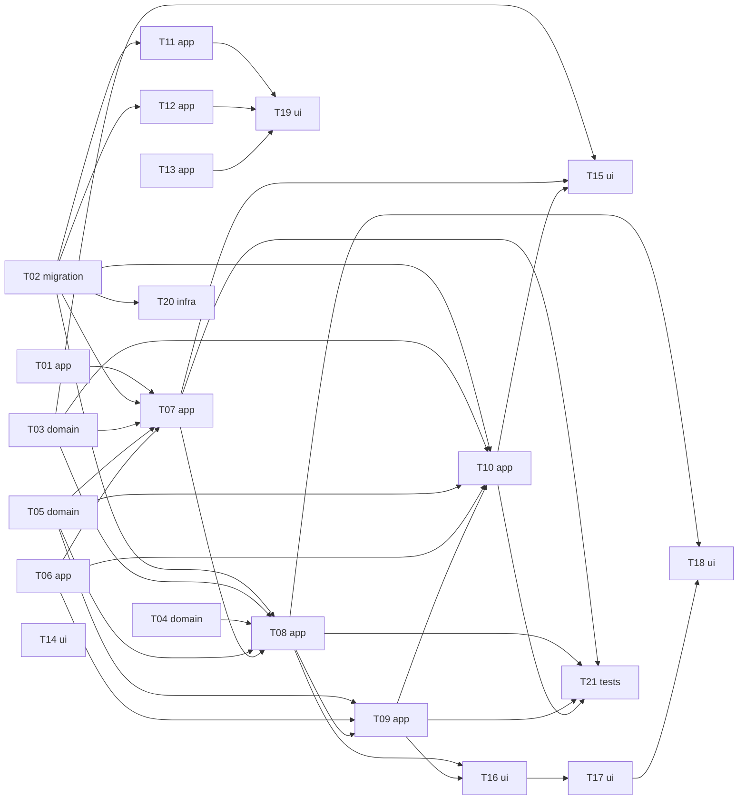

# Epic — invoice-integrity

> **Spec:** [spec.md](../spec.md) · **Design:** [sad.md](../sad.md) · **Data model:** [data-model.md](../data-model.md) · **API:** [server-actions.md](../contracts/server-actions.md) (no `openapi.yaml`: this feature changes no HTTP route) · **Screens:** [screens.md](../screens.md) · **ADRs:** [adr/](../adr/)

## Goal

Every invoice rule holds once, in the shared business layer, so the editor, a stale tab, a script with the Freelancer's session and the coming Assistant write tools all get the same answer (spec §2). An issued invoice and its PDF keep saying what the Customer received; statuses follow one lifecycle; an outdated view never overwrites a newer change; currency, amount and date mistakes come back as field errors; each Freelancer has exactly one default sender profile and each profile exactly one default bank account; the number's year comes from the issue date. Shipping this unblocks Assistant write tools (spec §1).

## Scope

- **In:** `lib/helpers` (transition table, locked-field comparison, PDF blocks), `lib/validations` (invoice bounds, strict product price), `lib/services` (`invoices`, `bank-accounts`, `sender-profiles`, `products`), the invoice server actions, the editor's three modes and dialogs, the invoice list row actions, the profile/account/product forms, one Prisma migration set (version column, bankAccountId index, two partial unique default indexes with the release repair), Sentry spans, a count-only pre-release report.
- **Out:** overdue derivation (shipped with `mcp-server`); partial payments, manual payment date, credit notes; copying the logo per invoice; automatic repair of existing invoices; per-year counter reset; editor UX races / table date formatting / accessibility (`editor-ux`); Assistant write tools (spec §3).

## Task map

**Waves** (longest dependency chain): 1 — T01, T02, T03, T04, T05, T06, T13, T14 · 2 — T07, T11, T12, T20 · 3 — T08, T19 · 4 — T09 · 5 — T10, T16 · 6 — T15, T17, T21 · 7 — T18.
**Serialized lanes:** `lib/services/invoices/invoices.ts` — T01 → T07 → T08 → T09 → T10 (explicit deps follow the lane); `components/invoice-editor/` — T16 → T17 → T18; `layer: migration` — T02 alone. **T01 ships first and on its own:** it creates the latency baseline and must be released at least 7 days before the rest (sad §11).

## Tasks

See [tracker.md](./tracker.md) for status. Machine contract: [tasks.json](../tasks.json).

| # | Task | Layer | Blocked by | DoD (short) |
|---|---|---|---|---|
| T01 | [Wrap invoice saves and status changes in Sentry spans and tag generic failures by path](./t01-save-and-status-spans.md) | app | — | spans exist; outcomes unchanged |
| T02 | [Promote the four staged migrations, declare them in the Prisma schema and adapt the test factories](./t02-promote-migrations-and-test-support.md) | migration | — | 4 pairs apply/revert; repair + P2002 tests |
| T03 | [Encode the status lifecycle as a transition table with decideStatusChange and add the new ActionResult detail kinds](./t03-lifecycle-module.md) | domain | — | 25-pair unit matrix green |
| T04 | [Add the pure locked-field comparison for issued invoices built on the write normalizers](./t04-locked-field-comparison.md) | domain | — | one fieldErrors key per changed locked field |
| T05 | [Bound every computed amount, cap the discount and require due date ≥ issue date in the shared invoice schema](./t05-amount-and-date-bounds.md) | domain | — | per-amount bounds, discount cap, due date |
| T06 | [Check the bank account's and every catalogue line product's currency against the invoice in verifyInvoiceRelations](./t06-currency-relations.md) | app | — | bank + catalogue currency field errors |
| T07 | [Create and duplicate invoices only as drafts under the draft rules, numbered by the issue date's year](./t07-create-and-duplicate.md) | app | T01, T02, T03, T05, T06 | create/duplicate only as draft; issue-date year |
| T08 | [Refuse outdated, cancelled, lifecycle-breaking and locked-field saves in updateInvoice and write only the four editable fields on issued invoices](./t08-update-freshness-and-issued-lock.md) | app | T02, T03, T04, T05, T07 | contract order of refusals; 4 fields written |
| T09 | [Apply every draft rule on draft saves and issuing from the editor, refreshing issued details only while the invoice is a draft](./t09-update-draft-branch.md) | app | T05, T06, T08 | all draft rules together; freeze on issue |
| T10 | [Decide list status changes and deletes under the row lock with the lifecycle and the draft rules on issue](./t10-status-change-and-delete.md) | app | T02, T03, T05, T06, T09 | locked lifecycle; same-status no write; delete drafts only |
| T11 | [Keep exactly one default sender profile per Freelancer under the User row lock](./t11-sender-profile-defaults.md) | app | T02 | exactly 1 default after 10 parallel |
| T12 | [Keep exactly one default bank account per sender profile and lock the currency of an account used by invoices](./t12-bank-account-defaults-and-currency-lock.md) | app | T02 | 1 default + currency lock HAS_INVOICES |
| T13 | [Require a strict two-decimal product price and count invoices, not lines, in the product currency lock](./t13-product-price-and-currency-lock.md) | app | — | strict price; invoice-count lock |
| T14 | [Print the PDF's sender, Customer and bank blocks from the issued details, account number always](./t14-pdf-from-issued-details.md) | ui | — | identical PDF text after record changes |
| T15 | [Offer only lifecycle-allowed row actions, confirm Cancel with SCR-04 and redraw refused rows at their current status](./t15-list-row-actions-and-cancel.md) | ui | T03, T07, T10 | menus by status; SCR-04; redraw on refusal |
| T16 | [Render the editor in draft, issued and cancelled modes with Save and issue and retired-product lines kept](./t16-editor-modes-and-issue.md) | ui | T08, T09 | three modes + Save and issue |
| T17 | [Show every new invoice rule refusal under its field in the editor](./t17-editor-field-errors.md) | ui | T16 | every key under its field |
| T18 | [Round-trip the loaded version and open the changed-elsewhere dialog and stale state on CHANGED_ELSEWHERE](./t18-changed-elsewhere-dialog.md) | ui | T08, T17 | SCR-05 + stale state |
| T19 | [Show default-checkbox states and currency-lock and price errors in the sender profile, bank account and product forms](./t19-profile-account-product-forms.md) | ui | T11, T12, T13 | checkbox states + currency/price errors |
| T20 | [Add the count-only pre-release report script and the release runbook](./t20-pre-release-report-and-runbook.md) | infra | T02 | counts printed, nothing written |
| T21 | [Prove every invoice write path enforces the same rules: status matrix, race, version bump, tenancy and read-only Assistant](./t21-write-path-conformance.md) | tests | T07, T08, T09, T10 | matrix, race, version, tenancy, MCP |

## Risks / Hard rules

- **Every rule lives in `lib/services`** (or a pure shared module it calls), never in a server action, component or the MCP adapter; every write is scoped by owner in its own `WHERE`, another Freelancer's record answers exactly like a missing one (sad §5, §8; AC-23).
- **Row lock first, version check first** in `updateInvoice`; `updateInvoiceStatus` takes no version and is judged by the lifecycle against the locked row (ADR-0002, ADR-0004).
- **Issued details are written only while the invoice is a draft**; the PDF, the editor and the Assistant read only those columns; the logo stays current (ADR-0001).
- **Never `FAILED` for user input** — refusals are `VALIDATION` / `CONFLICT` with the contract messages verbatim (sad §8, QG-3a).
- **Every invoice service write bumps `version`** except the lazy calendar-day normalisation (ADR-0004, sad §11).
- **Release order:** report → `prisma migrate deploy` on dev, then production → code deploy; the code reads `Invoice.version` (sad §7, §11). T01's spans ship ≥7 days earlier.
- **Changed test expectations:** every existing test changed because it encoded now-forbidden behaviour is listed in the PR (spec §6).
- **Open (spec §8):** what the pre-release report finds (T20, before the production deploy); duplicate reference — closed with the default (no reference).
