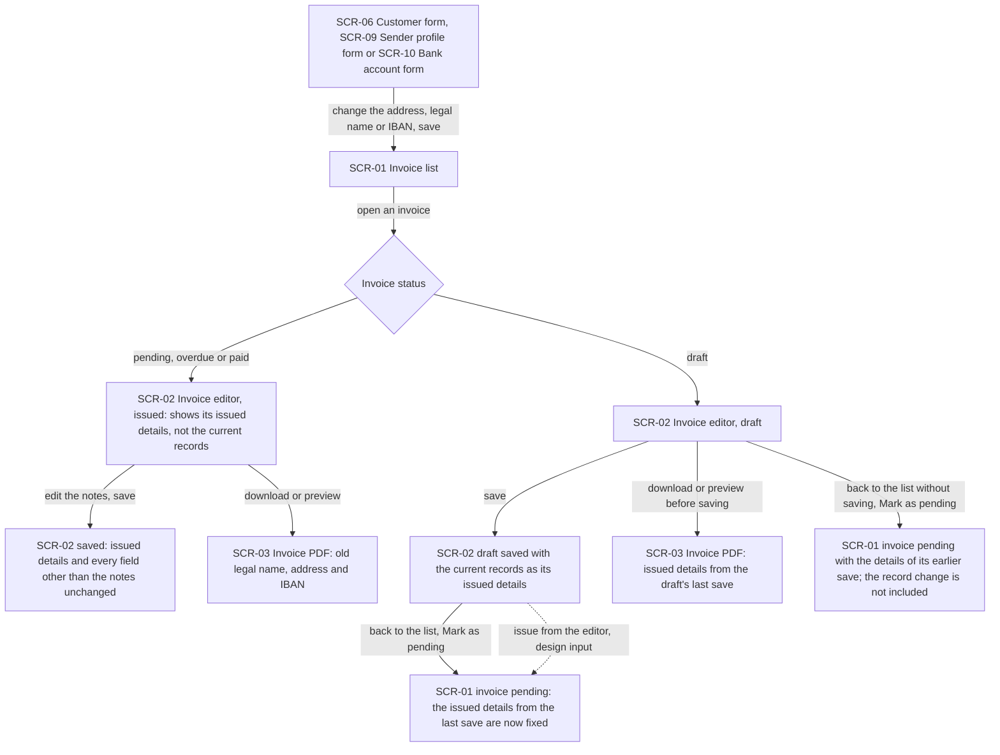
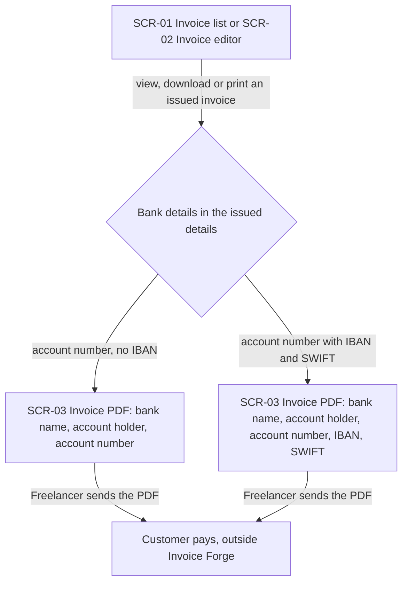
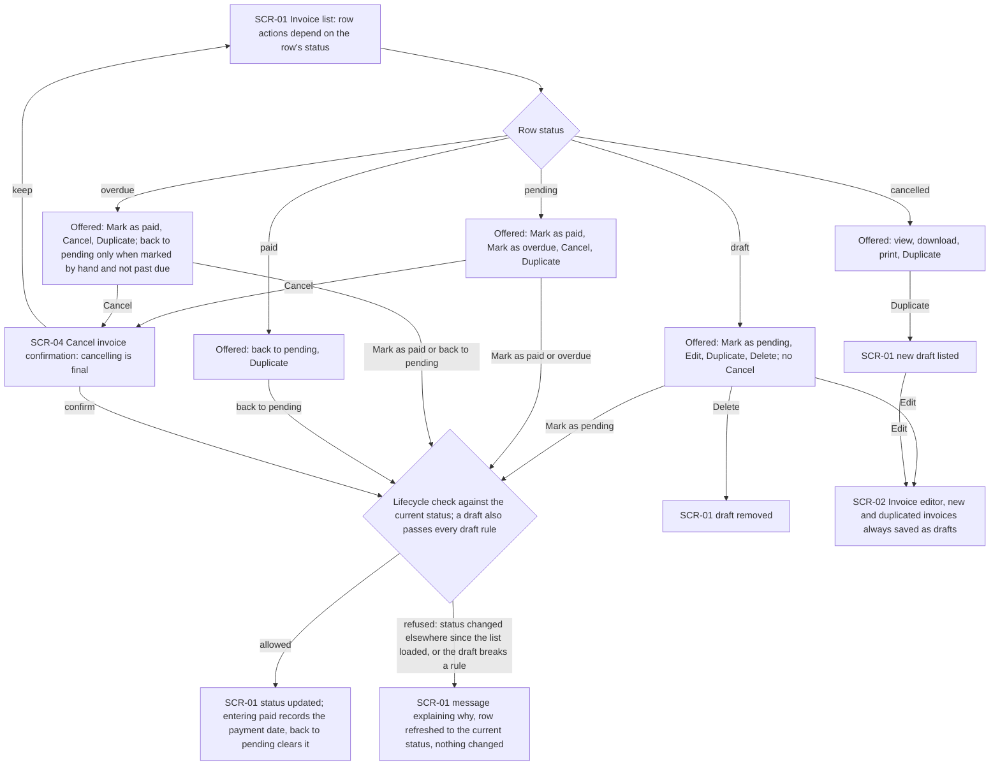
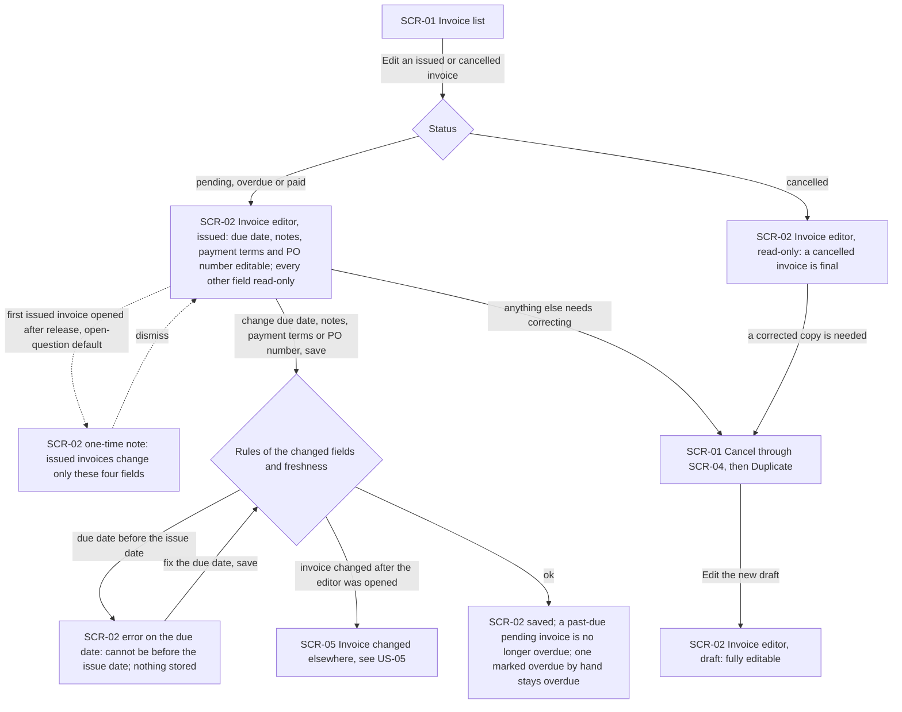
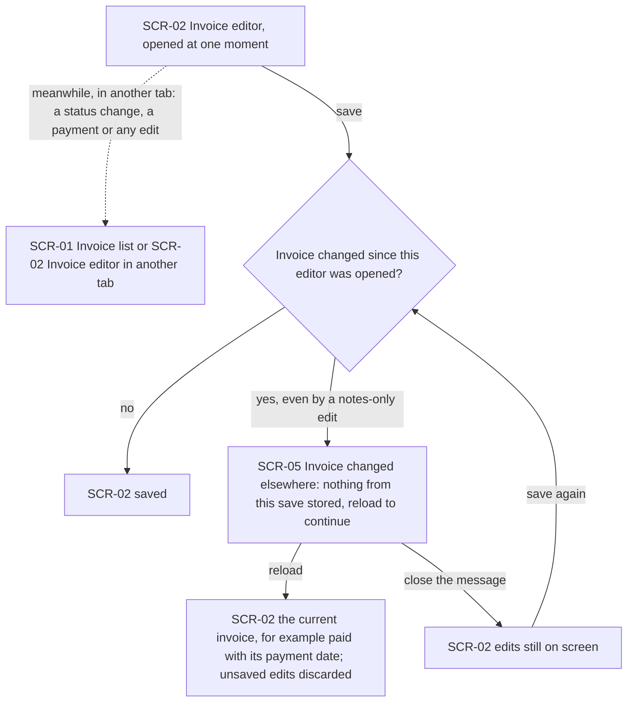
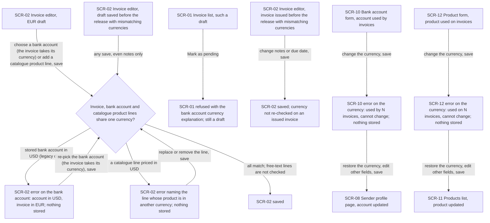
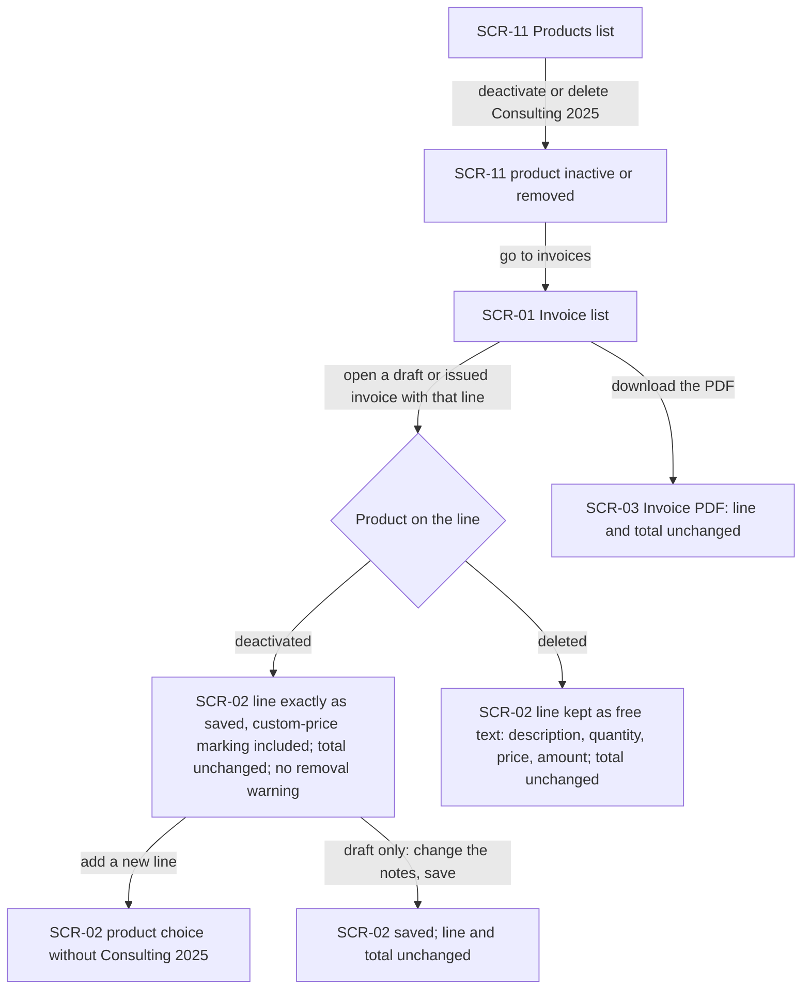
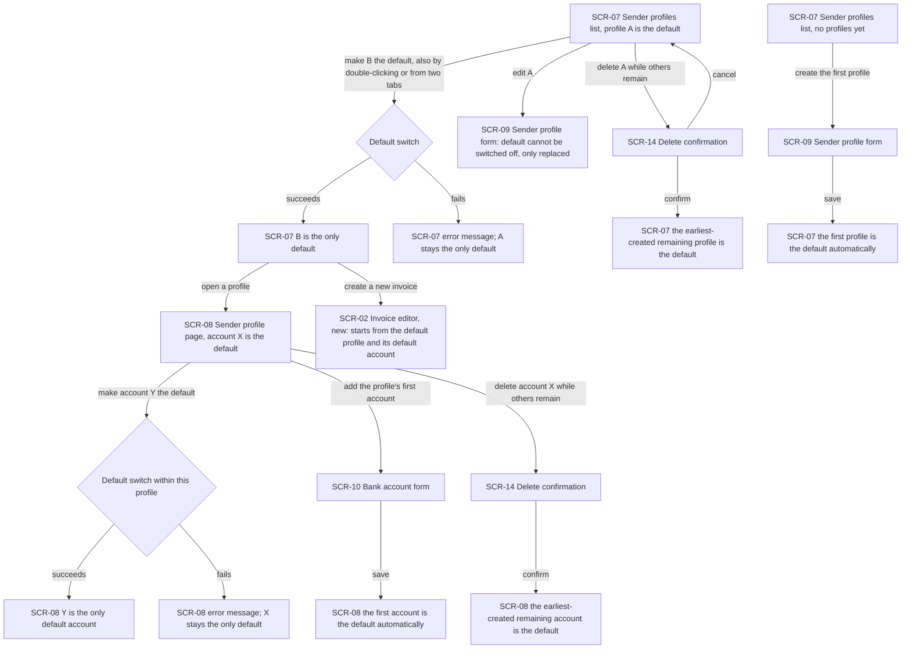
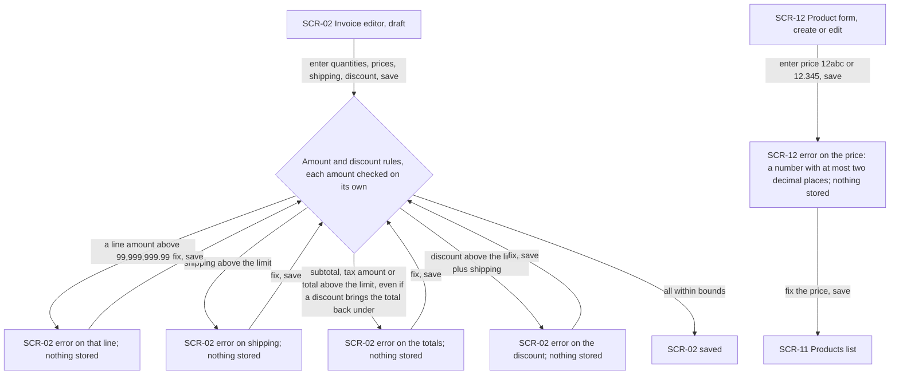
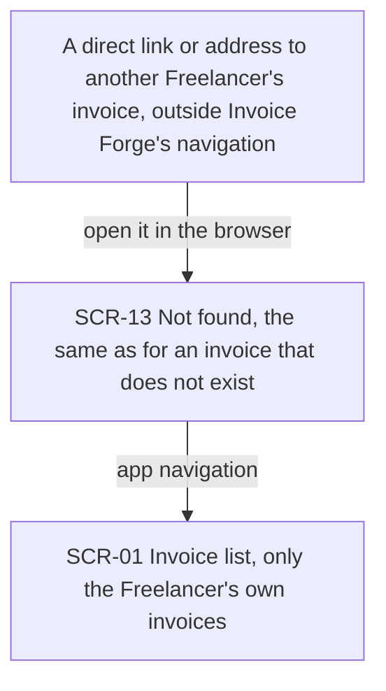

# UX flows — invoice-integrity

> User flows for every UI-touching §4 user story, produced by `ux-flows` (after `clarify`, before
> `design`) and read by `design` (evidence for the target-surface + UI-architecture decisions),
> `sequences` (UI-driven flows align on SCR ids), `screens` (details every inventory row) and
> `plan-tests` (the e2e-through-UI paths). **Always markdown + mermaid `flowchart`**, whatever the
> design tool — this artifact is flow-altitude, not visual design.

## Platform decisions

- **Posture:** responsive-both. This keeps the app's current behaviour: the same screens serve desktop and mobile, as in the mcp-server, security-patch and architecture-hardening flows. `docs/design-system.md` is code-only and doesn't state a posture. This feature adds no new pages. It changes what existing pages allow and how they refuse, so every refusal must read on a phone as well as on a desktop.
- **No new pages, only new states and two dialogs.** The invoice list (SCR-01), the invoice editor (SCR-02), the PDF (SCR-03), the sender profile, bank account and product pages keep their place in the navigation. The only new screens are the cancel confirmation (SCR-04) and the "changed elsewhere" notice (SCR-05).
- **The editor has three modes, chosen by the invoice's status.** A draft is fully editable. An issued invoice (pending, overdue, paid) opens with only the due date, notes, payment terms and PO number editable and every other field read-only (AC-08). A cancelled invoice opens fully read-only (AC-06). The editor stays today's only per-invoice page.
- **Status changes stay in the invoice list.** The list's row actions offer only the moves the lifecycle allows from the row's status (AC-04). There is no action back to draft on any issued invoice, and no Cancel on a draft. A status change from the list is judged against the invoice's current status, not against the row as loaded (AC-10). A refusal shows a message and refreshes the row to the current status, which is how the list already handles a stale row.
- **Issuing from the editor is design input.** AC-02 and AC-14 name the editor as one way to issue a draft. Today the editor has no status action, and issuing happens only from the list. The flows draw issuing from the editor as a dotted branch. `design` / `screens` decide whether the editor gets an issue action. The business-layer rule is the same either way.
- **Cancelling asks for confirmation.** A cancelled invoice is final (AC-06), so Cancel goes through a confirmation dialog (SCR-04) that says so. Delete stays a draft-only action with today's behaviour.
- **Correcting an issued invoice is Cancel, then Duplicate, both from the list.** Duplicate is offered for every status, cancelled included, and always creates a draft (AC-04b), which then opens in the editor fully editable. Following the §8 open-question default, the duplicate shows no reference to the cancelled invoice. There is no branch for one.
- **An outdated editor save gets a dialog, not an inline error.** SCR-05 tells the Freelancer the invoice changed elsewhere and must be reloaded (AC-10). Reloading discards the unsaved edits. Closing the dialog leaves the edits on screen, so the Freelancer can copy text out of them, but every further save is refused the same way until they reload. Merging the two versions is out of scope.
- **Every rule refusal is a field error in place.** Currency, amount, discount, due-date and product-price refusals keep the Freelancer on the same screen with their edits intact, put the explanation on the field (AC-09, AC-11, AC-12, AC-19, AC-20, AC-20b), and store nothing. The editor's current "Invalid items will be removed when you save" warning is retired. A currency mismatch on a line now blocks the save and names the line (AC-12). A line whose product was deactivated is kept as saved (AC-15).
- **A currency that can't change is refused on save, not hidden.** Changing the currency of a bank account or product used by invoices is refused on save with a count of the invoices that use it (AC-13, AC-13b). Every other field of the record stays editable. Whether `screens` also shows the currency field as locked up front is a visual choice for that stage.
- **Defaults are replaced, never switched off.** "Make default" on a sender profile or bank account always moves the default. The current default offers no way to unset it (AC-17b). A failed switch leaves the old default in place and shows an error (AC-17).
- **The one-time "issued invoices are now locked" note is the §8 open-question default.** It is drawn as a dotted branch on the first issued invoice the Freelancer opens after release. The decision is due before `sdd:tasks`.
- **Assistant and script callers have no screen here.** US-11's refusals for non-editor callers (AC-24, AC-25) and the Assistant's answer (AC-26) have no Invoice Forge screen, so they are not drawn. A direct link to another Freelancer's invoice is drawn, because a Freelancer can open one in the browser.

## Screen inventory

| ID | Screen | Purpose | Entry | Exit |
|---|---|---|---|---|
| SCR-01 | Invoice list | Invoices with their status and row actions: view, download, print, edit, duplicate, delete (drafts only) and the status changes the lifecycle allows from the row's status | App navigation, dashboard, customer page | SCR-02 (edit), SCR-03 (view, download, print), SCR-04 (cancel) |
| SCR-02 | Invoice editor | Create or edit an invoice. Draft: fully editable, issued details follow the current records on each save. Issued: only due date, notes, payment terms and PO number editable. Cancelled: read-only. Field errors for every rule refusal | New invoice action, Edit on SCR-01, opening a new duplicate | SCR-01 (back), SCR-03 (download, preview), SCR-05 (outdated save) |
| SCR-03 | Invoice PDF | Preview, download or print an invoice as the Customer receives it, printed from its issued details, including the bank account number. The logo stays current | View, download or print on SCR-01; download or preview in SCR-02 | Back to the originating screen; the file goes to the Customer outside Invoice Forge |
| SCR-04 | Cancel invoice confirmation | Confirm or keep cancelling one issued invoice, stating that a cancelled invoice is final and can only be duplicated | Cancel action on SCR-01 | SCR-01 (cancelled on confirm, unchanged on keep) |
| SCR-05 | Invoice changed elsewhere | Tell the Freelancer their editor save was refused because the invoice changed after they opened it, and offer to reload | Saving in SCR-02 from an outdated view | SCR-02 reloaded (edits discarded), or SCR-02 with edits still on screen (dialog closed) |
| SCR-06 | Customer form | Edit a Customer's details, such as the address | Customers list, customer page | Customer page; the change reaches drafts on their next save, never issued invoices |
| SCR-07 | Sender profiles list | The Freelancer's sender profiles, the one default marked, make-default and delete actions | App navigation | SCR-08, SCR-09, SCR-14 |
| SCR-08 | Sender profile page | One sender profile's details and its bank accounts, the one default account marked, with add, edit, make-default and delete actions for accounts | SCR-07 | SCR-09, SCR-10, SCR-14, back to SCR-07 |
| SCR-09 | Sender profile form | Create or edit a sender profile, including its legal name and whether it is the default. The current default cannot be switched off here | SCR-07, SCR-08 | SCR-07 or SCR-08 after saving |
| SCR-10 | Bank account form | Create or edit a bank account of one sender profile. A currency change on an account used by invoices is refused with the count of those invoices | SCR-08 | SCR-08 after saving |
| SCR-11 | Products list | The product catalogue with activate, deactivate and delete actions | App navigation | SCR-12 |
| SCR-12 | Product form | Create or edit a product. Strict price format, and a currency change on a product used on invoices is refused with the count of those invoices | SCR-11 | SCR-11 after saving |
| SCR-13 | Not found | Existing "not found" page for an invoice that doesn't exist or isn't the Freelancer's | A direct link or address to such an invoice | App navigation |
| SCR-14 | Delete confirmation | Existing confirm-or-cancel dialog for deleting a sender profile or a bank account | Delete action on SCR-07 or SCR-08 | Back to SCR-07 or SCR-08 |

## Flows

Out of scope for drawing (no human-facing movement of its own):

- **US-10 — Invoice number year matches the invoice.** The year is a value rule applied when the number is assigned on the first save. The Freelancer's movement through the editor (fill in, save, see the number) does not change, so there is nothing new to draw. AC-21, AC-21b and AC-22 are proven by tests on the assigned value.

US-11 is mostly about non-browser callers. Its one Freelancer-visible part, opening another Freelancer's invoice by a direct link (AC-23), is drawn below.

### Flow: US-01 — Issued invoice keeps its details

The Freelancer changes a Customer's address, a sender profile's legal name or a bank account's IBAN, then opens an invoice from the list. An issued invoice (pending, overdue or paid) opens showing the details it was issued with, not the new ones. Editing its notes and saving changes only the notes. Its PDF still prints the old legal name, address and IBAN. A draft is different: saving it copies the current records into it, and when it is then issued from the list (or from the editor, if `design` adds that action) those details become fixed. If the draft is issued without being saved again, it keeps the details from its earlier save, and the record change never reaches it. A draft's PDF always prints the details from its last save.

### Flow: US-02 — Customer can pay from the PDF

From the invoice list or the editor, the Freelancer views, downloads or prints an issued invoice. The PDF takes its payment details from the invoice's issued details, never from the current bank account. It always prints the bank name, account holder and account number. It adds the IBAN and SWIFT code only when the issued details contain them, so an account without an IBAN still gives the Customer something to pay to. The Freelancer sends the PDF, and the Customer pays outside Invoice Forge.

### Flow: US-03 — Statuses follow one lifecycle

In the invoice list, each row offers only the moves the lifecycle allows from its status. A draft can be issued (Mark as pending), edited, duplicated or deleted, but not cancelled. A pending invoice can be marked paid or overdue, or cancelled. An overdue invoice can be marked paid or cancelled, and can go back to pending only if the Freelancer marked it overdue by hand and its due date has not passed. A paid invoice can go back to pending to undo a mistaken payment. A cancelled invoice can only be viewed, downloaded, printed or duplicated. No issued invoice offers a way back to draft, and only drafts offer Delete. Cancel first opens a confirmation that says cancelling is final. Keeping the invoice returns to the list unchanged. Every status change is checked against the invoice's current status, not the row as it was loaded. Allowed changes update the row. Entering paid records the payment date, and going back to pending clears it. A change that is no longer allowed (for example, Mark as paid on an invoice cancelled in another tab), or a draft that breaks a rule such as mismatching currencies, is refused with an explanation. The row then refreshes to the current status and nothing changes. A duplicate of any invoice appears in the list as a new draft and opens in the editor, where every new invoice is saved as a draft.

### Flow: US-04 — Correct an issued invoice safely

Opening an issued invoice (pending, overdue or paid) in the editor allows changes to only its due date, notes, payment terms and PO number. Every other field is shown read-only. Following the §8 open-question default, the first issued invoice the Freelancer opens after the release shows a one-time note explaining this, which they dismiss. Saving checks only the fields that changed. A due date before the issue date is refused on the due date field, and nothing is stored until they fix it. If the invoice changed after the editor was opened, the save goes to the US-05 flow. A successful save keeps every fixed field as it was. A pending invoice whose due date moves into the future stops counting as overdue, but one the Freelancer marked overdue by hand stays overdue until they move it back to pending. A cancelled invoice opens fully read-only. To correct anything beyond the four fields, the Freelancer goes back to the list, cancels the invoice through the confirmation, duplicates it and edits the new draft, which is fully editable.

### Flow: US-05 — An old view never overwrites a newer change

The Freelancer has an invoice open in the editor. Meanwhile, in another tab, they change it: they mark it paid from the list or edit any field, even only the notes. When they save from the first editor, the system checks whether the invoice changed after that editor was opened. If it did not, the save goes through. If it did, the save is refused and nothing from it is stored. A dialog explains that the invoice was changed elsewhere and must be reloaded. Reloading shows the current invoice, for example paid with its payment date, and discards the unsaved edits. Closing the dialog leaves the edits on screen, but saving again is refused the same way until they reload. This applies to drafts and issued invoices alike. Status changes from the list are not checked this way. They follow the US-03 flow.

### Flow: US-06 — One currency per invoice

On a draft, every save checks that the invoice, its bank account and every line with a catalogue product share one currency. In the editor, choosing a bank account sets the invoice's currency to the account's, so the bank account refusal is reached through a draft stored with mismatching currencies or through another path. A bank account in another currency is refused on the bank account field ("the account is in USD while the invoice is in EUR"). A catalogue line in another currency is refused with the line named. Lines typed as free text are not checked. In both cases nothing is stored, and the Freelancer fixes the choice and saves again. A draft saved before the release with mismatching currencies hits the same check on its next save, even a notes-only one. Issuing it from the list is refused with the same explanation, and it stays a draft. An invoice issued before the release with mismatching currencies is not re-checked: changing its notes or due date saves normally. In the bank account form and the product form, changing the currency of a record that invoices use is refused on the currency field, with the number of invoices that use it. Restoring the currency lets every other change save.

### Flow: US-07 — Retired products do not break old invoices

The Freelancer deactivates or deletes the product "Consulting 2025" in the products list. Invoices that already have a line for it are unaffected. Opening a draft or an issued invoice shows the line exactly as it was saved, with no warning offering to remove it, and the total is unchanged. If the product was deleted, the line shows as free text with its description, quantity, price and amount. When the Freelancer adds a new line, the deactivated product is not offered. Saving a draft after changing its notes keeps the line and the total as they were. The PDF also shows the line and the total unchanged.

### Flow: US-08 — Exactly one default profile and account

In the sender profiles list, making profile B the default always leaves exactly one default, even if the Freelancer double-clicks or does it from two tabs at once. If the switch fails, an error appears and A stays the default. The current default can't be switched off in its form. It can only be replaced by making another profile the default. Deleting the default, after the existing confirmation, makes the earliest-created remaining profile the default. The first profile a Freelancer creates becomes the default automatically. On a sender profile's page, the bank accounts follow the same rules within that profile: switching the default leaves exactly one (or keeps the old one if the switch fails), the first account becomes the default automatically, and deleting the default promotes the earliest-created remaining account. A new invoice in the editor starts from the default profile and its default account.

### Flow: US-09 — Plain errors for out-of-range values

In the editor, saving a draft checks every amount on its own against the limit of 99,999,999.99. A line amount over the limit is refused on that line, shipping on the shipping field, and the subtotal, tax amount or total on the totals. A subtotal over the limit is refused even when a discount brings the total back under it. A discount larger than the lines plus shipping is refused on the discount field (1,250.00 against 1,000.00 of lines and 200.00 of shipping is refused; 1,200.00 is accepted). Each refusal stores nothing and shows no generic failure. The Freelancer fixes the value and saves again. In the product form, a price such as "12abc" or "12.345" is refused on the price field with the rule "a number with at most two decimal places". A due date before the issue date follows the same field-error pattern, shown in the US-04 flow.

### Flow: US-11 — The same rules for every caller

If a Freelancer opens a link or types an address that points to another Freelancer's invoice, they get the same "not found" page as for an invoice that doesn't exist. The page reveals nothing about the other invoice, and that invoice is not changed. From there, app navigation takes them back to their own invoice list. Assistants and scripts calling the business layer directly see no screen, so their refusals are not drawn here.

## AC coverage

| AC | Shown by | Notes |
|---|---|---|
| AC-01 | Flow US-01 → issued branch (A3 → A4, A5) | Notes edit keeps every other field; PDF prints the old details |
| AC-02 | Flow US-01 → draft branch (A6 → A7 → A9, A6 → A10, A6 → A8) | Issuing from the editor is dotted: design input |
| AC-03 | Flow US-02 → B2, B3 | Account number always; IBAN and SWIFT when present |
| AC-04 | Flow US-03 → C1 action sets, C7 → C9 / C10 | Payment date recorded on paid, cleared on back to pending. A same-status request isn't a UI action. It is a business-layer rule for editor saves, proven by the NFR test matrix |
| AC-04b | Flow US-03 → C12, C13 (new and duplicated invoices saved as drafts) | A non-draft creation from another path has no screen; see AC-25 |
| AC-05 | Flow US-03 → no back-to-draft action on any issued status (C3, C4, C5) | The "suggest Cancel and Duplicate" refusal text comes back to non-editor callers (AC-25); the UI never offers the move |
| AC-06 | Flow US-03 → C6 (cancelled offers only view, download, print, Duplicate); Flow US-04 → D3 (read-only editor) | Stays in the list and printable |
| AC-07 | Flow US-04 → D5 → D8 | Hand-marked overdue stays overdue |
| AC-08 | Flow US-04 → D2 (read-only fields), D9 (Cancel, then Duplicate) | A change that bypasses the editor is AC-25 |
| AC-09 | Flow US-04 → D6 | Due-date field error |
| AC-10 | Flow US-05 → E2 → E4 → E5 / E6; Flow US-03 → C10 (list changes judged by lifecycle) | Notes-only change elsewhere also refuses |
| AC-11 | Flow US-06 → F2 | Bank account field error |
| AC-12 | Flow US-06 → F3 | Names the line; free-text lines not checked |
| AC-13 | Flow US-06 → F10 → F11 → F12 | Count of invoices shown; other fields still editable |
| AC-13b | Flow US-06 → F13 → F14 → F15 | Count of invoices shown; other fields still editable |
| AC-14 | Flow US-06 → F5, F6 → F7, F8 → F9 | Legacy draft blocked; legacy issued invoice saves |
| AC-15 | Flow US-07 → G4, G6, G7 | No removal warning; product not offered for new lines |
| AC-16 | Flow US-07 → G5, G8 | Deleted product's line as free text; PDF unchanged |
| AC-17 | Flow US-08 → H1 → H2 / H3; H11 → H12 / H13 | Double-click and two tabs drawn on the switch edge |
| AC-17b | Flow US-08 → H4, H5 → H6, H7 → H9, H14 → H15, H16 → H17 | Default replaced, never switched off |
| AC-18 | N/A: release-time repair of existing defaults | No screen and no Freelancer action; the result appears as AC-17's single default |
| AC-19 | Flow US-09 → I2, I3, I4 | Each amount checked on its own |
| AC-20 | Flow US-09 → J0 → J1 | Product price field error |
| AC-20b | Flow US-09 → I5 | Discount field error |
| AC-21 | N/A: number value rule | US-10 is out of scope for drawing; the editor movement is unchanged |
| AC-21b | N/A: number value rule | Same as AC-21 |
| AC-22 | N/A: number value rule | Same as AC-21 |
| AC-23 | Flow US-11 → K0 → K1 | Same not-found page as a missing invoice |
| AC-24 | N/A: Assistant caller, no Invoice Forge screen | Personal keys offer no write capability |
| AC-25 | N/A: non-editor caller, no screen | Its editor counterparts are US-03 C10, US-04 D2 / D6, US-06 F2 / F3 |
| AC-26 | N/A: Assistant answer, outside Invoice Forge | The PDF counterpart is US-01 A5 |
