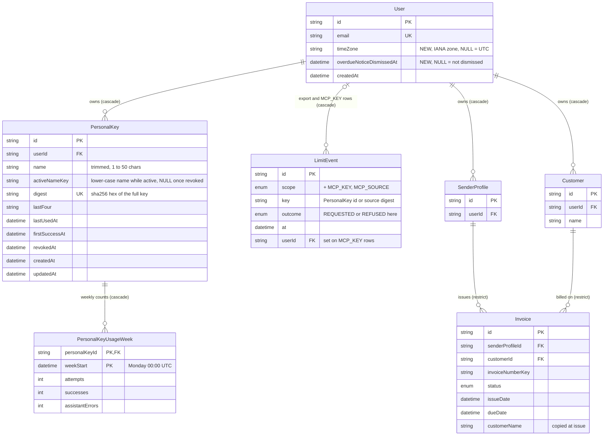

# Data model — mcp-server

> **Mode:** brownfield delta. This feature adds two tables (`PersonalKey`, `PersonalKeyUsageWeek`), two nullable columns on `User` (`timeZone`, `overdueNoticeDismissedAt`) and two values to the existing `LimitScope` enum (`MCP_KEY`, `MCP_SOURCE`). It adds **no** index to `Invoice` or `Customer`: the new overdue rule and the Assistant reads are served by the existing indexes at the spec's 5,000-invoice budget (measured, see §Indexes). Every other entity it touches keeps its schema.
> **Conventions followed (derived, not imposed):**
> - `prisma migrate` with the split schema `prisma/schema/{base,auth,invoice}.prisma` (architecture-map §Migrations). The new models go in `auth.prisma`, next to `LimitEvent` (SAD §5).
> - Quoted PascalCase table names and camelCase columns. `TEXT` ids from `cuid()` (SAD §8 ID strategy). `TEXT` for strings (the repo uses no `VARCHAR(N)`; length limits live in zod). `TIMESTAMP(3)` for timestamps.
> - `createdAt` / `updatedAt` on domain models (`Customer`, `SenderProfile`, …); none on counter tables (`LogoFetchWindow`, `LimitEvent`).
> - Composite `@@id` for per-window counters, as `LogoFetchWindow`.
> - Prisma's default constraint and index names (`_pkey`, `_key`, `_idx`, `_fkey`). FKs are `ON UPDATE CASCADE`. User-owned rows are `ON DELETE CASCADE`, as `Customer`, `LimitEvent`, `EmailHistory`.
> - No `CHECK` constraints, triggers or expression/partial indexes: the repo uses none, and Prisma cannot represent the last two (they would show as drift). Normalized lookup keys are stored as columns instead, as `Invoice.invoiceNumberKey`.
> - Idempotent DDL (`IF NOT EXISTS`, `DO $$ … IF NOT EXISTS` for FKs), as in `20261002120000_create_limit_event`.
>
> **Staged migrations:** `docs/features/mcp-server/migrations/0{1..6}_*.{up,down}.sql`. They are **not** in the live `prisma/migrations/` tree yet. `implement` promotes them (see the audit report).

## ER diagram

Only the entities this feature changes or relies on are shown.



## Entities

**Aggregate roots, from the ACs and ADRs.**
- `User` (the Freelancer) stays the root of the account. It gains two settings columns.
- `PersonalKey` is a child of `User`. Its lifecycle is create → (used) → revoked, and revocation is final (AC-06). Revoked keys are kept, so the connect page can list them and the export can include them (AC-05, AC-25). They go only with the account (AC-26).
- `PersonalKeyUsageWeek` is a child of `PersonalKey`. It is a counter table, like `LogoFetchWindow`, and is reached through its key.
- `LimitEvent` is unchanged infrastructure (security-patch). It gets two new scopes.
- `Invoice`, `Customer`, `SenderProfile` are read only. No schema change.

### `Invoice.issueDate` and `Invoice.dueDate`: storage meaning (T25, review-2026-10-05 F-02, F-03)

Both columns stay `TIMESTAMP(3)` and mean a **calendar day**: the day the Freelancer picked, stored as that day at `T00:00:00Z`. The editor sends `yyyy-MM-dd`, `invoiceFormSchema` turns it into the UTC midnight, and every other write (duplicate, the default "today + 30 days") also stores a UTC midnight. A period, a due-date filter and the overdue rule compare by calendar day (`UTC-midnight bounds` or `::date`), never by a zone-local instant; the account time zone only decides which day is "today" and which days a preset names. The browser shows a stored day by its UTC Y/M/D, so no zone shifts it. Migration `06_normalize_invoice_calendar_dates` (live as `20261005100000_normalize_invoice_calendar_dates`) backfills older rows, which held the browser's local-midnight instant or a time of day: each value is read in the owner's saved zone (`UTC` when none or unknown) and cut to its day. It skips a value already at exactly `00:00:00Z`, so it is idempotent. Its down script is a no-op: the old instants are not kept.

### `User` (two new nullable columns)

| Column | Type | Constraints | Notes |
|---|---|---|---|
| `timeZone` ★ | TEXT | NULL | ADR-0006. An IANA zone that both `Intl` and `pg_timezone_names` know, checked by `resolveTimeZone` before every write. NULL means "not saved yet": both `ActingFreelancer` factories then use `UTC` (AC-22) |
| `overdueNoticeDismissedAt` ★ | TIMESTAMP(3) | NULL | spec §8 (resolved here, 2026-10-04): when the Freelancer dismissed the one-time notice about the new overdue rule. Per account, so it shows once across devices |

**Access patterns.**
- Both `ActingFreelancer` factories read `timeZone` with the user row → `User_pkey`. The Personal-key factory gets it from the same join that authenticates the key (see `PersonalKey`).
- First-visit seed (flow 12): `UPDATE "User" SET "timeZone" = $zone WHERE "id" = $id AND "timeZone" IS NULL` (Prisma `updateMany`). It never overwrites a saved zone, even when two first requests race. Verified: the second seed affects 0 rows.
- Settings change (flow 12): a plain update by id, after `resolveTimeZone` accepts the zone. An unknown zone is refused, not saved as UTC.
- Notice: shown when `overdueNoticeDismissedAt IS NULL`. Dismiss: `updateMany` by id where it is still NULL.

**No backfill.** Existing Freelancers get `timeZone` on their next visit (ADR-0006, Neutral). A notice column that starts NULL is the intended state for existing accounts.

### `PersonalKey` ★ new (ADR-0004; AC-01 to AC-07, AC-25, AC-26)

| Column | Type | Constraints | Notes |
|---|---|---|---|
| `id` | TEXT | PK, `cuid()` (app-generated) | the key's handle in the UI (revoke) and the `LimitEvent` key for the per-key limit. Not secret |
| `userId` | TEXT | NOT NULL, FK → `User(id)` ON DELETE CASCADE | indexed by the leading column of `PersonalKey_userId_activeNameKey_key` |
| `name` | TEXT | NOT NULL | trimmed at both ends before saving, 1 to 50 characters (AC-03, zod) |
| `activeNameKey` | TEXT | NULL | `name.toLowerCase()` while the key is active, set to NULL on revoke in the same `UPDATE`. Unique per Freelancer with `userId`. Postgres never treats two NULLs as equal, so revoked keys may share a name with each other and with a new active key |
| `digest` | TEXT | NOT NULL, UNIQUE | lower-case hex SHA-256 of the full key (`ifk_` + secret + checksum, ADR-0004). The key itself is never stored |
| `lastFour` | TEXT | NOT NULL | the last four characters of the full key, for the list (AC-02, AC-05) |
| `lastUsedAt` | TIMESTAMP(3) | NULL | the latest call that passed the key check, including listings and limit-refused calls (AC-05). NULL = "never used" |
| `firstSuccessAt` | TIMESTAMP(3) | NULL | the first successful substantive call (§7 key-activation KPI: "within 7 days of creation"). Written once |
| `revokedAt` | TIMESTAMP(3) | NULL | NULL = active. Never cleared: no reactivation (AC-06) |
| `createdAt` | TIMESTAMP(3) | NOT NULL DEFAULT CURRENT_TIMESTAMP | the creation date shown in the list and the export |
| `updatedAt` | TIMESTAMP(3) | NOT NULL (Prisma `@updatedAt`) | repo convention for domain models |

**Access patterns.**
- **Authenticate (critical flow 1, flows 5 and 15):** `SELECT pk."id", pk."userId", pk."firstSuccessAt", u."timeZone" FROM "PersonalKey" pk JOIN "User" u ON u."id" = pk."userId" WHERE pk."digest" = $digest AND pk."revokedAt" IS NULL` → `PersonalKey_digest_key` (verified index scan). No cache, so revocation takes effect on the next call (AC-06). A key of a deleted account is gone through the cascade, so "orphaned" and "unknown" are the same miss (AC-07).
- **Record last use (at most once per minute):** `UPDATE … SET "lastUsedAt" = $now WHERE "id" = $id AND ("lastUsedAt" IS NULL OR "lastUsedAt" <= $now − 1 min)` → PK. `$now` and the cutoff come from the app clock. A one-minute throttle is well inside the 5-minute accuracy target (AC-05, NFR). Verified: a second call within the minute affects 0 rows.
- **Record first success:** `UPDATE … SET "firstSuccessAt" = $now WHERE "id" = $id AND "firstSuccessAt" IS NULL` → PK. The adapter runs it only when the authenticate row had `firstSuccessAt` NULL, so it is one write per key lifetime.
- **Create (flow 4, AC-02 to AC-04), in one interactive transaction:**
  1. `SELECT pg_advisory_xact_lock(hashtext('personal-key:' || $userId))` serializes creates per Freelancer. This is the repo's lock pattern (security-patch ADR-0002).
  2. Count the active keys (`WHERE "userId" = $1 AND "revokedAt" IS NULL`). At 10, refuse (AC-04).
  3. Look for an active key with the same `activeNameKey`. If there is one, refuse with the AC-03 message.
  4. Insert.

  The unique index `(userId, activeNameKey)` is the backstop: a P2002 on it maps to the same AC-03 refusal. The 10-active rule has no DB form (the repo uses no `CHECK`s or triggers), so it holds because every create takes the lock.
- **Revoke (critical flow 2):** `UPDATE … SET "revokedAt" = $now, "activeNameKey" = NULL WHERE "id" = $id AND "userId" = $actor AND "revokedAt" IS NULL` → PK. If 0 rows are affected, return `NOT_FOUND` (`notFoundIfNoneAffected`). This covers another Freelancer's key and an already revoked one.
- **List (flow 3):** `WHERE "userId" = $1 ORDER BY "createdAt" DESC`, split into active and revoked in the service → the `userId` prefix of `PersonalKey_userId_activeNameKey_key`.
- **Entry point (AC-01):** `EXISTS (… WHERE "userId" = $1 AND "lastUsedAt" IS NOT NULL)` → same prefix (verified bitmap index scan). Keys are never deleted while the account exists, so once a key is used, the entry point stays hidden for good.
- **Export (flow 14, AC-25):** `name`, `createdAt`, `lastUsedAt`, `revokedAt`. **Never** `digest`, `lastFour` or `activeNameKey`.

**App-side invariants (no DB form, per repo convention):**
- `activeNameKey IS NULL` ⇔ `revokedAt IS NOT NULL`. Only the create and revoke paths write these columns.
- At most 10 rows with `revokedAt IS NULL` per `userId`, enforced under the per-Freelancer advisory lock.

### `PersonalKeyUsageWeek` ★ new (spec §6.1, §7; SAD §7, §8 Observability)

| Column | Type | Constraints | Notes |
|---|---|---|---|
| `personalKeyId` | TEXT | PK (1), FK → `PersonalKey(id)` ON DELETE CASCADE | |
| `weekStart` | TIMESTAMP(3) | PK (2) | Monday 00:00 UTC of the call's ISO week, computed from the app clock (decided at data-model 2026-10-04: UTC, so a zone change never moves past counts) |
| `attempts` | INTEGER | NOT NULL DEFAULT 0 | substantive tool calls that passed the key check and the call limit. Tool listings are not counted (flow 5) |
| `successes` | INTEGER | NOT NULL DEFAULT 0 | attempts that returned an answer (a page, the figures, an invoice) |
| `assistantErrors` | INTEGER | NOT NULL DEFAULT 0 | attempts that ended in an error the Assistant can fix: invalid input or period, a page past the last one, a reference that matches nothing, or an ambiguous reference answered with candidates (decided at data-model 2026-10-04) |

`attempts − successes − assistantErrors` = server-side failures after the key check. So every §7 KPI can be computed from these counts without a schema change, however the KPI formula is finally worded.

**Access patterns.**
- **Count a call (flows 6 to 11):** one atomic upsert per substantive call (verified):

  ```sql
  INSERT INTO "PersonalKeyUsageWeek" ("personalKeyId", "weekStart", "attempts", "successes", "assistantErrors")
  VALUES ($key, $weekStart, 1, $success, $assistantError)
  ON CONFLICT ("personalKeyId", "weekStart") DO UPDATE SET
    "attempts" = "PersonalKeyUsageWeek"."attempts" + 1,
    "successes" = "PersonalKeyUsageWeek"."successes" + EXCLUDED."successes",
    "assistantErrors" = "PersonalKeyUsageWeek"."assistantErrors" + EXCLUDED."assistantErrors";
  ```

  `$success` and `$assistantError` are 0 or 1 and never both 1. Use `$executeRaw` for it: a Prisma `upsert` with `increment` can raise P2002 when two first calls of a week race.
- **Export (flow 14):** `WHERE "personalKeyId" IN ($keys of the Freelancer)` → PK prefix (verified index scan).
- **KPIs (§7):** ad-hoc reporting joins to `PersonalKey` for `userId`. These are not request-path queries, so no index is added for them.
  - Weekly active: `count(DISTINCT pk."userId") WHERE "weekStart" = $w AND "successes" > 0`.
  - Activation: `PersonalKey."firstSuccessAt" − "createdAt" ≤ 7 days`.
  - Successful-call share: from the three counts.
- **Account deletion:** cascades through `PersonalKey` (verified).

**Convention deviation (flagged in the audit):** no `createdAt`/`updatedAt`, because this is a counter table. Precedent: `LogoFetchWindow`.

### `LimitEvent` (two new `LimitScope` values; no table change) (ADR-0007)

| Scope | `key` | Outcome written | Counted rule | `userId` |
|---|---|---|---|---|
| `MCP_KEY` ★ | `PersonalKey.id` | `REQUESTED`: every call that passed the key check, tool listings included. Nothing is written for a call the limit refuses (AC-11) | `count(REQUESTED) where at > now − 60 s` ≥ 60 → refused. Retry at `min(at) + 60 s` | the key's owner (so account deletion cascades these rows) |
| `MCP_SOURCE` ★ | `sourceLimitKey(ip)`: the existing HMAC digest of the IPv4 address or IPv6 /64 | `REFUSED`: every refused key check (missing, malformed, unknown, revoked) | `count(REFUSED) where at > now − 5 min` ≥ 30 → the source is refused before any key check | NULL |

- No new outcome values. Every check and record runs under the existing per-`(scope, key)` advisory lock, against `LimitEvent_scope_key_at_idx`. The existing daily sweep and the opportunistic purge cover the new rows.
- The security-patch app rule "`userId` only on `EXPORT` rows" becomes "`userId` only on `EXPORT` and `MCP_KEY` rows".
- **Time handling:** unchanged from security-patch. Insert `at` from the app clock, and bind every cutoff as a parameter, never `now()`.

**Prisma schema (`prisma/schema/auth.prisma`):**

```prisma
model User {
    // … existing fields …
    timeZone                 String?   // ADR-0006; NULL = UTC until saved
    overdueNoticeDismissedAt DateTime?

    // … existing relations …
    personalKeys     PersonalKey[]
}

enum LimitScope {
    SIGNIN_SOURCE
    SIGNIN_ADDRESS
    EXPORT
    MCP_KEY
    MCP_SOURCE
}

model PersonalKey {
    id             String    @id @default(cuid())
    userId         String
    name           String
    activeNameKey  String?   // lower-case name while active, NULL once revoked
    digest         String    @unique // sha256 hex of the full key (ADR-0004)
    lastFour       String
    lastUsedAt     DateTime?
    firstSuccessAt DateTime?
    revokedAt      DateTime?

    user       User                   @relation(fields: [userId], references: [id], onDelete: Cascade)
    usageWeeks PersonalKeyUsageWeek[]

    createdAt DateTime @default(now())
    updatedAt DateTime @updatedAt

    @@unique([userId, activeNameKey])
}

// Weekly per-key usage counts for the KPIs (spec §7); counts only, never content.
model PersonalKeyUsageWeek {
    personalKeyId   String
    weekStart       DateTime // Monday 00:00 UTC
    attempts        Int      @default(0)
    successes       Int      @default(0)
    assistantErrors Int      @default(0)

    personalKey PersonalKey @relation(fields: [personalKeyId], references: [id], onDelete: Cascade)

    @@id([personalKeyId, weekStart])
}
```

`prisma migrate diff --from-schema prisma/schema --to-schema <schema with these edits>` produces exactly the DDL of the five staged `.up.sql` files, without the idempotency guards. Prisma emits the two `User` columns in one `ALTER TABLE`, and they are split here into 01 and 02. The end state is the same, so promotion leaves no drift.

### Account deletion (no code change; behaviour verified)

`deleteAccount` (`lib/services/account/account.ts:44`) already ends its transaction with `prisma.user.delete`. That one statement cascades `PersonalKey`, then `PersonalKeyUsageWeek` (through `PersonalKey`), then the `MCP_KEY` limit rows (through `userId`), all inside the same transaction (verified). `MCP_SOURCE` rows belong to no account and are left to the 24 h sweep, as `SIGNIN_SOURCE` rows are. This differs in wording from SAD flow 15 and the §11 risk, which assumed `RESTRICT` and explicit deletes. See the audit's flags back to upstream.

### Export (flow 14, AC-25): additions to `readExport`

- `personalKeys`: `{ name, createdAt, lastUsedAt, revokedAt }` per key, with the key's `usageWeeks`: `{ weekStart, attempts, successes, assistantErrors }`.
- `user`: add `timeZone` and `overdueNoticeDismissedAt` to the existing `select`. They are account data now.

### `Invoice`, `Customer` (unchanged schema; new read paths)

| Read (SAD §6) | Served by |
|---|---|
| Overdue rule over a Freelancer's invoices: Debtors, overdue list, Expected payments, summary (flows 6, 7, 8, 13) | `JOIN "SenderProfile" sp … WHERE sp."userId" = $1` → `Invoice_senderProfileId_idx` per sender profile, combined with `Invoice_status_idx` and `Invoice_dueDate_idx` |
| One invoice by id (flow 10) | `Invoice_pkey`, then the owner check through the sender profile |
| Invoice by number within one sender profile or across the Freelancer's sender profiles (flow 10, AC-20) | `Invoice_senderProfileId_invoiceNumberKey_key`. Normalize the number with `normalizeInvoiceNumber` |
| Search by Customer, sender profile, status and date ranges (flow 9) | `Invoice_customerId_idx` / `Invoice_senderProfileId_idx`, then filters over at most one Freelancer's invoices |
| Customer name match, current and invoice-copied, in part and ignoring case (flows 9, 11) | `Customer_userId_idx` and the per-sender-profile invoice scan. `ILIKE '%…%'` cannot use a B-tree, and no trigram index is added: the scan is bounded by one Freelancer's rows |

## Indexes

New only. Every other query in the §6 flows is served by an existing index (table above).

| Index | Columns | Query it serves |
|---|---|---|
| `PersonalKey_pkey` ★ | (`id`) | critical flow 2: revoke by id (scoped by `userId`). Critical flow 1: the last-use and first-success conditional updates |
| `PersonalKey_digest_key` ★ (unique) | (`digest`) | critical flow 1, flows 5 and 15: authenticate every call by the digest of the presented key (ADR-0004: one indexed lookup, no cache) |
| `PersonalKey_userId_activeNameKey_key` ★ (unique) | (`userId`, `activeNameKey`) | flow 4 / AC-03: the "active name unique per Freelancer, ignoring case" backstop. Its `userId` prefix also serves the FK cascade, the key list (flow 3), the entry-point check (AC-01), the 10-active count (AC-04) and the export (flow 14) |
| `PersonalKeyUsageWeek_pkey` ★ | (`personalKeyId`, `weekStart`) | flows 6 to 11: the per-call upsert's conflict target. Its prefix serves the FK cascade and the export (flow 14) |

**Not added:**
- **A separate `PersonalKey(userId)` index.** It would duplicate the prefix of the unique index above.
- **`Invoice(senderProfileId, status, dueDate)`**, which SAD §7 named as the candidate "above 5,000 invoices". Measured on PGlite with 40 Freelancers × 5,000 invoices (200,000 rows), the Debtors query with the new overdue rule ran in **12 ms**. The plan was bitmap scans on `Invoice_senderProfileId_idx` + `Invoice_status_idx`, against the 1.5 s p95 budget. Revisit only if dashboard or aggregate spans breach their budgets (SAD §7 trigger stays).
- **A trigram index for Customer name search**, for the same reason: the scan is per Freelancer.
- **Any index for the KPI queries.** They are reporting, not request-path.

## Test fixtures

Not generated here: the `PersonalKey` / `PersonalKeyUsageWeek` Prisma types do not exist until `implement` promotes the migrations, so factories written now would not type-check. This follows the precedent of security-patch (`LimitEvent`) and architecture-hardening (`LogoFetchWindow`). The `tasks` stage should put these in the DoD of the `layer: migration` tasks:

- `createPersonalKey(prisma, overrides)` in `tests/support/factories/personal-key.ts`, following `tests/support/factories/limit-event.ts`.
  - It generates a real `ifk_` key with the production generator and returns `{ row, fullKey }`, so tests can call `/api/mcp` with it.
  - Defaults: `name: 'Test key <n>'`, active (`activeNameKey` = lower-case name), `lastUsedAt: null`.
  - Use `revoked: true` to set `revokedAt` and clear `activeNameKey` together.
- `createPersonalKeyUsageWeek(prisma, overrides)` in `tests/support/factories/personal-key-usage-week.ts`. Defaults: `weekStart` = Monday 00:00 UTC of the test clock's now, all counts 0.
- `createUser` (`tests/support/factories/user.ts`) accepts `timeZone` and `overdueNoticeDismissedAt` overrides. The AC-23 / AC-23b fixtures use `Europe/Kyiv` and `America/New_York`.
- Add `'PersonalKeyUsageWeek'` and `'PersonalKey'` to `APP_TABLES` in `tests/support/db/truncate.ts`, before `'User'`.
- PII guard: users stay `user-<n>@example.test`, and key names are neutral (`Test key 1`). Fixtures never contain a real key.

No seeds: the feature adds no bootstrap or lookup data.
