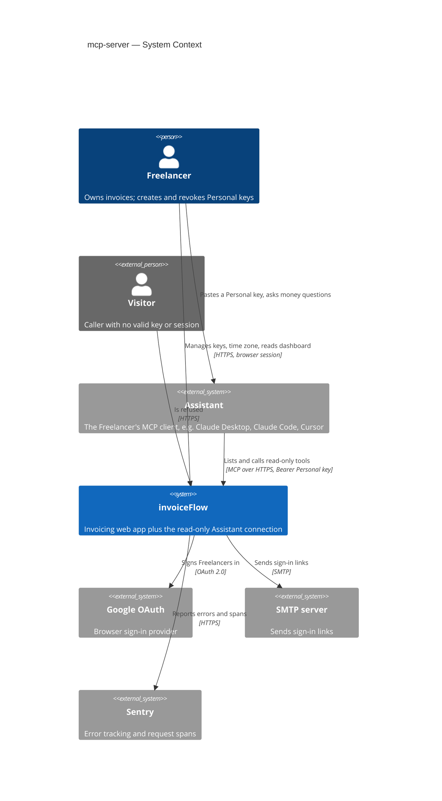
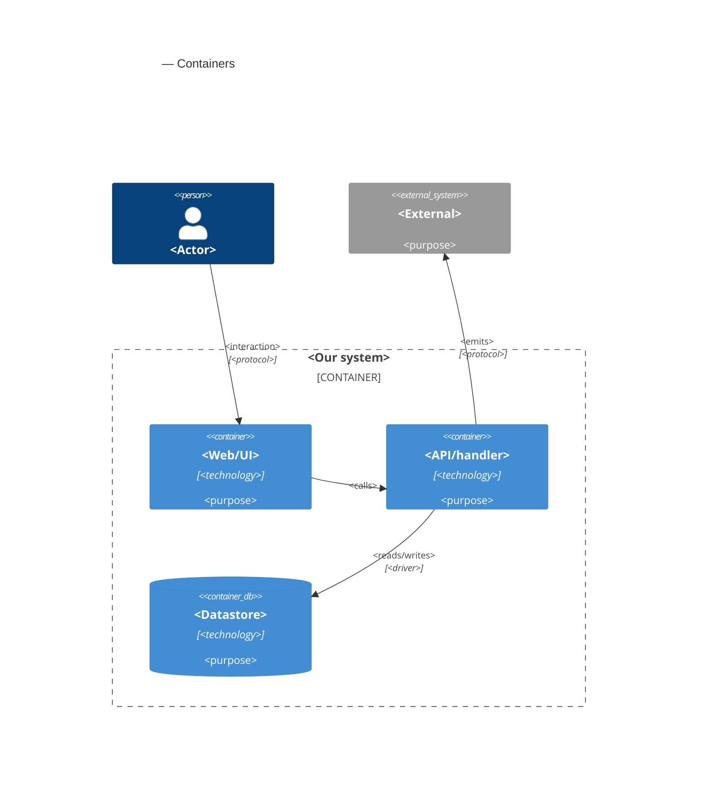

# Software Architecture Document — mcp-server

<!-- 12 Arc42 sections. Empty section → <!-- N/A: <one-line reason> -->. -->
<!-- C4 Context (L1) lives inline in §3. C4 Container (L2) lives inline in §5. -->
<!-- Numbers in §10 come VERBATIM from spec.md §6 NFR — no inventing, no rounding. -->

## 1. Introduction and goals

**Intent.** A read-only Model Context Protocol (MCP) server inside invoiceFlow that lets a Freelancer's own AI assistant answer money questions — who is overdue, which Debtors owe what, which Expected payments fall in a period, the per-currency summary figures, customers, invoice search and one invoice — authenticated by a named, revocable Personal key and never by a browser session. Around it the feature ships the "Connect your AI" page (create, list, revoke keys), the Freelancer time zone saved on the account, and one shared overdue rule computed at read time, so that **an Assistant's numbers always match the dashboard** (spec §1, §2). Primary users are solo freelancers and small agency owners using a desktop or IDE assistant; technical Freelancers scripting against the same key are served but not designed for first.

**Top-3 quality goals (1-liners; full scenarios in §10):**

1. **Dashboard parity** — every figure an Assistant receives equals the dashboard to the cent, because both apply one overdue rule and one Freelancer time zone.
2. **Tenant isolation and credential safety** — a Personal key reads only its own Freelancer's data, never writes, stops working on the first call after revocation, refuses uniformly, and the call limiter fails closed.
3. **Responsiveness at realistic scale** — list and single-record answers within the spec's p95 budget, aggregates within budget for a Freelancer with 5,000 invoices, and the dashboard not measurably slowed by the new overdue rule.

**Stakeholders.**

| Role | Interest | Sign-off owner? |
|---|---|---|
| Freelancer | Connects an Assistant, manages Personal keys, reads the dashboard whose overdue rule and time zone change | No |
| Assistant | Calls the read-only tools on behalf of exactly one Freelancer with a Personal key | No |
| Visitor | Any caller without a valid key or session — must be refused and learn nothing | No |
| Security Lead | New credential type, new authentication boundary, exception to the anonymous-request refusal (spec §6.1 "Security review: Required") | Yes |
| Tech Lead | SAD approval | Yes |

<!-- Decision overrides (¶4) — populated by the critic resolution loop, empty otherwise. -->

## 2. Constraints

**Technical.**
- TypeScript 5 (strict) on Node.js, pnpm 10.
- Next.js 16.3 App Router (route handlers on the Node.js runtime), React 19, next-auth 5 beta (JWT sessions), zod 3.
- PostgreSQL via Prisma 7 + `@prisma/adapter-pg`; split schema in `prisma/schema/{base,auth,invoice}.prisma`; migrations by `prisma migrate`.
- Hosted on Vercel, single region `iad1` (`vercel.json`); one daily cron (`/api/cron/purge-limits`).
- Business logic is reachable only through `lib/services/*`, every function taking a branded `ActingFreelancer { userId, timeZone }` first (service-layer ADR-0001), isolated behind `server-only` + lint rules (service-layer ADR-0006); dashboard aggregates are parameterized raw SQL (service-layer ADR-0004); lists return the shared page-number envelope (service-layer ADR-0005).
- Tests: vitest (unit / component / contract) + an integration config on throwaway Postgres containers (testcontainers).

**Organisational.**
- No external deadline — the motivation is product direction (spec §1).
- Size M (`docs/features/mcp-server/.size`), route `standard`.
- Team: one developer (Dmytro Hopko) working with AI agents through the SDD pipeline.

**Conventions.**
- `docs/architecture-map.md` §Conventions (note: the map predates `service-layer` / `security-patch` / `architecture-hardening`; the ADRs below are authoritative where they differ).
- Results: `ActionResult<T>` with typed codes `UNAUTHORIZED | NOT_FOUND | VALIDATION | CONFLICT | FAILED | RATE_LIMITED` (`types/result.ts`); writes scoped by owner in the `WHERE` clause (service-layer ADR-0003).
- Proxy: deny by default with a public allowlist, covering `/api` (architecture-hardening ADR-0001); anonymous non-read methods refused before the public-path check (security-patch ADR-0003).
- Limits: exact sliding windows over a Postgres event log under a per-key advisory lock (security-patch ADR-0002), purged daily (security-patch ADR-0007).
- Calendar dates and the 5-year period rule shared across layers (security-patch ADR-0004); account deletion in one explicit transaction keeping `RESTRICT` foreign keys (architecture-hardening ADR-0007).
- IDs: `cuid()` strings on every domain model.

**Regulatory / external.**
- Data classification Confidential (spec §6.1); a Personal key is a credential to it.
- Personal-key records and weekly usage aggregates are listed in the data export and removed with the account (spec §6.1, AC-25, AC-26).
- `/security-review` is mandatory before ship (spec §6.1).

## 3. Context and scope

invoiceFlow gains a new kind of caller: the Freelancer's own AI assistant (an MCP client such as Claude Desktop, Claude Code or Cursor), which reaches one new endpoint with a Personal key instead of a browser session and only ever reads. The Freelancer keeps using invoiceFlow in the browser, where they create and revoke keys, set their time zone, and see the dashboard that now applies the same overdue rule the Assistant sees. Nothing leaves invoiceFlow on the Assistant's behalf — no email, no outbound call (spec §3).

<!-- brownfield: Next.js 16 monolith on Vercel; lib/services business layer with ActingFreelancer; proxy deny-by-default over /api; Postgres-backed limits; tz cookie (ADR-0010) to be superseded; no MCP SDK yet (explorer scan at 3acdeb6; architecture-map.md reflects ded1be7 and is stale) -->

**External systems (in / out):**

| Actor or system | Type | Interaction |
|---|---|---|
| Freelancer | Person | Uses the web app; creates, names and revokes Personal keys; sets the time zone; pastes a key into their assistant |
| Assistant (the Freelancer's MCP client) | System (external) | Lists and calls read-only tools over MCP / HTTPS, presenting a Personal key on every call; never holds a session |
| Visitor | Person (external) | Any caller without a valid key or session — refused, learns nothing |
| Google OAuth | System (external) | Existing browser sign-in provider (unchanged) |
| SMTP server | System (external) | Existing sign-in-link email (unchanged) |
| Sentry | System (external) | Error tracking and request spans — the measurement source for the latency and failure-rate NFRs |

External: no new third-party system in v1 — deliberate (the read-only scope sends nothing out).

**C4 Context (L1):**



## 4. Solution strategy

**Target surfaces:** `backend-service` (the MCP endpoint) + `web-frontend` (the "Connect your AI" page, the time-zone setting, overdue states on existing screens) → ADR-0001. Both ship from the one Next.js deployable.

**Top strategic choices (the seeds for ADRs):**

1. **A thin, stateless MCP adapter over the existing business layer** — the Assistant connection is a route handler (`app/api/mcp`) hosting the official MCP SDK in stateless Streamable HTTP mode; each tool validates its input, calls an existing or new `lib/services` function with an `ActingFreelancer`, and shapes the answer. No business rule lives in the adapter, so the dashboard and the Assistant read the same queries (quality goals 1 and 3; ADR-0002).
2. **The Personal key is its own authentication boundary** — exactly one proxy exception (`/api/mcp`), a handler that reads only the `Authorization: Bearer` header and never cookies, keys stored as SHA-256 digests of `ifk_`-prefixed random secrets, and a database check on every call with no cache, so revocation is immediate and refusals are uniform (quality goal 2; ADR-0003, ADR-0004).
3. **One overdue rule and one "today" for every surface** — the Freelancer time zone moves from the browser cookie to the account, and overdue is computed at read time by one shared rule module used by the dashboard, invoice list, customer page, invoice page and every tool; stored statuses never change (quality goal 1; ADR-0005, ADR-0006 — supersedes architecture-hardening ADR-0010).
4. **Reuse the Postgres limit log, fail closed** — per-key and per-source limits are new scopes in the existing `LimitEvent` sliding-window log; any limit-store failure refuses the call (quality goal 2; ADR-0007).

**UI architecture (web-frontend):** unchanged — Next.js App Router with React Server Components and server actions, composed from the existing shadcn/ui primitives and tokens (`docs/design-system.md`); the connect page follows the Settings sub-page precedent and the list/CRUD precedents in `architecture-map.md` §Frontend. No ADR: the only alternative (a client-side SPA) contradicts the repo's established stack.

Each tactical decision in later sections should trace to one of these seeds. Tactical decisions that *contradict* a strategic choice are red flags — surface them in §11.

## 5. Building block view

<!-- 🎯 Why: INTERNAL DECOMPOSITION — modules, containers, datastores. The static topology: who
     may talk to whom. Without §5, §6 (the flows) has no vocabulary of participants.
     📋 Write: 1 ¶ on the style (layered / hexagonal / clean / event-driven) + a folder tree + a
     C4Container block.
     📌 Draw ONE Container per declared `target_surface` (frontmatter): a fullstack
     [backend-service, web-frontend] = a backend-API container + a web/SPA container; a
     [backend-service, mobile-app] = the API + the mobile app. The Container(web, …) line below is
     just one surface's container — swap/add per what was declared in §4. → _shared/surfaces.md
     📌 e.g. «web app, content API, media worker, datastore, object store, CDN». -->

<One paragraph: layered / hexagonal / clean / event-driven, and why.>

**Internal decomposition:**

```
<e.g. modules/<feature>/>
├── domain/       <entities + sentinel errors>
├── app/          <use cases / services>
├── infra/        <repository + integration impl>
├── ports/        <handlers, DTOs, error mapping>
└── wiring        <self-wiring entry point>
```

**C4 Container (L2):** <!-- syntax → references/c4-mermaid-syntax.md. Real names, no <placeholder> stubs. ONE Container per declared target_surface (frontmatter); the web container below is one example surface. -->



## 6. Runtime view

<!-- 🎯 Why: the RUNTIME FLOW of 1–2 critical scenarios — who talks to whom, when, in what order.
     Without §6, §5 is just boxes with no life.
     📋 Write: a Mermaid sequenceDiagram. Participants are names from §5 (don't invent new ones).
     Messages are semantic («saves a draft»), NO HTTP verbs / paths / status codes — endpoint-level
     sequences arrive at the `api` stage.
     📌 e.g. «author → web: composes draft → web → content API: save». Seed the primary flow(s) here;
     the `sequences` stage then covers every §5 AC (no cap). Never N/A for M+; XS/S keeps ≥1 happy-path flow. -->

**Critical flow 1: <flow name>**

```mermaid
sequenceDiagram
    actor Actor
    participant Web
    participant Service
    participant Store
    Actor->>Web: <action>
    Web->>Service: <call>
    Service->>Store: <write>
    Store-->>Service: ok
    Service-->>Web: result
    Web-->>Actor: confirmation
```

**Critical flow 2: <e.g. async event propagation>** — <if applicable, otherwise N/A>.

## 7. Deployment view

<!-- 🎯 Why: the TOPOLOGY DevOps must know without reading the deploy charts — how many replicas,
     where the background worker lives, AT WHAT NUMBERS we scale.
     📋 Write: 2–3 sentences on topology + monitoring + concrete threshold numbers.
     📌 e.g. «500 authors → partition by quarter» (not «we'll think about scale later»).
     🎯 N/A allowed for XS/S that reuses an existing deployment unit with no change.
     Deployment-diagram scaffold → templates/deployment.md. -->

<Topology in 2–3 sentences. Where it runs, replicas, scaling thresholds.>

**Monitoring:**
- <Metrics — e.g. `<metric_name>`>
- <Alerts — e.g. «worker lag > 10 min → page on-call»>
- <Tracing — e.g. spans on the request boundary>

**Scaling thresholds:**
- <e.g. comfortable in one table up to N rows/year>
- <e.g. partition by quarter above N rows/year>

<!-- For XS/S with no deployment change: <!-- N/A: reuses existing deployment unit, no infra change --> -->

## 8. Crosscutting concepts

<!-- 🎯 Why: CROSS-CUTTING PATTERNS spanning several modules: logging, errors, authorization, ID
     strategy, events, caching. ⭐ The second-densest section. A pattern inside one module is NOT
     here; a project-wide convention belongs in the convention file.
     📋 Write: a table — concept / convention / where defined. One row per concept.
     📌 e.g. «sortable time-based IDs generated in the app layer» as a default from the convention file. -->

| Concept | Convention | Where defined |
|---|---|---|
| Logging | <e.g. structured, fields `module=<name>`> | <convention file §X or here> |
| Authentication | <e.g. token-based via middleware> | <convention file §X> |
| Error handling | <e.g. domain sentinel → ports error mapping → JSON> | <convention file §X> |
| ID strategy | <e.g. sortable time-based ID in the app layer> | <convention file §X> |
| Internationalisation | <e.g. N/A, single language> | — |
| Observability | <e.g. tracing on the request boundary> | — |
| Events | <module-specific patterns, if any> | <here> |

## 9. Architecture decisions

<!-- 🎯 Why: the REVERSE INDEX onto the adr/ folder. `ls adr/` gives the files; §9 gives the
     semantics — why they exist, which SAD section they attach to, what status.
     📋 Write: a 4-column table, one row per ADR. Mixed status is fine.
     📌 e.g. «0001 | Store content as a table of typed blocks | Accepted | §4». -->

| # | Title | Status | Section |
|---|---|---|---|
| <NNNN> | <imperative — e.g. "Use a sliding-window counter for rate limiting"> | Accepted | §<N> |
| <NNNN> | <imperative — e.g. "Co-locate the worker in the API process"> | Accepted | §<N> |

ADR files live under `docs/features/<slug>/adr/NNNN-<title>.md`.

## 10. Quality requirements

<!-- 🎯 Why: the QUALITY TREE — take a goal from §1 and break it into concrete leaves: tests,
     metrics, configs, drills. ⭐ Without §10, §1 is a manifesto. With §10 each declaration maps
     to something PROVABLE.
     📋 Write: per §1 goal — When / Then / How-verify. Numbers from spec §6 NFR VERBATIM (don't
     round ≤250ms to ≤300ms — that's a critic F6 hit).
     📌 e.g. «p95 ≤ 500 ms on a block update, verified by a 100 req/s load test». -->

Each top-3 goal from §1 expanded into a full scenario:

**QG-1. <quality attribute>**
- **When:** <trigger condition>
- **Then:** <expected behaviour with numbers from spec §6 NFR>
- **How verify:** <test / chaos drill / load test / metric>

**QG-2. <quality attribute>**
- **When:** <trigger>
- **Then:** <expected>
- **How verify:** <how>

**QG-3. <quality attribute>**
- **When:** <trigger>
- **Then:** <expected>
- **How verify:** <how>

## 11. Risks and technical debt

<!-- 🎯 Why: ⭐ collects EVERYTHING that can break — not only the technical. Without §11 risks get
     discussed at standups and lost; debt lives only in the head of whoever accepted it.
     📋 Write: a risk/debt table — severity — mitigation — owner. Accepted debt in its own block.
     📌 The first risk is often a product risk, not a technical one. That's normal. -->

<!-- Severity literals: Low / Medium / High for regular risks; "Open question" for rows created by
     a Save-as-OQ resolution during the Socratic walk (see references/socratic.md). -->

| Risk / debt | Severity | Mitigation | Owner |
|---|---|---|---|
| <e.g. Worker lag may reach hours during a downstream outage> | Medium | <alert >10 min, on-call playbook, retry backoff> | <DevOps> |
| <e.g. No event-schema versioning in v1> | Medium | <ADR-NNNN planned for v2, tolerate unknown fields> | <Backend> |
| Open architectural decision: <decision-headline> | Open question | Resolve before <stage trigger or YYYY-MM-DD>; <inline rationale from the Save-as-OQ> | <owner> |

**Accepted debt (acceptable in v1, plan to fix later):**
- <e.g. the entity is immutable / unversioned — OK for v1, may need audit versioning in v2>

## 12. Glossary

<!-- 🎯 Why: ⭐ the DOMAIN GLOSSARY that ends arguments a year later («checkpoint — weekly or
     biweekly? quarter — calendar or fiscal?»).
     📋 Write: a term / meaning table. Business + technical terms mixed.
     📌 e.g. «Lesson | a unit inside a course made of blocks (text, video)». -->

| Term | Meaning |
|---|---|
| <e.g. domain object A> | <its meaning in this domain> |
| <e.g. domain object B> | <its meaning> |
| <e.g. domain invariant name> | <the rule, in plain language> |
