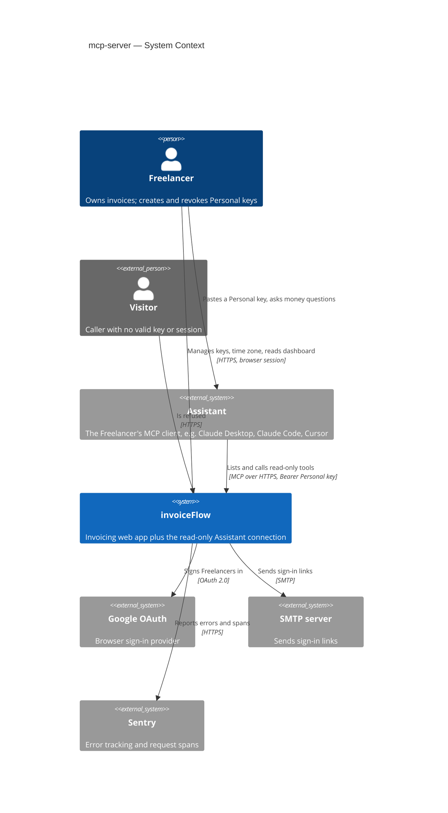
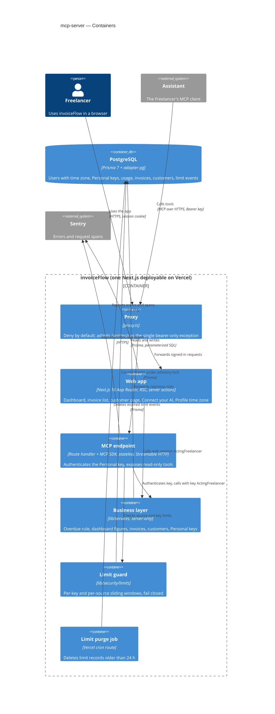
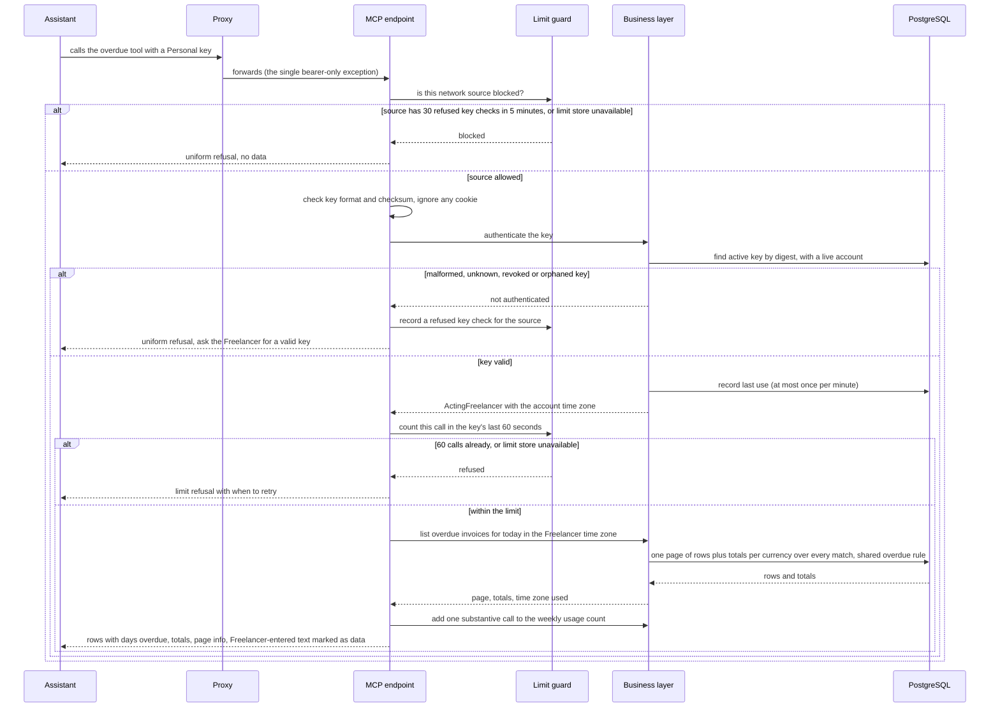
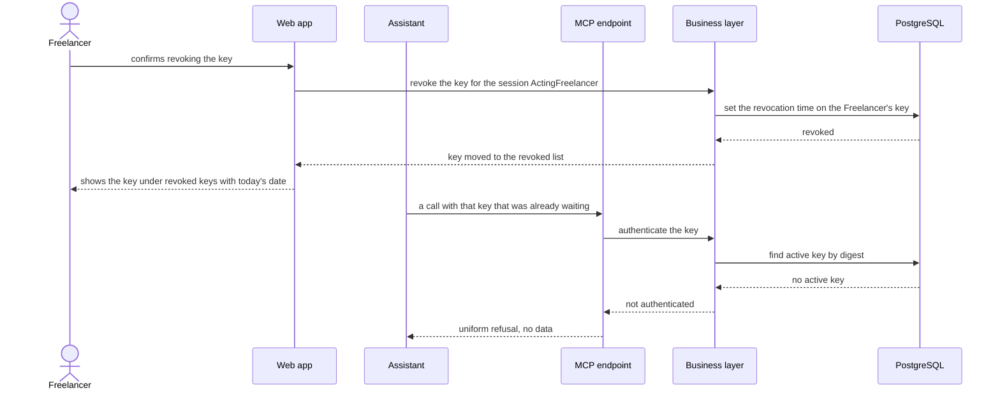

# Software Architecture Document — mcp-server

<!-- 12 Arc42 sections. Empty section → <!-- N/A: <one-line reason> -->. -->
<!-- C4 Context (L1) lives inline in §3. C4 Container (L2) lives inline in §5. -->
<!-- Numbers in §10 come VERBATIM from spec.md §6 NFR — no inventing, no rounding. -->

## 1. Introduction and goals

**Intent.** A read-only Model Context Protocol (MCP) server inside invoiceFlow that lets a Freelancer's own AI assistant answer money questions — who is overdue, which Debtors owe what, which Expected payments fall in a period, the per-currency summary figures, customers, invoice search and one invoice — authenticated by a named, revocable Personal key and never by a browser session. Around it the feature ships the "Connect your AI" page (create, list, revoke keys), the Freelancer time zone saved on the account, and one shared overdue rule computed at read time, so that **an Assistant's numbers always match the dashboard** (spec §1, §2). Primary users are solo freelancers and small agency owners using a desktop or IDE assistant; technical Freelancers scripting against the same key are served but not designed for first.

**Top-3 quality goals (1-liners; full scenarios in §10):**

1. **Dashboard parity** — every figure an Assistant receives equals the dashboard to the cent, because both apply one overdue rule and one Freelancer time zone.
2. **Tenant isolation and credential safety** — a Personal key reads only its own Freelancer's data, never writes, stops working on the first call after revocation, refuses uniformly, and the call limiter fails closed.
3. **Responsiveness at realistic scale** — list and single-record answers within the spec's p95 budget, aggregates within budget for a Freelancer with 5,000 invoices, and the dashboard not measurably slowed by the new overdue rule.

**Stakeholders.**

| Role | Interest | Sign-off owner? |
|---|---|---|
| Freelancer | Connects an Assistant, manages Personal keys, reads the dashboard whose overdue rule and time zone change | No |
| Assistant | Calls the read-only tools on behalf of exactly one Freelancer with a Personal key | No |
| Visitor | Any caller without a valid key or session — must be refused and learn nothing | No |
| Security Lead | New credential type, new authentication boundary, exception to the anonymous-request refusal (spec §6.1 "Security review: Required") | Yes |
| Tech Lead | SAD approval | Yes |

<!-- Decision overrides (¶4) — populated by the critic resolution loop, empty otherwise. -->

## 2. Constraints

**Technical.**
- TypeScript 5 (strict) on Node.js, pnpm 10.
- Next.js 16.3 App Router (route handlers on the Node.js runtime), React 19, next-auth 5 beta (JWT sessions), zod 3.
- PostgreSQL via Prisma 7 + `@prisma/adapter-pg`; split schema in `prisma/schema/{base,auth,invoice}.prisma`; migrations by `prisma migrate`.
- Hosted on Vercel, single region `iad1` (`vercel.json`); one daily cron (`/api/cron/purge-limits`).
- Business logic is reachable only through `lib/services/*`, every function taking a branded `ActingFreelancer { userId, timeZone }` first (service-layer ADR-0001), isolated behind `server-only` + lint rules (service-layer ADR-0006); dashboard aggregates are parameterized raw SQL (service-layer ADR-0004); lists return the shared page-number envelope (service-layer ADR-0005).
- Tests: vitest (unit / component / contract) + an integration config on throwaway Postgres containers (testcontainers).

**Organisational.**
- No external deadline — the motivation is product direction (spec §1).
- Size M (`docs/features/mcp-server/.size`), route `standard`.
- Team: one developer (Dmytro Hopko) working with AI agents through the SDD pipeline.

**Conventions.**
- `docs/architecture-map.md` §Conventions (note: the map predates `service-layer` / `security-patch` / `architecture-hardening`; the ADRs below are authoritative where they differ).
- Results: `ActionResult<T>` with typed codes `UNAUTHORIZED | NOT_FOUND | VALIDATION | CONFLICT | FAILED | RATE_LIMITED` (`types/result.ts`); writes scoped by owner in the `WHERE` clause (service-layer ADR-0003).
- Proxy: deny by default with a public allowlist, covering `/api` (architecture-hardening ADR-0001); anonymous non-read methods refused before the public-path check (security-patch ADR-0003).
- Limits: exact sliding windows over a Postgres event log under a per-key advisory lock (security-patch ADR-0002), purged daily (security-patch ADR-0007).
- Calendar dates and the 5-year period rule shared across layers (security-patch ADR-0004); account deletion in one explicit transaction keeping `RESTRICT` foreign keys (architecture-hardening ADR-0007).
- IDs: `cuid()` strings on every domain model.

**Regulatory / external.**
- Data classification Confidential (spec §6.1); a Personal key is a credential to it.
- Personal-key records and weekly usage aggregates are listed in the data export and removed with the account (spec §6.1, AC-25, AC-26).
- `/security-review` is mandatory before ship (spec §6.1).

## 3. Context and scope

invoiceFlow gains a new kind of caller: the Freelancer's own AI assistant (an MCP client such as Claude Desktop, Claude Code or Cursor), which reaches one new endpoint with a Personal key instead of a browser session and only ever reads. The Freelancer keeps using invoiceFlow in the browser, where they create and revoke keys, set their time zone, and see the dashboard that now applies the same overdue rule the Assistant sees. Nothing leaves invoiceFlow on the Assistant's behalf — no email, no outbound call (spec §3).

<!-- brownfield: Next.js 16 monolith on Vercel; lib/services business layer with ActingFreelancer; proxy deny-by-default over /api; Postgres-backed limits; tz cookie (ADR-0010) to be superseded; no MCP SDK yet (explorer scan at 3acdeb6; architecture-map.md reflects ded1be7 and is stale) -->

**External systems (in / out):**

| Actor or system | Type | Interaction |
|---|---|---|
| Freelancer | Person | Uses the web app; creates, names and revokes Personal keys; sets the time zone; pastes a key into their assistant |
| Assistant (the Freelancer's MCP client) | System (external) | Lists and calls read-only tools over MCP / HTTPS, presenting a Personal key on every call; never holds a session |
| Visitor | Person (external) | Any caller without a valid key or session — refused, learns nothing |
| Google OAuth | System (external) | Existing browser sign-in provider (unchanged) |
| SMTP server | System (external) | Existing sign-in-link email (unchanged) |
| Sentry | System (external) | Error tracking and request spans — the measurement source for the latency and failure-rate NFRs |

External: no new third-party system in v1 — deliberate (the read-only scope sends nothing out).

**C4 Context (L1):**



## 4. Solution strategy

**Target surfaces:** `backend-service` (the MCP endpoint) + `web-frontend` (the "Connect your AI" page, the time-zone setting, overdue states on existing screens) → ADR-0001. Both ship from the one Next.js deployable.

**Top strategic choices (the seeds for ADRs):**

1. **A thin, stateless MCP adapter over the existing business layer** — the Assistant connection is a route handler (`app/api/mcp`) hosting the official MCP SDK in stateless Streamable HTTP mode; each tool validates its input, calls an existing or new `lib/services` function with an `ActingFreelancer`, and shapes the answer. No business rule lives in the adapter, so the dashboard and the Assistant read the same queries (quality goals 1 and 3; ADR-0002).
2. **The Personal key is its own authentication boundary** — exactly one proxy exception (`/api/mcp`), a handler that reads only the `Authorization: Bearer` header and never cookies, keys stored as SHA-256 digests of `ifk_`-prefixed random secrets, and a database check on every call with no cache, so revocation is immediate and refusals are uniform (quality goal 2; ADR-0003, ADR-0004).
3. **One overdue rule and one "today" for every surface** — the Freelancer time zone moves from the browser cookie to the account, and overdue is computed at read time by one shared rule module used by the dashboard, invoice list, customer page, invoice page and every tool; stored statuses never change (quality goal 1; ADR-0005, ADR-0006 — supersedes architecture-hardening ADR-0010).
4. **Reuse the Postgres limit log, fail closed** — per-key and per-source limits are new scopes in the existing `LimitEvent` sliding-window log; any limit-store failure refuses the call (quality goal 2; ADR-0007).

**UI architecture (web-frontend):** unchanged — Next.js App Router with React Server Components and server actions, composed from the existing shadcn/ui primitives and tokens (`docs/design-system.md`); the connect page follows the Settings sub-page precedent and the list/CRUD precedents in `architecture-map.md` §Frontend. No ADR: the only alternative (a client-side SPA) contradicts the repo's established stack.

Each tactical decision in later sections should trace to one of these seeds. Tactical decisions that *contradict* a strategic choice are red flags — surface them in §11.

## 5. Building block view

The feature follows the repo's layered convention: thin entry points (RSC pages, server actions, route handlers) over one business layer (`lib/services`, `server-only`, every function taking an `ActingFreelancer` first — service-layer ADR-0001, ADR-0006) over Prisma/PostgreSQL. The MCP endpoint is one more entry point of the same kind: a ports-style adapter that validates tool input, calls `lib/services`, and shapes the answer — it holds no business rule, so every figure an Assistant gets comes from the same function the dashboard calls (ADR-0002). The Assistant reads are added to the existing `dashboard`, `invoices` and `customers` services rather than to a parallel "assistant" service, because parity is cheapest when there is only one query.

**Internal decomposition:**

```
app/
├── api/mcp/route.ts                   NEW  POST-only MCP endpoint (stateless Streamable HTTP); bearer key → ActingFreelancer
└── (protected)/settings/assistants/   NEW  "Connect your AI" page (SCR-03) — Settings sub-page beside profile/privacy
lib/
├── mcp/                               NEW  adapter layer — imports only lib/services + lib/security/limits
│   ├── server.ts                           builds the MCP server per request, registers the read-only tools
│   ├── authenticate.ts                     source limit → key format/checksum → key lookup → key limit → last use
│   ├── tools/                              one file per tool: overdue, debtors, expected-payments, summary, customers, search, invoice
│   └── answers.ts                          page/total/time-zone envelope, Freelancer-entered-text marking, refusal messages
├── services/
│   ├── _shared/acting-freelancer.ts   EXT  + actingFreelancerFromPersonalKey(); both factories read the account time zone (ADR-0006)
│   ├── _shared/overdue.ts             NEW  the one overdue rule: SQL fragment, Prisma condition, TS predicate (ADR-0005)
│   ├── personal-keys/                 NEW  create / list / revoke / authenticate / record use / weekly usage / export rows
│   ├── dashboard/                     EXT  overdue rule in every figure; paginated Debtors; Expected payments by period
│   ├── invoices/                      EXT  overdue rule in list filters and status; Assistant search; one invoice by reference
│   ├── customers/                     EXT  name match over current and invoice-copied names
│   ├── profile/                       EXT  read/save the Freelancer time zone; first-visit seed
│   └── account/                       EXT  delete keys + usage in the existing deletion transaction; export rows
└── security/limits/                   EXT  two new scopes: per-key calls, per-source refused key checks (ADR-0007)
config/routes.config.ts                EXT  /api/mcp as the single bearer-only exception (ADR-0003)
components/assistants/                 NEW  key list, create form, one-time key reveal, setup steps, example prompts
prisma/schema/auth.prisma              EXT  User.timeZone, PersonalKey, weekly usage aggregate (shape owned by data-model)
```

**C4 Container (L2):**



## 6. Runtime view

Messages are semantic; endpoint shapes arrive at the `api` stage. Participants are the §5 containers. These two flows seed the runtime view; `sequences` covers every remaining §5 AC.

**Critical flow 1: an Assistant asks for overdue invoices (key check, limits, answer)**



**Critical flow 2: revoking a key while an Assistant call is waiting**



## 7. Deployment view

The feature runs inside the existing Vercel project in region `iad1`: `/api/mcp` is one more Node.js serverless function of the same Next.js deployable, scaled per request by Vercel with no sticky sessions (ADR-0002). No new infrastructure, environment setting, region or cron job — the existing daily `/api/cron/purge-limits` job (security-patch ADR-0007) also purges the two new limit scopes. The public MCP URL is `https://<app origin>/api/mcp`; preview deployments expose the same path for testing.

**Monitoring:**
- Sentry spans on every MCP request, named by tool (`mcp.tools/call <tool>`, `mcp.tools/list`) — the source for the spec §6 latency targets (p95 ≤ 800 ms lists and single records, ≤ 1.5 s aggregates) and the dashboard-span comparison (no more than 10 % slower than the 7 days before release).
- Counted outcomes per call: success, refused-key, refused-source, refused-limit, limit-store-unavailable, server-error — the source for the ≤ 1 % weekly server-side failure rate and the §7 KPIs.
- Alert: any `limit-store-unavailable` outcome in production (every Assistant call is being refused) → notify the owner.
- Alert: server-side failure rate over 1 % of Assistant calls in a rolling day → notify the owner (early warning for the weekly target).

**Scaling thresholds:**
- `LimitEvent` grows by at most 60 rows per active key per minute and is purged daily; comfortable while daily rows stay under ~5 million — beyond that, or if the limit check exceeds 50 ms p95, revisit a dedicated counter store (ADR-0007 neutral consequence).
- Personal keys: at most 10 active per Freelancer (AC-04); the key table stays small and is read by a unique digest index.
- Aggregates are bounded by the per-Freelancer invoice count; the spec budget is set at 5,000 invoices per Freelancer — above that, revisit indexes on `(userId, status, dueDate)` at the `data-model` stage.

## 8. Crosscutting concepts

| Concept | Convention | Where defined |
|---|---|---|
| Logging | Repo default — `console.error` inside `try/catch`, errors to Sentry in production. **Never** log or report the `Authorization` header, a key, a key digest, or answer bodies; Sentry scrubbing extends to request headers on `/api/mcp`. | `docs/architecture-map.md` §Conventions; here |
| Authentication | Two trusted `ActingFreelancer` factories: session (web) and Personal key (MCP). `/api/mcp` reads only `Authorization: Bearer` and never cookies; a key never creates a session (AC-09). Key check on every call, no cache (0 s revocation). | service-layer ADR-0001; ADR-0003, ADR-0004 |
| Authorization | Every read scoped by the acting Freelancer's id in its own `WHERE`; another Freelancer's record is answered exactly like a missing one (AC-08). No write tool is registered (AC-10). | service-layer ADR-0003; here |
| Error handling | Services return `ActionResult` with typed codes. The adapter maps them: key/source/limit refusals are request-level refusals with a plain-language message (limit refusals say when to retry); `VALIDATION` / `NOT_FOUND` / ambiguity become tool errors that explain what to ask. Refusals are uniform and never reveal whether a key existed (AC-07). | `types/result.ts`; architecture-hardening ADR-0009; exact shapes at `api` |
| Rate limiting | Per key: 60 calls in the most recent 60 s, counting every call that passed the key check, tool listings included, limit refusals excluded. Per source: 30 refused key checks in 5 min, then refused before any key check. Fail closed. | ADR-0007; security-patch ADR-0002 |
| Overdue rule | One rule module used by every surface; stored statuses never change; "Mark as overdue" / "back to pending" not offered for derived-overdue invoices. | ADR-0005 |
| Time zone and dates | "Today", day and period bounds use the account time zone (UTC until saved); due dates are calendar days compared without shift; periods follow the shared calendar-date / 5-year rule; every Assistant answer names the time zone and period bounds it used. | ADR-0006; security-patch ADR-0004 |
| Pagination and completeness | Shared page-number envelope. Assistant answers: default 20, maximum 50 rows; a larger request is capped and says so; totals and counts always cover the full match set; a page past the end returns no rows and the last page number, never an earlier page (AC-18, AC-18b). | service-layer ADR-0005; here |
| Money | Totals and counts come from the same queries the dashboard uses; reported per currency, never converted, formatted to the cent. | service-layer ADR-0004; architecture-hardening ADR-0006 |
| Untrusted text | Every Freelancer-entered text field in an answer (notes, line descriptions, product names, customer names and addresses, payment terms) is wrapped in a marked structure the tool descriptions declare as data, not instructions (AC-19b). Exact shape at `api`. | here |
| Data minimisation | No bank account number or IBAN in any answer (AC-19); invoices are returned as stored (copied sender/customer details). | here |
| ID strategy | `cuid()` for new models; answers expose record ids so later calls can reference them; invoice numbers are matched within a sender profile, ambiguity returns candidates (AC-20). | repo default |
| Observability | Sentry spans per tool; weekly per-key usage aggregates (counts only, never content) for the §7 KPIs, included in the export and deleted with the account. | spec §6.1, §7; here |
| Caching | None for key checks, figures or lists — revocation must be immediate and figures must match the dashboard at the moment of the call. | here |
| Internationalisation | Answers in English, matching the app's single UI language. | — |

## 9. Architecture decisions

<!-- 🎯 Why: the REVERSE INDEX onto the adr/ folder. `ls adr/` gives the files; §9 gives the
     semantics — why they exist, which SAD section they attach to, what status.
     📋 Write: a 4-column table, one row per ADR. Mixed status is fine.
     📌 e.g. «0001 | Store content as a table of typed blocks | Accepted | §4». -->

| # | Title | Status | Section |
|---|---|---|---|
| <NNNN> | <imperative — e.g. "Use a sliding-window counter for rate limiting"> | Accepted | §<N> |
| <NNNN> | <imperative — e.g. "Co-locate the worker in the API process"> | Accepted | §<N> |

ADR files live under `docs/features/<slug>/adr/NNNN-<title>.md`.

## 10. Quality requirements

<!-- 🎯 Why: the QUALITY TREE — take a goal from §1 and break it into concrete leaves: tests,
     metrics, configs, drills. ⭐ Without §10, §1 is a manifesto. With §10 each declaration maps
     to something PROVABLE.
     📋 Write: per §1 goal — When / Then / How-verify. Numbers from spec §6 NFR VERBATIM (don't
     round ≤250ms to ≤300ms — that's a critic F6 hit).
     📌 e.g. «p95 ≤ 500 ms on a block update, verified by a 100 req/s load test». -->

Each top-3 goal from §1 expanded into a full scenario:

**QG-1. <quality attribute>**
- **When:** <trigger condition>
- **Then:** <expected behaviour with numbers from spec §6 NFR>
- **How verify:** <test / chaos drill / load test / metric>

**QG-2. <quality attribute>**
- **When:** <trigger>
- **Then:** <expected>
- **How verify:** <how>

**QG-3. <quality attribute>**
- **When:** <trigger>
- **Then:** <expected>
- **How verify:** <how>

## 11. Risks and technical debt

<!-- 🎯 Why: ⭐ collects EVERYTHING that can break — not only the technical. Without §11 risks get
     discussed at standups and lost; debt lives only in the head of whoever accepted it.
     📋 Write: a risk/debt table — severity — mitigation — owner. Accepted debt in its own block.
     📌 The first risk is often a product risk, not a technical one. That's normal. -->

<!-- Severity literals: Low / Medium / High for regular risks; "Open question" for rows created by
     a Save-as-OQ resolution during the Socratic walk (see references/socratic.md). -->

| Risk / debt | Severity | Mitigation | Owner |
|---|---|---|---|
| <e.g. Worker lag may reach hours during a downstream outage> | Medium | <alert >10 min, on-call playbook, retry backoff> | <DevOps> |
| <e.g. No event-schema versioning in v1> | Medium | <ADR-NNNN planned for v2, tolerate unknown fields> | <Backend> |
| Open architectural decision: <decision-headline> | Open question | Resolve before <stage trigger or YYYY-MM-DD>; <inline rationale from the Save-as-OQ> | <owner> |

**Accepted debt (acceptable in v1, plan to fix later):**
- <e.g. the entity is immutable / unversioned — OK for v1, may need audit versioning in v2>

## 12. Glossary

<!-- 🎯 Why: ⭐ the DOMAIN GLOSSARY that ends arguments a year later («checkpoint — weekly or
     biweekly? quarter — calendar or fiscal?»).
     📋 Write: a term / meaning table. Business + technical terms mixed.
     📌 e.g. «Lesson | a unit inside a course made of blocks (text, video)». -->

| Term | Meaning |
|---|---|
| <e.g. domain object A> | <its meaning in this domain> |
| <e.g. domain object B> | <its meaning> |
| <e.g. domain invariant name> | <the rule, in plain language> |
