# Software Architecture Document — mcp-server

<!-- 12 Arc42 sections. Empty section → <!-- N/A: <one-line reason> -->. -->
<!-- C4 Context (L1) lives inline in §3. C4 Container (L2) lives inline in §5. -->
<!-- Numbers in §10 come VERBATIM from spec.md §6 NFR — no inventing, no rounding. -->

## 1. Introduction and goals

**Intent.** A read-only Model Context Protocol (MCP) server inside invoiceFlow that lets a Freelancer's own AI assistant answer money questions — who is overdue, which Debtors owe what, which Expected payments fall in a period, the per-currency summary figures, customers, invoice search and one invoice — authenticated by a named, revocable Personal key and never by a browser session. Around it the feature ships the "Connect your AI" page (create, list, revoke keys), the Freelancer time zone saved on the account, and one shared overdue rule computed at read time, so that **an Assistant's numbers always match the dashboard** (spec §1, §2). Primary users are solo freelancers and small agency owners using a desktop or IDE assistant; technical Freelancers scripting against the same key are served but not designed for first.

**Top-3 quality goals (1-liners; full scenarios in §10):**

1. **Dashboard parity** — every figure an Assistant receives equals the dashboard to the cent, because both apply one overdue rule and one Freelancer time zone.
2. **Tenant isolation and credential safety** — a Personal key reads only its own Freelancer's data, never writes, stops working on the first call after revocation, refuses uniformly, and the call limiter fails closed.
3. **Responsiveness at realistic scale** — list and single-record answers within the spec's p95 budget, aggregates within budget for a Freelancer with 5,000 invoices, and the dashboard kept within its 10 % slowdown budget after the new overdue rule.

**Stakeholders.**

| Role | Interest | Sign-off owner? |
|---|---|---|
| Freelancer | Connects an Assistant, manages Personal keys, reads the dashboard whose overdue rule and time zone change | No |
| Assistant | Calls the read-only tools on behalf of exactly one Freelancer with a Personal key | No |
| Visitor | Any caller without a valid key or session — must be refused and learn nothing | No |
| Security Lead | New credential type, new authentication boundary, exception to the anonymous-request refusal (spec §6.1 "Security review: Required") | Yes |
| Tech Lead | SAD approval | Yes |

<!-- Decision overrides (¶4) — populated by the critic resolution loop, empty otherwise. -->

## 2. Constraints

**Technical.**
- TypeScript 5 (strict) on Node.js, pnpm 10.
- Next.js 16.3 App Router (route handlers on the Node.js runtime), React 19, next-auth 5 beta (JWT sessions), zod 3.
- PostgreSQL via Prisma 7 + `@prisma/adapter-pg`; split schema in `prisma/schema/{base,auth,invoice}.prisma`; migrations by `prisma migrate`.
- Hosted on Vercel, single region `iad1` (`vercel.json`); one daily cron (`/api/cron/purge-limits`).
- Business logic is reachable only through `lib/services/*`, every function taking a branded `ActingFreelancer { userId, timeZone }` first (service-layer ADR-0001), isolated behind `server-only` + lint rules (service-layer ADR-0006); dashboard aggregates are parameterized raw SQL (service-layer ADR-0004); lists return the shared page-number envelope (service-layer ADR-0005).
- Tests: vitest (unit / component / contract) + an integration config on throwaway Postgres containers (testcontainers).

**Organisational.**
- No external deadline — the motivation is product direction (spec §1).
- Size M (`docs/features/mcp-server/.size`), route `standard`.
- Team: one developer (Dmytro Hopko) working with AI agents through the SDD pipeline.

**Conventions.**
- `docs/architecture-map.md` §Conventions (note: the map predates `service-layer` / `security-patch` / `architecture-hardening`; the ADRs below are authoritative where they differ).
- Results: `ActionResult<T>` with typed codes `UNAUTHORIZED | NOT_FOUND | VALIDATION | CONFLICT | FAILED | RATE_LIMITED` (`types/result.ts`); writes scoped by owner in the `WHERE` clause (service-layer ADR-0003).
- Proxy: deny by default with a public allowlist, covering `/api` (architecture-hardening ADR-0001); anonymous non-read methods refused before the public-path check (security-patch ADR-0003).
- Limits: exact sliding windows over a Postgres event log under a per-key advisory lock (security-patch ADR-0002), purged daily (security-patch ADR-0007).
- Calendar dates and the 5-year period rule shared across layers (security-patch ADR-0004); account deletion in one explicit transaction keeping `RESTRICT` foreign keys (architecture-hardening ADR-0007).
- IDs: `cuid()` strings on every domain model.

**Regulatory / external.**
- Data classification Confidential (spec §6.1); a Personal key is a credential to it.
- Personal-key records and weekly usage aggregates are listed in the data export and removed with the account (spec §6.1, AC-25, AC-26).
- `/security-review` is mandatory before ship (spec §6.1).

## 3. Context and scope

invoiceFlow gains a new kind of caller: the Freelancer's own AI assistant (an MCP client such as Claude Desktop, Claude Code or Cursor), which reaches one new endpoint with a Personal key instead of a browser session and only ever reads. The Freelancer keeps using invoiceFlow in the browser, where they create and revoke keys, set their time zone, and see the dashboard that now applies the same overdue rule the Assistant sees. Nothing leaves invoiceFlow on the Assistant's behalf — no email, no outbound call (spec §3).

<!-- brownfield: Next.js 16 monolith on Vercel; lib/services business layer with ActingFreelancer; proxy deny-by-default over /api; Postgres-backed limits; tz cookie (ADR-0010) to be superseded; no MCP SDK yet (explorer scan at 3acdeb6; architecture-map.md reflects ded1be7 and is stale) -->

**External systems (in / out):**

| Actor or system | Type | Interaction |
|---|---|---|
| Freelancer | Person | Uses the web app; creates, names and revokes Personal keys; sets the time zone; pastes a key into their assistant |
| Assistant (the Freelancer's MCP client) | System (external) | Lists and calls read-only tools over MCP / HTTPS, presenting a Personal key on every call; never holds a session |
| Visitor | Person (external) | Any caller without a valid key or session — refused, learns nothing |
| Google OAuth | System (external) | Existing browser sign-in provider (unchanged) |
| SMTP server | System (external) | Existing sign-in-link email (unchanged) |
| Sentry | System (external) | Error tracking and request spans — the measurement source for the latency and failure-rate NFRs |

External: no new third-party system in v1 — deliberate (the read-only scope sends nothing out).

**C4 Context (L1):**

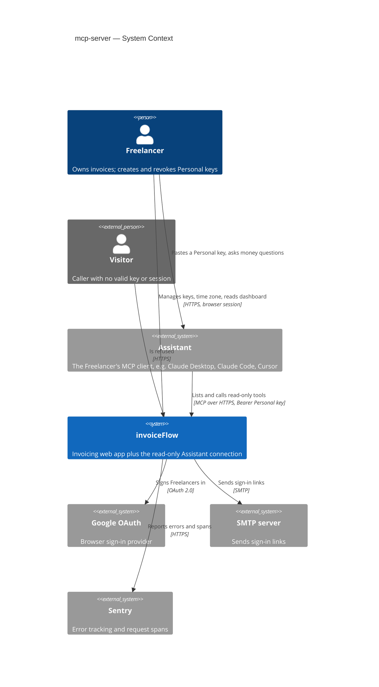

## 4. Solution strategy

**Target surfaces:** `backend-service` (the MCP endpoint) + `web-frontend` (the "Connect your AI" page, the time-zone setting, overdue states on existing screens) → ADR-0001. Both ship from the one Next.js deployable.

**Top strategic choices (the seeds for ADRs):**

1. **A thin, stateless MCP adapter over the existing business layer** — the Assistant connection is a route handler (`app/api/mcp`) hosting the official MCP SDK in stateless Streamable HTTP mode; each tool validates its input, calls an existing or new `lib/services` function with an `ActingFreelancer`, and shapes the answer. No business rule lives in the adapter, so the dashboard and the Assistant read the same queries (quality goals 1 and 3; ADR-0002).
2. **The Personal key is its own authentication boundary** — exactly one proxy exception (`/api/mcp`), a handler that reads only the `Authorization: Bearer` header and never cookies, keys stored as SHA-256 digests of `ifk_`-prefixed random secrets, and a database check on every call with no cache, so revocation is immediate and refusals are uniform (quality goal 2; ADR-0003, ADR-0004).
3. **One overdue rule and one "today" for every surface** — the Freelancer time zone moves from the browser cookie to the account, and overdue is computed at read time by one shared rule module used by the dashboard, invoice list, customer page, invoice page and every tool; stored statuses never change (quality goal 1; ADR-0005, ADR-0006 — supersedes architecture-hardening ADR-0010).
4. **Reuse the Postgres limit log, fail closed** — per-key and per-source limits are new scopes in the existing `LimitEvent` sliding-window log; any limit-store failure refuses the call (quality goal 2; ADR-0007).

**UI architecture (web-frontend):** unchanged — Next.js App Router with React Server Components and server actions, composed from the existing shadcn/ui primitives and tokens (`docs/design-system.md`); the connect page follows the Settings sub-page precedent and the list/CRUD precedents in `architecture-map.md` §Frontend. No ADR: the only alternative (a client-side SPA) contradicts the repo's established stack.

Each tactical decision in later sections should trace to one of these seeds. Tactical decisions that *contradict* a strategic choice are red flags — surface them in §11.

## 5. Building block view

The feature follows the repo's layered convention: thin entry points (RSC pages, server actions, route handlers) over one business layer (`lib/services`, `server-only`, every function taking an `ActingFreelancer` first — service-layer ADR-0001, ADR-0006) over Prisma/PostgreSQL. The MCP endpoint is one more entry point of the same kind: a ports-style adapter that validates tool input, calls `lib/services`, and shapes the answer — it holds no business rule, so every figure an Assistant gets comes from the same function the dashboard calls (ADR-0002). The Assistant reads are added to the existing `dashboard`, `invoices` and `customers` services rather than to a parallel "assistant" service, because parity is cheapest when there is only one query.

**Internal decomposition:**

```
app/
├── api/mcp/route.ts                   NEW  POST-only MCP endpoint (stateless Streamable HTTP); bearer key → ActingFreelancer
└── (protected)/settings/assistants/   NEW  "Connect your AI" page (SCR-03) — Settings sub-page beside profile/privacy
lib/
├── mcp/                               NEW  adapter layer — imports only lib/services + lib/security/limits
│   ├── server.ts                           builds the MCP server per request, registers the read-only tools
│   ├── authenticate.ts                     source limit → key format/checksum → key lookup → key limit → last use
│   ├── tools/                              one file per tool: overdue, debtors, expected-payments, summary, customers, search, invoice
│   └── answers.ts                          page/total/time-zone envelope, Freelancer-entered-text marking, refusal messages
├── services/
│   ├── _shared/acting-freelancer.ts   EXT  + actingFreelancerFromPersonalKey(); both factories read the account time zone (ADR-0006)
│   ├── _shared/overdue.ts             NEW  the one overdue rule: SQL fragment, Prisma condition, TS predicate (ADR-0005)
│   ├── personal-keys/                 NEW  create / list / revoke / authenticate / record use / weekly usage / export rows
│   ├── dashboard/                     EXT  overdue rule in every figure; paginated Debtors; Expected payments by period
│   ├── invoices/                      EXT  overdue rule in list filters and status; Assistant search; one invoice by reference
│   ├── customers/                     EXT  name match over current and invoice-copied names
│   ├── profile/                       EXT  read/save the Freelancer time zone; first-visit seed
│   └── account/                       EXT  delete keys + usage in the existing deletion transaction; export rows
└── security/limits/                   EXT  two new scopes: per-key calls, per-source refused key checks (ADR-0007)
config/routes.config.ts                EXT  /api/mcp as the single bearer-only exception (ADR-0003)
components/assistants/                 NEW  key list, create form, one-time key reveal, setup steps, example prompts
prisma/schema/auth.prisma              EXT  User.timeZone, PersonalKey, weekly usage aggregate (shape owned by data-model)
```

**C4 Container (L2):**

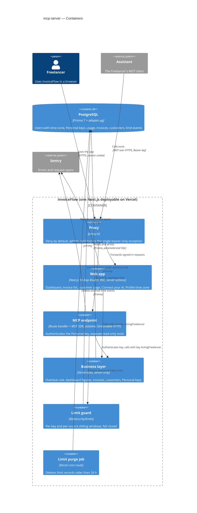

## 6. Runtime view

Messages are semantic; endpoint shapes arrive at the `api` stage. Participants are the §5 containers. These two flows seed the runtime view; `sequences` covers every remaining §5 AC.

**Critical flow 1: an Assistant asks for overdue invoices (key check, limits, answer)**

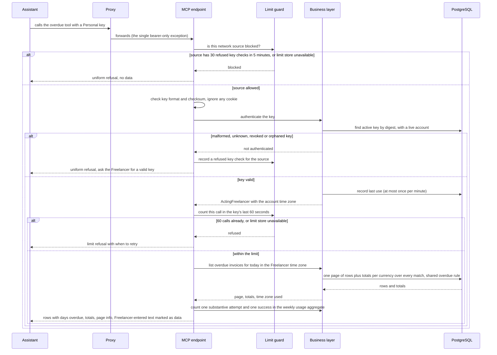

**Critical flow 2: revoking a key while an Assistant call is waiting**

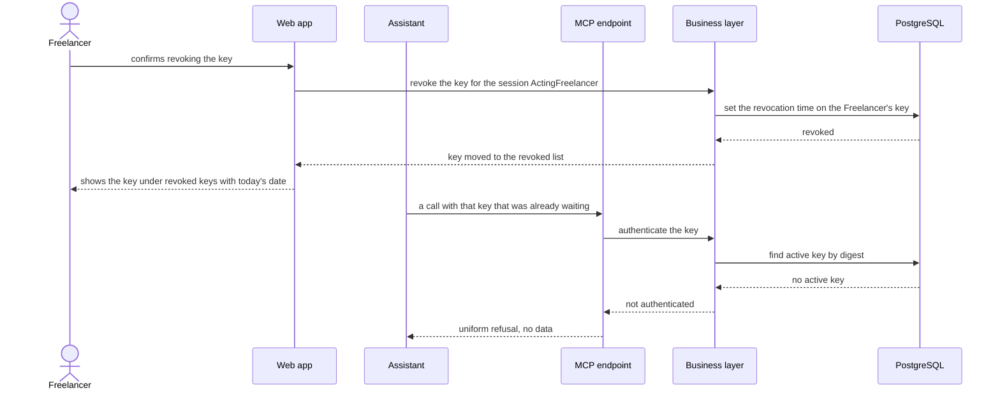

The flows below are added by `sequences`. They use generic participants: `user (Freelancer)`, `client (Assistant)`, `ui`, `service (<§5 block>)` and `data-store`. Every tool flow (Flows 6–11) starts after the source limit, key check, last-use record and per-key call count shown in Critical flow 1. Those steps are not redrawn. `persists …` and `reads …` notes are index hints for `data-model`.

### Flow 3: Freelancer opens Connect your AI (entry point and key list)

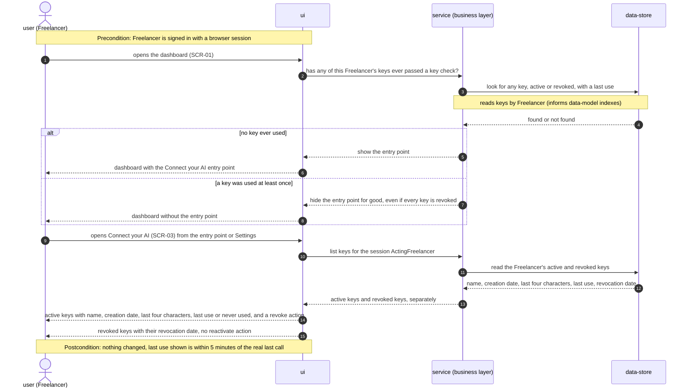

### Flow 4: Freelancer creates a Personal key

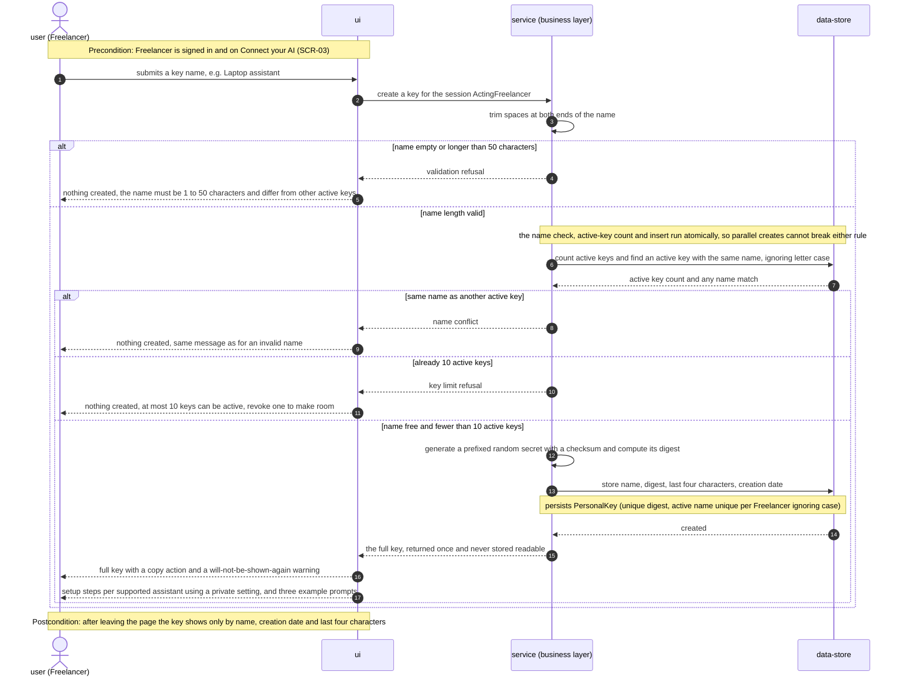

### Flow 5: Assistant lists tools, or calls without a key

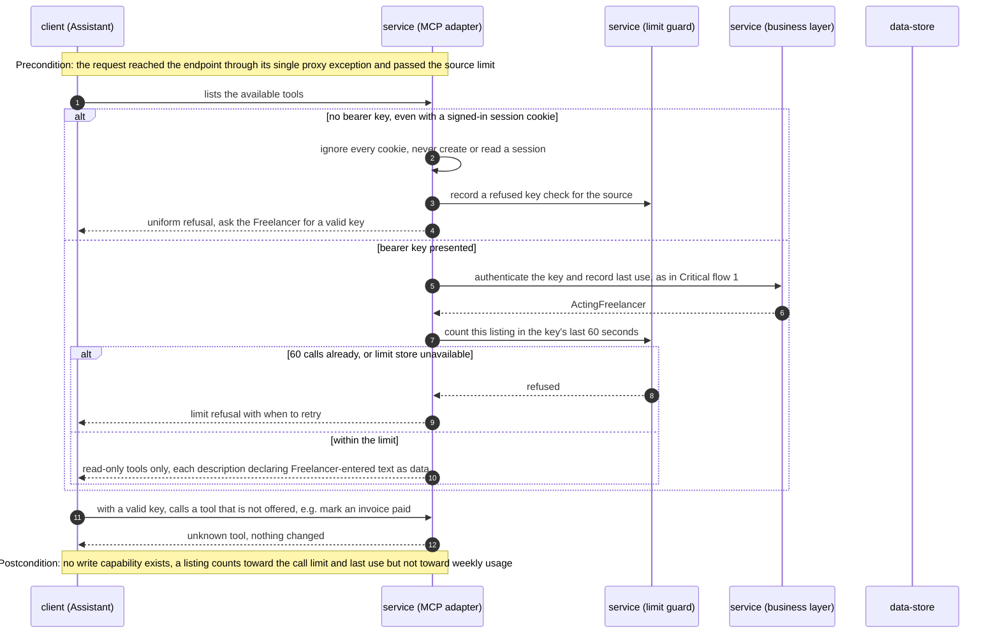

### Flow 6: Assistant asks who owes money (Debtors)

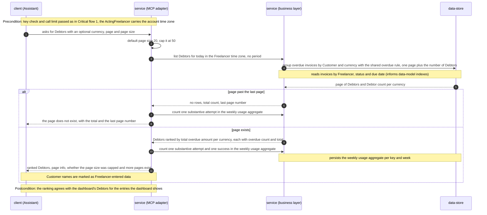

### Flow 7: Assistant asks what is coming in (Expected payments)

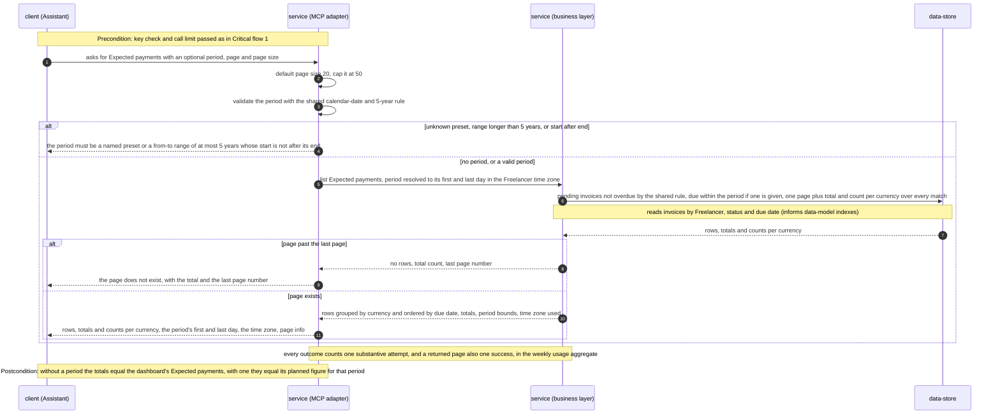

### Flow 8: Assistant asks for summary figures

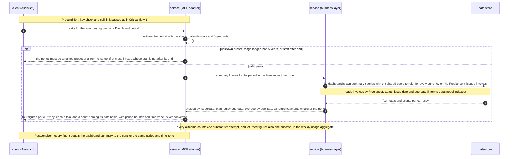

### Flow 9: Assistant searches invoices

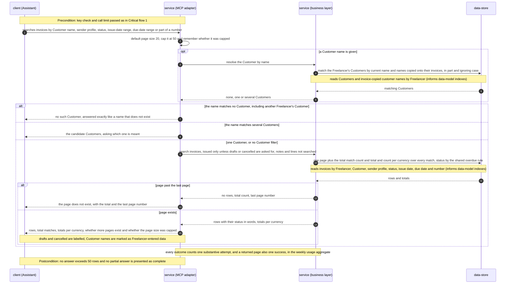

### Flow 10: Assistant opens one invoice

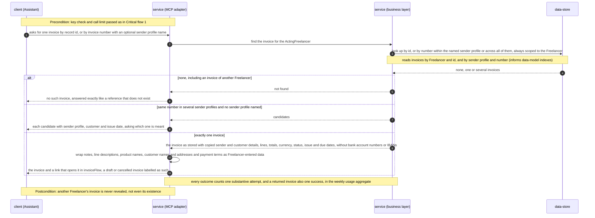

### Flow 11: Assistant lists customers

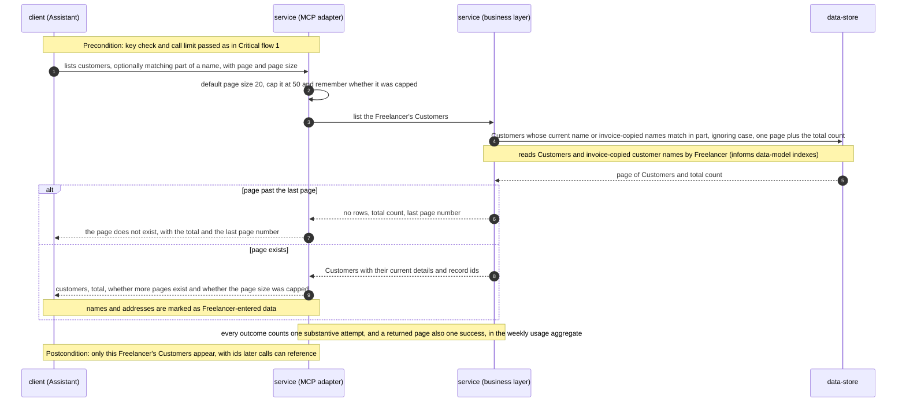

### Flow 12: Freelancer time zone is saved and changed

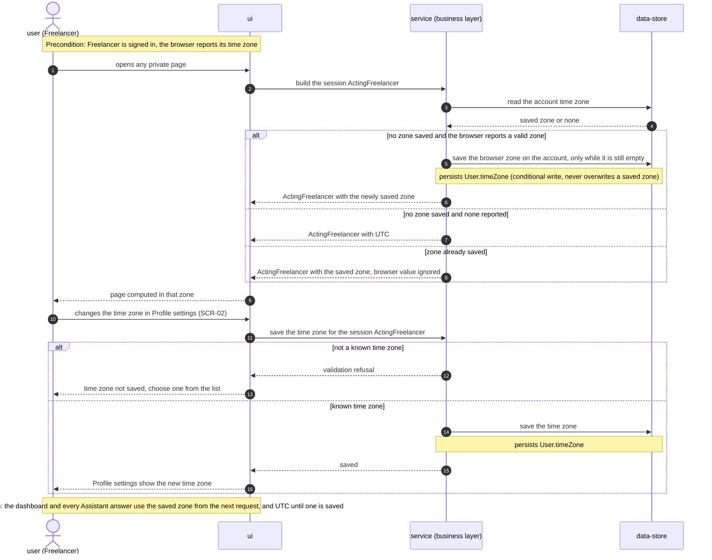

### Flow 13: Dashboard and invoice list apply the shared overdue rule

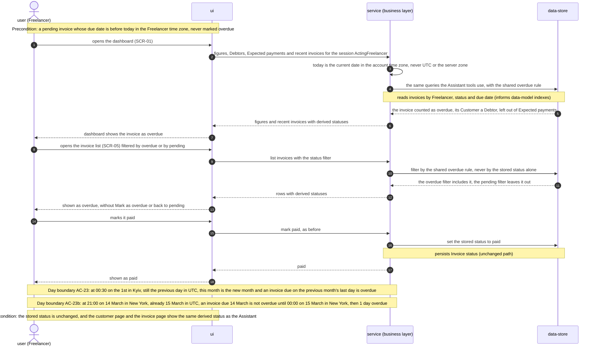

### Flow 14: Freelancer downloads the data export

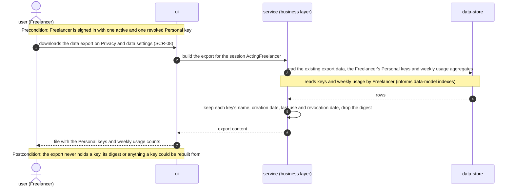

### Flow 15: Freelancer deletes the account while keys are active

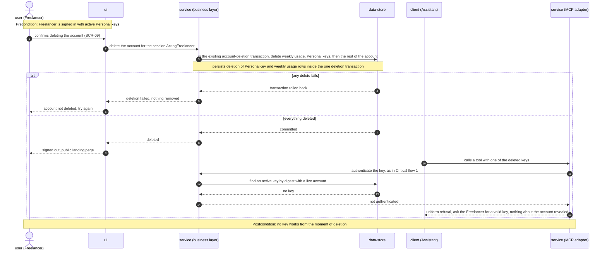

### Coverage

| Spec item | Shown in |
|---|---|
| US-01 | Flows 3, 4 |
| US-02 | Flow 3, Critical flow 2 |
| US-03 | Critical flow 1, Flow 6 |
| US-04 | Flow 7 |
| US-05 | Flow 8 |
| US-06 | Flows 9, 10, 11 |
| US-07 | Flows 12, 13 |
| US-08 | Flow 13 |
| US-09 | Critical flows 1, 2, Flow 5 |
| US-10 | Flows 14, 15 |
| AC-01 | Flow 3 (entry point shown or hidden for good) |
| AC-02 | Flow 4 (happy path) |
| AC-03 | Flow 4 (invalid length and duplicate-name branches) |
| AC-04 | Flow 4 (10-key branch) |
| AC-05 | Flow 3 (key list), Critical flow 1 and Flow 5 (last use recorded on listings and limit-refused calls) |
| AC-06 | Critical flow 2 |
| AC-07 | Critical flow 1 (refusal branch), Flow 15 (deleted account) |
| AC-08 | Flow 9 (Customer not found branch), Flow 10 (invoice not found branch) |
| AC-09 | Flow 5 (no-key branch) |
| AC-10 | Flow 5 (read-only listing, unknown tool) |
| AC-11 | Critical flow 1 (per-key limit branch), Flow 5 (listings count) |
| AC-12 | Critical flow 1 |
| AC-13 | Flow 6 |
| AC-14 | Flow 7 |
| AC-15 | Flow 8 |
| AC-16 | Flows 7, 8 (invalid period branch) |
| AC-17 | Flow 9 |
| AC-18 | Flows 6, 7, 9, 11 (page size capped at 50, totals over every match) |
| AC-18b | Flows 6, 7, 9, 11 (page past the last page branch) |
| AC-19 | Flow 10 (opening the link in the browser is the existing invoice page, see ux-flows SCR-07, SCR-10, SCR-11) |
| AC-19b | Flow 10, and the Freelancer-entered-data notes in Flows 6, 9, 11 |
| AC-20 | Flow 10 (several candidates branch) |
| AC-21 | Flow 9 (Customer resolution), Flow 11 |
| AC-22 | Flow 12 |
| AC-23 | Flow 13 (Kyiv day-boundary note) |
| AC-23b | Flow 13 (New York day-boundary note) |
| AC-24 | Flow 13 |
| AC-25 | Flow 14 |
| AC-26 | Flow 15 |

### Flags from the runtime view

- **Missing key counts as a refused key check** (Flow 5): a call with no bearer key adds to the source's 30-in-5-minutes budget. It is not stated in spec AC-09 or §6. Confirm at `api` together with the refusal shape (§11 risk on OAuth discovery by MCP clients).
- **Weekly usage on failures** (Flows 6–11): every substantive outcome, including a page past the end, an invalid period or an ambiguous reference, counts as an attempt without a success. That lowers the §7 successful-call share for Assistant-side mistakes. Reconsider at `data-model` if the KPI should exclude them.
- **Invalid time zone branch** (Flow 12) is a design addition that no AC asks for.
- **Atomic key creation** (Flow 4): the name check, the 10-active count and the insert must not race. `data-model` picks the mechanism (a partial unique index on active names plus a transaction or lock for the count).
- **Overdue-rule notice** (spec §8 open question): not drawn. If the default (a one-time dismissable dashboard notice) is kept, it adds a per-Freelancer "notice dismissed" write to Flow 13 before `tasks`.
- No new participant beyond §5 and no new ADR-worthy decision.

## 7. Deployment view

The feature runs inside the existing Vercel project in region `iad1`: `/api/mcp` is one more Node.js serverless function of the same Next.js deployable, scaled per request by Vercel with no sticky sessions (ADR-0002). No new infrastructure, environment setting, region or cron job — the existing daily `/api/cron/purge-limits` job (security-patch ADR-0007) also purges the two new limit scopes. The public MCP URL is `https://<app origin>/api/mcp`; preview deployments expose the same path for testing.

**Monitoring:**
- Sentry spans on every MCP request, named by tool (`mcp.tools/call <tool>`, `mcp.tools/list`) — the source for the spec §6 latency targets (p95 ≤ 800 ms lists and single records, ≤ 1.5 s aggregates) and the dashboard-span comparison (no more than 10 % slower than the 7 days before release).
- Counted outcomes per call: success, refused-key, refused-source, refused-limit, limit-store-unavailable, server-error — the source for the ≤ 1 % weekly server-side failure rate. The weekly per-key usage aggregate holds substantive attempts and successes, the source for the §7 weekly-active, activation and successful-call-share KPIs.
- Alert: any `limit-store-unavailable` outcome in production (every Assistant call is being refused) → notify the owner.
- Alert: server-side failure rate over 1 % of Assistant calls in a rolling day → notify the owner (early warning for the weekly target).

**Scaling thresholds:**
- `LimitEvent` grows by at most 60 rows per active key per minute and is purged daily; comfortable while daily rows stay under ~5 million — beyond that, or if the limit check exceeds 50 ms p95, revisit a dedicated counter store (design estimates, not spec NFRs; recorded in ADR-0007).
- Personal keys: at most 10 active per Freelancer (AC-04); the key table stays small and is read by a unique digest index.
- Aggregates are bounded by the per-Freelancer invoice count; the spec budget is set at 5,000 invoices per Freelancer — above that, revisit indexes on `(userId, status, dueDate)` at the `data-model` stage.

## 8. Crosscutting concepts

| Concept | Convention | Where defined |
|---|---|---|
| Logging | Repo default — `console.error` inside `try/catch`, errors to Sentry in production. **Never** log or report the `Authorization` header, a key, a key digest, or answer bodies; Sentry scrubbing extends to request headers on `/api/mcp`. | `docs/architecture-map.md` §Conventions; here |
| Authentication | Two trusted `ActingFreelancer` factories: session (web) and Personal key (MCP). `/api/mcp` reads only `Authorization: Bearer` and never cookies; a key never creates a session (AC-09). Key check on every call, no cache (0 s revocation). | service-layer ADR-0001; ADR-0003, ADR-0004 |
| Authorization | Every read scoped by the acting Freelancer's id in its own `WHERE`; another Freelancer's record is answered exactly like a missing one (AC-08). No write tool is registered (AC-10). | service-layer ADR-0003; here |
| Error handling | Services return `ActionResult` with typed codes. The adapter maps them: key/source/limit refusals are request-level refusals with a plain-language message (limit refusals say when to retry); `VALIDATION` / `NOT_FOUND` / ambiguity become tool errors that explain what to ask. Refusals are uniform and never reveal whether a key existed (AC-07). | `types/result.ts`; architecture-hardening ADR-0009; exact shapes at `api` |
| Rate limiting | Per key: 60 calls in the most recent 60 s, counting every call that passed the key check, tool listings included, limit refusals excluded. Per source: 30 refused key checks in 5 min, then refused before any key check. Fail closed. | ADR-0007; security-patch ADR-0002 |
| Overdue rule | One rule module used by every surface; stored statuses never change; "Mark as overdue" / "back to pending" not offered for derived-overdue invoices. | ADR-0005 |
| Time zone and dates | "Today", day and period bounds use the account time zone (UTC until saved); due dates are calendar days compared without shift; periods follow the shared calendar-date / 5-year rule; every Assistant answer names the time zone and period bounds it used. | ADR-0006; security-patch ADR-0004 |
| Pagination and completeness | Shared page-number envelope. Assistant answers: default 20, maximum 50 rows; a larger request is capped and says so; totals and counts always cover the full match set; a page past the end returns no rows and the last page number, never an earlier page (AC-18, AC-18b). | service-layer ADR-0005; here |
| Money | Totals and counts come from the same queries the dashboard uses; reported per currency, never converted, formatted to the cent. | service-layer ADR-0004; architecture-hardening ADR-0006 |
| Untrusted text | Every Freelancer-entered text field in an answer (notes, line descriptions, product names, customer names and addresses, payment terms) is wrapped in a marked structure the tool descriptions declare as data, not instructions (AC-19b). Exact shape at `api`. | here |
| Data minimisation | No bank account number or IBAN in any answer (AC-19); invoices are returned as stored (copied sender/customer details). | here |
| ID strategy | `cuid()` for new models; answers expose record ids so later calls can reference them; invoice numbers are matched within a sender profile, ambiguity returns candidates (AC-20). | repo default |
| Observability | Sentry spans per tool; weekly per-key usage aggregates (counts only, never content) holding substantive attempts and successes for the §7 KPIs; a substantive call that fails after the key check still counts as an attempt, included in the export and deleted with the account. | spec §6.1, §7; here |
| Caching | None for key checks, figures or lists — revocation must be immediate and figures must match the dashboard at the moment of the call. | here |
| Internationalisation | Answers in English, matching the app's single UI language. | — |

## 9. Architecture decisions

| # | Title | Status | Section |
|---|---|---|---|
| 0001 | Build a backend MCP endpoint and web-frontend changes as two surfaces | Accepted | §4 |
| 0002 | Serve MCP from a stateless route handler in the Next.js app | Accepted | §4 |
| 0003 | Admit only /api/mcp past the proxy and authenticate it by bearer key alone | Accepted | §4 |
| 0004 | Store Personal keys as SHA-256 digests of prefixed random secrets | Accepted | §4 |
| 0005 | Compute overdue at read time from one shared rule module | Accepted | §4 |
| 0006 | Save the Freelancer time zone on the account (supersedes architecture-hardening ADR-0010) | Accepted | §4 |
| 0007 | Count Assistant calls in the existing Postgres limit log and fail closed | Accepted | §4 |
| 0008 | Show dashboard currency tabs for bank-account and issued-invoice currencies | Accepted | §10 |

ADR files live under `docs/features/mcp-server/adr/NNNN-<title>.md`.

## 10. Quality requirements

Each §1 goal expanded into scenarios; every target is quoted from spec §6.

**QG-1. Dashboard parity**
- **When:** an Assistant asks for summary figures, overdue invoices, Debtors or Expected payments for any Dashboard period, for a Freelancer with invoices in several currencies — including at the day boundary of AC-23 (00:30 on the 1st in Kyiv) and AC-23b (21:00 on 14 March in New York).
- **Then:** "100 % of figures equal the dashboard to the cent", for every currency tab (ADR-0008), with the same overdue rule (ADR-0005) and the same Freelancer time zone (ADR-0006).
- **How verify:** "automated parity test over a seeded multi-currency fixture, run in CI; spot check in the ship stage" — the test calls each tool and the matching dashboard function for the same `ActingFreelancer` and compares every figure; the boundary cases run under a fake clock; an equivalence test runs the three forms of the overdue rule over the same fixture; a scanning test fails on any hand-written `status = 'OVERDUE'` check outside the rule module.

**QG-2. Tenant isolation and credential safety**
- **When:** a key is revoked while a call is waiting; a key makes its 61st call in a rolling minute; a source fails key checks repeatedly; the limit store is unavailable; Freelancer A's key asks for Freelancer B's invoice; a signed-in browser calls without a key.
- **Then:** revocation — "the first call after revocation is refused (0 s grace)"; per-key limit — "60 calls per minute per Personal key; no daily cap"; failed keys — "at most 30 refused key checks per 5 minutes per network source; beyond that the source is refused before any key is checked"; limiter — "fail-closed: 100 % of Assistant calls are refused while the limit store is unavailable"; cross-tenant and session-only calls answered exactly as AC-08 and AC-09 require.
- **How verify:** integration tests on a throwaway Postgres container (one per target above, as spec §6 names "integration test" for each), plus a unit test that a request carrying a valid session cookie and no key is refused, and a test that `/api/mcp` is the only non-auth proxy exception.

**QG-3. Responsiveness at realistic scale**
- **When:** an Assistant asks list and single-record questions (≤ 50 rows), or asks for summary figures, Debtors and Expected payments for a Freelancer with 5,000 invoices; and Freelancers load the dashboard after the overdue rule change.
- **Then:** list and single-record p95 "≤ 800 ms server-side"; aggregates p95 "≤ 1.5 s server-side"; dashboard p95 "no more than 10 % slower than the 7 days before release".
- **How verify:** "request spans in error tracking, 7-day window after release" for lists; "integration test on a seeded fixture + spans in error tracking" for aggregates; "dashboard spans in error tracking" compared against the 7 days before release.

**QG-4. Answer completeness and operational health** (supporting goals 1 and 2)
- **When:** an Assistant asks for 1,000 rows, a page past the end, or any list; a key is used; a week of Assistant calls passes.
- **Then:** page size "default 20, maximum 50 rows per answer", totals over the full match set; last use "within 5 minutes of the real last call"; server-side failures "≤ 1 % of Assistant calls per week fail on the system's side".
- **How verify:** "contract test" for page size and the AC-18b out-of-range answer; "integration test" for last-use accuracy; "error tracking, weekly" for the failure rate, with the §7 daily early-warning alert.

## 11. Risks and technical debt

| Risk / debt | Severity | Mitigation | Owner |
|---|---|---|---|
| A leaked Personal key reads all of the Freelancer's data until revoked (accepted in spec §6.1) | Medium | `ifk_` prefix + checksum for secret scanners; setup steps keep the key in user-level config (Claude Code `--scope user`, Cursor global `~/.cursor/mcp.json`, Claude Desktop `claude_desktop_config.json` via `mcp-remote`); immediate revocation; last use shown | Dmytro Hopko |
| Dashboard aggregates sum money as `::float8` in raw SQL (`lib/services/dashboard/queries.ts`); a formatting or rounding difference between surfaces would break "to the cent" parity | Medium | Assistant tools reuse the same query functions and one formatter; the CI parity test compares formatted values; move sums to `numeric` at `data-model` if the test finds drift | Dmytro Hopko |
| The overdue rule exists in three forms (SQL fragment, Prisma condition, TS predicate) and could drift, or a new query could hand-write `status = 'OVERDUE'` | Medium | Equivalence test over one fixture + a scanning test for the literal outside `_shared/overdue.ts` (ADR-0005) | Dmytro Hopko |
| MCP clients that receive 401 may start OAuth discovery (MCP authorization spec) and show a confusing sign-in prompt instead of "ask for a valid key" | Medium | Refusals carry no OAuth resource-metadata pointer and a plain-language message; launch clients (Claude Desktop, Claude Code, Cursor) are tested against refusals at `ship`; exact status/headers decided at `api` | Dmytro Hopko |
| `/api/mcp` shares the origin with session cookies; a future change that reads the session there would break AC-09 | Medium | Handler reads only `Authorization`; unit test: valid session cookie + no key ⇒ refused; no CORS headers; Security Lead review (ADR-0003) | Dmytro Hopko |
| Account deletion runs in one explicit transaction keeping `RESTRICT` foreign keys (architecture-hardening ADR-0007); new key and usage tables must be deleted inside it or deletion fails | Medium | `data-model` adds the tables to the deletion transaction; integration test for AC-26 | Dmytro Hopko |
| `LimitEvent` write volume and advisory-lock contention grow with Assistant traffic (up to 60 rows per key per minute) | Low | Daily purge already covers new scopes; §7 threshold (≈5 million rows/day or limit check > 50 ms p95) triggers a counter-store review (ADR-0007) | Dmytro Hopko |
| MCP SDK / protocol revisions change transport or auth behaviour | Low | Pin the SDK version; contract tests over `tools/list` and `tools/call`; review on SDK upgrades | Dmytro Hopko |
| Prompt injection through Freelancer-entered text reaching an Assistant's other tools (residual, named in spec §6.1) | Low | Read-only keys keep in-app damage at zero; every Freelancer-entered field is marked as data (AC-19b); residual risk outside invoiceFlow accepted | Dmytro Hopko |
| `docs/architecture-map.md` reflects `ded1be7`, 101 commits behind; downstream stages reading it may miss the service layer and proxy changes | Low | Run `/sdd:survey` before `tasks`; this SAD's §2 and §5 reflect the current code | Dmytro Hopko |
| Open architectural decision: one-time notice about the new overdue rule (dashboard figures change on release day) — spec §8 default: a dismissable dashboard notice | Open question | Resolve before `sdd:tasks`; affects SCR-01 states and whether a per-Freelancer "notice dismissed" flag is stored | Dmytro Hopko |
| Open architectural decision: `invoice-integrity` brief must drop D3 and depend on this feature's overdue rule (ADR-0005) | Open question | Resolve before `sdd:specify invoice-integrity`; edit the brief when that feature is specified | Dmytro Hopko |

**Accepted debt (acceptable in v1, plan to fix later):**
- No key expiry, first-use email or automatic revocation of unused keys (spec §3).
- No server-to-client notifications or resumable streams on the MCP endpoint (ADR-0002) — revisit with the drafts feature.
- Claude Desktop setup needs the `mcp-remote` bridge (Node.js on the Freelancer's machine) until it supports custom headers on remote servers directly.
- A Freelancer's saved time zone does not follow them when travelling (ADR-0006) — they change it in settings.
- Dashboard currency tabs now include issued-invoice currencies (ADR-0008) — a small scope addition beyond the spec's default, accepted to close the parity gap.

## 12. Glossary

Canonical definitions live in [`CONTEXT.md`](../../../CONTEXT.md); the rows below are the terms this SAD relies on, plus design-level terms not in the glossary (flagged ⟂ for a `glossary` follow-up if they reach the UI or the spec).

| Term | Meaning |
|---|---|
| Assistant | A program (an in-app AI chat or an external MCP client) that reads and changes data on behalf of exactly one Freelancer who authorized it, without a browser session, and sees only that Freelancer's data (CONTEXT). In this feature: an external MCP client that only reads. |
| Freelancer | A signed-in account holder who owns sender profiles, customers, products and invoices and sees only their own data (CONTEXT). |
| Visitor | Anyone reaching the app or its endpoints without a signed-in session, including scripts and bots outside a browser (CONTEXT). In this feature, a caller on `/api/mcp` without a valid Personal key is refused like a Visitor. |
| Personal key | A named secret a Freelancer creates and gives to one Assistant; shown once, revocable, removed with the account (CONTEXT). Stored as a SHA-256 digest (ADR-0004). |
| Overdue invoice | An issued, unpaid invoice marked overdue, or whose due date is before today in the Freelancer time zone; one rule for every surface (CONTEXT; ADR-0005). |
| Freelancer time zone | The zone saved on the account that decides "today" for the dashboard and every Assistant; UTC until saved (CONTEXT; ADR-0006). |
| Issued invoice | Pending, overdue or paid — not draft, not cancelled; the default scope of every list and figure (CONTEXT). |
| Debtor | A Customer with at least one overdue invoice in the selected currency, ranked by total overdue amount (CONTEXT). |
| Expected payment | A pending, not-overdue invoice, grouped by currency and ordered by due date (CONTEXT). |
| Dashboard period | A named preset or a from–to range of at most 5 years selecting which invoices a figure counts (CONTEXT). |
| Customer | A party a Freelancer bills; each invoice keeps a copy of its details as issued (CONTEXT). |
| Sender profile | A business identity a Freelancer issues invoices under; invoice numbers are unique within it (CONTEXT). |
| ActingFreelancer ⟂ | The branded `{ userId, timeZone }` value every business function takes first; built only by the session and Personal-key factories (service-layer ADR-0001). |
| MCP endpoint ⟂ | The `/api/mcp` route handler serving the Model Context Protocol, stateless, read-only (ADR-0002). |
| Tool ⟂ | One read-only MCP operation an Assistant can list and call (e.g. overdue invoices, summary figures). |
| Substantive call ⟂ | Any tool call other than listing tools or housekeeping, whether it succeeds or not; attempts and successes are both counted per key per week, so the §7 "successful call share" is measurable (spec §7). |
| Key check ⟂ | Format/checksum validation plus digest lookup of an active key with a live account; a call "passes the key check" when it succeeds (spec AC-05, AC-11). |
| Network source ⟂ | The client address used for the failed-key-attempt limit (security-patch `sourceLimitKey`). |
