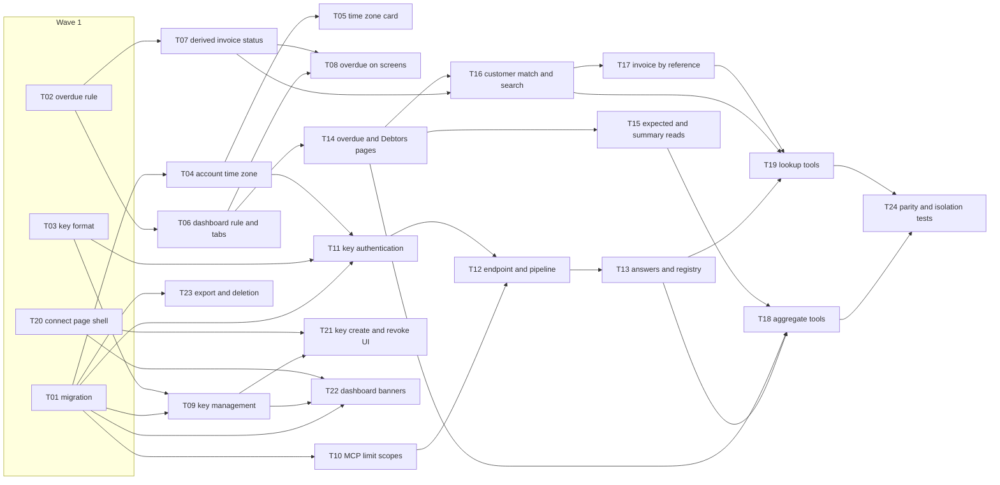

# Epic — mcp-server

> **Spec:** [spec.md](../spec.md) · **Design:** [sad.md](../sad.md) · **Data model:** [data-model.md](../data-model.md) · **API:** [openapi.yaml](../contracts/openapi.yaml) · [server-actions.md](../contracts/server-actions.md) · **Screens:** [screens.md](../screens.md) · **ADRs:** [adr/](../adr/)

## Goal

Ship a read-only MCP endpoint (`/api/mcp`) that lets a Freelancer's own AI assistant answer money questions with a named, revocable Personal key, plus the "Connect your AI" page to manage those keys (spec §2 goals 1 and 3). In the same release, move the Freelancer time zone onto the account and apply one shared overdue rule on every surface, so an Assistant's numbers always match the dashboard (spec §2 goal 2). Weekly usage counts per key make the §7 KPIs measurable from day one (spec §2 goal 4).

## Scope

- **In:** the five staged migrations (`User.timeZone`, `User.overdueNoticeDismissedAt`, `PersonalKey`, `PersonalKeyUsageWeek`, two `LimitScope` values); `lib/services/_shared` (overdue rule, both `ActingFreelancer` factories, strict paging); `lib/services/{personal-keys,dashboard,invoices,customers,sender-profiles,profile,account}`; `lib/security/limits` (two MCP scopes); `lib/mcp` + `app/api/mcp` (endpoint, pipeline, seven read-only tools); `config/routes.config.ts` + `proxy.ts` (one bearer-only exception); UI: SCR-01 dashboard banners, SCR-02 time-zone card, SCR-03/SCR-04 Connect your AI, derived overdue on SCR-05/06/07; data export 2.1.
- **Out (spec §3):** creating or editing drafts through an Assistant; delegated sign-in for hosted chat assistants; any action that leaves the account or changes money state; payment-behaviour history; currency conversion; several access levels; key expiry, first-use emails and automatic revocation; plan-based access.

## Task map

**Waves** (what `implement` can run in parallel): W1 T01 · T02 · T03 · T20 → W2 T04 · T06 · T07 · T09 · T10 · T23 → W3 T05 · T08 · T11 · T14 · T21 · T22 → W4 T12 · T15 · T16 → W5 T13 · T17 → W6 T18 · T19 → W7 T24.

**Serialized lanes** (overlapping `files_hint`): `lib/services/dashboard/queries.ts` — T06 → T14 → T15 · `lib/mcp/server.ts` — T12 → T13 → T18 / T19 · `config/routes.config.ts` — T20 / T12 · `app/(protected)/settings/assistants/page.tsx` — T20 → T21. `layer: migration` (T01) is serialized by `implement` regardless.

## Tasks

See [tracker.md](./tracker.md) for status. Machine contract: [tasks.json](../tasks.json).

| # | Task | Layer | Blocked by | DoD (short) |
|---|---|---|---|---|
| T01 | [Promote the five staged migrations and extend the test support](./t01-promote-migrations-and-test-support.md) | migration | — | 01–05 apply and revert, no drift; user delete cascades keys, usage, MCP_KEY rows |
| T02 | [Add the shared overdue rule module](./t02-shared-overdue-rule.md) | domain | — | three forms equivalent; AC-23/23b instants pass; literal scan guards the rule |
| T03 | [Generate, checksum and digest ifk_ Personal keys](./t03-personal-key-format.md) | domain | — | format, checksum, digest, lastFour unit-tested; malformed refused without a lookup |
| T04 | [Read the time zone from the account in both factories](./t04-account-time-zone.md) | app | T01 | first-visit seed only while NULL; UTC fallback; updateTimeZone validates |
| T05 | [Add the Time zone card to Profile settings](./t05-time-zone-settings-card.md) | ui | T04 | SCR-02 states component-tested |
| T06 | [Apply the overdue rule to every dashboard figure](./t06-dashboard-overdue-rule-and-currency-tabs.md) | app | T02 | past-due invoice overdue, a Debtor, not expected; tabs union; parity green |
| T07 | [Return the derived status from every invoice read](./t07-derived-invoice-status.md) | app | T02 | derived OVERDUE everywhere; filters by rule; D-6 refusal |
| T08 | [Show the derived overdue status on screens](./t08-derived-overdue-on-screens.md) | ui | T06, T07 | SCR-05/06/07 badges and menu; literal scan has no allow-list left |
| T09 | [Create, list and revoke Personal keys](./t09-personal-key-management.md) | app | T01, T03 | AC-02–AC-06 service + actions; 10-key rule holds under parallel creates |
| T10 | [Add the per-key and per-source MCP limit scopes](./t10-mcp-limit-scopes.md) | infra | T01 | 60/60 s per key, 30/5 min per source, retryAt, fail closed |
| T11 | [Authenticate a presented Personal key and record usage](./t11-key-authentication-and-usage.md) | app | T01, T03, T04 | uniform `{ok:false}`; last use ≤ once a minute; atomic weekly upsert |
| T12 | [Serve POST /api/mcp with the request pipeline](./t12-mcp-endpoint-and-request-pipeline.md) | ports | T10, T11 | uniform 401, 429, 503, 405; session cookie never accepted; one proxy exception |
| T13 | [Shape MCP answers and register read-only tools](./t13-mcp-answers-and-tool-registry.md) | ports | T12 | page cap, ToolError mapping, freelancerText, readOnly listing, -32602, usage per call |
| T14 | [Page overdue invoices and Debtors strictly](./t14-strict-paging-overdue-and-debtors.md) | app | T06 | AC-12/13 rows and totals; PAGE_OUT_OF_RANGE; cap 50 |
| T15 | [Page Expected payments and compute summary figures](./t15-expected-payments-and-summary-reads.md) | app | T14 | totals equal the dashboard; AC-16 period refusals |
| T16 | [Match Customers and search invoices for an Assistant](./t16-customer-match-and-invoice-search.md) | app | T07, T14 | AC-17 search, AC-21 rename match, ambiguity, cross-tenant NOT_FOUND |
| T17 | [Find one invoice by id or number](./t17-find-invoice-by-reference.md) | app | T16 | stored invoice without bank fields; AC-20 candidates; AC-08 identical miss |
| T18 | [Expose the aggregate tools](./t18-aggregate-tools.md) | ports | T13, T14, T15 | four tools return openapi shapes through /api/mcp |
| T19 | [Expose the lookup tools](./t19-lookup-tools.md) | ports | T13, T16, T17 | three tools return openapi shapes; link; cross-tenant NOT_FOUND |
| T20 | [Add the Connect your AI page shell](./t20-connect-page-shell-and-setup.md) | ui | — | nav item, setup tabs, example prompts, CopyButton states |
| T21 | [Build key creation, reveal, lists and revoke](./t21-key-create-reveal-and-revoke-ui.md) | ui | T09, T20 | SCR-03 key states and SCR-04 states component-tested |
| T22 | [Show the overdue notice and the entry point on the dashboard](./t22-dashboard-notice-and-entry-point.md) | ui | T01, T09, T20 | notice dismiss once per account; entry point hidden for good after first use |
| T23 | [Add keys, usage and time zone to the export](./t23-export-and-account-deletion.md) | app | T01 | export 2.1 without secrets; deletion removes keys and usage |
| T24 | [Prove parity, day boundaries, isolation and scale](./t24-parity-boundary-isolation-and-scale.md) | tests | T18, T19 | to-the-cent parity; boundary instants; no cross-tenant leak; p95 budgets |

## Risks / Hard rules

- **Parity (spec §6):** "100 % of figures equal the dashboard to the cent". Tools call the dashboard's own query functions. No second query for the same figure (sad §5).
- **One overdue rule (ADR-0005):** no hand-written `status = 'OVERDUE'` outside `lib/services/_shared/overdue.ts`. The T02 scanning test enforces it; T06–T08 empty its allow-list.
- **Bearer only (ADR-0003, AC-09):** `/api/mcp` never reads cookies, sends no CORS headers, and is the single non-auth proxy exception.
- **Uniform refusal (AC-07):** missing, malformed, unknown, revoked and deleted-account keys get the byte-identical `401`. No cache on the key check (0 s revocation).
- **Fail closed (ADR-0007):** "100 % of Assistant calls are refused while the limit store is unavailable" → `503`.
- **Read-only (AC-10):** only the seven `readOnlyHint` tools are registered.
- **Never log secrets (sad §8):** not the `Authorization` header, a key, a digest, or answer bodies.
- **Contract-task fold:** the `ActionErrorDetails` additions (`PAGE_OUT_OF_RANGE`, `AMBIGUOUS_REFERENCE`) land in T14, their first implementer. They are additive, and no exhaustive `switch` over `details.kind` exists today.
- **Upstream drift to know about:** sad.md flow 15 and §11 still describe explicit deletes inside the deletion transaction. data-model verified that the existing `prisma.user.delete` cascades. T23 follows data-model (api-sync-report OQ-S2 is open). The sender-profile-name ambiguity (OQ-S1) is in the contract but not drawn in flow 9. T16 follows the contract.
- **Security review:** `/security-review` is required before ship (spec §6.1).
