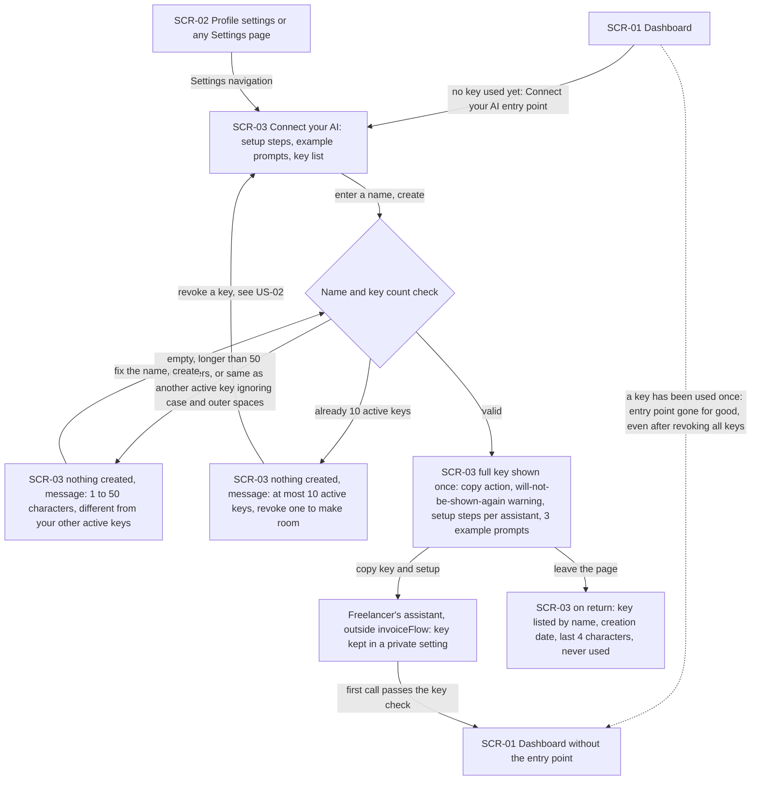
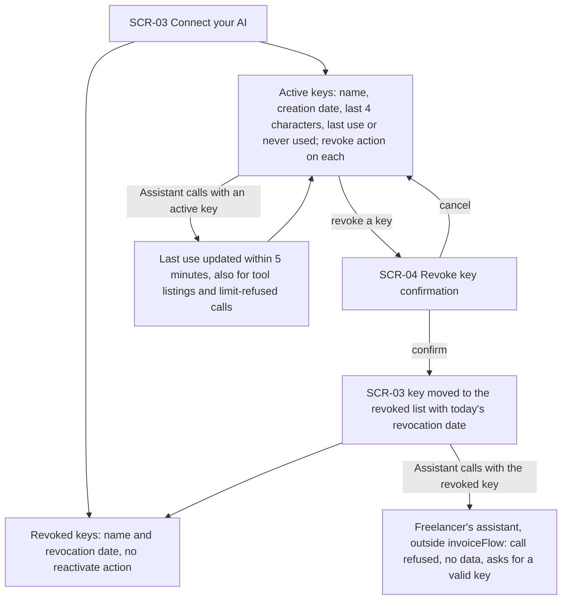
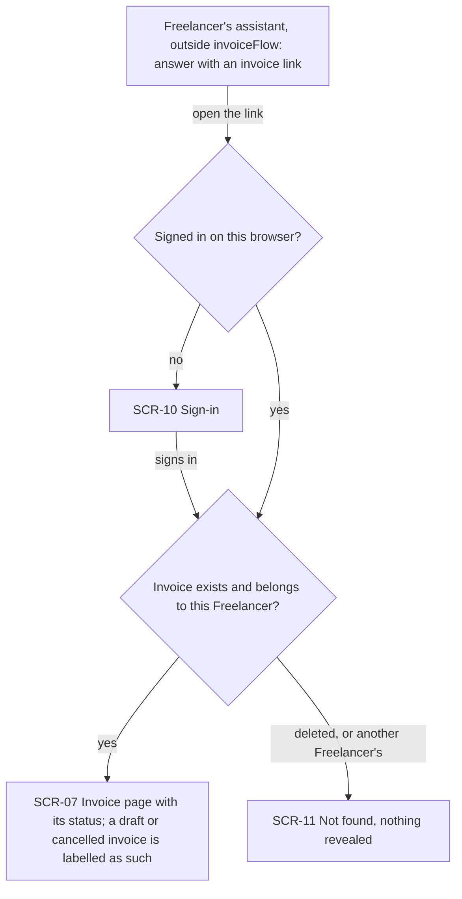
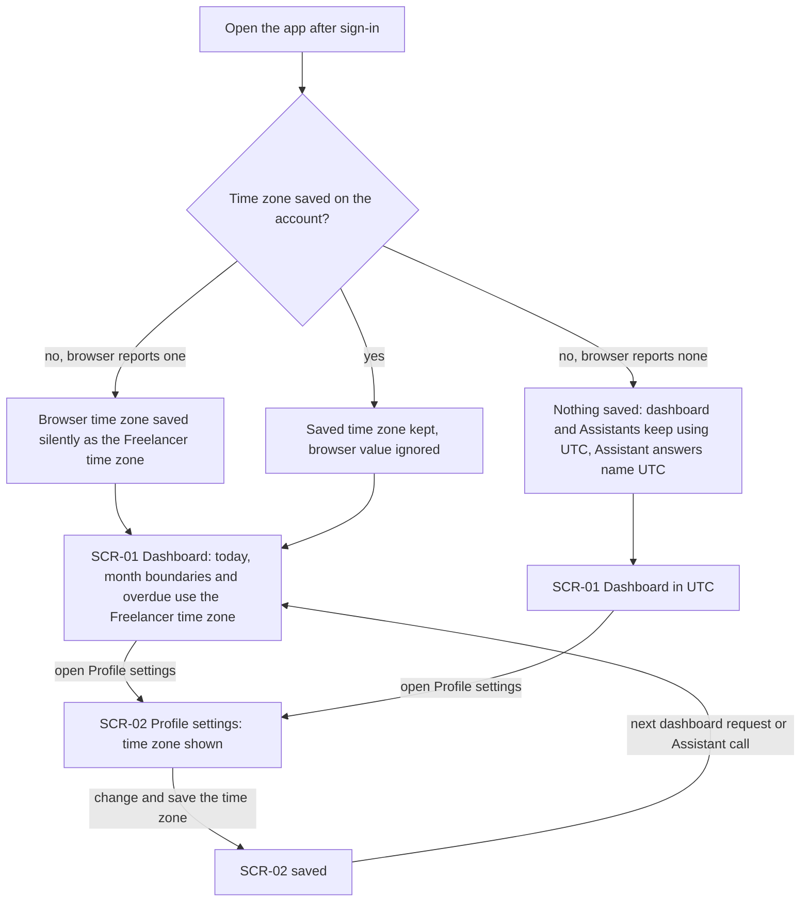
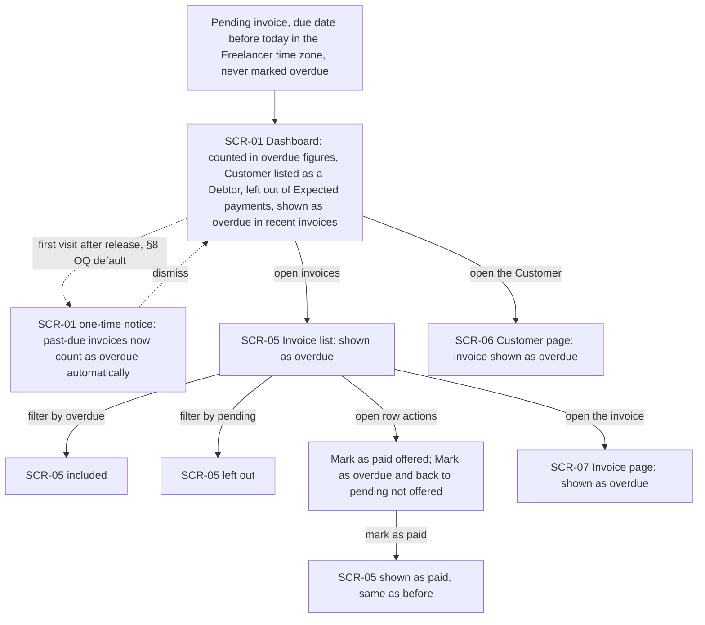
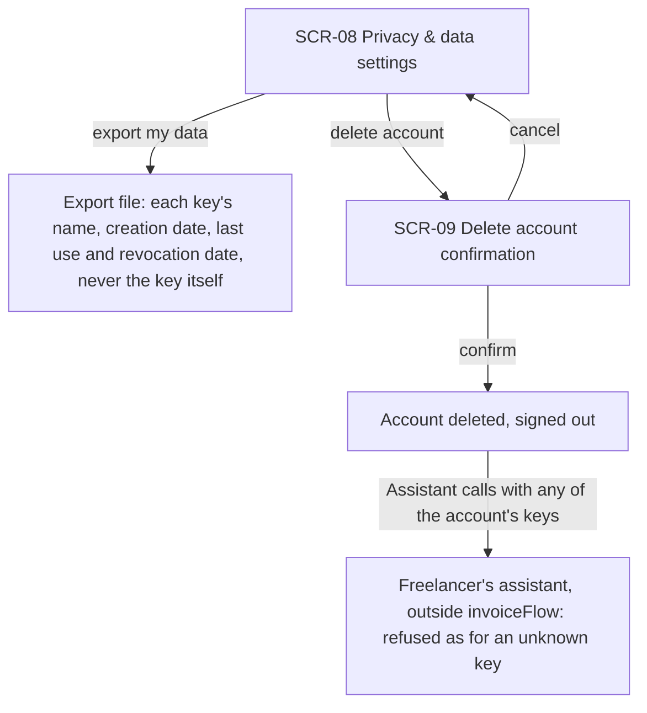

# UX flows — mcp-server

> User flows for every UI-touching §4 user story, produced by `ux-flows` (after `clarify`, before
> `design`) and read by `design` (evidence for the target-surface + UI-architecture decisions),
> `sequences` (UI-driven flows align on SCR ids), `screens` (details every inventory row) and
> `plan-tests` (the e2e-through-UI paths). **Always markdown + mermaid `flowchart`**, whatever the
> design tool — this artifact is flow-altitude, not visual design.

## Platform decisions

- **Posture:** responsive-both. This keeps the app's current behaviour: the same screens serve desktop and mobile, as in the security-patch and architecture-hardening flows. `docs/design-system.md` is code-only and doesn't state a posture. Creating a key and copying the setup is mostly done on a desktop, because the key goes into a desktop or IDE assistant. That is a hint for `screens`, not a constraint. Viewing and revoking keys must work on a phone too, so a leaked key can be revoked from whatever device is at hand.
- **One new page, inside Settings.** The connect page (SCR-03) is a new section in the Settings navigation, next to Profile and Privacy. This makes it the "settings" entry point AC-01 asks for, always reachable. The dashboard entry point (on SCR-01) is a second way in that links to the same page. It disappears for good once any key has been used. No other new pages.
- **The new key is shown in place, not in a separate step.** After creation the connect page itself shows the full key once, with a copy action, the "will not be shown again" warning, the setup steps and the example prompts. It stays visible until the Freelancer leaves the page. There is no dialog to dismiss by accident and no wizard. After leaving, only the name, creation date and last four characters remain (AC-02).
- **Setup steps and example prompts are always on the connect page**, not only right after creating a key. A Freelancer setting up a second assistant, or one who closed the page too early, still finds them. Only the full key is one-time.
- **Refusals keep the Freelancer on the connect page.** An invalid or duplicate name (AC-03) and the 10-key limit (AC-04) show a message on SCR-03 and create nothing. The limit message points at the revoke action on the same page.
- **Revoking asks for confirmation, and it is final.** A confirmation dialog (SCR-04) sits between the revoke action and the revocation. A revoked key moves to a separate "revoked" list with its revocation date and has no action to reactivate it (AC-06).
- **The time zone is saved silently and changed in Profile settings.** On the first visit with no saved time zone, the browser's time zone is saved with no prompt. Profile settings (SCR-02) show it and allow changing it. An already saved time zone is never overwritten by the browser.
- **The overdue rule changes what existing screens show, not where the Freelancer goes.** The dashboard, invoice list, customer page and invoice page show past-due unpaid invoices as overdue. The "Mark as overdue" / "back to pending" actions disappear for them. The one-time notice about the new rule is a §8 open question. Its default (a dismissable notice on the dashboard) is drawn as a dotted branch.
- **The Assistant conversation is outside invoiceFlow.** Nodes marked "outside invoiceFlow" are the Freelancer's own assistant. They have no SCR id, because invoiceFlow draws no screen there. The only way back into the app from it is the invoice link in an answer (AC-19), which goes through the normal sign-in check.
- **Design input, not decided here:** which existing page the AC-19 invoice link opens (the invoice editor is today's only per-invoice page) and whether a cancelled invoice opens read-only there. `design` / `screens` decide this.

## Screen inventory

| ID | Screen | Purpose | Entry | Exit |
|---|---|---|---|---|
| SCR-01 | Dashboard | Figures, Debtors, Expected payments and recent invoices for a Dashboard period in the Freelancer time zone. Shows the "Connect your AI" entry point until a key is first used, and (§8 OQ default) the one-time overdue-rule notice | After sign-in, app navigation | SCR-03 (Connect your AI entry), SCR-05, other private pages |
| SCR-02 | Profile settings | Account profile, now including the Freelancer time zone | Settings navigation | Stays on SCR-02 after saving; Settings navigation to SCR-03 / SCR-08 |
| SCR-03 | Connect your AI | Create a named Personal key. Shows the new key once, the setup steps per supported assistant, three example prompts, the active keys (name, creation date, last four characters, last use) and the revoked keys (revocation date) | Settings navigation; dashboard entry point on SCR-01 | SCR-04 (revoke); leaving the page ends the one-time key display; copy-paste into the Freelancer's assistant (outside invoiceFlow) |
| SCR-04 | Revoke key confirmation | Confirm or cancel revoking one Personal key | Revoke action on SCR-03 | Back to SCR-03 (revoked list on confirm, unchanged on cancel) |
| SCR-05 | Invoice list | Issued invoices with status filters and row actions; past-due unpaid invoices show as overdue | App navigation, dashboard | SCR-07, other private pages |
| SCR-06 | Customer page | One Customer's details and invoices, with each invoice's status | Customers list, app navigation | SCR-07, other private pages |
| SCR-07 | Invoice page | One invoice, with its status; also the target of the invoice link in an Assistant answer | Invoice list, customer page, dashboard recent invoices, Assistant answer link | Back to the originating screen, app navigation |
| SCR-08 | Privacy & data settings | Download the data export and delete the account | Settings navigation | File download; SCR-09 (delete account) |
| SCR-09 | Delete account confirmation | Confirm or cancel deleting the account | Delete action on SCR-08 | Signed out after deleting (public landing); back to SCR-08 on cancel |
| SCR-10 | Sign-in | Existing sign-in. Returns to the page that was asked for once signed in | Opening a private link (such as the invoice link) without a session | The page asked for (SCR-07) |
| SCR-11 | Not found | Existing "not found" page for a record that doesn't exist or isn't the Freelancer's | Invoice link to a deleted record or to another Freelancer's record | App navigation |

## Flows

Out of scope for drawing (no human-facing screen of their own):

- **US-03 — Ask who owes me.** The caller is the Assistant; the answer is shown in the Freelancer's own assistant, outside invoiceFlow. Its dashboard counterpart (overdue figures, Debtors) is the US-08 flow.
- **US-04 — Ask what is coming in.** Assistant-only, as US-03. The dashboard's Expected payments appear in the US-08 flow.
- **US-05 — Ask for summary figures.** Assistant-only. Parity with the dashboard is a data guarantee (NFR parity test), not a screen movement.
- **US-09 — Only my data, only with a valid key.** Every AC here is a refusal returned to an Assistant or to a browser call on the Assistant connection, never a screen. The Freelancer-visible parts (revocation, last use) are the US-02 flow. A wrong-Freelancer invoice link is the not-found branch of the US-06 flow.

US-06 is mostly Assistant-only too. Its one UI-visible part, opening the invoice link from an answer (AC-19), is drawn below.

### Flow: US-01 — Connect an Assistant

The Freelancer reaches the connect page in two ways: through Settings navigation, which is always there, or through the "Connect your AI" entry point on the dashboard. The dashboard entry stays until any of their keys passes a key check for the first time. After that it is gone for good, even if every key is revoked later. On the connect page they type a name and create a key. An empty name, a name longer than 50 characters, or one that matches another active key (ignoring letter case and spaces at either end) creates nothing. The page explains the rule, and they fix the name and try again. With 10 keys already active, the page refuses and tells them to revoke one first, which is the US-02 flow on the same page. A valid name shows the full key once, in place, with a copy action and a warning that it will not be shown again, next to the setup steps for each supported assistant and three example prompts. They copy the key into their assistant's private setting. Once they leave the page, the key appears only by its name, creation date and last four characters, marked "never used" until the assistant's first call.

### Flow: US-02 — Manage my Personal keys

On the connect page the Freelancer sees two lists. Active keys show name, creation date, last four characters and last use (or "never used"), and each has a revoke action. Revoked keys show their revocation date and nothing to bring them back. Choosing revoke opens a confirmation. Cancelling leaves the key active. Confirming moves it to the revoked list straight away. From then on, any call with that key is refused with no data, including a call that was already waiting but is checked after the confirmation, and the assistant is told to ask for a valid key. While a key is active, its last use reflects its latest call that passed the key check, within 5 minutes. That includes tool listings and calls refused by the call limit.

### Flow: US-06 — Open an invoice from an Assistant answer (UI part only)

An Assistant answer about one invoice carries a link that opens it in invoiceFlow. The link is an ordinary private page: without a session the Freelancer goes through sign-in and comes back to the invoice. The key never signs anyone in. The invoice page shows the invoice with its status, and a draft or cancelled invoice is labelled as such. If the invoice was deleted, or the signed-in account is not its owner (for example the link was shared with another Freelancer), the normal "not found" page appears and reveals nothing about the record.

### Flow: US-07 — One "today" everywhere

On the Freelancer's next visit after release, the app checks whether their account has a time zone. If not, the browser's time zone is saved as the Freelancer time zone with no prompt. If the browser reports none, nothing is saved, and the dashboard and every Assistant keep using UTC. Assistant answers then name UTC as the time zone used. An already saved time zone is never overwritten by the browser. The dashboard then decides "today", the first and last day of the month and which invoices are overdue in that time zone. Just after midnight in Kyiv on the 1st of a month it already shows the new month and counts an invoice due the day before as overdue. At 21:00 in New York it does not yet count an invoice due that same day. Profile settings show the saved time zone. After a change, the very next dashboard request and Assistant call use the new one.

### Flow: US-08 — Overdue without marking by hand

A pending invoice whose due date is before today in the Freelancer time zone now counts as overdue everywhere without being marked by hand. On the dashboard it is in the overdue figures, its Customer is a Debtor, it is left out of Expected payments, and recent invoices show it as overdue. If the §8 open question keeps its default, the first dashboard visit after release shows a one-time notice explaining the change, which the Freelancer dismisses. In the invoice list it shows as overdue, appears under the overdue filter and not under the pending filter. Its row actions still offer "Mark as paid", which works as before, but no longer offer "Mark as overdue" or "back to pending". The customer page and the invoice page show it as overdue too. Its stored status does not change, so the same numbers come out for an Assistant.

### Flow: US-10 — Keys follow my account

In Privacy & data settings, the existing export now also lists every Personal key, active or revoked, with its name, creation date, last use and revocation date. The key itself never appears, nor anything it could be rebuilt from. Deleting the account goes through the existing confirmation. Cancelling returns to the settings. Confirming deletes the account and signs the Freelancer out. From that moment every one of their keys stops working, and an Assistant using one gets the same refusal as for an unknown key.

## AC coverage

| AC | Shown by | Notes |
|---|---|---|
| AC-01 | Flow US-01 → SCR-01 entry point, Settings navigation to SCR-03, dotted "entry point gone for good" branch | Settings entry is the Settings navigation itself |
| AC-02 | Flow US-01 → one-time key display on SCR-03 → copy to the assistant; "on return" node | Setup steps and prompts are always on SCR-03, the full key is one-time |
| AC-03 | Flow US-01 → "nothing created, 1 to 50 characters" branch | |
| AC-04 | Flow US-01 → "at most 10 active keys" branch → US-02 revoke | |
| AC-05 | Flow US-02 → active-keys and revoked-keys nodes, last-use update loop | |
| AC-06 | Flow US-02 → SCR-04 confirm → revoked list → Assistant refused; no reactivate action | The waiting-call timing is system behaviour, shown only as "refused" |
| AC-07 | Flow US-02 → "call refused" node; Flow US-10 → "refused as for an unknown key" | The refusal itself is Assistant-facing; flows show only where it is triggered |
| AC-08 | Flow US-06 → SCR-11 Not found branch | UI part only; the Assistant-side answer is not a screen |
| AC-09 | N/A: no screen | A browser call on the Assistant connection is refused; no page is involved |
| AC-10 | N/A: no screen | No write capability exists for Assistants; nothing to show |
| AC-11 | N/A: no screen | The call-limit refusal goes to the Assistant; its effect on last use is in Flow US-02 |
| AC-12 | N/A: Assistant-only | Dashboard counterpart: Flow US-08 |
| AC-13 | N/A: Assistant-only | Dashboard Debtors: Flow US-08 → SCR-01 |
| AC-14 | N/A: Assistant-only | Dashboard Expected payments: Flow US-08 → SCR-01 |
| AC-15 | N/A: Assistant-only | Parity is a data guarantee, verified by the NFR parity test |
| AC-16 | N/A: Assistant-only | |
| AC-17 | N/A: Assistant-only | |
| AC-18 | N/A: Assistant-only | |
| AC-18b | N/A: Assistant-only | |
| AC-19 | Flow US-06 → link → SCR-10 if needed → SCR-07 with draft or cancelled label | Link target page is design input |
| AC-19b | N/A: Assistant-only | Marking of Freelancer-entered text is in the answer, not on a screen |
| AC-20 | N/A: Assistant-only | |
| AC-21 | N/A: Assistant-only | |
| AC-22 | Flow US-07 → silent save, UTC branch, SCR-02 change → next request | |
| AC-23 | Flow US-07 → SCR-01 node "today, month boundaries and overdue use the Freelancer time zone" | The Assistant half is not a screen |
| AC-23b | Flow US-07 → same SCR-01 node | The Assistant half is not a screen |
| AC-24 | Flow US-08 → SCR-01, SCR-05 filters and row actions, SCR-06, SCR-07 | Stored status unchanged; Mark as paid unchanged |
| AC-25 | Flow US-10 → export file node | |
| AC-26 | Flow US-10 → SCR-09 confirm → Assistant refused | |
