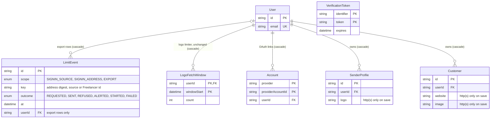

# Data model — security-patch

> **Mode:** brownfield delta. This feature adds one table, `LimitEvent`, with two enum types (`LimitScope`, `LimitOutcome`). It also adds one new delete to the existing account-deletion transaction. Every other entity it touches keeps its schema; they are documented below only as far as this feature reads or writes them.
> **Conventions followed (derived, not imposed):**
> - `prisma migrate` with the split schema `prisma/schema/{base,auth,invoice}.prisma` (architecture-map §Migrations).
> - Quoted PascalCase table names and camelCase columns. `TEXT` ids from `cuid()` (SAD §8 ID strategy). `TIMESTAMP(3)` for timestamps.
> - Native Postgres enums with UPPER_CASE values, as for `Currency` and `InvoiceStatus`.
> - Prisma's default constraint and index names (`_pkey`, `_fkey`, `_idx`). FKs are `ON UPDATE CASCADE`.
> - No `CHECK` constraints or triggers, because the repo uses none.
> - Idempotent DDL guarded with `DO $$ … IF NOT EXISTS`, as in `20260927094537_create_logo_fetch_window`.
>
> **Staged migrations:** `docs/features/security-patch/migrations/01_create_limit_event.{up,down}.sql`. They are **not** in the live `prisma/migrations/` tree yet. `implement` promotes them (see the audit report).

## ER diagram

Only the entities this feature changes or relies on are shown. Most `LimitEvent` rows have no owner: source rows and address-digest rows are keyed by `key` alone. Only export rows carry a `userId`.



`VerificationToken` has no FK to `User`. It is keyed by the email identifier, and account deletion removes it explicitly (below).

## Entities

**Aggregate roots, inferred from the ACs and ADRs.** `User` (the Freelancer) stays the root of the account and its owned aggregates, which this feature leaves unchanged. `LimitEvent` is infrastructure, like `LogoFetchWindow`, but it is not always owned by a `User`:
- **Export rows** belong to the Freelancer. They carry `userId`, and the User delete cascades them.
- **Sign-in rows** (per source, per address) belong to no account. A Visitor's address may have no account at all, and a source never maps to one. The account-deletion transaction removes address rows by digest, and the retention sweep removes the rest (ADR-0007).

### `LimitEvent` ★ new (ADR-0002, ADR-0005, ADR-0007)

| Column | Type | Constraints | Notes |
|---|---|---|---|
| `id` | TEXT | PK, `cuid()` (app-generated) | lets the export path update its own `STARTED` row to `FAILED` (ADR-0002) |
| `scope` | `"LimitScope"` enum | NOT NULL | `SIGNIN_SOURCE` (30 per 5 min), `SIGNIN_ADDRESS` (5 sent per hour), `EXPORT` (3 started per hour) |
| `key` | TEXT | NOT NULL | the Limit key (SAD §12). `SIGNIN_ADDRESS`: lower-case hex HMAC-SHA256 of the folded address under `LIMIT_KEY_SECRET`, never the raw address. `SIGNIN_SOURCE`: the IPv4 address, or the IPv6 /64 network, from `ipAddress()`. `EXPORT`: the Freelancer id |
| `outcome` | `"LimitOutcome"` enum | NOT NULL | see the per-scope table below |
| `at` | TIMESTAMP(3) | NOT NULL DEFAULT CURRENT_TIMESTAMP | event time in UTC. Windows, the retry time and the 24 h purge all read it. **The app always passes it explicitly** (see Time handling) |
| `userId` | TEXT | NULL, FK → `User(id)` ON DELETE CASCADE | set only on `EXPORT` rows (same value as `key`). NULL for sign-in rows |

**Outcomes per scope (which rows exist and what counts):**

| Scope | Outcome | Written when | Counted by |
|---|---|---|---|
| `SIGNIN_SOURCE` | `REQUESTED` | a well-formed request, recorded only while the source is under its limit (flow 1), so one source writes ≤ 30 rows per 5 min however fast it floods | source limit: `count(REQUESTED) where at > now − 5 min` ≥ 30 → limited |
| `SIGNIN_ADDRESS` | `SENT` | after SMTP accepted the link (flow 1, AC-11). Refused, invalid and failed requests write nothing | address limit: `count(SENT) where at > now − 1 h` ≥ 5 → limited |
| `SIGNIN_ADDRESS` | `REFUSED` | the address limit refused a request; **at most one per address per UTC hour** (checked under the lock, flow 1) | lockout alert: a `REFUSED` row in each of the current and the two previous UTC hours |
| `SIGNIN_ADDRESS` | `ALERTED` | the targeted-lockout alert was raised for this digest | alert dedupe: no new alert while an `ALERTED` row exists in the past 24 h ("at most once per address per day", spec §6) |
| `EXPORT` | `STARTED` | before any data is read (flow 6, AC-24 reservation) | export limit: `count(STARTED) where at > now − 1 h` ≥ 3 → `RATE_LIMITED`; retry at `min(at) + 1 h` over the same rows |
| `EXPORT` | `FAILED` | the same row, updated from `STARTED` on a system-side failure, which frees the place (ADR-0002) | not counted |

**Access patterns.** Every check and record for one key runs in one transaction under `pg_advisory_xact_lock(hashtext(scope || ':' || key))` (ADR-0002).
- Window count, retry time, refusal-per-hour and alert-dedupe lookups: `WHERE "scope" = $1 AND "key" = $2 AND "at" > $cutoff [AND "outcome" IN (…)]` → `LimitEvent_scope_key_at_idx` (verified as an index-only scan). `outcome` is filtered after the index, which is cheap: a key holds at most about 30 rows in its window.
- Export release: `UPDATE "LimitEvent" SET "outcome" = 'FAILED' WHERE "id" = $1` → PK.
- Daily sweep (flow 10): `DELETE FROM "LimitEvent" WHERE "at" < $now − 24 h` → `LimitEvent_at_idx`.
- Bounded opportunistic purge on every write (ADR-0007): `DELETE FROM "LimitEvent" WHERE "id" IN (SELECT "id" FROM "LimitEvent" WHERE "at" < $now − 24 h LIMIT 100)` → `LimitEvent_at_idx`. The batch size is an `implement` choice.
- Account deletion: export rows cascade through `LimitEvent_userId_idx`. Address rows are deleted with `WHERE "scope" = 'SIGNIN_ADDRESS' AND "key" = $digest` → `LimitEvent_scope_key_at_idx` (prefix).

**Constraints.**
- PK `id`.
- FK `userId` → `User(id)` ON DELETE CASCADE, indexed.
- The enums reject unknown scopes and outcomes at the DB.
- "At most one `REFUSED` per address per UTC hour" and "`userId` only on `EXPORT`" are app rules enforced under the per-key lock, not DB rules. A unique expression index on the hour bucket would not be representable in the Prisma schema (it would show as drift), and the repo uses no `CHECK`s.

**Time handling.** `at` is `TIMESTAMP(3)` without a time zone, like every repo timestamp. Prisma writes UTC, but the column `DEFAULT CURRENT_TIMESTAMP` and `now()` in raw SQL use the session time zone. Rules for the limiter code:
- Always insert `at` from the app's clock (`new Date()`, or the test clock in `tests/support/clock.ts`).
- Bind every cutoff as a parameter computed in the app. Never use `now()` in a window predicate.
- Compute UTC hour buckets for the lockout alert in the app.

This keeps windows exact whatever the session time zone is, and keeps them testable with the fake clock.

**Convention deviations (deliberate, flagged in the audit):**
- No `createdAt`/`updatedAt`. `at` is the event time, and the only mutation is the `STARTED → FAILED` flip. Precedent: `LogoFetchWindow` and `VerificationToken` have no audit columns.
- The column names `key` and `at` come from ADR-0002 rather than the repo's usual `…At` style. Both are non-reserved words in Postgres, and Prisma quotes every identifier anyway.

**Prisma schema (`prisma/schema/auth.prisma`, next to `LogoFetchWindow`):**

```prisma
enum LimitScope {
    SIGNIN_SOURCE
    SIGNIN_ADDRESS
    EXPORT
}

enum LimitOutcome {
    REQUESTED
    SENT
    REFUSED
    ALERTED
    STARTED
    FAILED
}

model LimitEvent {
    id      String       @id @default(cuid())
    scope   LimitScope
    key     String
    outcome LimitOutcome
    at      DateTime     @default(now())
    userId  String?

    user User? @relation(fields: [userId], references: [id], onDelete: Cascade)

    @@index([scope, key, at])
    @@index([at])
    @@index([userId])
}
// and on User:  limitEvents LimitEvent[]
```

`prisma migrate diff --from-schema prisma/schema --to-schema <schema with this model>` produces exactly the DDL in the staged `.up.sql` (minus the idempotency guards), so promotion leaves no drift.

### `User` (unchanged schema; new relation field, new deletion step)

- **Relation:** `limitEvents LimitEvent[]` (Prisma-side only, no column).
- **Account deletion (`lib/services/account/account.ts` `deleteAccount`, ADR-0007, spec §6.1).** The existing `$transaction` gains one step, before the `User` delete:

```ts
prisma.limitEvent.deleteMany({
  where: { scope: 'SIGNIN_ADDRESS', key: addressLimitKey(user.email) },
}),
```

  `EXPORT` rows go through the `userId` cascade. `SIGNIN_SOURCE` rows never map to an account, so they are left to the 24 h sweep. Because the digest folds case, `+tag` and Gmail dots, this also removes the rows of every other spelling of the same mailbox, which is the intended grouping (AC-12).
- **Email identity:** unchanged. `User.email` stays `@unique`, and `normalizeIdentifier` keeps the identity normalization (lower-case + trim). The folded limit key never decides account identity (AC-03).

### `VerificationToken` (unchanged)

- AC-17's 254-character and ASCII-only rule is applied in `normalizeIdentifier` before Auth.js writes a token. There is no column change (`identifier` stays `TEXT`) and no `CHECK`.
- A limited request still leaves one unused token row (SAD §11, Low). It expires on its own, and the per-source limit bounds how many one source can create.

### `Customer`, `SenderProfile` (unchanged schema; new write rule)

| Table | Column | Rule this feature adds (AC-21) |
|---|---|---|
| `Customer` | `website`, `image` | a new or changed value must be an `http:` or `https:` URL, enforced in the zod schemas in `lib/validations/`. No DB constraint, per the repo's no-CHECK convention |
| `SenderProfile` | `logo`, and any other URL field the forms accept | same |
| `Invoice` | the snapshot copies of these fields | never rewritten. A non-web value saved before this change renders as plain text (UI rule, SAD §6 flow 7) |

**No backfill.** AC-21 says stored data is not rewritten, so there is no expand → backfill → contract here.

## Indexes

New only. Every other query in the §6 flows is served by an existing index or by none (single-row PK reads).

| Index | Columns | Query it serves |
|---|---|---|
| `LimitEvent_pkey` ★ | (`id`) | flow 6: the export release flip `STARTED → FAILED` by id |
| `LimitEvent_scope_key_at_idx` ★ | (`scope`, `key`, `at`) | flow 1: the source count (5 min) and the address count (1 h), the refusal-per-UTC-hour check, the 3-consecutive-hours lockout check and the alert dedupe. Flow 6: the export count and the "export again at" `min(at)`. Account deletion: the address-digest delete (prefix) |
| `LimitEvent_at_idx` ★ | (`at`) | flow 10: the global daily sweep across every key; ADR-0007: the bounded opportunistic purge on every write |
| `LimitEvent_userId_idx` ★ | (`userId`) | FK index: the `User` delete cascade in account deletion (ADR-0007) |

**Not added:** an index that includes `outcome`. After the `(scope, key, at)` range scan, the `outcome` filter reads at most about 30 rows per key, and a wider index would only cost writes.

## Test fixtures

Not generated here: the `LimitEvent` Prisma type does not exist until `implement` promotes the migration, so a factory written now would not type-check. Precedent: architecture-hardening built its `LogoFetchWindow` factory in its migration task. The `tasks` stage should put these in the DoD of the `layer: migration` task:

- `createLimitEvent(prisma, overrides)` in `tests/support/factories/limit-event.ts`, following `tests/support/factories/logo-fetch-window.ts`. Defaults: `scope: 'SIGNIN_SOURCE'`, `key: '203.0.113.7'` (an RFC 5737 documentation address), `outcome: 'REQUESTED'`, `at: new Date()`. `EXPORT` rows require `userId` and set `key` to the same value.
- Address keys in fixtures are digests of `user-<n>@example.test` under a test-only `LIMIT_KEY_SECRET`. No real-looking addresses or real network addresses.
- Add `'LimitEvent'` to `APP_TABLES` in `tests/support/db/truncate.ts`, before `'User'`.

No seeds: the feature adds no bootstrap or lookup data.
