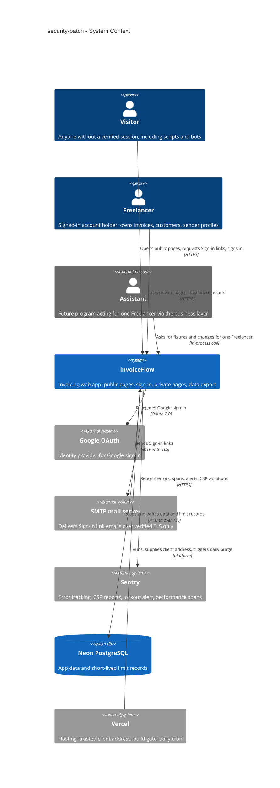
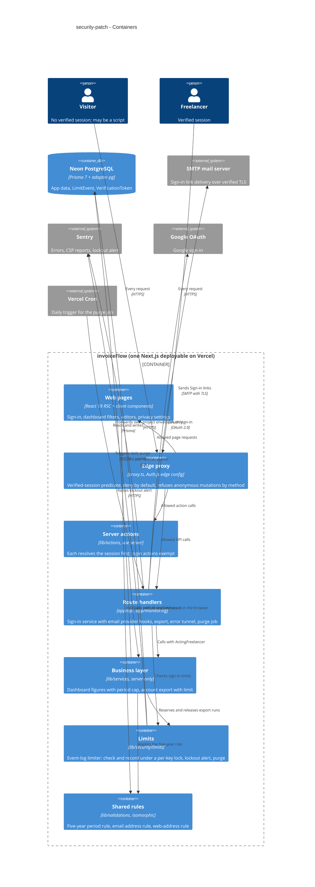

# Software Architecture Document — security-patch

<!-- 12 Arc42 sections. Empty section → <!-- N/A: <one-line reason> -->. -->
<!-- C4 Context (L1) lives inline in §3. C4 Container (L2) lives inline in §5. -->
<!-- Numbers in §10 come VERBATIM from spec.md §6 NFR — no inventing, no rounding. -->

## 1. Introduction and goals

**Intent.** Close the holes in invoiceFlow's current public surface before it becomes a public portfolio demo and gains an in-app AI chat (spec §1, §2). The feature upgrades the framework, sign-in and mail components to versions with no critical or high production advisory. It makes "signed in" mean a verified session and nothing else. It bounds what a Visitor can make the app do: Sign-in link emails per address and per source, the custom Dashboard period, and data exports per Freelancer. It sends mail only over verified TLS and refuses anonymous server actions however the request is shaped. Finally, it gives the browser a baseline content-security policy and transport headers, and closes the open error-reporting relay. Every hole is closed at the point all callers pass through, not only in the page the brief cites.

**Top-3 quality goals (1-liners; full scenarios in §10):**

1. **Fail-closed auth boundary.** Nothing private is served without a verified session, whatever shape the request takes and even when the sign-in check itself errors (AC-04, AC-18).
2. **Bounded abuse cost without enumeration.** Sign-in emails, the Dashboard period and data exports are capped. A limited sign-in request is indistinguishable from a sent one in wording and timing (spec §6: ≤ 150 ms median difference; dashboard p95 ≤ 2 s).
3. **Core flows survive the hardening.** Sign-in, the dashboard chart, invoice PDFs and client error reporting keep working under the enforced policy and the upgraded components: zero policy violations (AC-20), and browser error events still arrive (spec §6).

**Stakeholders.**

| Role | Interest | Sign-off owner? |
|---|---|---|
| Freelancer | Account and data never exposed; email sign-in keeps working; dashboard and export stay usable within the caps | No |
| Visitor | Can sign in (link or Google) without being able to abuse the app; sees no difference between a sent and a limited link | No |
| Assistant | Future business-layer caller; gets a plain refusal for an over-long Dashboard period (AC-10) and is subject to the same export limit | No |
| App operator | Receives the targeted-lockout alert and CSP violation reports in error tracking | No |
| Security Lead | Reviews the auth-boundary change, the new personal data in limit records and the headers (`/security-review` before ship) | Yes (security review) |
| Tech Lead | SAD approval | Yes |

## 2. Constraints

**Technical.**
- TypeScript 5 (strict) on Node 22, pnpm 10.
- Next.js 16.1.1 → **16.3.x** (App Router; the edge guard is `proxy.ts`), with `eslint-config-next` moved in step. React 19.2.
- next-auth 5.0.0-beta.30 → **5.0.0-beta.32** (`@auth/core` ≥ 0.41.3). Providers are Google and Nodemailer, with JWT sessions (30-day lifetime) and the Prisma adapter. `auth.config.ts` must stay edge-safe: no Prisma or Nodemailer imports.
- nodemailer 7 → **10.x**.
- Prisma 7.2 → **latest 7.x** (`@prisma/client`, `prisma`, `@prisma/adapter-pg`) over Neon PostgreSQL. The schema is split under `prisma/schema/` and migrated with `prisma migrate`. `@prisma/extension-accelerate` is removed (AC-27).
- Hosting: Vercel serverless functions in `iad1`. No memory is shared between invocations, so any counter lives in Postgres, the only shared store.
- Sentry 10 (`@sentry/nextjs`), production only; browser events go through the `/monitoring` tunnel.
- Tests: Vitest unit (`pnpm test:unit`) and integration against a throwaway Postgres container (`pnpm test:integration`), Playwright e2e (`pnpm test:e2e`). CI (`.github/workflows/test.yml`) runs lint, typecheck, unit and integration on every PR. `next build` runs in the Vercel preview deploy for every PR.

**Organisational.**
- Effort budget: about one sprint (≈ 2 weeks) for one developer.
- Deadline (hard): merged before `ai-chat` starts and before the demo URL is shared publicly.
- The framework, sign-in and mail upgrades ship together in one change (spec §1 decision). The accepted cost is harder bisecting.

**Conventions.**
- Deny by default in `proxy.ts`, with one public allowlist in `config/routes.config.ts` (architecture-hardening ADR-0001). Route handlers re-check the session through `actingFreelancerForRoute()` / `requireSession()`.
- A session without a live account is a Visitor (architecture-hardening ADR-0002).
- Business functions live in `lib/services/` behind `server-only` and lint bans (service-layer ADR-0006). They take a branded `ActingFreelancer` (service-layer ADR-0001) and return the `ActionResult` union with typed codes (service-layer ADR-0002, architecture-hardening ADR-0009).
- No new external service for rate limiting; Postgres is the counter store (architecture-hardening ADR-0008 precedent).
- Zod schemas per entity in `lib/validations/`, shared by forms and actions. IDs are `cuid()`. Migrations are named `YYYYMMDDhhmmss_snake_case`.

**Regulatory / external.**
- Limit records hold personal data: a keyed digest of the normalized email address and a network source address. They are kept ≤ 24 h, never shown to anyone, purged by a sweep that covers every key, and removed on account deletion where they map to an account (spec §6.1).
- Security review is required before ship (`/security-review`), because the feature changes the authentication boundary.
- No other compliance regime applies to this feature.

## 3. Context and scope

invoiceFlow is a Next.js invoicing app for Freelancers, about to be shared publicly as a demo. This feature does not add a new product capability. It hardens the existing boundary between the public internet (Visitors, including scripts and bots) and each Freelancer's private data, and it bounds what an anonymous or signed-in caller can make the app spend: emails, CPU and export runs.

<!-- brownfield: Next.js 16 App Router monolith on Vercel; deny-by-default proxy.ts, business layer in lib/services (server-only), Postgres via Prisma 7, Auth.js v5 beta with JWT sessions, Postgres sliding-window limiter precedent (LogoFetchWindow). Scanned at e857fa5; docs/architecture-map.md (ded1be7) predates the service layer. -->

**External systems (in / out):**

| Actor or system | Type | Interaction |
|---|---|---|
| Visitor | Person | Opens public pages; requests a Sign-in link or signs in with Google; may be a script calling endpoints directly. Untrusted. |
| Freelancer | Person | Uses private pages, the dashboard (Dashboard period), the editors and the data export with a verified session |
| Assistant | Person (future, external program) | Calls the business layer for exactly one Freelancer; today exercised only by direct business-layer tests (AC-10) |
| Google OAuth | System (external) | Identity provider for Google sign-in; unaffected by the sign-in-email limits (AC-14) |
| SMTP mail server | System (external) | Delivers Sign-in link emails. Must offer TLS with a certificate valid for its host name, or nothing is sent (AC-16). |
| Sentry | System (external) | Error tracking: server and browser errors (browser events through the app's tunnel), CSP violation reports, the targeted-lockout alert to the app operator, dashboard and sign-in spans for the NFRs |
| Neon PostgreSQL | System (external, managed) | The only shared store: app data, sessions' account lookup, and the new limit records |
| Vercel | System (external platform) | Runs the app. It is the only trusted source of the client network address and runs the daily retention job (cron). The build there fails the deploy when required settings are missing (AC-26). |

**Trust boundary.** Everything a Visitor sends is untrusted: headers, body, form fields, the `Next-Action` marker and query parameters. The client network address is taken only from the hosting platform, never from a header the client can set (spec §6.1). The Sign-in link address is untrusted until the link is opened (glossary: *Sign-in link*).

**C4 Context (L1):**



## 4. Solution strategy

**Target surfaces.** `[backend-service, web-frontend]`. Both are parts of the existing Next.js deployable: server-side proxy, route handlers, server actions and the business layer on one side, browser-delivered pages on the other. The feature introduces no new container. It changes server behaviour and adds three messages and two field messages to existing screens (SCR-01, SCR-04, SCR-06, SCR-07, SCR-08 in `ux-flows.md`). Inline, no ADR: both surfaces are given by the repo, so there is no alternative to choose between.

**UI architecture (web-frontend).** Keep the existing hybrid: React Server Components render on the server, and client components handle interactive parts (the dashboard filters, the sign-in form, the export button). The new messages reuse the existing shadcn/ui primitives and tokens from `docs/design-system.md`. No new primitive and no new client state library. Inline: unchanged from today.

**Top strategic choices (the seeds for ADRs):**

1. **Enforce the sign-in-email rules where every sign-in route converges: the Auth.js email provider hooks** ([ADR-0001](adr/0001-enforce-sign-in-email-rules-inside-the-auth-js-email-provider-hooks.md)). `normalizeIdentifier` applies the address rule (≤ 254 characters, ASCII only) while keeping identity normalization unchanged (AC-03). `sendVerificationRequest` applies the per-address and per-source limits, the equal response time and the TLS-only send. Both the `/login` action and direct calls to the sign-in service pass through these hooks; Google sign-in never does (AC-14). Serves quality goals 1 and 2.
2. **Count limited events exactly, in one Postgres event log** ([ADR-0002](adr/0002-count-limited-events-in-a-postgres-event-log-under-a-per-key-advisory-lock.md)). A new `LimitEvent` table holds one row per counted event. A per-key advisory lock makes check-then-insert safe under concurrency. The same shape gives sent-only counting, export reservation and release, the exact "export again at …" time, refusals per hour for the lockout alert, and a single global 24 h purge. No new external service (§2). The logo limiter stays as it is. Serves quality goal 2.
3. **Refuse anonymous mutations by method at the edge, and backstop every action with a guard that CI checks** ([ADR-0003](adr/0003-refuse-anonymous-mutations-in-the-proxy-by-method-and-backstop-with-a-scanned-action-guard.md)). Without a verified session, every request that is not GET, HEAD or OPTIONS is refused before the public-path check, except `/api/auth/*` and POSTs to `/login`. Every exported server action outside `login-actions.ts` resolves the session first, and a unit scan fails CI otherwise. Serves quality goal 1.
4. **Define the five-year Dashboard period boundary once, in an isomorphic module** ([ADR-0004](adr/0004-share-one-calendar-date-five-year-period-rule-across-link-filter-and-business-layer.md)). The link reader falls back, the filter shows a notice and the business layer refuses, all through the same calendar-date rule (AC-08). Serves quality goal 2 (dashboard p95 ≤ 2 s for any link).
5. **"Signed in" means a verified session, decided by one predicate, and a failed check never ends a session.** `isVerifiedSession(x)` is true only when `x?.user?.id` is a non-empty string.
   - The edge config gains an edge-safe `session` callback that copies the JWT's account id into `session.user.id`. The Node config keeps its live-account lookup (architecture-hardening ADR-0002).
   - `proxy.ts`, `requireSession()` and `getAuthenticatedUser()` / `actingFreelancerFromSession()` all use the predicate, so an Auth.js error object or any other truthy non-session is a Visitor (S2, AC-04).
   - The proxy's `catch` branch becomes the ordinary Visitor branch. Public paths render, private pages redirect to sign-in, data and action requests get the 401. It no longer clears session cookies, so a Freelancer is signed in again once the check recovers (AC-04, AC-06).
   - Inline: this extends architecture-hardening ADR-0001 and ADR-0002 rather than choosing between alternatives.
6. **Upgrade in one change, then harden.** Next.js 16.3.x, next-auth 5.0.0-beta.32, nodemailer 10.x and Prisma's latest 7.x land in one change (spec §1 decision), followed by removal of `@prisma/extension-accelerate`. Every hardening step above is built against the upgraded APIs, so the provider hooks and the proxy are written once. Serves quality goal 3 (AC-01, AC-02, AC-27).

Each tactical decision in later sections traces to one of these seeds. A tactical decision that contradicts one is surfaced in §11.

## 5. Building block view

The feature keeps the repo's layering unchanged. Edge proxy → pages, server actions and route handlers → business layer (`lib/services`, `server-only`, `ActingFreelancer` in, `ActionResult` out) → Prisma. It adds three small modules, each with one job:
- `lib/security/limits/` counts limited events (ADR-0002).
- `lib/auth/email-provider.ts` holds the Auth.js email hooks (ADR-0001).
- A dependency-free rules module under `lib/validations/` is shared by browser and server (ADR-0004).

Business functions stay the only place business rules live. Route handlers and actions only resolve the caller and map results. The export limit lives in the business layer and refuses with a typed `RATE_LIMITED` result ([ADR-0005](adr/0005-limit-exports-in-the-business-layer-and-refuse-with-a-typed-rate-limited-result.md)). The open error relay is replaced by an app-owned tunnel that forwards only the configured DSN ([ADR-0006](adr/0006-forward-browser-error-reports-through-an-app-owned-tunnel-that-accepts-only-the-configured-dsn.md)).

**Internal decomposition (new or changed):**

```
proxy.ts                                  # verified-session predicate; refuse anonymous non-GET before isPublicPath (ADR-0003); catch = Visitor, cookies untouched
auth.config.ts                            # + edge-safe session callback copying the JWT account id to session.user.id
auth.ts                                   # Nodemailer provider wired to lib/auth/email-provider.ts
lib/
├── auth/
│   └── email-provider.ts                 # normalizeIdentifier (identity unchanged + 254/ASCII rule), sendVerificationRequest (limits, response floor, TLS-only send)
├── security/
│   ├── logo-rate-limit.ts                # unchanged (architecture-hardening ADR-0008)
│   └── limits/
│       ├── limit-store.ts                # LimitEvent check-and-record under pg_advisory_xact_lock, release, purge
│       ├── scopes.ts                     # signin-address (5/h, sent only), signin-source (30/5 min), export (3/h, started minus failed)
│       ├── keys.ts                       # address limit key (case, +tag, Gmail dots folded; keyed digest), source key (IPv4, IPv6 /64)
│       └── lockout-alert.ts              # 3 consecutive UTC hours with a refusal → one Sentry alert per address digest per day
├── helpers/
│   ├── verified-session.ts               # isVerifiedSession(x): x?.user?.id is a non-empty string (edge-safe)
│   ├── route-auth.ts                     # requireSession() uses the predicate
│   └── auth-helpers.ts                   # getAuthenticatedUser() uses the predicate
├── validations/
│   ├── dashboard-period.ts               # isWithinMaxCustomPeriod, MAX_CUSTOM_PERIOD_YEARS = 5 (isomorphic, ADR-0004)
│   ├── auth.ts                           # loginEmailSchema aligned to ≤ 254 chars, ASCII only
│   ├── web-address.ts                    # http(s)-only rule for website / image / logo fields (AC-21)
│   └── search-params.ts                  # dashboard link reader applies the shared period rule
├── services/
│   ├── dashboard/period.ts               # parseDashboardInput refuses > 5 years before any query (AC-10)
│   └── account/account.ts                # getAccountExport reserves / releases an export place (ADR-0005)
├── get-email-server-config.ts            # secure on 465, requireTLS otherwise, certificate checked against host
└── env/required-settings.ts              # required-settings list read by the build check (§7)
types/result.ts                           # + RATE_LIMITED code, RETRY_AT details
app/
├── monitoring/route.ts                   # app-owned tunnel, own DSN only (ADR-0006)
└── api/
    ├── user/export/route.ts              # maps RATE_LIMITED → 429 + Retry-After
    └── cron/purge-limits/route.ts        # daily purge, Vercel Cron secret (§7)
components/                               # three messages + field messages on existing screens; legacy non-web values as plain text
prisma/schema/auth.prisma                 # + LimitEvent model (shape fixed by the data-model stage)
```

**C4 Container (L2):**



## 6. Runtime view

<!-- 🎯 Why: the RUNTIME FLOW of 1–2 critical scenarios — who talks to whom, when, in what order.
     Without §6, §5 is just boxes with no life.
     📋 Write: a Mermaid sequenceDiagram. Participants are names from §5 (don't invent new ones).
     Messages are semantic («saves a draft»), NO HTTP verbs / paths / status codes — endpoint-level
     sequences arrive at the `api` stage.
     📌 e.g. «author → web: composes draft → web → content API: save». Seed the primary flow(s) here;
     the `sequences` stage then covers every §5 AC (no cap). Never N/A for M+; XS/S keeps ≥1 happy-path flow. -->

**Critical flow 1: <flow name>**

```mermaid
sequenceDiagram
    actor Actor
    participant Web
    participant Service
    participant Store
    Actor->>Web: <action>
    Web->>Service: <call>
    Service->>Store: <write>
    Store-->>Service: ok
    Service-->>Web: result
    Web-->>Actor: confirmation
```

**Critical flow 2: <e.g. async event propagation>** — <if applicable, otherwise N/A>.

## 7. Deployment view

<!-- 🎯 Why: the TOPOLOGY DevOps must know without reading the deploy charts — how many replicas,
     where the background worker lives, AT WHAT NUMBERS we scale.
     📋 Write: 2–3 sentences on topology + monitoring + concrete threshold numbers.
     📌 e.g. «500 authors → partition by quarter» (not «we'll think about scale later»).
     🎯 N/A allowed for XS/S that reuses an existing deployment unit with no change.
     Deployment-diagram scaffold → templates/deployment.md. -->

<Topology in 2–3 sentences. Where it runs, replicas, scaling thresholds.>

**Monitoring:**
- <Metrics — e.g. `<metric_name>`>
- <Alerts — e.g. «worker lag > 10 min → page on-call»>
- <Tracing — e.g. spans on the request boundary>

**Scaling thresholds:**
- <e.g. comfortable in one table up to N rows/year>
- <e.g. partition by quarter above N rows/year>

<!-- For XS/S with no deployment change: <!-- N/A: reuses existing deployment unit, no infra change --> -->

## 8. Crosscutting concepts

<!-- 🎯 Why: CROSS-CUTTING PATTERNS spanning several modules: logging, errors, authorization, ID
     strategy, events, caching. ⭐ The second-densest section. A pattern inside one module is NOT
     here; a project-wide convention belongs in the convention file.
     📋 Write: a table — concept / convention / where defined. One row per concept.
     📌 e.g. «sortable time-based IDs generated in the app layer» as a default from the convention file. -->

| Concept | Convention | Where defined |
|---|---|---|
| Logging | <e.g. structured, fields `module=<name>`> | <convention file §X or here> |
| Authentication | <e.g. token-based via middleware> | <convention file §X> |
| Error handling | <e.g. domain sentinel → ports error mapping → JSON> | <convention file §X> |
| ID strategy | <e.g. sortable time-based ID in the app layer> | <convention file §X> |
| Internationalisation | <e.g. N/A, single language> | — |
| Observability | <e.g. tracing on the request boundary> | — |
| Events | <module-specific patterns, if any> | <here> |

## 9. Architecture decisions

<!-- 🎯 Why: the REVERSE INDEX onto the adr/ folder. `ls adr/` gives the files; §9 gives the
     semantics — why they exist, which SAD section they attach to, what status.
     📋 Write: a 4-column table, one row per ADR. Mixed status is fine.
     📌 e.g. «0001 | Store content as a table of typed blocks | Accepted | §4». -->

| # | Title | Status | Section |
|---|---|---|---|
| <NNNN> | <imperative — e.g. "Use a sliding-window counter for rate limiting"> | Accepted | §<N> |
| <NNNN> | <imperative — e.g. "Co-locate the worker in the API process"> | Accepted | §<N> |

ADR files live under `docs/features/<slug>/adr/NNNN-<title>.md`.

## 10. Quality requirements

<!-- 🎯 Why: the QUALITY TREE — take a goal from §1 and break it into concrete leaves: tests,
     metrics, configs, drills. ⭐ Without §10, §1 is a manifesto. With §10 each declaration maps
     to something PROVABLE.
     📋 Write: per §1 goal — When / Then / How-verify. Numbers from spec §6 NFR VERBATIM (don't
     round ≤250ms to ≤300ms — that's a critic F6 hit).
     📌 e.g. «p95 ≤ 500 ms on a block update, verified by a 100 req/s load test». -->

Each top-3 goal from §1 expanded into a full scenario:

**QG-1. <quality attribute>**
- **When:** <trigger condition>
- **Then:** <expected behaviour with numbers from spec §6 NFR>
- **How verify:** <test / chaos drill / load test / metric>

**QG-2. <quality attribute>**
- **When:** <trigger>
- **Then:** <expected>
- **How verify:** <how>

**QG-3. <quality attribute>**
- **When:** <trigger>
- **Then:** <expected>
- **How verify:** <how>

## 11. Risks and technical debt

<!-- 🎯 Why: ⭐ collects EVERYTHING that can break — not only the technical. Without §11 risks get
     discussed at standups and lost; debt lives only in the head of whoever accepted it.
     📋 Write: a risk/debt table — severity — mitigation — owner. Accepted debt in its own block.
     📌 The first risk is often a product risk, not a technical one. That's normal. -->

<!-- Severity literals: Low / Medium / High for regular risks; "Open question" for rows created by
     a Save-as-OQ resolution during the Socratic walk (see references/socratic.md). -->

| Risk / debt | Severity | Mitigation | Owner |
|---|---|---|---|
| <e.g. Worker lag may reach hours during a downstream outage> | Medium | <alert >10 min, on-call playbook, retry backoff> | <DevOps> |
| <e.g. No event-schema versioning in v1> | Medium | <ADR-NNNN planned for v2, tolerate unknown fields> | <Backend> |
| Open architectural decision: <decision-headline> | Open question | Resolve before <stage trigger or YYYY-MM-DD>; <inline rationale from the Save-as-OQ> | <owner> |

**Accepted debt (acceptable in v1, plan to fix later):**
- <e.g. the entity is immutable / unversioned — OK for v1, may need audit versioning in v2>

## 12. Glossary

<!-- 🎯 Why: ⭐ the DOMAIN GLOSSARY that ends arguments a year later («checkpoint — weekly or
     biweekly? quarter — calendar or fiscal?»).
     📋 Write: a term / meaning table. Business + technical terms mixed.
     📌 e.g. «Lesson | a unit inside a course made of blocks (text, video)». -->

| Term | Meaning |
|---|---|
| <e.g. domain object A> | <its meaning in this domain> |
| <e.g. domain object B> | <its meaning> |
| <e.g. domain invariant name> | <the rule, in plain language> |
