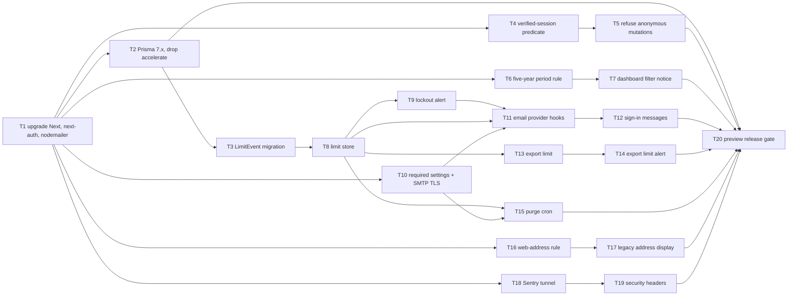

# Epic — security-patch

> **Spec:** [spec.md](../spec.md) · **Design:** [sad.md](../sad.md) · **Data model:** [data-model.md](../data-model.md) · **API:** [openapi.yaml](../contracts/openapi.yaml) + [server-actions.md](../contracts/server-actions.md) · **Screens:** [screens.md](../screens.md) · **ADRs:** [adr/](../adr/)

## Goal

Close the holes in Invoice Forge's public surface before the demo URL is shared and `ai-chat` starts (spec §2). When the epic ships:
- no critical or high advisory affects production packages;
- "signed in" means a verified session, and anonymous mutations are refused whatever their shape;
- Sign-in link emails, the custom Dashboard period and data exports are bounded, and a limited sign-in request looks the same as a sent one;
- the browser gets an enforced content-security policy and transport headers, and the core flows keep working under them.

## Scope

- **In:**
  - dependency upgrades: Next.js, next-auth, nodemailer, then Prisma, with accelerate removed;
  - the edge proxy and session helpers;
  - the Auth.js email provider hooks;
  - a new `LimitEvent` event log with its limit store, lockout alert and daily purge;
  - the export limit in the business layer;
  - shared rules in `lib/validations/` (five-year period, email address, web address);
  - the Sentry tunnel, security headers and the build-time settings check;
  - UI messages on SCR-01, SCR-02, SCR-04 to SCR-10;
  - the preview release gate.
- **Out (spec §3):**
  - replacing the beta sign-in library;
  - an "email sign-in disabled" mode;
  - invoice correctness rules (`invoice-integrity`);
  - Assistant- and AI-specific protections;
  - moving the hosting region;
  - ending sessions on account deletion;
  - rate-limiting the error relay;
  - removing every inline script and style (a nonce policy is a follow-up).

## Decisions taken at this stage (2026-10-02)

- **TD-1:** source limit keys (IPv4 / IPv6 /64) are stored as HMAC-SHA256 under `LIMIT_KEY_SECRET`, like address keys. This resolves the data-model audit flag. There is no schema impact.
- **TD-2:** the lockout-alert dedupe uses a rolling 24 h window (an `ALERTED` row in the past 24 h suppresses a new alert), as `data-model.md` proposes.
- **TD-3:** spec §8 OQ2 keeps its default and non-ASCII addresses are refused. Before T11 merges, the user runs a read-only check of production accounts. If any account has a non-ASCII email, T11 is blocked until the user decides.
- api-sync-report **OQ-1**: the three undrawn error branches are already defined in the contract, and the tasks build to it. **OQ-2**: a spike step inside T12.

## Task map

**Waves (DAG levels):**

| Wave | Tasks |
|---|---|
| 1 | T1 |
| 2 | T2, T4, T6, T10, T16, T18 |
| 3 | T3, T5, T7, T17, T19 |
| 4 | T8 |
| 5 | T9, T13, T15 |
| 6 | T11, T14 |
| 7 | T12 |
| 8 | T20 |

The upgrade (T1) goes first, because every hardening step is built against the upgraded APIs (sad.md §4 choice 6, §11 risk row 1).

**Lanes.** Tasks whose `files_hint` overlap are serialized:

| Shared files | Tasks |
|---|---|
| `package.json` / lockfile | T1 → T2, T10 |
| `proxy.ts` | T4 → T5 |
| `config/routes.config.ts` | T5, T15 |
| `lib/actions/` (T12 edits `login-actions.ts`) | T5, T12 |
| `limit-store.ts` | T8 → T9 |
| `vercel.json` | T15, T19 |
| `next.config.ts` | T18 → T19 |

Compile-coupled: the `ActionErrorCode` extension is folded into T13, so there is no standalone contract task.

## Tasks

See [tracker.md](./tracker.md) for status. Machine contract: [tasks.json](../tasks.json).

| # | Task | Layer | Blocked by | DoD (short) |
|---|---|---|---|---|
| T1 | [Upgrade Next.js, next-auth, nodemailer in one change](./t01-upgrade-framework-auth-mail.md) | wiring | — | suite green; same-account sign-in after upgrade (AC-03) |
| T2 | [Upgrade Prisma to latest 7.x, remove accelerate](./t02-prisma-upgrade-drop-accelerate.md) | wiring | T1 | separate commit; suite green (AC-27) |
| T3 | [Promote the LimitEvent migration](./t03-limit-event-table.md) | migration | T2 | applies + reverts; diff empty; factory + truncate |
| T4 | [Verified-session predicate](./t04-verified-session-predicate.md) | ports | T1 | error object / thrown check = Visitor, cookies kept |
| T5 | [Refuse anonymous mutations + action guard scan](./t05-refuse-anonymous-mutations.md) | ports | T4 | anonymous non-GET → 401; scan fails on unguarded action |
| T6 | [Shared five-year period rule](./t06-five-year-period-rule.md) | domain | T1 | boundary table test; link fallback; service refuses |
| T7 | [Dashboard filter notice](./t07-dashboard-filter-notice.md) | ui | T6 | over-long range not applied, notice shown |
| T8 | [LimitEvent limit store](./t08-limit-store.md) | infra | T3 | exact windows under concurrency; HMAC keys; fail-closed |
| T9 | [Lockout alert](./t09-lockout-alert.md) | infra | T8 | one alert after 3 UTC hours, none again within 24 h |
| T10 | [Required settings + SMTP TLS](./t10-mail-settings-and-tls.md) | wiring | T1 | build names missing settings; no plaintext send |
| T11 | [Email provider hooks](./t11-email-provider-hooks.md) | app | T8, T9, T10 | limits, floor ≤ 150 ms, fail-closed, both routes |
| T12 | [Sign-in messages](./t12-sign-in-messages.md) | ui | T11 | fixed messages by error type; neutral check-inbox copy |
| T13 | [Export limit (RATE_LIMITED)](./t13-export-limit.md) | app | T8 | 3/h per Freelancer; 429 + Retry-After; deletion cleanup |
| T14 | [Export limit alert](./t14-export-limit-alert.md) | ui | T13 | inline alert with local retry time |
| T15 | [Purge cron](./t15-purge-cron.md) | ports | T8, T10 | wrong secret → 401; deletes > 24 h across keys |
| T16 | [Web-address rule](./t16-web-address-rule.md) | domain | T1 | http(s) only in forms and services |
| T17 | [Legacy address display](./t17-legacy-address-display.md) | ui | T16 | plain text, no src, no data: logo in PDF |
| T18 | [Sentry tunnel](./t18-sentry-tunnel.md) | ports | T1 | own DSN forwarded, others 403 |
| T19 | [Security headers](./t19-security-headers.md) | wiring | T18 | exact CSP + HSTS + Permissions-Policy served |
| T20 | [Preview release gate](./t20-preview-release-gate.md) | tests | T2, T5, T7, T12, T14, T15, T17, T19 | zero CSP violations; genuine-session sweep; 0 crit/high |

## Risks / Hard rules

- **Fail-closed auth boundary.** Nothing private is served without a verified session. A failed check is a Visitor and never clears cookies (sad.md §1 QG-1, §8 Authentication).
- **Sign-in fails closed.** No email is sent when the limits cannot be checked (spec §6). A refused or failed request never counts towards the address limit.
- **No enumeration.** A limited sign-in request matches a sent one in wording, status and timing: median difference ≤ 150 ms, p95 ≤ 1.5 s (spec §6).
- **Personal data.** Never log or report a raw email or network address. Only digests are stored, and only the address digest appears, in the lockout alert (sad.md §8 Logging, TD-1). Limit records are kept ≤ 24 h and deleted on account deletion (spec §6.1).
- **Time handling.** Every `LimitEvent.at` comes from the app clock, and every cutoff is a bound parameter. Never use `now()` in a predicate (data-model.md §Time handling).
- **Layering.** Business rules stay in `lib/services` (server-only). The shared rules in `lib/validations/` stay dependency-free (ADR-0004). `auth.config.ts` stays edge-safe, with no Prisma or Nodemailer import (sad.md §2).
- **DB safety.** Migrations run only on the throwaway test container or the dev DB. Production checks (TD-3, the preview and production gates in T1 and T20) are run by the user.
- **Upgrade risk** (sad.md §11, High). T1 lands alone, then T2 lands as its own commit, with the suite run between the two, so a regression bisects to one of them.
