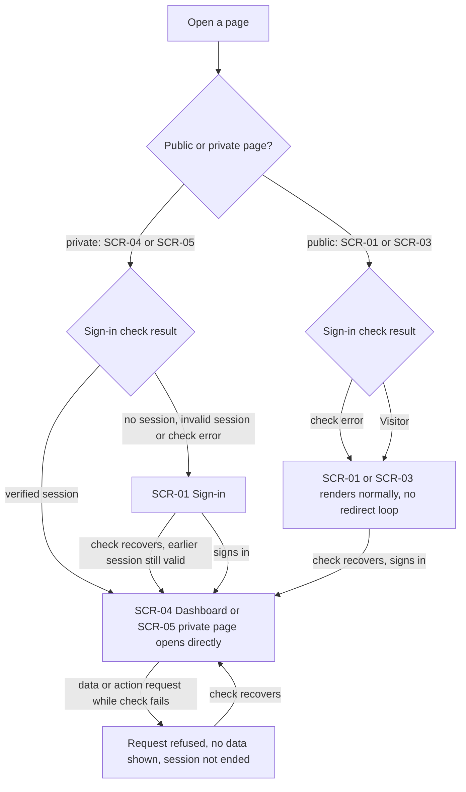
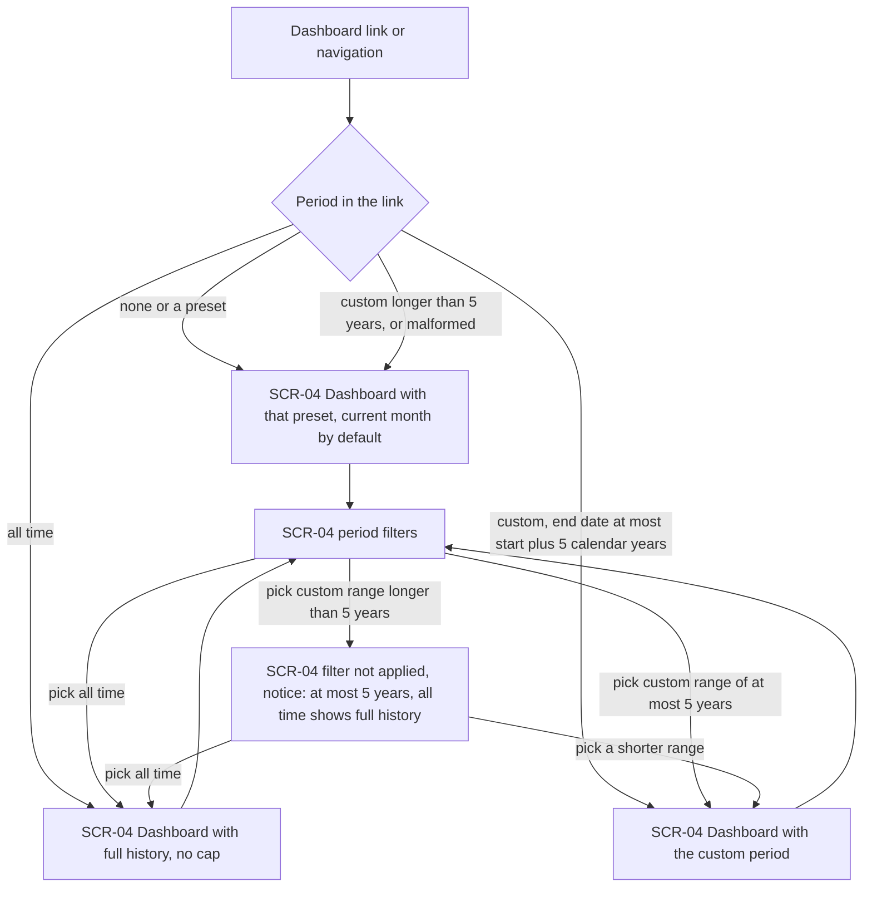
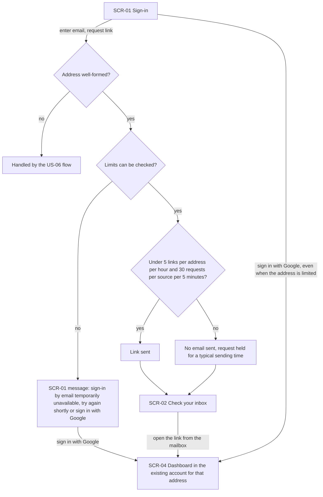
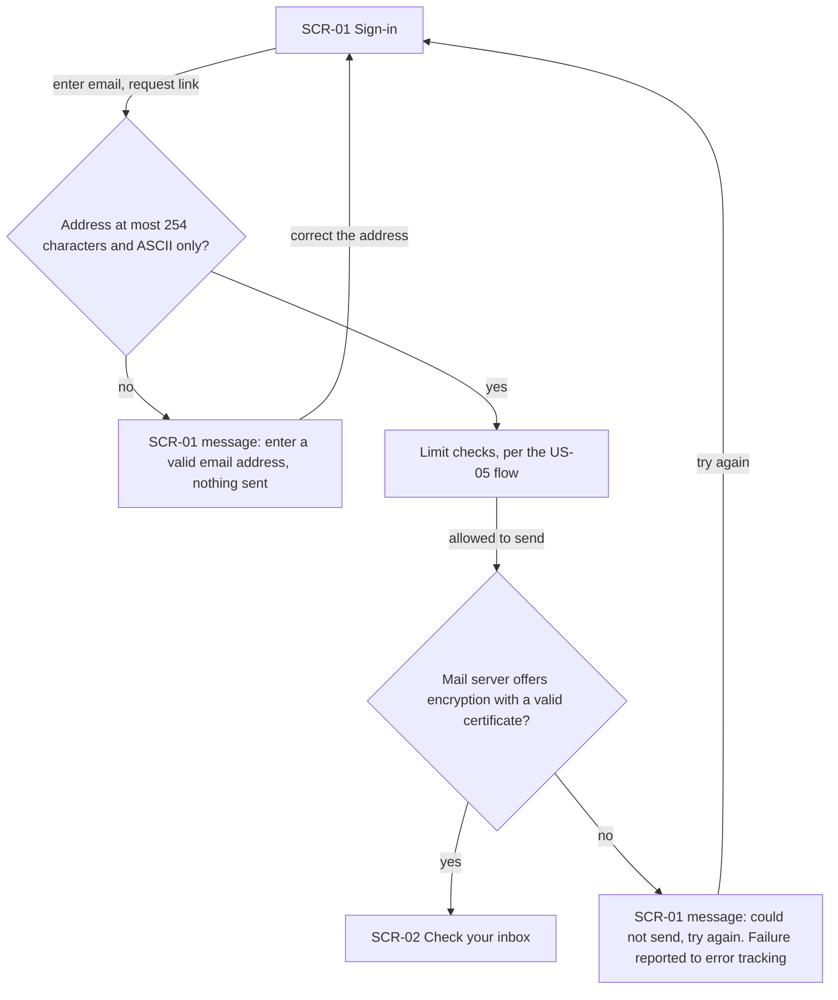
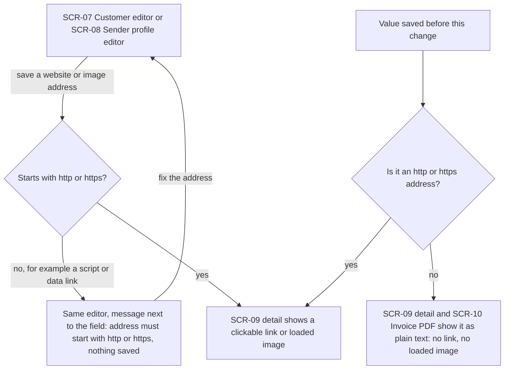
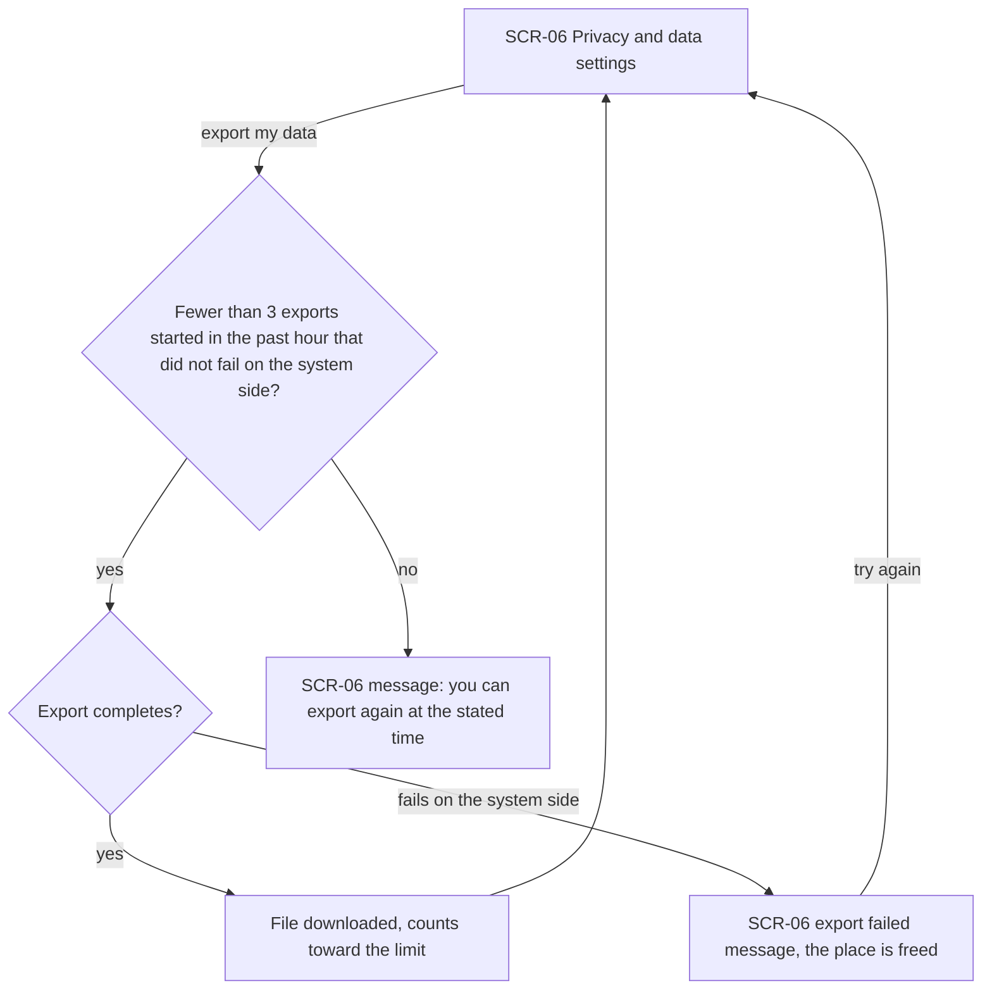

# UX flows — security-patch

> User flows for every UI-touching §4 user story, produced by `ux-flows` (after `clarify`, before
> `design`) and read by `design` (evidence for the target-surface + UI-architecture decisions),
> `sequences` (UI-driven flows align on SCR ids), `screens` (details every inventory row) and
> `plan-tests` (the e2e-through-UI paths). **Always markdown + mermaid `flowchart`**, whatever the
> design tool — this artifact is flow-altitude, not visual design.

## Platform decisions

- **Posture:** responsive-both. This keeps the app's current behaviour: the same screens serve desktop and mobile. `docs/design-system.md` is code-only and doesn't state a posture, so this comes from the existing app (and matches architecture-hardening's flows).
- **No new pages.** Every screen below already exists. This feature adds only new branches and messages to them: the 5-year notice in the dashboard filters (AC-07b), "sign-in by email temporarily unavailable" on sign-in (AC-15) and "you can export again at …" in privacy settings (AC-24), plus field messages for invalid email and web addresses.
- **Refusals keep the user where they are.** An invalid email, a non-web address, an over-long period picked in the filters and a limited export all return to the same screen with a message. Nothing navigates away and nothing is silently corrected.
- **A limited sign-in-email request looks exactly like a sent one.** Both end on the "check your inbox" screen with the same wording and a comparable wait. The flow never shows the Visitor that a limit was hit (AC-12, AC-13). Only the "cannot check the limits" case (AC-15) gets its own message.
- **A link the system won't honour falls back; it never errors.** A dashboard link with an over-long or malformed custom period silently shows the default period (the current month). Only the filters, where the Freelancer is actively choosing, explain the 5-year cap.
- **Anything short of a verified session is a Visitor.** Private pages send such a request to sign-in (SCR-01); public pages (SCR-01, SCR-03) still render when the sign-in check fails, so there is never a redirect loop.
- **Old non-web values are shown, not rewritten.** A website or image address saved before this change that isn't http(s) appears as plain text wherever it is displayed: no link, no loaded image.

## Screen inventory

| ID | Screen | Purpose | Entry | Exit |
|---|---|---|---|---|
| SCR-01 | Sign-in | Request a Sign-in link or sign in with Google; shows the invalid-address, "temporarily unavailable" and "could not send" messages | Landing page, any private page without a verified session | SCR-02 (link requested), SCR-04 (Google sign-in) |
| SCR-02 | Check your inbox | Neutral confirmation after a Sign-in link request, identical whether the link was sent or limited | Link request on SCR-01 | The Visitor's mailbox (outside the app); opening the link leads to SCR-04 |
| SCR-03 | Landing page | Public entry to the app | Direct visit, shared demo URL | SCR-01 |
| SCR-04 | Dashboard | Figures for a Dashboard period (preset or custom), with period filters | After sign-in, app navigation, bookmarked or shared link | Other private pages |
| SCR-05 | Other private page | Any private page other than the dashboard (invoices, customers, products, sender profiles, settings) | App navigation, direct link | App navigation |
| SCR-06 | Privacy & data settings | Start a full data export | Settings navigation | File download; stays on SCR-06 when refused |
| SCR-07 | Customer editor | Create or edit a Customer, including the website | Customers list or Customer detail | SCR-09 after save |
| SCR-08 | Sender profile editor | Edit a sender profile, including its website and logo address | Sender profiles list or detail | SCR-09 after save |
| SCR-09 | Customer / sender profile detail | Shows saved details, including web and image addresses | Lists, after a save on SCR-07 / SCR-08 | SCR-07 / SCR-08, app navigation |
| SCR-10 | Invoice PDF | Invoice preview, download or print, showing the copy of the customer and sender details kept on the invoice | PDF actions on the invoice list or editor | Back to the originating screen |

## Flows

Out of scope for drawing (no human-facing screen of their own):

- **US-01 — Run on patched components.** A dependency upgrade with no new screen. Its UI-visible checks (AC-02 sign-in and page sweep, AC-03 same account after upgrade) are the happy paths of the US-02 and US-05 flows.
- **US-04 — Clear refusal for over-long periods.** The caller is an Assistant using the business layer directly, never a screen. The browser equivalent is the US-03 fallback.
- **US-07 — No anonymous actions.** Changes what anonymous calls can do, not what any screen shows. The only UI-visible part, sign-in actions still working on the sign-in page (AC-19), is the US-05 flow's happy path.

### Flow: US-02 — Unverified sessions stay outside

When someone opens a private page (the dashboard or any other), the system asks the sign-in check. Only a verified session opens the page directly. Anything else (no session, a malformed one, or the check itself failing) is treated as a Visitor and sent to sign-in. A failed check never ends a session: once it recovers, a Freelancer who was signed in is signed in again without signing in anew. A data or action request made while the check is failing is refused with no data, and works again once the check recovers. Public pages (sign-in and landing) always render, even when the check errors, so there is no endless redirect.

### Flow: US-03 — Bounded dashboard period

A dashboard link is read first. No period or a preset shows that preset (the current month by default). "All time" shows the full history, because it is a preset and the cap doesn't apply. A custom period whose end date is no later than its start date plus 5 calendar years is applied. A longer or malformed custom period silently falls back to the current month, with no error and no slow load. In the filters, picking a custom range longer than 5 years is not applied. Instead the Freelancer sees a notice that a custom period can be at most 5 years and that "all time" shows their full history. From there they pick a shorter range or "all time".

### Flow: US-05 — Limited sign-in emails

On sign-in, the Visitor enters an email and requests a link (a malformed address is handled in the US-06 flow). If the system can't check the sign-in-email limits right now, nothing is sent and the Visitor stays on sign-in with "sign-in by email is temporarily unavailable, try again shortly or sign in with Google". If the address has had fewer than 5 links in the past hour and the source fewer than 30 requests in 5 minutes, the link is sent and the Visitor sees "check your inbox". If either limit is reached, no email is sent, but the request is held about as long as a real send and ends on the same "check your inbox" screen, so the two are indistinguishable. Opening the link lands on the dashboard in the existing account for that address, never a new empty one. Google sign-in always works, including for an address that is currently limited.

### Flow: US-06 — Safe sign-in email delivery

The Visitor requests a Sign-in link. An address longer than 254 characters, or one with non-ASCII characters, is refused before anything is sent, and the Visitor stays on sign-in with "enter a valid email address". A well-formed address goes through the limit checks of the US-05 flow. When sending is allowed, the link goes out only over an encrypted connection with a valid certificate, and the Visitor reaches "check your inbox". If the mail server can't provide that, nothing is sent unencrypted: the Visitor sees the generic "could not send, try again" on sign-in, and the failure is reported to error tracking.

### Flow: US-08 — Browser protections

When a Freelancer saves a website, logo or other image address in the Customer or sender profile editor, anything that isn't an http or https address (such as a script or data link) is refused. They stay in the editor with a message next to the field, and nothing is saved. A valid address appears on the detail page as a link or loaded image. A non-web value saved before this change is left as stored. On the detail page and on the copy kept on an issued invoice's PDF it is shown as plain text, never as a link or a loaded image. The content-security policy (AC-20) adds no branch here; it must let every other flow in this file finish without a violation.

### Flow: US-09 — Limited data export

In privacy settings, the Freelancer starts a full data export. If they have started fewer than 3 exports in the past hour that didn't fail on the system's side, the export runs and the file downloads. That export counts from the moment it starts, including if they abandon the file afterwards. An export that fails on the system's side shows an error and frees its place again, so they can retry. A fourth export within the hour is refused with "you can export again at …", and they stay on the settings page. Several requests sent at once never run more than 3. The limit is per Freelancer, so another Freelancer on the same network is unaffected.

## AC coverage

| AC | Shown by | Notes |
|---|---|---|
| AC-01 | N/A | Advisory audit over packages; no screen |
| AC-02 | Flow US-05 → S6 → S8 (link opened), S0 → S8 (Google); Flow US-02 → A3 | E2E: both sign-in methods plus the full private-page sweep on a preview environment |
| AC-03 | Flow US-05 → S8 "existing account for that address" | Pre-upgrade account fixture |
| AC-04 | Flow US-02 → A2 → A4, A3 → A7, A4/A7 → A3 on recovery | Page request → sign-in; data or action refused; session survives the failed check |
| AC-05 | Flow US-02 → A2 verified → A3 | Uses a session from the real sign-in flow |
| AC-06 | Flow US-02 → A5 check error → A6 | No redirect loop on SCR-01 / SCR-03 |
| AC-07 | Flow US-03 → D1 longer or malformed → D2 | Silent fallback to the current month |
| AC-07b | Flow US-03 → F0 → F1 | The new 5-year notice |
| AC-08 | Flow US-03 → D1 → D4 (exactly 5 years) vs D2 (5 years + 1 day) | Calendar-date boundary, any time zone |
| AC-09 | Flow US-03 → D3 / F0 → D3 | "All time" is uncapped |
| AC-10 | N/A | Business-layer caller (US-04), no screen |
| AC-11 | Flow US-05 → S4 yes → S5 → S6 | |
| AC-12 | Flow US-05 → S4 no → S7 → S6 (address limit) | Same screen and comparable wait as a sent link |
| AC-13 | Flow US-05 → S4 no → S7 → S6 (source limit) | Same as AC-12 |
| AC-14 | Flow US-05 → S0 → S8 via Google | Google sign-in unaffected by the email limit |
| AC-15 | Flow US-05 → S2 no → S3 | New message |
| AC-16 | Flow US-06 → E4 no → E6 | Generic message; reported to error tracking |
| AC-17 | Flow US-06 → E1 no → E2 | Also applies to direct calls to the sign-in service (no screen) |
| AC-18 | N/A | Anonymous calls outside the UI; no screen changes |
| AC-19 | Flow US-05 → S0 request link → S6, S0 → S8 Google | Sign-in actions keep working on SCR-01 |
| AC-20 | N/A: cross-cutting | No branch of its own; the e2e paths of every flow here (plus PDF, chart, client error, page sweep) must run with zero policy violations |
| AC-21 | Flow US-08 → W1 no → W2; V1 no → V2 | Refuse on save; legacy values as plain text on SCR-09 and SCR-10 |
| AC-22 | N/A | Error-reporting relay; no screen |
| AC-23 | Flow US-09 → X1 yes → X2 yes → X3 | |
| AC-24 | Flow US-09 → X1 no → X5; X2 fails → X4 | New "export again at …" message; failed export frees its place |
| AC-25 | N/A: per-account counting | Not visible on any screen; noted in the US-09 prose |
| AC-26 | N/A | Deploy-time check; no screen |
| AC-27 | N/A | Dependency inspection; no screen |
