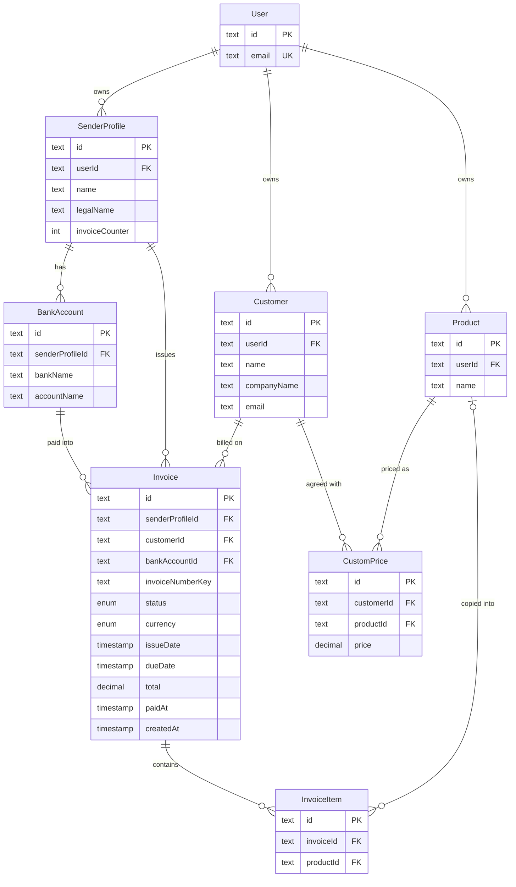

# Data model — service-layer

> **Mode:** brownfield, **no schema change**. The spec rules out any change to the stored data model and any data migration (spec §3, §6 "no stored-data change"; SAD §2, §7). This document therefore stages **zero** migrations. It records the entities the business layer reads and writes, the **owner path** that each owner-scoped query must carry (ADR-0003), and which existing index serves each query drawn in SAD §6. Index gaps are recorded as deferred findings for a later schema feature. They are not fixed here.
> **Conventions (derived, not imposed):** `prisma migrate` with the split schema `prisma/schema/{base,auth,invoice}.prisma` (architecture-map §Migrations). Quoted PascalCase tables, camelCase columns, `TEXT` ids from `cuid()`, `DECIMAL(10,2)` money, Prisma index names (`<Model>_<cols>_idx` / `_key`). No `CHECK` constraints or triggers. This feature touches none of them.

## ER diagram

Only the entities the business layer touches are shown, with the columns its queries filter, join, sort or aggregate on. The full column lists live in `prisma/schema/invoice.prisma` and `prisma/schema/auth.prisma`.

## Entities

No column, constraint or index changes. Each entity is listed with its **owner path**: the filter that every read and every write of it inside `lib/services/` must carry in its own `where` clause or SQL join (ADR-0003, SAD §8 Authorization). Its **search fields** follow ADR-0005 and spec §1.

### Aggregate roots

The Freelancer (`User`) is the tenant. It owns three roots directly: `SenderProfile`, `Customer` and `Product`. `BankAccount` and `Invoice` belong to a `SenderProfile`, `InvoiceItem` belongs to an `Invoice`, and `CustomPrice` belongs to the `Customer` it was agreed with. Account deletion removes the whole tenant (SAD §6 flow 10).

| Entity | Aggregate root | Owner path (ADR-0003) | List search fields (ADR-0005) | List order today (id tiebreak added, spec §1 change 4) |
|---|---|---|---|---|
| `SenderProfile` | root | `userId = A` | `name`, `legalName` | as today, then `id` |
| `BankAccount` | `SenderProfile` | `senderProfile.userId = A` | `bankName`, `accountName` (never `accountNumber` or `iban`) | as today, then `id`. Dashboard sender accounts: by `bankName`, then `accountName` (spec §1 change 3) |
| `Customer` | root | `userId = A` | `name`, `companyName`, `email` | as today, then `id` |
| `Product` | root | `userId = A` | `name` | as today, then `id` |
| `CustomPrice` | `Customer` | `customer.userId = A`, and on writes also `product.userId = A` | product `name`, customer `name` | as today, then `id` |
| `Invoice` | `SenderProfile` | `senderProfile.userId = A`. On writes, the referenced `customer`, `bankAccount` and every item `product` must also belong to A (AC-19) | `invoiceNumber`, `customerName`, `senderName` (as today) | the invoices page's sort options, then `id` |
| `InvoiceItem` | `Invoice` | through `invoice.senderProfile.userId = A`. Items are written only inside their invoice's transaction | — | as today |
| `User` | tenant | `id = A` | — | — |
| `VerificationToken` | — (keyed by the account's email) | `identifier = A's email`, deleted only in account deletion | — | — |

**Write rules this feature relies on (unchanged schema):**
- `Invoice (senderProfileId, invoiceNumberKey)` stays unique. Numbering keeps the `SenderProfile` row lock and the `invoiceCounter` sequence (hardening ADR-0004/0005; SAD §6 flows 6, 8).
- `Invoice` → `SenderProfile` / `Customer` / `BankAccount` stay `ON DELETE RESTRICT`. The race branch of SAD §6 flow 9 depends on it.
- `User` → `SenderProfile` / `Customer` / `Product` cascade, and account deletion deletes invoices first in the same transaction (hardening ADR-0007; flow 10).
- There is no unique `(customerId, productId)` on `CustomPrice`. It was dropped on purpose in `20260105020000_allow_multiple_custom_prices` (architecture-hardening data-model §CustomPrice).

## Indexes

No index is added. Each query drawn in SAD §6 is served by an existing index, listed below. The `pg_timezone_names` lookup reads a system view and needs no index. The deferred rows are gaps worth a later schema feature. They are not blockers at current scale, which is a handful of accounts with tens of invoices each (SAD §7).

| Index | Columns | Status | Query it serves |
|---|---|---|---|
| `SenderProfile_userId_idx` | `SenderProfile(userId)` | existing | Every owner join. Invoice, bank-account and dashboard queries reach the owner through `SenderProfile.userId` (flows 4, 5, 12). Sender-profile list (flow 4) |
| `Customer_userId_idx` | `Customer(userId)` | existing | Customer list and count (flow 4), editor data (flow 11), owner check on invoice references (flows 6, 7) |
| `Product_userId_idx` | `Product(userId)` | existing | Product list and count (flow 4), editor data (flow 11) |
| `BankAccount_senderProfileId_idx` | `BankAccount(senderProfileId)` | existing | Bank-account list per sender profile (flow 4), dashboard sender accounts (flow 12) |
| `CustomPrice_customerId_idx` | `CustomPrice(customerId)` | existing | Custom prices of one Customer, after the parent ownership check (flow 4), editor data (flow 11) |
| `CustomPrice_productId_idx` | `CustomPrice(productId)` | existing | Custom prices of one product (flow 4) |
| `Invoice_senderProfileId_invoiceNumberKey_key` | `Invoice(senderProfileId, invoiceNumberKey)` | existing, unique | Typed-number check and system-number skip loop (flow 6), duplicate numbering (flow 8). Its leading column also serves invoice counts per sender profile (flow 9) |
| `Invoice_senderProfileId_idx` | `Invoice(senderProfileId)` | existing | Invoice list scoped to the owner's sender profiles (flow 5), dashboard aggregates (flow 12), account deletion (flow 10) |
| `Invoice_customerId_idx` | `Invoice(customerId)` | existing | Invoice count per Customer for the delete guard and its race recount (flow 9), customer filter (flow 5) |
| `Invoice_status_idx`, `Invoice_issueDate_idx`, `Invoice_dueDate_idx` | single columns | existing | Status, issue-date-range and due-date filters and sorts (flows 5, 12). Postgres combines them with the owner index at current volume |
| `InvoiceItem_invoiceId_idx` | `InvoiceItem(invoiceId)` | existing | Loading an invoice's lines (flows 3, 7, 8) |
| `VerificationToken_pkey` | `(identifier, token)` | existing | Deleting the account's sign-in tokens by `identifier` (flow 10) |
| — `Invoice(bankAccountId)` | `Invoice(bankAccountId)` | **deferred gap** | FK without an index (pre-existing, not introduced here). A bank-account delete makes the `RESTRICT` check scan `Invoice`. The flows draw no query by bank account. Add it in a schema feature |
| — `Invoice(senderProfileId, status, currency, issueDate)` | composite | **deferred** | Dashboard aggregates above roughly 100,000 invoices per Freelancer (SAD §7 scaling thresholds) |
| — trigram (`pg_trgm`) on list name fields | GIN | **deferred** | `ILIKE '%…%'` search above roughly 10,000 records per list per Freelancer (SAD §7, ADR-0005) |

## Test fixtures

No new database fixtures. The request-free and foreign-record tests (SAD §10 QG-1, QG-3) reuse the existing factories in `tests/support/factories/` (`user`, `sender-profile`, `bank-account`, `customer`, `product`, `custom-price`, `invoice` incl. `createLegacyInvoice`). Emails come from `uniqueTestEmail()` (`@example.test`).

- `actingFreelancerForTest(userId, timeZone?)`: the test factory of ADR-0001. It builds an `ActingFreelancer` without a request. It is a code fixture, not a DB seed, and lives with the business-layer tests.
- The two-Freelancer setup (A and B, each with one record of every entity) for the foreign-record tests is composed from the same factories. It is specified in `test-plan.md`, not here.
