# Software Architecture Document — service-layer

## 1. Introduction and goals

**Intent.** Invoice Forge keeps all of its business rules and data access inside about sixty `'use server'` actions in `lib/actions/`. Each of them reads the caller's identity from the next-auth session and the time zone from the `tz` cookie, runs the rules and queries, and refreshes pages. This feature extracts the rules and queries into one **request-free business layer**, `lib/services/`. Every business function takes the acting Freelancer (and their time zone) as an explicit input and limits every read and every write to that Freelancer's records itself. The web actions become thin wrappers: they identify the Freelancer from the session, call the business function, and refresh the same pages as today. Every record list gains optional search and page-number paging with an honest total. Dashboard figures are computed by PostgreSQL rather than in memory. The Freelancer sees no change except the five deliberate ones in spec §1. The first consumer after the web app is the Assistant (the in-app AI chat and the MCP server, both later features), which has no browser session.

**Top-3 quality goals (1-liners; full scenarios in §10):**

1. **Tenant isolation.** No read or write made through a business function ever reaches another Freelancer's record, whoever the caller is: a page, a test or an Assistant.
2. **Behaviour parity.** The web app behaves exactly as before: existing tests unchanged, and dashboard amounts equal to the cent.
3. **Request independence.** Every business function can be called with only the acting Freelancer and a time zone. It never touches the session, cookies, headers or page refresh, and it is never reachable from the browser.

**Stakeholders.**

| Role | Interest | Sign-off owner? |
|---|---|---|
| Freelancer | Every page, form, picker and the dashboard keep working unchanged; their data stays theirs | No |
| Assistant | Future consumer (AI chat and MCP features): reads and changes one Freelancer's data through the same rules, without a browser | No |
| Visitor | Still sent to sign in; no private data read or changed (AC-10) | No |
| Tech Lead (Dmytro Hopko) | SAD approval; the layer boundary and result contract every later feature builds on | Yes |
| Security Lead | Security review is required (spec §6.1): the authorization boundary moves for every data function | Yes |

## 2. Constraints

**Technical.**
- TypeScript 5 (strict) on Node, pnpm 10 (`package.json`, `tsconfig.json`).
- Next.js 16.1.1 App Router + React 19.2.3. RSC pages call `'use server'` actions directly for reads (e.g. `app/(protected)/customers/page.tsx`). Every export of a `'use server'` file is a browser-callable endpoint.
- PostgreSQL on Neon (through its pooler) via Prisma 7.2 + `@prisma/adapter-pg`. The schema is split in `prisma/schema/`, with no `previewFeatures` in the generator. Money columns are `Decimal(10,2)`. Raw SQL precedent: the invoice-number row lock (`lib/actions/invoice-actions/numbering.ts`, `$queryRaw … FOR UPDATE`).
- next-auth 5.0.0-beta.30 with JWT sessions. `getAuthenticatedUser()` (`lib/helpers/auth-helpers.ts`) is the only identity source in actions, and the sign-in flow (`lib/actions/login-actions.ts`) stays untouched (spec §3).
- The time zone comes from the `tz` cookie via `getRequestTimeZone()` (`lib/helpers/time-zone.ts`, validated with `Intl`, falling back to UTC). The day-bound helpers in that file take the zone as a plain string, but the file imports `cookies` from `next/headers` at the top level (`time-zone.ts:8`), so the business layer can't import it as it is. The file is split (§5).
- Caching uses `unstable_cache` (dashboard currency tabs, 60 s) and `revalidatePath(protectedRoutes.*)` after every mutation. Both are Next.js facilities.
- Tests: Vitest 5 (`vitest.config.ts` for unit/component/contract, `vitest.integration.config.ts` for integration against a throwaway Postgres via `@testcontainers/postgresql`), Playwright e2e. CI (`.github/workflows/test.yml`) runs lint, `tsc --noEmit`, unit and integration on every PR. It does not run `next build` today, and this feature adds it (ADR-0006).
- Sentry 10 (production only, 10% trace sample, `sentry.server.config.ts:74`), with Prisma arguments scrubbed.
- No stored-data change and no data migration (spec §3). The feature is code-only.
- The `server-only` package is not installed yet. It is added as a dependency (ADR-0006).

**Organisational.**
- Size M (`.size`), route standard (`.route`): 1–2 sprints, one developer (the owner, Dmytro Hopko). There is no hard deadline. The AI chat and MCP features are next on the roadmap and wait for this one.
- TDD is on (`.claude/sdd.local.md`). The existing test suite is the parity oracle: 0 changed expected values (spec §6).
- Releases must stay rollback-safe by redeploying the previous build (0 minutes of planned downtime, spec §6).

**Conventions.**
- `docs/architecture-map.md` §Conventions (stale: it reflects `ded1be7`, before architecture-hardening; see §11) and the hard rules in `docs/features/architecture-hardening/sad.md` §8 and `contracts/server-actions.md`. This feature preserves them.
- `ActionResult<T>` with typed codes `UNAUTHORIZED | NOT_FOUND | VALIDATION | CONFLICT | FAILED` (`types/actions.ts`, hardening ADR-0009). `failed()` reports an unexpected cause to Sentry exactly once.
- A foreign record answers `NOT_FOUND`, identical to a missing one. `cuid()` IDs. zod schemas per entity in `lib/validations/`, shared by forms and actions.
- One exact-decimal amount module (hardening ADR-0006), invoice numbers on a normalized key under a sender-profile row lock (hardening ADR-0004/0005), account deletion in one explicit transaction (hardening ADR-0007).

**Regulatory / external.**
- Data classification: confidential. The layer reads and changes names, addresses, tax ids and bank details (spec §6.1). No new personal-data fields.
- Security review required before release (spec §6.1). No formal compliance regime (SOC 2, PCI) applies.
- Business functions verify no identity themselves. Only trusted server-side callers may call them: the web wrappers today, and later an Assistant layer that must authenticate first (spec §3, §6.1).

## 3. Context and scope

Invoice Forge lets a Freelancer keep sender profiles, customers, products, custom prices, bank accounts and invoices, and see a dashboard of revenue, Debtors and Expected payments. This feature does not move the system boundary: the same people and systems talk to it as today. What changes is where trust is established. Identity is verified once, at the edge of the system (the session in a web wrapper, or later the Assistant layer), and then passed inward as an explicit acting Freelancer. The Assistant is drawn as a planned actor: this feature only prepares the functions it will call.

<!-- brownfield: Next.js 16 monolith on Vercel; 63 exported functions in lib/actions (3,885 lines) own auth + rules + Prisma + revalidation; the architecture map is stale (ded1be7), so the scan was re-run on 6cf4c6e -->

**External systems (in / out):**

| Actor or system | Type | Interaction |
|---|---|---|
| Freelancer | Person | Uses every page, form, picker and the dashboard in the browser; signed in |
| Visitor | Person (external) | Reaches pages or endpoints without a session; is sent to sign in (AC-10) |
| Assistant (planned) | System (external, future feature) | Will read and change one authenticated Freelancer's data without a browser session. Not built here (spec §3) |
| Google OAuth | System (external) | Sign-in provider (unchanged) |
| SMTP server | System (external) | Sends magic-link sign-in email (unchanged) |
| Sentry | System (external) | Receives server and client errors and performance traces; the dashboard latency baseline comes from here |

The trust boundary stays where it is: nothing from the browser or from an Assistant is trusted until a wrapper has authenticated it. Business functions sit inside the boundary and never face a client directly (ADR-0006).

**C4 Context (L1):**

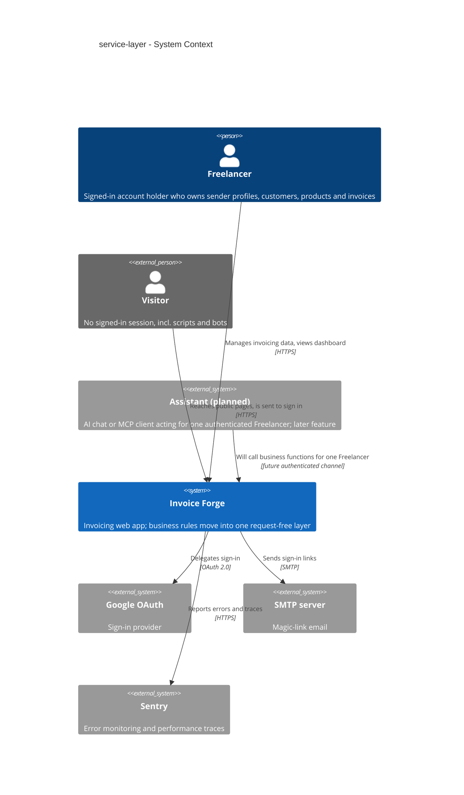

## 4. Solution strategy

**Target surface: `backend-service` only.** The feature changes server code only: RSC pages, `'use server'` actions, route handlers and the new business layer. It adds no screen, component or client state (spec §1: "Nothing changes for the Freelancer"; no `ux-flows.md` exists for it). The browser UI keeps consuming the same actions with the same results. One surface means no multi-surface ADR and no UI-architecture decision.

**Top strategic choices (the seeds for ADRs):**

1. **An explicit, branded acting Freelancer on every business function** (ADR-0001). The first argument of every function is an `ActingFreelancer { userId, timeZone }`. Its type can only be produced by trusted factories: `actingFreelancerFromSession()` in the web layer, a factory the Assistant feature will add after it authenticates, and a test factory. The factory also resolves the time zone once, so no function reads a cookie or forgets the zone. This serves quality goals 1 and 3, and it makes every place that establishes identity greppable.
2. **One result contract across both layers** (ADR-0002). Business functions return the existing `ActionResult<T>` union (moved to a neutral `types/result.ts`, with `ActionResult` kept as an alias). Wrappers pass it through unchanged, so messages, field errors, typed codes and the "reported exactly once" rule stay byte-identical (quality goal 2, AC-02, AC-04). The Assistant gets the same typed codes and field errors (AC-13, AC-26).
3. **The owner filter lives in every write's own `where` clause** (ADR-0003). The current check-then-write-by-bare-id pattern (`findFirst({ id, userId })` then `update({ where: { id } })`) is replaced by writes whose unique `where` carries the owner too, e.g. `{ id, userId }` or `{ id, senderProfile: { userId } }`. A miss (Prisma `P2025`) maps to the same `NOT_FOUND`. Reads are owner-filtered the same way, and a foreign-record test per function proves it (quality goal 1, AC-08, AC-19, spec §6.1 check-then-write abuse case).
4. **Dashboard figures aggregated by PostgreSQL in parameterized raw SQL** (ADR-0004). Each dashboard section is one `$queryRaw` tagged-template query: sums on `numeric`, local-day and local-month buckets via `AT TIME ZONE`, "name from the most recent invoice" via `DISTINCT ON`, and ordering and top-three limits (`ORDER BY … LIMIT`) in SQL. Each query is owner-joined through `SenderProfile.userId` and its rows are parsed with zod. The number of rows read no longer grows with invoice history, and the sums are exact (quality goal 2, spec §6 data-read row, AC-05, AC-06).
5. **Page-number paging with one shared page envelope** (ADR-0005). Every list accepts an optional `{ search, page, pageSize }` and returns `Page<T> = { items, total, page, pageSize, totalPages, hasMore }`. With no page requested, the full list comes back as page 1. A page given without a page size uses 10. A page out of range falls back to page 1, every sort order ends with the record id, and search is a case-insensitive substring match (`ILIKE`) on the fields spec §1 names. This one contract is seen by six lists, the web pickers and the future Assistant (AC-11 to AC-14).

**Inline strategy notes (no ADR: reversible, or fixed by an upstream decision):**
- **Time-zone resolution** (closes spec §8 OQ-2 at its default). A zone is accepted only if both `Intl` and PostgreSQL (`pg_timezone_names`, looked up once per process) know it; otherwise UTC is used, as for an unknown zone (AC-22). The check lives in the `ActingFreelancer` factories, so JS day bounds and SQL `AT TIME ZONE` buckets always use the same zone (AC-21).
- **Transactions are owned by business functions.** A function that needs atomicity (invoice create/update with numbering, account deletion, duplicate) opens its own `prisma.$transaction`. Internal helpers take a `Prisma.TransactionClient`. No public `tx` parameter: composing several changes in one transaction is a later Assistant concern.
- **Next.js facilities stay in the web wrappers.** `revalidatePath`, `unstable_cache` (currency tabs) and `redirect` are called only by wrappers, after a successful result. The business layer knows nothing about pages.
- **Incremental, per-domain migration.** Domains move one release at a time, and each release keeps the full suite green. The old in-memory dashboard stays only until the parity test's expected values are recorded, then it is deleted with every other function the move leaves unused (spec §1 deliberate change 5). Details in §7.

Each tactical decision in later sections traces to one of these seeds. A tactical decision that contradicts one is a red flag and goes to §11.

## 5. Building block view

The app keeps its layered-by-convention Next.js monolith and gains one real layer. **Web adapters** (RSC pages, `'use server'` actions, route handlers) own everything tied to a request: session, cookies, `revalidatePath`, `unstable_cache`, redirects. **Business functions** in `lib/services/` own every rule and every data access, take an `ActingFreelancer` (ADR-0001) and return `ActionResult<T>` (ADR-0002). Prisma and PostgreSQL stay below them. There are no ports and adapters beyond this split and no repository abstraction: business functions call the Prisma client directly, as actions do today, which keeps the move mechanical and the parity diff small. The layer lives in the same package, and its boundary is enforced by `server-only`, a lint rule and a unit check (ADR-0006). The single surface `backend-service` is drawn as its three logical containers (web adapters, business layer, proxy). The browser UI is unchanged and is drawn only as the caller.

**Internal decomposition** (★ new, ✎ changed, ✗ removed):

```
lib/services/                                  ★ request-free business layer (ADR-0006); every file imports 'server-only'
├── _shared/
│   ├── acting-freelancer.ts                   ★ ActingFreelancer brand + the ONLY place it is constructed from raw values (ADR-0001)
│   ├── time-zone.ts                           ★ resolveTimeZone() (accepted only if Intl AND pg_timezone_names know it, else UTC) + the pure day-bound
│   │                                            helpers moved from lib/helpers/time-zone.ts (localDayRange, startOfLocalDay, formatLocalDateKey…)
│   ├── list-query.ts                          ★ ListQuery zod schema, Page<T>, paginate() helper with the id tiebreak (ADR-0005)
│   ├── owner-scope.ts                         ★ P2025 → NOT_FOUND mapping for owner-scoped writes (ADR-0003)
│   └── result-helpers.ts                      ✎ moved from lib/actions/action-result-helpers.ts: failed(), zodValidationFailure(), hasInvoicesConflict()…
├── customers/ products/ custom-prices/        ★ one module per domain: list (search + paging), get, create, update, delete
├── sender-profiles/ bank-accounts/            ★ same shape; sender-profile delete keeps the HAS_INVOICES guard
├── invoices/
│   ├── invoices.ts                            ★ create, update (totals-changed check), status change, duplicate, get, list (AC-26 filters)
│   ├── numbering.ts                           ✎ moved from lib/actions/invoice-actions/numbering.ts (row lock, normalized key; hardening ADR-0004/0005)
│   └── editor-data.ts                         ★ customers + products + custom prices for a new invoice (AC-25)
├── dashboard/
│   ├── dashboard.ts                           ★ one function per section, same outputs as today's actions
│   └── queries.ts                             ★ the only dashboard SQL; every query owner-joined through SenderProfile.userId (ADR-0004)
├── account/                                   ★ deletion summary + all-or-nothing deletion (hardening ADR-0007), data export read
└── profile/                                   ★ profile update, dashboard setup check
lib/actions/**                                 ✎ thin wrappers: actingFreelancerFromSession() → business function → revalidatePath on success
lib/actions/login-actions.ts                   — unchanged (sign-in stays in the browser flow, spec §3)
lib/helpers/session-actor.ts                   ★ actingFreelancerFromSession() (actions) + actingFreelancerForRoute() (route handlers): session + tz cookie
                                                 → ActingFreelancer, or UNAUTHORIZED / today's 401. server-only, NOT 'use server' (auth-helpers.ts is
                                                 a 'use server' file, so an export there would be browser-callable)
lib/helpers/time-zone.ts                       ✎ keeps only getRequestTimeZone() (reads the cookie) + re-exports the moved pure helpers
app/api/user/export/route.ts                   ✎ reads through lib/services/account instead of Prisma
app/api/convert-image/route.ts                 ✎ owned-profile lookup through lib/services/sender-profiles
types/result.ts                                ★ the ActionResult union, moved here (ADR-0002); types/actions.ts re-exports it
eslint.config.mjs                              ✎ no-restricted-imports for lib/services/** (next/headers, next/cache, next/navigation, @/auth, next-auth)
                                                 + a ban on `as ActingFreelancer` outside _shared/acting-freelancer.ts
tests/integration/services/**                  ★ request-free tests per business function + a foreign-record test per id-taking function
tests/unit/service-layer-boundary.test.ts      ★ no 'use server' under lib/services, no lib/services import from 'use client' files
lib/actions/dashboard-actions.ts               ✎ same export names, now thin wrappers (+ unstable_cache for currency tabs). The in-memory
                                                 bodies are deleted after the dashboard parity values are recorded (spec §1 change 5)
lib/actions/invoice-actions/…getInvoices()     ✗ the unused list-all-invoices function and its test (spec §1 change 5)
```

**C4 Container (L2):**

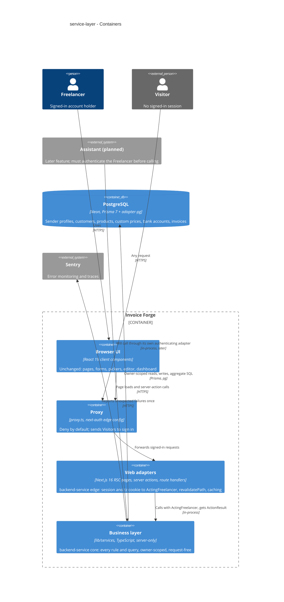

## 6. Runtime view

Participants are the §5 containers. The two seeded flows cover the two shapes every business function takes: an owner-scoped change behind a web wrapper, and a request-free aggregate read. The `sequences` stage extends this section to every §5 acceptance criterion.

**Critical flow 1: a Freelancer changes a record through a web wrapper (e.g. update a customer, AC-03, AC-08, AC-09)**

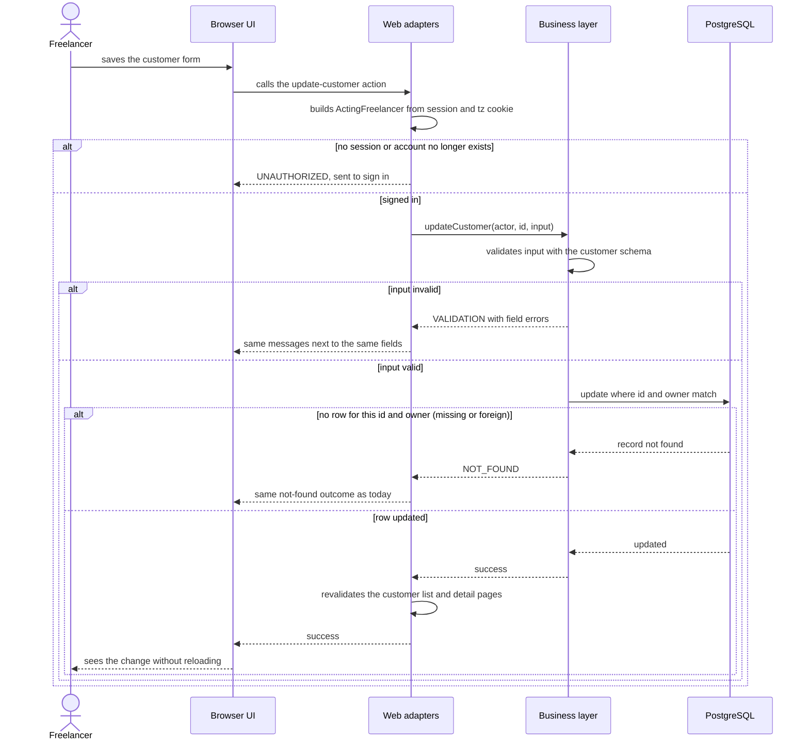

**Critical flow 2: a request-free caller reads the Debtors section (an integration test today, the Assistant later; AC-06, AC-07, AC-21, AC-22)**

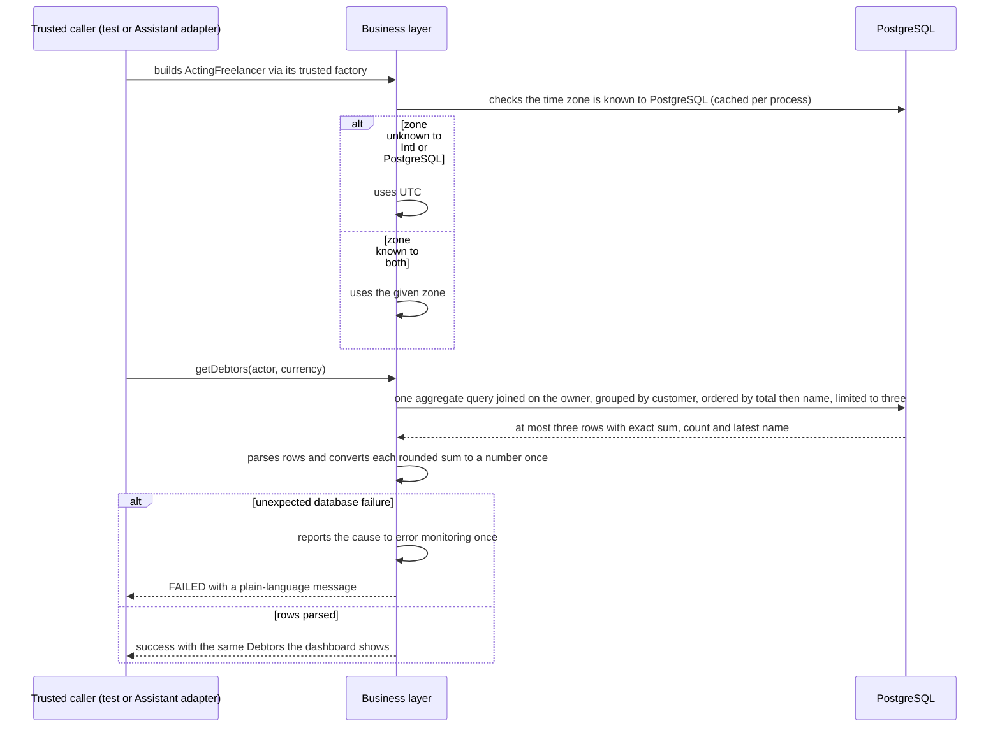

Flows 3–12 are drawn with the generic participant vocabulary: "service (web wrapper)" is the §5 Web adapters container, "service (business layer)" is the Business layer, "data-store" is PostgreSQL, and "external-system (error monitoring)" is Sentry. A "client (trusted caller)" is anything holding an `ActingFreelancer` from a trusted factory: a web wrapper, a request-free test, and later the Assistant's own adapter. Every error branch returns the typed code of the result contract (ADR-0002).

### Flow 3: loading a data page through a web wrapper (AC-01, AC-04, AC-09, AC-10)

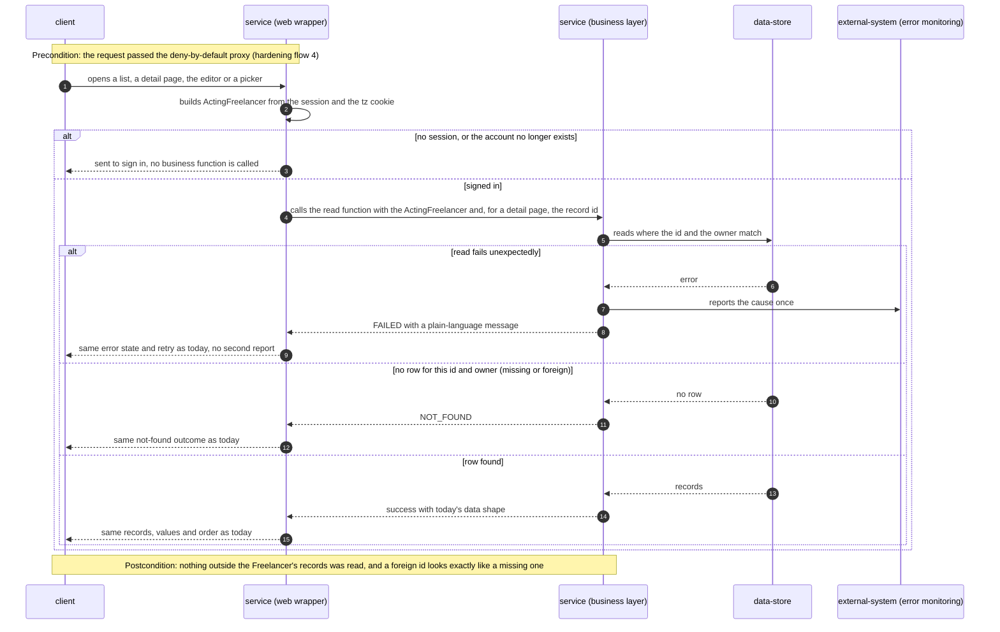

### Flow 4: searching and paging any list (AC-08, AC-11, AC-12, AC-13, AC-14)

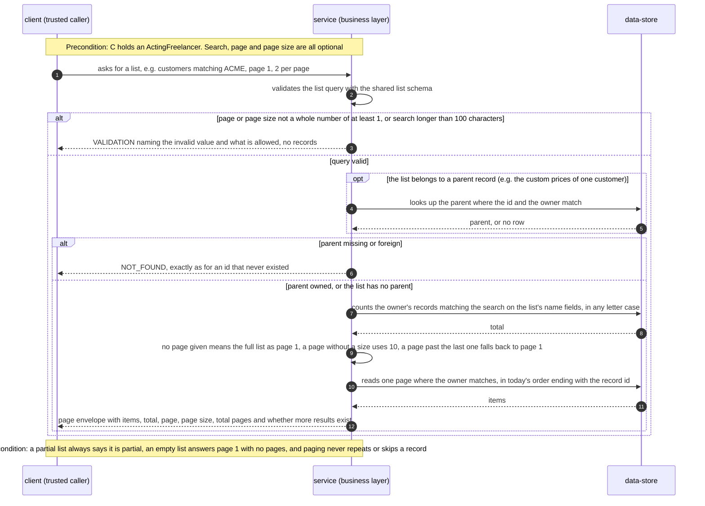

### Flow 5: listing invoices with filters in the Freelancer's time zone (AC-13, AC-21, AC-22, AC-26)

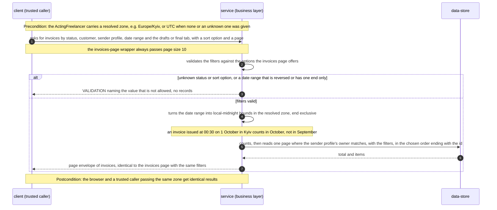

### Flow 6: creating an invoice (AC-15, AC-16, AC-19)

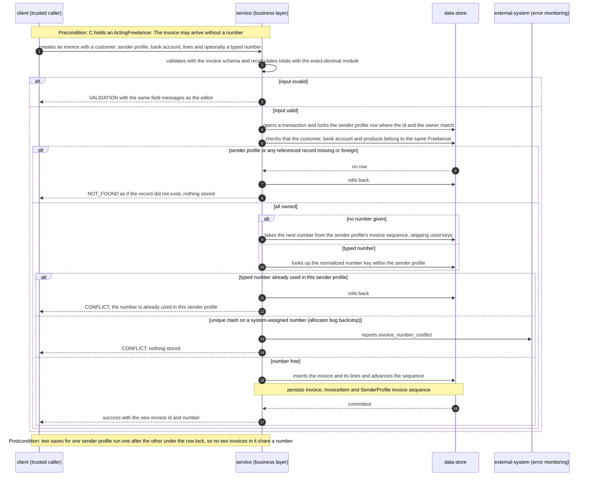

### Flow 7: updating an invoice or changing its status (AC-08, AC-18, AC-19, AC-23)

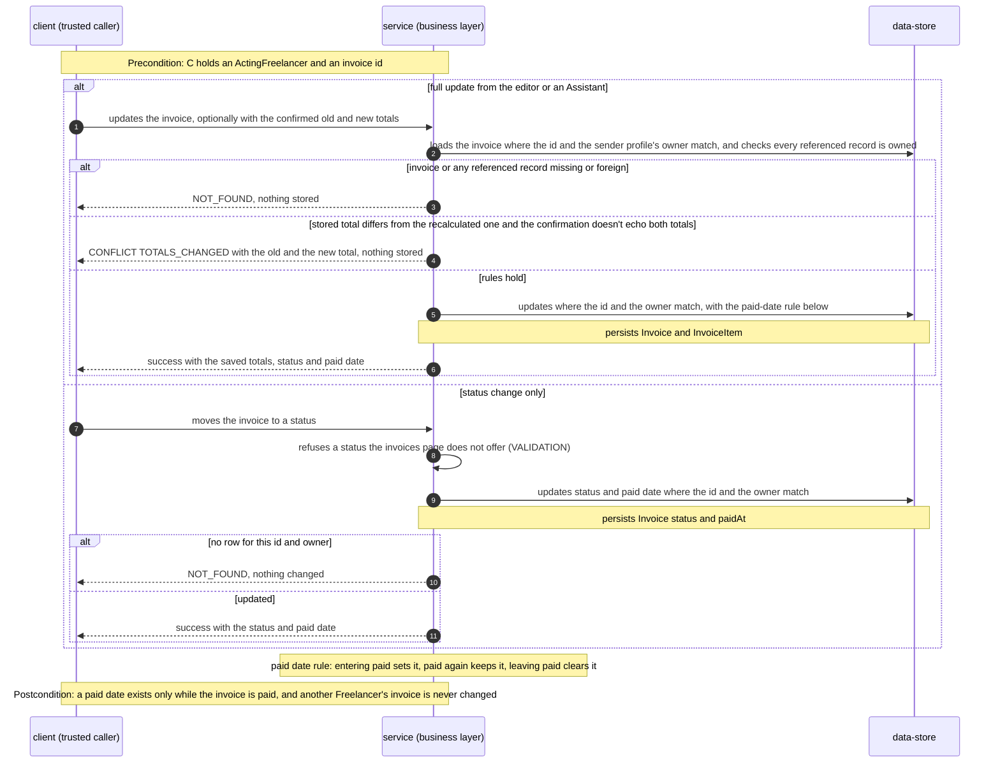

### Flow 8: duplicating an invoice (AC-08, AC-24)

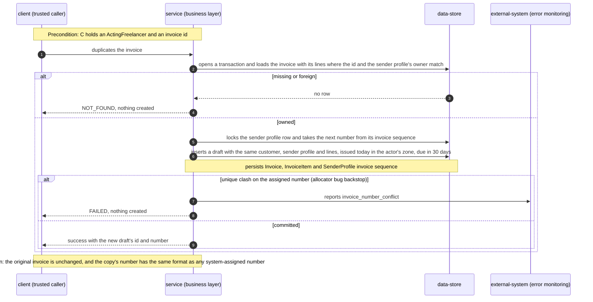

### Flow 9: deleting a Customer or a sender profile (AC-08, AC-17)

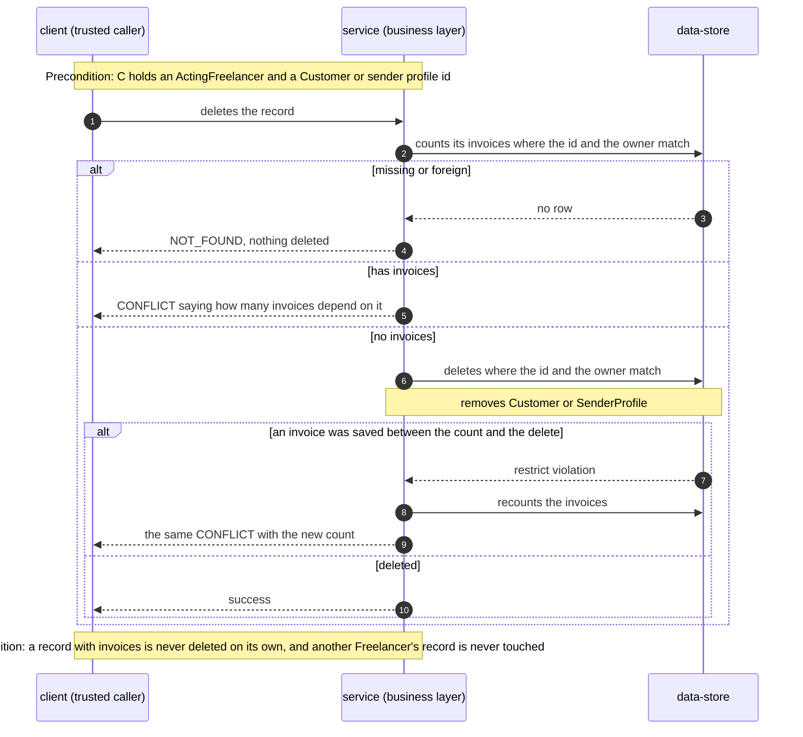

### Flow 10: deleting the Freelancer's account (AC-20)

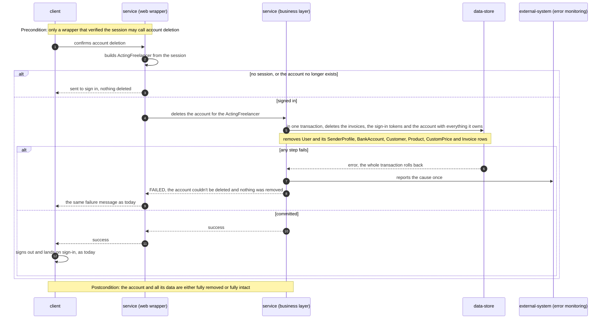

### Flow 11: loading the data for a new invoice (AC-07, AC-25)

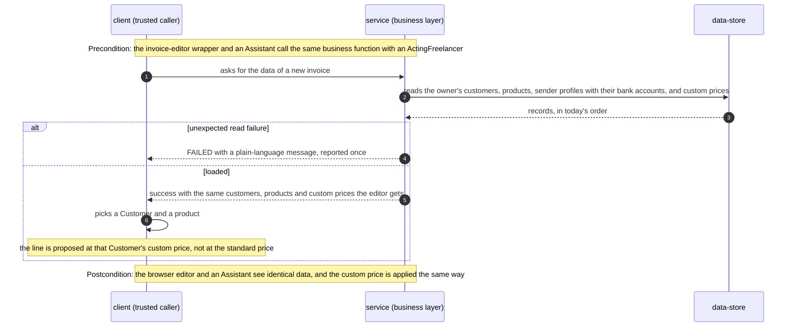

### Cross-cutting: Flow 12: one dashboard, two callers (AC-01, AC-06, AC-07, AC-21, AC-22)

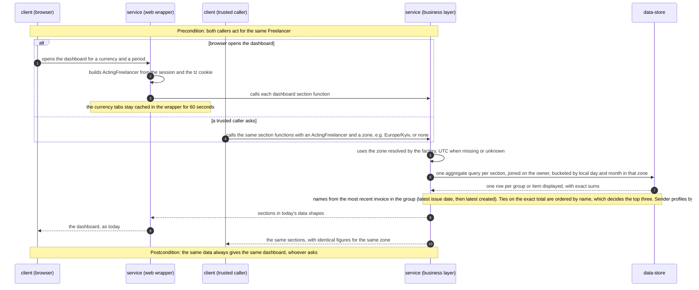

### Coverage: user stories and acceptance criteria → flows

| US | Flows |
|---|---|
| US-01 Keep using the app unchanged | 1, 3, 12 |
| US-02 Trust dashboard figures | 2, 12 |
| US-03 Read a Freelancer's data without a browser | 2, 11, 12 |
| US-04 Search and page through any list | 4, 5 |
| US-05 Change data under the same rules | 6, 7, 8, 9, 10 |
| US-06 Only my data, whoever asks | 1, 3, 4, 6, 7, 8, 9 (owner-scoped branches) |
| US-07 Dates in my time zone | 2, 5, 12 |
| US-08 Stay locked out without a session | 1, 3, 10 (no-session branches) |

| AC | Shown in | AC | Shown in |
|---|---|---|---|
| AC-01 | flow 3 "row found", flow 12 browser branch | AC-14 | flow 4 "a page past the last one falls back to page 1" |
| AC-02 | flow 1 "input invalid" | AC-15 | flow 6 "no number given" |
| AC-03 | flow 1 revalidation step | AC-16 | flow 6 row lock and "typed number already used" |
| AC-04 | flow 3 "read fails unexpectedly" | AC-17 | flow 9 "has invoices" and the race branch |
| AC-05 | N/A, non-runtime: a development-time old-vs-new parity test on a fixed fixture. The old code is deleted before release, and the runtime path is flows 2 and 12 | AC-18 | flow 7 "CONFLICT TOTALS_CHANGED" |
| AC-06 | flow 2, flow 12 naming and tie note | AC-19 | flow 6 and flow 7 "any referenced record missing or foreign" |
| AC-07 | flows 2, 11, 12 trusted-caller branch | AC-20 | flow 10 "any step fails" |
| AC-08 | flow 4 "parent missing or foreign", flows 7, 8, 9 "missing or foreign" | AC-21 | flow 5 local-midnight bounds, flow 12 zone buckets |
| AC-09 | flow 1 and flow 3 "missing or foreign" | AC-22 | flow 2 UTC branch, flows 5 and 12 zone resolution |
| AC-10 | flow 1 and flow 3 "no session, or the account no longer exists" | AC-23 | flow 7 paid-date rule |
| AC-11 | flow 4 search and page envelope | AC-24 | flow 8 |
| AC-12 | flow 4 "no page given means the full list as page 1" | AC-25 | flow 11 |
| AC-13 | flow 4 and flow 5 VALIDATION branches | AC-26 | flow 5 |

Every §4 user story maps to at least one flow. Every §5 AC maps to a flow or branch, except AC-05, which is an explicit non-runtime N/A.

### Flags from the sequences pass

- **Participants:** flows 3–12 use the generic vocabulary, mapped to §5 containers in the note above flow 3. No participant is new to §5. Flows 1 and 2 were drawn by `design` and keep their concrete names.
- **Flag for design (flow 4):** a list page needs two reads, the count and the page. They aren't in one transaction, so a concurrent change can make `total` and `items` disagree by one. That seems acceptable for a read. Decide whether ADR-0005 should say so.
- **Flag for design (flow 7):** the status-change path writes before it knows whether the row exists (owner-scoped update, `P2025 → NOT_FOUND`). But the paid-date rule needs the current status ("paid again keeps it"). So the write either reads first inside a transaction, or it makes the rule conditional in SQL. ADR-0003's fallback note covers the read-then-write-with-owner shape. Confirm that it applies here.
- **Hints for data-model (from the persist and read notes):** no schema change is planned (spec §3). The reads that matter are the owner-scoped list reads with the id tiebreak (flow 4), the invoice list by owner, status, issue-date range and sort field (flow 5), the normalized number key per sender profile (flows 6, 8), invoice counts per Customer and per sender profile (flow 9), and the dashboard aggregates by sender profile owner, status, currency and issue date (flow 12, §7 scaling note).

## 7. Deployment view

There is no infrastructure change. The app stays one Vercel project (functions in `iad1`, the proxy on the edge) over the existing Neon PostgreSQL reached through its pooler. The business layer runs in-process inside the same serverless functions as the web adapters, and nothing new is deployed. There is no schema change, so every release is code-only and rolls back by redeploying the previous build (spec §6: 0 minutes of planned downtime, no stored-data change). The move ships domain by domain, one production release per wave, with the full suite green at each:

| Wave | Moves into `lib/services` | Also ships | Rollback-safe because |
|---|---|---|---|
| 1 | `_shared` (ActingFreelancer, time zone, list query, owner scope, result helpers), customers, products, custom prices | ESLint boundary rule, boundary unit test, `server-only` dependency, `next build` on every PR via the Vercel preview (ADR-0006, amended 2026-10-02). `dashboard.<section>` Sentry spans around the **old** dashboard actions, to start the latency baseline. The first owner-scoped writes confirm Prisma's relation filter in a unique `where` (§11) | code only |
| 2 | sender profiles, bank accounts, profile, account deletion and export, dashboard setup check | `convert-image` owned-profile lookup through the layer | code only |
| 3 | invoices: list with filters, numbering, create, update, status, duplicate, editor data | the unused list-all-invoices function and its test are deleted | code only |
| 4 | dashboard sections on SQL (ADR-0004) | parity test run old-vs-new, then its old outputs recorded as fixed expected values, then the old in-memory code deleted (spec §1 change 5) | code only; until the old code is deleted, the previous build is a complete fallback |

**Monitoring:**
- Errors: unchanged. `failed()` inside business functions reports each unexpected cause to Sentry once. The `invoice_number_conflict` message still fires on a system-proposed number clash (spec §6 error-reporting row).
- Latency: Sentry performance traces (10% sample in production) give the dashboard p95 per section. Each dashboard section runs inside a named Sentry span (`dashboard.<section>`), added around the old actions in wave 1 and kept around the new queries in wave 4. The before/after 7-day windows (spec §6, §7) therefore compare the same span. At least 7 days of baseline accumulate before wave 4 ships.
- Alerts: the existing Sentry alerts stay (allocator conflict on a system number, unhandled errors on list or dashboard pages). No new alert.

**Scaling thresholds** (design estimates. Current scale is a handful of accounts with tens of invoices each):
- Dashboard queries read rows proportional to the groups displayed and scan only the Freelancer's invoices through the existing `Invoice(senderProfileId)` index. Comfortable up to roughly 100,000 invoices per Freelancer. Above that, add a composite index on `(senderProfileId, status, currency, issueDate)` in its own schema feature.
- List search is `ILIKE '%…%'` with no index, a sequential scan over one Freelancer's rows. Comfortable up to roughly 10,000 records per list per Freelancer. Above that, add a trigram index (`pg_trgm`, schema change).
- Full lists (no page requested) serve the web pickers and are fine up to roughly 1,000 customers or products. Above that, the pickers need the paging follow-up feature (spec §3).

## 8. Crosscutting concepts

The default is the convention set of architecture-hardening (`docs/features/architecture-hardening/sad.md` §8), which this feature preserves. **Bold** marks where it adds or overrides a convention.

| Concept | Convention | Where defined |
|---|---|---|
| Authentication | Unchanged: next-auth JWT sessions, deny-by-default proxy, a token without a live account is a Visitor. **Only web adapters (and later the Assistant's own adapter) authenticate. Business functions never do** | hardening ADR-0001, ADR-0002; spec §6.1 |
| Authorization | **Identity enters the layer only as an `ActingFreelancer`, built by a trusted factory.** Wrappers build it before parsing any input (hardening AC-23 order preserved). **Every read and every write inside a business function carries the owner filter in its own query**, including raw SQL. A foreign record answers `NOT_FOUND`, exactly like a missing one. `as ActingFreelancer` is banned by lint outside the factory module | ADR-0001, ADR-0003, ADR-0006 |
| Input validation | **Business functions validate their own input with the entity's zod schema and refuse invalid values** (`VALIDATION` + `fieldErrors` naming the value and what is allowed, AC-13, AC-26). Pages still correct malformed links to documented defaults before calling (hardening AC-25/26), and the invoices page always passes its page size (10) | `lib/validations/`, `lib/validations/search-params.ts` |
| Error handling | **Business functions return `ActionResult<T>` themselves** (typed `code`, plain-language `error`, optional `fieldErrors`, `details`). `failed()` inside the business function reports the cause once, and wrappers pass results through untouched. Only wrappers produce `UNAUTHORIZED` | ADR-0002; `types/result.ts` |
| Lists | **Every list takes an optional `{ search, page, pageSize }` and returns `Page<T>`.** No page means the full list as page 1. A page without a page size uses 10. A page out of range answers page 1. Every order ends with `id`. Search is case-insensitive `ILIKE` on the name fields of spec §1 (never on account number or IBAN) and is at most 100 characters. There is no page-size cap in the layer | ADR-0005 |
| Money | Unchanged: `Decimal(10,2)` at rest, one exact-decimal module (hardening ADR-0006). **Dashboard sums are `SUM(numeric)` in SQL. The row parser converts each already-exact two-decimal sum to a `number` once, so business functions return today's dashboard DTOs (`types/dashboard/types.ts`) unchanged. No JS addition of amounts** | ADR-0004 |
| Time and time zones | Stored as UTC, with range ends exclusive at the next local midnight. **The zone is resolved once, in the `ActingFreelancer` factory: accepted only if both `Intl` and PostgreSQL `pg_timezone_names` know it (looked up once per process), else UTC** (closes spec §8 OQ-2). SQL buckets use `AT TIME ZONE` with the same resolved zone | hardening ADR-0010; §4 inline note |
| Transactions | **Business functions own their transactions.** Internal helpers take `Prisma.TransactionClient`. No public `tx` parameter. Numbering row lock and all-or-nothing account deletion are unchanged | hardening ADR-0005, ADR-0007 |
| Cache invalidation | **Only web adapters call `revalidatePath` and `unstable_cache`**, after a successful result, with the same paths and tags as today (AC-03). The business layer never touches page caches | ADR-0006 |
| Logging and observability | Unchanged: `console.error(redactError(...))` + Sentry with scrubbed Prisma arguments. **Dashboard queries run inside named Sentry spans** (§7) | `sentry.server.config.ts`, `lib/helpers/prisma-error-scrub.ts` |
| Layer boundary | **`lib/services/**` imports `server-only`, never declares `'use server'`, and never imports `next/headers`, `next/cache`, `next/navigation`, `@/auth` or `next-auth`**, checked by ESLint, `next build` (added to CI) and a unit test | ADR-0006 |
| ID strategy | `cuid()`; unchanged | `prisma/schema/` |
| Internationalisation | N/A: English only | — |
| Events | N/A: no events or queues. All calls are in-process function calls | — |

## 9. Architecture decisions

| # | Title | Status | Section |
|---|---|---|---|
| 0001 | Pass a branded acting Freelancer to every business function | Accepted | §4 |
| 0002 | Return the existing ActionResult union from business functions | Accepted | §4 |
| 0003 | Scope every write by owner in its own where clause | Accepted | §4 |
| 0004 | Aggregate dashboard figures in parameterized raw SQL | Accepted | §4 |
| 0005 | Page lists by page number with a shared page envelope | Accepted | §4 |
| 0006 | Isolate business functions in lib/services behind server-only and lint rules | Accepted | §5 |

ADR files live under `docs/features/service-layer/adr/NNNN-<title>.md`. The conventions this feature preserves are decided in architecture-hardening's ADR-0001 to ADR-0010 (`docs/features/architecture-hardening/adr/`).

## 10. Quality requirements

Each top-3 goal from §1 expanded into a full scenario, plus the dashboard data-volume, error-reporting and rollout scenarios the spec measures. Numbers are quoted from spec §6.

**QG-1. Tenant isolation**
- **When:** any caller (a web wrapper, a request-free test, later an Assistant) acting for Freelancer A reads, changes or deletes a record of Freelancer B by its identifier, asks for a list that belongs to B, or saves an invoice referring to B's customer, sender profile, bank account or product.
- **Then:** the answer is exactly what an identifier that never existed gets, and B's record stays unchanged (AC-08, AC-09, AC-19). Target: "100% of business functions that take a record identifier have a foreign-record test (read, change, delete) proving AC-08".
- **How verify:** `tests/integration/services/**` has, for every id-taking business function, a test that seeds two Freelancers, calls the function as A with B's id, asserts `NOT_FOUND` and asserts B's row is byte-identical afterwards. `review` checks the inventory against the function list. Every dashboard query also has a two-Freelancer test proving B's invoices never count toward A's figures.

**QG-2. Behaviour parity**
- **When:** the web app runs on the new layer after each wave.
- **Then:** "0 changed or removed expected values in existing automated tests (sole exception: the test of the removed list-all-invoices function)". For the dashboard: "0 differences above 0.01 per amount; 0 differences in counts, group membership or listed invoices (Debtor / sender-account names and tie order excluded; checked by AC-06)".
- **How verify:** the full suite runs green in CI on every PR, and the test diff is reviewed in `review` for changed expectations. The dashboard parity test runs the AC-05 fixture (float-drift totals, several currencies, a renamed Customer, a top-three tie, a DST switch in range) through the old and the new implementation during development. Before release, the old output is recorded as fixed expected values and the old code is deleted.

**QG-3. Request independence and browser isolation**
- **When:** a business function is called without any browser request, or the codebase is checked in CI.
- **Then:** "100% of business functions callable with only the acting Freelancer (+ time zone) and no browser request; 0 uses of session, cookie, header or page-refresh facilities inside the business layer" and "0 business-layer functions marked as browser-callable; 0 imports of the business layer from browser-side code".
- **How verify:** an integration test per business function calls it with only `actingFreelancerForTest(...)`. There are no request mocks, and the `@/auth` mocks disappear for business-function tests. ESLint `no-restricted-imports` on `lib/services/**`, the `server-only` import (fails `next build` on a client import) and `tests/unit/service-layer-boundary.test.ts` (no `'use server'` under `lib/services`) all run in CI. `next build` runs on every PR as the Vercel preview deploy, with the real environment (ADR-0006, amended 2026-10-02).

**QG-4. Dashboard cost does not grow with history**
- **When:** the dashboard loads for a Freelancer with any number of invoices.
- **Then:** "rows returned by each dashboard query ≤ the number of groups or items displayed", and dashboard load latency p95 "≤ today's baseline (no regression)". The reduction target is still open (spec §8 OQ-1, §11).
- **How verify:** the dashboard parity test captures the query log and asserts the row count per query. The latency baseline comes from production performance traces over a 7-day window before and after release, per `dashboard.<section>` Sentry span. The spans exist from wave 1, so the "before" window is real (§7).

**QG-5. Error reporting unchanged**
- **When:** a business function hits an unexpected failure, or the number allocator hits a clash on a system-proposed invoice number.
- **Then:** "each unexpected failure reported exactly once; the invoice-number-conflict alert still fires on a system-proposed number clash".
- **How verify:** the existing failure-reporting tests (`failed()` reports-once, the delete-* Sentry tests, the invoice-conflict payload test) run unchanged against the business functions they now call, and the web wrappers add no second report (ADR-0002).

**QG-6. Rollout without downtime**
- **When:** each of the four waves (§7) is released or rolled back.
- **Then:** "0 minutes of planned downtime; no stored-data change".
- **How verify:** the deploy log shows no migration in any wave. A rollback is a redeploy of the previous build.

## 11. Risks and technical debt

| Risk / debt | Severity | Mitigation | Owner |
|---|---|---|---|
| Behaviour drift while moving 63 functions: a message, an order, a refreshed path or a paid-date rule changes silently | High | Move domain by domain (§7), with the existing suite as an oracle (0 changed expectations, reviewed in `review`). Wrappers keep today's `revalidatePath` lists verbatim. Only the five spec §1 changes are allowed | Dmytro Hopko |
| A raw dashboard query or a new business function forgets the owner filter, so a Freelancer sees another's data | High | ADR-0003 owner-in-`where` rule, with all dashboard SQL in one file with an owner join. A foreign-record test per id-taking function and per dashboard query (QG-1). Security review before release | Dmytro Hopko / Security Lead |
| Prisma rejects a relation filter inside a unique `where` for some model (e.g. `Invoice` via `senderProfile`, `CustomPrice` via `customer`) | Medium | Confirm in wave 1 with the first owner-scoped writes. Fallback per ADR-0003: `updateMany`/`deleteMany` with the owner filter and `count === 0 → NOT_FOUND` | Dmytro Hopko |
| The dashboard latency reduction target is still unset (spec §8 OQ-1 was due before design) | Medium | Spans ship in wave 1, and the 7-day baseline per dashboard span is recorded before wave 4. Ship on "no regression" and set the reduction target from the baseline. The spec §8 OQ-1 row stays the tracker | Dmytro Hopko |
| The `ActingFreelancer` brand can be bypassed with a cast, and business functions trust their caller | Medium | A lint ban on `as ActingFreelancer` outside the factory module. No business function is reachable from the browser (ADR-0006). The Assistant feature must specify its authenticating layer (spec §3) | Dmytro Hopko |
| Unpaged full lists are unbounded for a non-browser caller | Medium | Out of scope here (spec §3). Caps belong to the Assistant tool layer, and spec §8 OQ-3 is due before `sdd:specify` of the AI-chat / MCP feature | Dmytro Hopko |
| A time zone known to `Intl` but not to PostgreSQL (or the reverse) gives different day buckets in JS and SQL | Low | Accept a zone only if both know it, else UTC (§8). A test with a zone missing from one database | Dmytro Hopko |
| `docs/architecture-map.md` is stale (reflects `ded1be7`, before architecture-hardening and this feature) | Low | Re-run `/sdd:survey` after this feature ships so later features read the service-layer layout | Dmytro Hopko |
| `ILIKE '%…%'` search has no index | Low | Fine to roughly 10,000 records per list per Freelancer (§7). Add `pg_trgm` in a schema feature beyond that | Dmytro Hopko |

**Accepted debt (acceptable in v1, plan to fix later):**
- Human-readable English error messages live in the business layer (ADR-0002). A tool-specific or translated wording needs a mapping at the consumer.
- The layer boundary is lint + build + test enforced, not a separate package (ADR-0006). Extract `lib/services` into a package if the MCP server runs as its own process.
- The dashboard currency-tabs cache (`unstable_cache`, 60 s) stays in the web wrapper, so a non-browser caller reads uncached. That is acceptable at current scale.
- The customers, products and custom-prices pages and pickers still load full lists. UI paging is a separate follow-up feature (spec §3).

## 12. Glossary

Domain terms come from `CONTEXT.md` (repo root, canonical). Terms marked † were introduced by this SAD and aren't in `CONTEXT.md`. They are implementation vocabulary, so they belong here rather than in the domain glossary.

| Term | Meaning |
|---|---|
| Freelancer | A signed-in account holder who owns sender profiles, customers, products and invoices and sees only their own data |
| Assistant | A program (in-app AI chat or external MCP client) that reads and changes data on behalf of exactly one Freelancer who authorized it, without a browser session. Planned, not built here |
| Visitor | Anyone reaching the app or its endpoints without a signed-in session, including scripts and bots |
| Customer | A party a Freelancer bills. Each invoice keeps a copy of the customer's details as they were when it was issued |
| Debtor | A Customer with at least one overdue invoice in the selected currency, ranked by total overdue amount |
| Expected payment | A pending (issued, not yet paid, not overdue) invoice, grouped by currency and ordered by due date |
| Sender profile | A business identity a Freelancer issues invoices under, with its own bank accounts, invoice prefix and invoice sequence |
| Invoice number / Invoice sequence | The printed identifier, unique within a sender profile / the per-sender-profile counter that proposes the next number |
| Custom price | A price a Freelancer agrees with one Customer for one product, pre-filled into that Customer's invoice lines |
| Business function † | A function in `lib/services/` that holds one use case's rules and data access, takes an `ActingFreelancer` and returns `ActionResult<T>`. It never touches the request |
| Web wrapper † | A `'use server'` action (or RSC page loader, or route handler) that builds the `ActingFreelancer` from the session, calls a business function and refreshes pages on success |
| ActingFreelancer † | The explicit, branded `{ userId, timeZone }` input naming whose data a business function may touch. Built only by trusted factories (ADR-0001) |
| Page envelope † | `Page<T> = { items, total, page, pageSize, totalPages, hasMore }`, returned by every list (ADR-0005) |
| Foreign record † | A record that exists but belongs to another Freelancer. It must behave exactly like a record that never existed |
| Owner-scoped write † | An update or delete whose own `where` clause carries the owner filter, so no ownership check can drift from its write (ADR-0003) |
