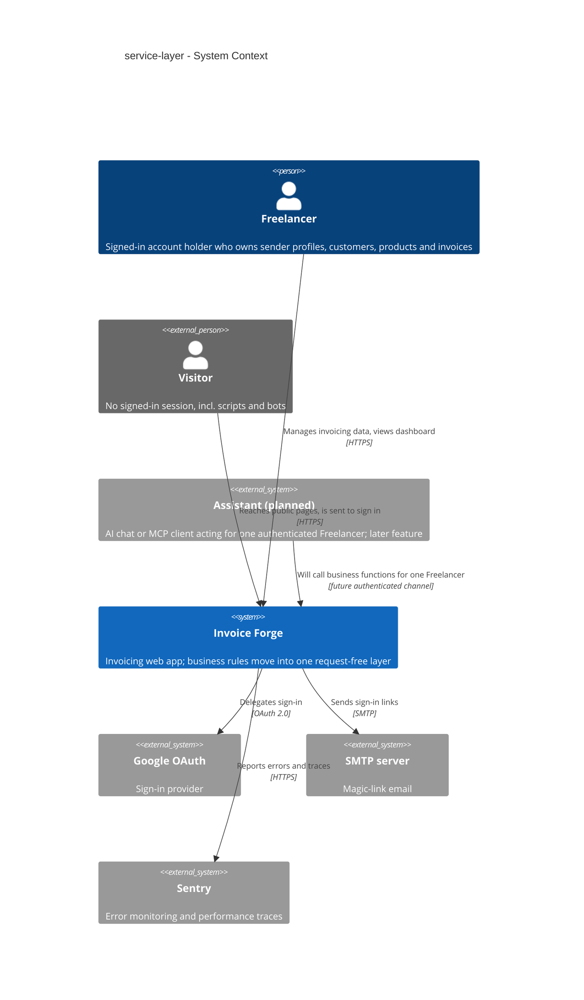
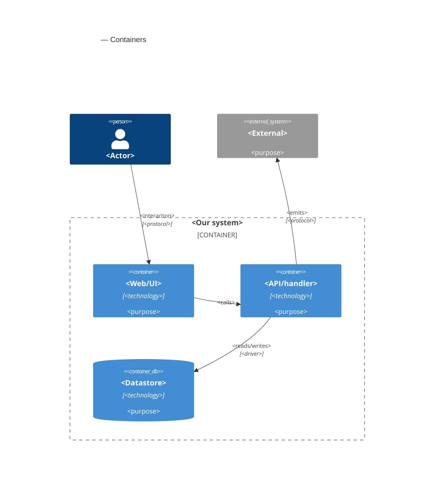

# Software Architecture Document — service-layer

<!-- 12 Arc42 sections. Empty section → <!-- N/A: <one-line reason> -->. -->
<!-- C4 Context (L1) lives inline in §3. C4 Container (L2) lives inline in §5. -->
<!-- Numbers in §10 come VERBATIM from spec.md §6 NFR — no inventing, no rounding. -->

## 1. Introduction and goals

**Intent.** Invoice Forge keeps all of its business rules and data access inside about sixty `'use server'` actions in `lib/actions/`. Each of them reads the caller's identity from the next-auth session and the time zone from the `tz` cookie, runs the rules and queries, and refreshes pages. This feature extracts the rules and queries into one **request-free business layer**, `lib/services/`. Every business function takes the acting Freelancer (and their time zone) as an explicit input and limits every read and every write to that Freelancer's records itself. The web actions become thin wrappers: they identify the Freelancer from the session, call the business function, and refresh the same pages as today. Every record list gains optional search and page-number paging with an honest total. Dashboard figures are computed by PostgreSQL rather than in memory. The Freelancer sees no change except the five deliberate ones in spec §1. The first consumer after the web app is the Assistant (the in-app AI chat and the MCP server, both later features), which has no browser session.

**Top-3 quality goals (1-liners; full scenarios in §10):**

1. **Tenant isolation.** No read or write made through a business function ever reaches another Freelancer's record, whoever the caller is: a page, a test or an Assistant.
2. **Behaviour parity.** The web app behaves exactly as before: existing tests unchanged, and dashboard amounts equal to the cent.
3. **Request independence.** Every business function can be called with only the acting Freelancer and a time zone. It never touches the session, cookies, headers or page refresh, and it is never reachable from the browser.

**Stakeholders.**

| Role | Interest | Sign-off owner? |
|---|---|---|
| Freelancer | Every page, form, picker and the dashboard keep working unchanged; their data stays theirs | No |
| Assistant | Future consumer (AI chat and MCP features): reads and changes one Freelancer's data through the same rules, without a browser | No |
| Visitor | Still sent to sign in; no private data read or changed (AC-10) | No |
| Tech Lead (Dmytro Hopko) | SAD approval; the layer boundary and result contract every later feature builds on | Yes |
| Security Lead | Security review is required (spec §6.1): the authorization boundary moves for every data function | Yes |

## 2. Constraints

**Technical.**
- TypeScript 5 (strict) on Node, pnpm 10 (`package.json`, `tsconfig.json`).
- Next.js 16.1.1 App Router + React 19.2.3. RSC pages call `'use server'` actions directly for reads (e.g. `app/(protected)/customers/page.tsx`). Every export of a `'use server'` file is a browser-callable endpoint.
- PostgreSQL on Neon (through its pooler) via Prisma 7.2 + `@prisma/adapter-pg`. The schema is split in `prisma/schema/`, with no `previewFeatures` in the generator. Money columns are `Decimal(10,2)`. Raw SQL precedent: the invoice-number row lock (`lib/actions/invoice-actions/numbering.ts`, `$queryRaw … FOR UPDATE`).
- next-auth 5.0.0-beta.30 with JWT sessions. `getAuthenticatedUser()` (`lib/helpers/auth-helpers.ts`) is the only identity source in actions, and the sign-in flow (`lib/actions/login-actions.ts`) stays untouched (spec §3).
- The time zone comes from the `tz` cookie via `getRequestTimeZone()` (`lib/helpers/time-zone.ts`, validated with `Intl`, falling back to UTC). The day-bound helpers in that file are already pure.
- Caching uses `unstable_cache` (dashboard currency tabs, 60 s) and `revalidatePath(protectedRoutes.*)` after every mutation. Both are Next.js facilities.
- Tests: Vitest 5 (`vitest.config.ts` for unit/component/contract, `vitest.integration.config.ts` for integration against a throwaway Postgres via `@testcontainers/postgresql`), Playwright e2e. CI (`.github/workflows/test.yml`) runs lint, `tsc --noEmit`, unit and integration on every PR.
- Sentry 10 (production only, 10% trace sample, `sentry.server.config.ts:74`), with Prisma arguments scrubbed.
- No stored-data change and no data migration (spec §3). The feature is code-only.
- The `server-only` package is not installed yet. It is added as a dependency (ADR-0006).

**Organisational.**
- Size M (`.size`), route standard (`.route`): 1–2 sprints, one developer (the owner, Dmytro Hopko). There is no hard deadline. The AI chat and MCP features are next on the roadmap and wait for this one.
- TDD is on (`.claude/sdd.local.md`). The existing test suite is the parity oracle: 0 changed expected values (spec §6).
- Releases must stay rollback-safe by redeploying the previous build (0 minutes of planned downtime, spec §6).

**Conventions.**
- `docs/architecture-map.md` §Conventions (stale: it reflects `ded1be7`, before architecture-hardening; see §11) and the hard rules in `docs/features/architecture-hardening/sad.md` §8 and `contracts/server-actions.md`. This feature preserves them.
- `ActionResult<T>` with typed codes `UNAUTHORIZED | NOT_FOUND | VALIDATION | CONFLICT | FAILED` (`types/actions.ts`, hardening ADR-0009). `failed()` reports an unexpected cause to Sentry exactly once.
- A foreign record answers `NOT_FOUND`, identical to a missing one. `cuid()` IDs. zod schemas per entity in `lib/validations/`, shared by forms and actions.
- One exact-decimal amount module (hardening ADR-0006), invoice numbers on a normalized key under a sender-profile row lock (hardening ADR-0004/0005), account deletion in one explicit transaction (hardening ADR-0007).

**Regulatory / external.**
- Data classification: confidential. The layer reads and changes names, addresses, tax ids and bank details (spec §6.1). No new personal-data fields.
- Security review required before release (spec §6.1). No formal compliance regime (SOC 2, PCI) applies.
- Business functions verify no identity themselves. Only trusted server-side callers may call them: the web wrappers today, and later an Assistant layer that must authenticate first (spec §3, §6.1).

## 3. Context and scope

Invoice Forge lets a Freelancer keep sender profiles, customers, products, custom prices, bank accounts and invoices, and see a dashboard of revenue, Debtors and Expected payments. This feature does not move the system boundary: the same people and systems talk to it as today. What changes is where trust is established. Identity is verified once, at the edge of the system (the session in a web wrapper, or later the Assistant layer), and then passed inward as an explicit acting Freelancer. The Assistant is drawn as a planned actor: this feature only prepares the functions it will call.

<!-- brownfield: Next.js 16 monolith on Vercel; 63 exported functions in lib/actions (3,885 lines) own auth + rules + Prisma + revalidation; the architecture map is stale (ded1be7), so the scan was re-run on 6cf4c6e -->

**External systems (in / out):**

| Actor or system | Type | Interaction |
|---|---|---|
| Freelancer | Person | Uses every page, form, picker and the dashboard in the browser; signed in |
| Visitor | Person (external) | Reaches pages or endpoints without a session; is sent to sign in (AC-10) |
| Assistant (planned) | System (external, future feature) | Will read and change one authenticated Freelancer's data without a browser session. Not built here (spec §3) |
| Google OAuth | System (external) | Sign-in provider (unchanged) |
| SMTP server | System (external) | Sends magic-link sign-in email (unchanged) |
| Sentry | System (external) | Receives server and client errors and performance traces; the dashboard latency baseline comes from here |

The trust boundary stays where it is: nothing from the browser or from an Assistant is trusted until a wrapper has authenticated it. Business functions sit inside the boundary and never face a client directly (ADR-0006).

**C4 Context (L1):**



## 4. Solution strategy

**Target surface: `backend-service` only.** The feature changes server code only: RSC pages, `'use server'` actions, route handlers and the new business layer. It adds no screen, component or client state (spec §1: "Nothing changes for the Freelancer"; no `ux-flows.md` exists for it). The browser UI keeps consuming the same actions with the same results. One surface means no multi-surface ADR and no UI-architecture decision.

**Top strategic choices (the seeds for ADRs):**

1. **An explicit, branded acting Freelancer on every business function** (ADR-0001). The first argument of every function is an `ActingFreelancer { userId, timeZone }`. Its type can only be produced by trusted factories: `actingFreelancerFromSession()` in the web layer, a factory the Assistant feature will add after it authenticates, and a test factory. The factory also resolves the time zone once, so no function reads a cookie or forgets the zone. This serves quality goals 1 and 3, and it makes every place that establishes identity greppable.
2. **One result contract across both layers** (ADR-0002). Business functions return the existing `ActionResult<T>` union (moved to a neutral `types/result.ts`, with `ActionResult` kept as an alias). Wrappers pass it through unchanged, so messages, field errors, typed codes and the "reported exactly once" rule stay byte-identical (quality goal 2, AC-02, AC-04). The Assistant gets the same typed codes and field errors (AC-13, AC-26).
3. **The owner filter lives in every write's own `where` clause** (ADR-0003). The current check-then-write-by-bare-id pattern (`findFirst({ id, userId })` then `update({ where: { id } })`) is replaced by writes whose unique `where` carries the owner too, e.g. `{ id, userId }` or `{ id, senderProfile: { userId } }`. A miss (Prisma `P2025`) maps to the same `NOT_FOUND`. Reads are owner-filtered the same way, and a foreign-record test per function proves it (quality goal 1, AC-08, AC-19, spec §6.1 check-then-write abuse case).
4. **Dashboard figures aggregated by PostgreSQL in parameterized raw SQL** (ADR-0004). Each dashboard section is one `$queryRaw` tagged-template query: sums on `numeric`, local-day and local-month buckets via `AT TIME ZONE`, and "name from the most recent invoice" via `DISTINCT ON`. Each query is owner-joined through `SenderProfile.userId` and its rows are parsed with zod. The number of rows read no longer grows with invoice history, and the sums are exact (quality goal 2, spec §6 data-read row, AC-05, AC-06).
5. **Page-number paging with one shared page envelope** (ADR-0005). Every list accepts an optional `{ search, page, pageSize }` and returns `Page<T> = { items, total, page, pageSize, totalPages, hasMore }`. With no page requested, the full list comes back as page 1. A page out of range falls back to page 1, every sort order ends with the record id, and search is a case-insensitive substring match (`ILIKE`) on the fields spec §1 names. This one contract is seen by six lists, the web pickers and the future Assistant (AC-11 to AC-14).

**Inline strategy notes (no ADR: reversible, or fixed by an upstream decision):**
- **Time-zone resolution** (closes spec §8 OQ-2 at its default). A zone is accepted only if both `Intl` and PostgreSQL (`pg_timezone_names`, looked up once per process) know it; otherwise UTC is used, as for an unknown zone (AC-22). The check lives in the `ActingFreelancer` factories, so JS day bounds and SQL `AT TIME ZONE` buckets always use the same zone (AC-21).
- **Transactions are owned by business functions.** A function that needs atomicity (invoice create/update with numbering, account deletion, duplicate) opens its own `prisma.$transaction`. Internal helpers take a `Prisma.TransactionClient`. No public `tx` parameter: composing several changes in one transaction is a later Assistant concern.
- **Next.js facilities stay in the web wrappers.** `revalidatePath`, `unstable_cache` (currency tabs) and `redirect` are called only by wrappers, after a successful result. The business layer knows nothing about pages.
- **Incremental, per-domain migration.** Domains move one release at a time, and each release keeps the full suite green. The old in-memory dashboard stays only until the parity test's expected values are recorded, then it is deleted with every other function the move leaves unused (spec §1 deliberate change 5). Details in §7.

Each tactical decision in later sections traces to one of these seeds. A tactical decision that contradicts one is a red flag and goes to §11.

## 5. Building block view

<!-- 🎯 Why: INTERNAL DECOMPOSITION — modules, containers, datastores. The static topology: who
     may talk to whom. Without §5, §6 (the flows) has no vocabulary of participants.
     📋 Write: 1 ¶ on the style (layered / hexagonal / clean / event-driven) + a folder tree + a
     C4Container block.
     📌 Draw ONE Container per declared `target_surface` (frontmatter): a fullstack
     [backend-service, web-frontend] = a backend-API container + a web/SPA container; a
     [backend-service, mobile-app] = the API + the mobile app. The Container(web, …) line below is
     just one surface's container — swap/add per what was declared in §4. → _shared/surfaces.md
     📌 e.g. «web app, content API, media worker, datastore, object store, CDN». -->

<One paragraph: layered / hexagonal / clean / event-driven, and why.>

**Internal decomposition:**

```
<e.g. modules/<feature>/>
├── domain/       <entities + sentinel errors>
├── app/          <use cases / services>
├── infra/        <repository + integration impl>
├── ports/        <handlers, DTOs, error mapping>
└── wiring        <self-wiring entry point>
```

**C4 Container (L2):** <!-- syntax → references/c4-mermaid-syntax.md. Real names, no <placeholder> stubs. ONE Container per declared target_surface (frontmatter); the web container below is one example surface. -->



## 6. Runtime view

<!-- 🎯 Why: the RUNTIME FLOW of 1–2 critical scenarios — who talks to whom, when, in what order.
     Without §6, §5 is just boxes with no life.
     📋 Write: a Mermaid sequenceDiagram. Participants are names from §5 (don't invent new ones).
     Messages are semantic («saves a draft»), NO HTTP verbs / paths / status codes — endpoint-level
     sequences arrive at the `api` stage.
     📌 e.g. «author → web: composes draft → web → content API: save». Seed the primary flow(s) here;
     the `sequences` stage then covers every §5 AC (no cap). Never N/A for M+; XS/S keeps ≥1 happy-path flow. -->

**Critical flow 1: <flow name>**

```mermaid
sequenceDiagram
    actor Actor
    participant Web
    participant Service
    participant Store
    Actor->>Web: <action>
    Web->>Service: <call>
    Service->>Store: <write>
    Store-->>Service: ok
    Service-->>Web: result
    Web-->>Actor: confirmation
```

**Critical flow 2: <e.g. async event propagation>** — <if applicable, otherwise N/A>.

## 7. Deployment view

<!-- 🎯 Why: the TOPOLOGY DevOps must know without reading the deploy charts — how many replicas,
     where the background worker lives, AT WHAT NUMBERS we scale.
     📋 Write: 2–3 sentences on topology + monitoring + concrete threshold numbers.
     📌 e.g. «500 authors → partition by quarter» (not «we'll think about scale later»).
     🎯 N/A allowed for XS/S that reuses an existing deployment unit with no change.
     Deployment-diagram scaffold → templates/deployment.md. -->

<Topology in 2–3 sentences. Where it runs, replicas, scaling thresholds.>

**Monitoring:**
- <Metrics — e.g. `<metric_name>`>
- <Alerts — e.g. «worker lag > 10 min → page on-call»>
- <Tracing — e.g. spans on the request boundary>

**Scaling thresholds:**
- <e.g. comfortable in one table up to N rows/year>
- <e.g. partition by quarter above N rows/year>

<!-- For XS/S with no deployment change: <!-- N/A: reuses existing deployment unit, no infra change --> -->

## 8. Crosscutting concepts

<!-- 🎯 Why: CROSS-CUTTING PATTERNS spanning several modules: logging, errors, authorization, ID
     strategy, events, caching. ⭐ The second-densest section. A pattern inside one module is NOT
     here; a project-wide convention belongs in the convention file.
     📋 Write: a table — concept / convention / where defined. One row per concept.
     📌 e.g. «sortable time-based IDs generated in the app layer» as a default from the convention file. -->

| Concept | Convention | Where defined |
|---|---|---|
| Logging | <e.g. structured, fields `module=<name>`> | <convention file §X or here> |
| Authentication | <e.g. token-based via middleware> | <convention file §X> |
| Error handling | <e.g. domain sentinel → ports error mapping → JSON> | <convention file §X> |
| ID strategy | <e.g. sortable time-based ID in the app layer> | <convention file §X> |
| Internationalisation | <e.g. N/A, single language> | — |
| Observability | <e.g. tracing on the request boundary> | — |
| Events | <module-specific patterns, if any> | <here> |

## 9. Architecture decisions

<!-- 🎯 Why: the REVERSE INDEX onto the adr/ folder. `ls adr/` gives the files; §9 gives the
     semantics — why they exist, which SAD section they attach to, what status.
     📋 Write: a 4-column table, one row per ADR. Mixed status is fine.
     📌 e.g. «0001 | Store content as a table of typed blocks | Accepted | §4». -->

| # | Title | Status | Section |
|---|---|---|---|
| <NNNN> | <imperative — e.g. "Use a sliding-window counter for rate limiting"> | Accepted | §<N> |
| <NNNN> | <imperative — e.g. "Co-locate the worker in the API process"> | Accepted | §<N> |

ADR files live under `docs/features/<slug>/adr/NNNN-<title>.md`.

## 10. Quality requirements

<!-- 🎯 Why: the QUALITY TREE — take a goal from §1 and break it into concrete leaves: tests,
     metrics, configs, drills. ⭐ Without §10, §1 is a manifesto. With §10 each declaration maps
     to something PROVABLE.
     📋 Write: per §1 goal — When / Then / How-verify. Numbers from spec §6 NFR VERBATIM (don't
     round ≤250ms to ≤300ms — that's a critic F6 hit).
     📌 e.g. «p95 ≤ 500 ms on a block update, verified by a 100 req/s load test». -->

Each top-3 goal from §1 expanded into a full scenario:

**QG-1. <quality attribute>**
- **When:** <trigger condition>
- **Then:** <expected behaviour with numbers from spec §6 NFR>
- **How verify:** <test / chaos drill / load test / metric>

**QG-2. <quality attribute>**
- **When:** <trigger>
- **Then:** <expected>
- **How verify:** <how>

**QG-3. <quality attribute>**
- **When:** <trigger>
- **Then:** <expected>
- **How verify:** <how>

## 11. Risks and technical debt

<!-- 🎯 Why: ⭐ collects EVERYTHING that can break — not only the technical. Without §11 risks get
     discussed at standups and lost; debt lives only in the head of whoever accepted it.
     📋 Write: a risk/debt table — severity — mitigation — owner. Accepted debt in its own block.
     📌 The first risk is often a product risk, not a technical one. That's normal. -->

<!-- Severity literals: Low / Medium / High for regular risks; "Open question" for rows created by
     a Save-as-OQ resolution during the Socratic walk (see references/socratic.md). -->

| Risk / debt | Severity | Mitigation | Owner |
|---|---|---|---|
| <e.g. Worker lag may reach hours during a downstream outage> | Medium | <alert >10 min, on-call playbook, retry backoff> | <DevOps> |
| <e.g. No event-schema versioning in v1> | Medium | <ADR-NNNN planned for v2, tolerate unknown fields> | <Backend> |
| Open architectural decision: <decision-headline> | Open question | Resolve before <stage trigger or YYYY-MM-DD>; <inline rationale from the Save-as-OQ> | <owner> |

**Accepted debt (acceptable in v1, plan to fix later):**
- <e.g. the entity is immutable / unversioned — OK for v1, may need audit versioning in v2>

## 12. Glossary

<!-- 🎯 Why: ⭐ the DOMAIN GLOSSARY that ends arguments a year later («checkpoint — weekly or
     biweekly? quarter — calendar or fiscal?»).
     📋 Write: a term / meaning table. Business + technical terms mixed.
     📌 e.g. «Lesson | a unit inside a course made of blocks (text, video)». -->

| Term | Meaning |
|---|---|
| <e.g. domain object A> | <its meaning in this domain> |
| <e.g. domain object B> | <its meaning> |
| <e.g. domain invariant name> | <the rule, in plain language> |
