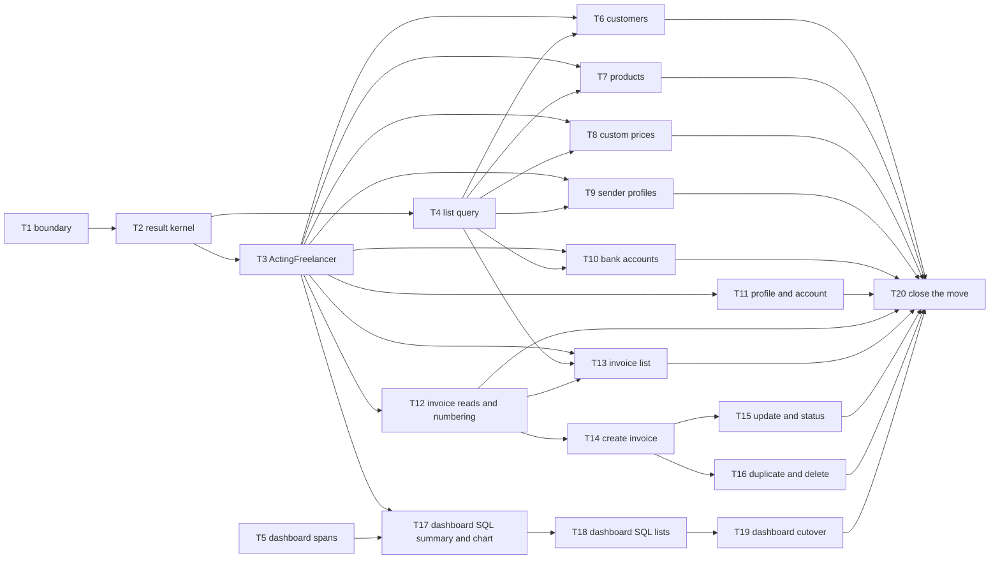

# Epic — service-layer

> **Spec:** [spec.md](../spec.md) · **Design:** [sad.md](../sad.md) · **Data model:** [data-model.md](../data-model.md) · **API:** [public-api.md](../contracts/public-api.md) (in-process, no OpenAPI) · **ADRs:** [adr/](../adr/)

## Goal

This epic moves every business rule and data access out of the `'use server'` actions into one request-free business layer, `lib/services/`. Each business function takes an explicit `ActingFreelancer` and scopes every read and write to that Freelancer itself. The web app keeps working exactly as before (spec §2 goal 1). The layer is ready for the Assistant, which can never see another Freelancer's data (goal 2). Every list can be searched and paged honestly (goal 3). Dashboard figures are exact to the cent and computed by PostgreSQL (goal 4).

## Scope

- **In:** the `lib/services/` kernel (result contract, `ActingFreelancer`, time zones, list query, owner scope); the customers, products, custom prices, sender profiles, bank accounts, profile/account and invoices modules; the dashboard on parameterized SQL; thin wrappers in `lib/actions/**`; the export and convert-image route internals; boundary enforcement (lint, `server-only`, `pnpm build` in CI); request-free and foreign-record tests.
- **Out (spec §3):** the AI chat, the MCP server and any Assistant tool or factory; page-size caps; UI paging and server-side search on the customers, products and custom-prices pages; any stored-data change or migration; the sign-in flow.

## Task map

**DAG levels (parallel waves for `implement`):** 1: T1, T5 · 2: T2 · 3: T3, T4 · 4: T6–T12, T17 · 5: T13, T14, T18 · 6: T15, T16, T19 · 7: T20.

**Serialized lanes (overlapping `files_hint`):**
- T12 → T13 → T14 → T15 → T16 share `lib/actions/invoice-actions/invoice-actions.ts` and `lib/services/invoices/`.
- T17 → T18 → T19 share `tests/integration/services/dashboard/`.
- T5 and T19 share `lib/actions/dashboard-actions.ts`.

**Production releases (sad.md §7):**

| Release | Tasks |
|---|---|
| 1 | T1–T8 |
| 2 | T9–T11 |
| 3 | T12–T16 |
| 4 | T17–T19, then T20 |

Each release is code-only and rolls back by redeploying.

## Tasks

See [tracker.md](./tracker.md) for status. Machine contract: [tasks.json](../tasks.json).

| # | Task | Layer | Blocked by | DoD (short) |
|---|---|---|---|---|
| T1 | [Enforce the lib/services boundary](./t01-layer-boundary.md) | wiring | — | lint + boundary test + `pnpm build` in CI |
| T2 | [Move the result contract and helpers into the kernel](./t02-result-kernel.md) | domain | T1 | `types/result.ts`, P2025 → NOT_FOUND, report-once tests unchanged |
| T3 | [ActingFreelancer, factories, time-zone resolution](./t03-acting-freelancer.md) | domain | T2 | UNAUTHORIZED without an account, Intl ∩ PostgreSQL zone else UTC |
| T4 | [ListQuery, Page envelope, paginate helper](./t04-list-query.md) | domain | T2 | AC-11..14 edge cases unit-tested |
| T5 | [Sentry spans around the old dashboard actions](./t05-dashboard-spans.md) | wiring | — | seven `dashboard.<section>` spans, outputs unchanged |
| T6 | [Customers module](./t06-customers.md) | app | T3, T4 | search/paging, HAS_INVOICES race, foreign-record tests |
| T7 | [Products module](./t07-products.md) | app | T3, T4 | onlyActive, used-in-invoices CONFLICT, foreign-record tests |
| T8 | [Custom prices module](./t08-custom-prices.md) | app | T3, T4 | parent NOT_FOUND, owner via customer and product |
| T9 | [Sender profiles module + convert-image](./t09-sender-profiles.md) | app | T3, T4 | HAS_INVOICES race, logo lookup through the layer |
| T10 | [Bank accounts module](./t10-bank-accounts.md) | app | T3, T4 | parent-scoped list, never searching the IBAN |
| T11 | [Profile, account deletion, export, setup check](./t11-profile-account.md) | app | T3 | all-or-nothing deletion, tenant-gone mapping |
| T12 | [Invoice numbering, reads, editor data](./t12-invoice-reads-numbering.md) | app | T3 | custom price in editor data (AC-25) |
| T13 | [listInvoices with filters and local dates](./t13-invoice-list.md) | app | T3, T4, T12 | parity with the invoices page, Kyiv case, `getInvoices()` deleted |
| T14 | [createInvoice](./t14-create-invoice.md) | app | T12 | sequence number, typed duplicate, foreign refs |
| T15 | [updateInvoice + updateInvoiceStatus](./t15-update-invoice-status.md) | app | T14 | TOTALS_CHANGED, paid-date rule |
| T16 | [duplicateInvoice + deleteInvoice](./t16-duplicate-delete-invoice.md) | app | T14 | draft copy with the next number, draft-only delete |
| T17 | [Dashboard SQL: tabs, summary, chart + parity harness](./t17-dashboard-sql-summary-chart.md) | app | T3, T5 | exact to the cent vs old, rows per query |
| T18 | [Dashboard SQL: sender accounts, recent, Debtors, Expected](./t18-dashboard-sql-lists.md) | app | T17 | AC-06 naming and tie order |
| T19 | [Dashboard wrapper cutover](./t19-dashboard-wrappers-cutover.md) | ports | T18 | local-date periods, recorded parity, old code deleted |
| T20 | [Close the move](./t20-close-the-move.md) | tests | T6–T13, T15, T16, T19 | 0 prisma in `lib/actions`, test inventory complete |

## Risks / Hard rules

- **Behaviour parity (spec §6):** 0 changed or removed expected values in existing tests. The sole exception is the list-all-invoices test, which T13 removes. Wrappers keep today's `revalidatePath` lists verbatim (sad.md §11).
- **Tenant isolation (spec §6.1, ADR-0003):** every read and write carries the owner in its own `where` clause or SQL join. A foreign record answers `NOT_FOUND`, exactly like a missing one. Every id-taking function has a foreign-record test (QG-1).
- **Request independence (ADR-0006):** there is no session, cookie, header, `revalidatePath`, `unstable_cache` or `redirect` in `lib/services`, and no `'use server'` there.
- **Only wrappers produce `UNAUTHORIZED`** (ADR-0002). A vanished tenant is `NOT_FOUND`, mapped by the wrapper (public-api.md §1.4).
- **Money:** no JS addition of amounts in the dashboard. It uses `SUM(numeric)` in SQL, converted once (ADR-0004).
- **Open question (spec §8):** five preserved-from-code branches still have no §6 flow (G1–G5, owner `sequences`). The tasks keep them unchanged.
